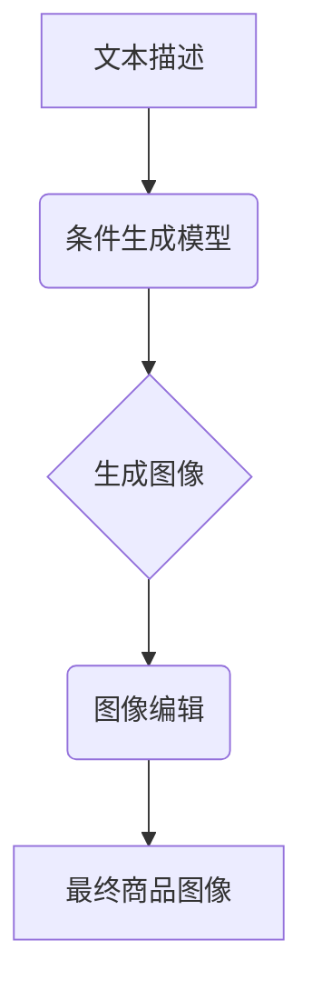

                 

## 深度学习驱动的商品图像生成控制技术

> 关键词：深度学习、商品图像生成、图像控制、生成对抗网络(GAN)、条件生成模型、图像编辑、电商

## 1. 背景介绍

随着电商行业的蓬勃发展，高质量的商品图像成为了吸引顾客、提升转化率的关键因素。传统的商品图像拍摄方式成本高、效率低，难以满足快速迭代的需求。而深度学习技术近年来取得了突破性进展，为商品图像生成提供了新的可能性。

深度学习驱动的商品图像生成技术能够根据文本描述或其他输入信息，自动生成逼真的商品图像，具有以下优势：

* **成本效益高:** 相比传统拍摄方式，深度学习方法可以显著降低图像生成成本。
* **效率高:**  可以快速生成大量图像，满足电商平台快速更新商品信息的需要。
* **灵活多样:** 可以根据不同的需求生成不同风格、不同角度的商品图像。
* **个性化定制:** 可以根据用户喜好生成个性化的商品图像。

## 2. 核心概念与联系

商品图像生成控制技术的核心是利用深度学习模型，将文本描述或其他输入信息映射到图像空间。

**2.1 核心概念**

* **生成对抗网络 (GAN):** GAN 由两个网络组成：生成器和判别器。生成器负责生成图像，判别器负责判断图像的真实性。两者在对抗博弈中相互学习，最终生成器能够生成逼真的图像。
* **条件生成模型:** 条件生成模型能够根据特定的条件信息生成图像，例如文本描述、类别标签、风格偏好等。
* **图像编辑:** 图像编辑技术可以对生成的图像进行修改和增强，例如调整颜色、添加背景、改变角度等。

**2.2 架构图**



## 3. 核心算法原理 & 具体操作步骤

### 3.1 算法原理概述

深度学习驱动的商品图像生成控制技术主要基于生成对抗网络 (GAN) 和条件生成模型的原理。

* **生成器:** 生成器是一个神经网络，其输入是文本描述或其他条件信息，输出是生成的图像。
* **判别器:** 判别器也是一个神经网络，其输入是图像，输出是判断图像真实性的概率。
* **对抗训练:** 生成器和判别器在对抗训练中相互学习。生成器试图生成逼真的图像来欺骗判别器，而判别器试图准确地识别出生成的图像。

### 3.2 算法步骤详解

1. **数据准备:** 收集大量商品图像和对应的文本描述数据。
2. **模型训练:** 使用 GAN 架构训练生成器和判别器。
3. **文本编码:** 将文本描述编码成向量表示。
4. **图像生成:** 将文本编码向量作为条件输入，让生成器生成商品图像。
5. **图像编辑:** 对生成的图像进行编辑和增强，例如调整颜色、添加背景、改变角度等。
6. **图像评估:** 使用评价指标评估生成的图像质量。

### 3.3 算法优缺点

**优点:**

* 生成逼真的商品图像。
* 能够根据文本描述生成特定风格的图像。
* 效率高，可以快速生成大量图像。

**缺点:**

* 需要大量的训练数据。
* 训练过程复杂，需要专业的技术人员。
* 生成的图像可能存在一些瑕疵，例如纹理不自然、细节缺失等。

### 3.4 算法应用领域

* **电商平台:** 生成商品图片、展示产品多样化。
* **广告营销:** 生成吸引人的广告图片。
* **游戏开发:** 生成游戏场景和角色。
* **设计行业:** 生成产品原型和设计草图。

## 4. 数学模型和公式 & 详细讲解 & 举例说明

### 4.1 数学模型构建

商品图像生成控制技术通常使用条件生成对抗网络 (Conditional GAN, cGAN) 模型。cGAN 在传统的 GAN 架构的基础上，引入了条件信息，使得生成器能够根据条件信息生成特定类型的图像。

**4.1.1 生成器网络 (G)**

生成器网络是一个从随机噪声向量 $z$ 到图像空间的映射函数，其数学表示为：

$$G(z, c) = I$$

其中：

* $z$ 是随机噪声向量。
* $c$ 是条件信息向量，例如文本描述的编码向量。
* $I$ 是生成的图像。

**4.1.2 判别器网络 (D)**

判别器网络是一个从图像到真实性概率的映射函数，其数学表示为：

$$D(I) = P(真实|I)$$

其中：

* $I$ 是输入图像。
* $P(真实|I)$ 是判别器判断图像真实性的概率。

### 4.2 公式推导过程

GAN 的训练目标是让生成器生成逼真的图像，欺骗判别器，同时让判别器能够准确地识别出真实图像和生成图像。

**4.2.1 生成器损失函数:**

$$L_G = -E_{z, c} [log(D(G(z, c)))]$$

**4.2.2 判别器损失函数:**

$$L_D = -E_{真实图像} [log(D(真实图像))] - E_{生成图像} [log(1 - D(生成图像))]$$

**4.2.3 整体损失函数:**

$$L = L_G + L_D$$

### 4.3 案例分析与讲解

假设我们想要生成一种特定风格的手机图像，例如复古风格。我们可以使用文本描述 "复古风格手机" 作为条件信息，输入到 cGAN 的生成器网络中。生成器网络会根据条件信息和随机噪声向量，生成符合复古风格的手机图像。

## 5. 项目实践：代码实例和详细解释说明

### 5.1 开发环境搭建

* Python 3.6+
* TensorFlow 或 PyTorch 深度学习框架
* CUDA 和 cuDNN (可选，用于 GPU 加速)

### 5.2 源代码详细实现

```python
# 使用 TensorFlow 实现 cGAN 的生成器网络
def generator(z, c):
    # ... (生成器网络结构代码)
    return I

# 使用 TensorFlow 实现 cGAN 的判别器网络
def discriminator(I):
    # ... (判别器网络结构代码)
    return P(真实|I)

# ... (训练循环代码)
```

### 5.3 代码解读与分析

* 生成器网络和判别器网络的结构可以根据具体需求进行调整。
* 训练循环中，需要不断地更新生成器和判别器的参数，以最小化损失函数。
* 训练过程中，可以使用不同的优化算法，例如 Adam 优化器。

### 5.4 运行结果展示

训练完成后，可以将随机噪声向量和条件信息输入到生成器网络中，生成符合条件的商品图像。

## 6. 实际应用场景

### 6.1 电商平台

* **商品图片生成:** 根据商品信息自动生成商品图片，例如服装、电子产品、家居用品等。
* **虚拟试衣间:** 根据用户上传的图片，生成用户穿着不同服装的虚拟试衣效果。
* **个性化商品推荐:** 根据用户的喜好和购买历史，生成个性化的商品推荐图片。

### 6.2 广告营销

* **广告图片生成:** 根据广告文案和目标受众，生成吸引人的广告图片。
* **动态广告:** 生成动态的广告图片，根据用户行为和时间变化进行调整。
* **虚拟代言人:** 生成虚拟代言人形象，进行产品宣传和推广。

### 6.3 其他应用场景

* **游戏开发:** 生成游戏场景、角色、道具等。
* **设计行业:** 生成产品原型、设计草图、艺术作品等。
* **医疗领域:** 生成医学图像、辅助诊断等。

### 6.4 未来应用展望

随着深度学习技术的不断发展，商品图像生成控制技术将有更广泛的应用场景。例如：

* **更逼真的图像生成:** 生成更加逼真的商品图像，能够更好地满足用户的视觉需求。
* **更灵活的图像编辑:** 能够对生成的图像进行更灵活的编辑和增强，例如调整颜色、添加背景、改变角度等。
* **个性化定制:** 能够根据用户的个性化需求生成定制化的商品图像。

## 7. 工具和资源推荐

### 7.1 学习资源推荐

* **书籍:**
    * Deep Learning by Ian Goodfellow, Yoshua Bengio, and Aaron Courville
    * Generative Deep Learning by David Foster
* **在线课程:**
    * Coursera: Deep Learning Specialization
    * Udacity: Deep Learning Nanodegree
* **博客和论坛:**
    * Towards Data Science
    * Reddit: r/MachineLearning

### 7.2 开发工具推荐

* **深度学习框架:** TensorFlow, PyTorch, Keras
* **图像处理库:** OpenCV, Pillow
* **云计算平台:** AWS, Google Cloud, Azure

### 7.3 相关论文推荐

* **Generative Adversarial Networks** by Ian Goodfellow et al. (2014)
* **Conditional Generative Adversarial Networks** by Mehdi Mirza and Simon Osindero (2014)
* **Progressive Growing of GANs for Improved Quality, Stability, and Variation** by Tero Karras et al. (2017)

## 8. 总结：未来发展趋势与挑战

### 8.1 研究成果总结

深度学习驱动的商品图像生成控制技术取得了显著进展，能够生成逼真的商品图像，满足电商平台和广告营销等领域的应用需求。

### 8.2 未来发展趋势

* **更高质量的图像生成:** 探索新的生成模型架构和训练方法，生成更加逼真、细节丰富的商品图像。
* **更灵活的图像编辑:** 开发更强大的图像编辑工具，能够对生成的图像进行更灵活的修改和增强。
* **更个性化的定制:** 利用用户数据和行为信息，生成更加个性化的商品图像，满足用户的独特需求。
* **跨模态生成:** 将文本、图像、音频等多种模态信息融合，生成更加丰富的商品体验。

### 8.3 面临的挑战

* **数据质量和数量:** 训练高质量的商品图像生成模型需要大量的训练数据，而获取高质量的商品图像数据仍然是一个挑战。
* **模型复杂度和训练成本:** 训练大型的生成模型需要大量的计算资源和时间，成本较高。
* **伦理和安全问题:** 商品图像生成技术可能被用于生成虚假信息或进行欺诈活动，需要关注伦理和安全问题。

### 8.4 研究展望

未来，商品图像生成控制技术将继续朝着更高质量、更灵活、更个性化的方向发展。随着深度学习技术的不断进步，以及数据获取和处理能力的提升，商品图像生成技术将为电商平台、广告营销、设计行业等领域带来更多创新应用。

## 9. 附录：常见问题与解答

**Q1: 如何评估生成的图像质量？**

**A1:** 可以使用多种评价指标评估生成的图像质量，例如 PSNR、SSIM、FID 等。

**Q2: 如何选择合适的生成模型架构？**

**A2:** 选择合适的生成模型架构需要根据具体应用场景和数据特点进行选择。常见的生成模型架构包括 GAN、VAE、Diffusion Model 等。

**Q3: 如何解决训练过程中出现的模式崩溃问题？**

**A3:** 模式崩溃问题是指生成器生成的图像过于单一，缺乏多样性。可以采用多种方法解决，例如使用正则化技术、增加训练数据、调整训练参数等。


作者：禅与计算机程序设计艺术 / Zen and the Art of Computer Programming 
<end_of_turn>

