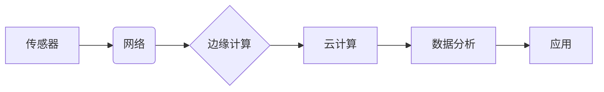

                 

## 物联网生态系统：从传感器到云端的全链路解析

> 关键词：物联网、传感器、网络协议、云计算、数据分析、边缘计算、安全、隐私

### 1. 背景介绍

物联网（Internet of Things，IoT）正以惊人的速度发展，它将物理世界与数字世界紧密连接，为我们带来前所未有的便利和效率。物联网生态系统是一个庞大而复杂的网络，它由各种各样的设备、传感器、网络、平台和应用组成。从简单的智能家居设备到复杂的工业自动化系统，物联网正在改变着我们的生活和工作方式。

随着物联网应用的不断扩展，对物联网生态系统的理解和优化变得越来越重要。本文将深入解析物联网生态系统，从传感器到云端，全方位解读其核心概念、技术架构、算法原理、实践案例以及未来发展趋势。

### 2. 核心概念与联系

物联网生态系统是一个多层次、多节点的网络，其核心概念包括：

* **传感器:** 物联网生态系统的感知单元，负责收集物理世界的各种数据，例如温度、湿度、位置、运动等。
* **网络:** 连接传感器、设备和云端的网络基础设施，包括无线网络、有线网络、卫星网络等。
* **边缘计算:** 将计算能力部署在靠近数据源的边缘节点，例如传感器、网关等，实现数据实时处理和分析。
* **云计算:** 提供大规模数据存储、计算和分析服务，用于处理和分析来自物联网设备的大量数据。
* **数据分析:** 利用各种算法和技术对物联网数据进行分析，提取有价值的信息，并用于决策支持、预测分析等。
* **应用:** 基于物联网数据和分析结果开发的各种应用，例如智能家居、智慧城市、工业自动化等。

**物联网生态系统架构图**



### 3. 核心算法原理 & 具体操作步骤

物联网生态系统中，各种算法发挥着至关重要的作用，例如数据采集、传输、处理、分析等。以下将介绍几种常用的算法原理和操作步骤：

#### 3.1  算法原理概述

* **数据压缩算法:** 用于减少数据传输量，提高网络效率。常见的算法包括Huffman编码、Lempel-Ziv算法等。
* **数据加密算法:** 用于保护物联网数据安全，防止数据泄露。常见的算法包括AES、RSA等。
* **机器学习算法:** 用于对物联网数据进行分析和预测，例如分类、回归、聚类等。常见的算法包括决策树、支持向量机、神经网络等。

#### 3.2  算法步骤详解

以数据压缩算法为例，其基本步骤如下：

1. **数据预处理:** 对原始数据进行清洗、格式化等处理，去除噪声和冗余信息。
2. **建立符号表:** 将数据中的常用符号和字符映射到相应的编码值。
3. **编码:** 根据符号表，将原始数据编码成压缩后的数据。
4. **解码:** 在接收端，根据符号表，将压缩后的数据解码成原始数据。

#### 3.3  算法优缺点

* **数据压缩算法:** 优点是能够有效减少数据传输量，降低网络成本；缺点是压缩过程需要消耗一定的计算资源，解码过程也需要时间。
* **数据加密算法:** 优点是能够有效保护数据安全，防止数据泄露；缺点是加密和解密过程需要消耗一定的计算资源，可能会影响数据传输速度。
* **机器学习算法:** 优点是能够从数据中提取有价值的信息，并进行预测分析；缺点是需要大量的训练数据，训练过程需要消耗大量的计算资源。

#### 3.4  算法应用领域

* **数据压缩算法:** 应用于图像、音频、视频等大数据传输场景，例如视频流传输、在线游戏等。
* **数据加密算法:** 应用于金融交易、医疗数据、个人信息等敏感数据保护场景，例如银行网络安全、电子健康记录等。
* **机器学习算法:** 应用于智能家居、智慧城市、工业自动化等物联网应用场景，例如智能家居设备控制、交通流量预测、设备故障诊断等。

### 4. 数学模型和公式 & 详细讲解 & 举例说明

物联网生态系统中，数学模型和公式用于描述各种现象和关系，例如数据传输速率、网络拥塞度、数据分析精度等。

#### 4.1  数学模型构建

以数据传输速率为例，其数学模型可以表示为：

$$
R = \frac{B}{T}
$$

其中：

* $R$ 表示数据传输速率，单位为比特/秒 (bps)。
* $B$ 表示传输的数据量，单位为比特 (bit)。
* $T$ 表示传输时间，单位为秒 (s)。

#### 4.2  公式推导过程

该公式的推导过程非常简单，即数据传输速率等于数据量除以传输时间。

#### 4.3  案例分析与讲解

假设一个传感器每秒钟采集 1000 字节的数据，传输时间为 1 秒钟，则其数据传输速率为：

$$
R = \frac{1000 \text{ 字节}}{1 \text{ 秒}} = 1000 \text{ 字节/秒}
$$

### 5. 项目实践：代码实例和详细解释说明

以下是一个简单的物联网项目实践案例，演示如何使用 Python 语言开发一个温度传感器数据采集和传输的程序。

#### 5.1  开发环境搭建

* 安装 Python 语言环境。
* 安装必要的库，例如 `RPi.GPIO` 用于控制 Raspberry Pi 的 GPIO 引脚，`requests` 用于发送 HTTP 请求。

#### 5.2  源代码详细实现

```python
import RPi.GPIO as GPIO
import requests
import time

# 设置 GPIO 引脚
sensor_pin = 17
GPIO.setmode(GPIO.BCM)
GPIO.setup(sensor_pin, GPIO.IN)

# 设置 API 地址
api_url = "https://api.example.com/temperature"

while True:
    # 读取传感器数据
    temperature = GPIO.input(sensor_pin)

    # 发送数据到 API
    data = {"temperature": temperature}
    response = requests.post(api_url, json=data)

    # 打印结果
    print("Temperature:", temperature)
    print("Response:", response.text)

    # 等待一段时间
    time.sleep(1)
```

#### 5.3  代码解读与分析

* 该程序首先设置 GPIO 引脚，并将其设置为输入模式。
* 然后，程序读取传感器数据，并将数据发送到指定的 API 地址。
* 程序使用 `requests` 库发送 HTTP POST 请求，并将数据作为 JSON 格式发送。
* 最后，程序打印传感器数据和 API 响应结果，并等待一段时间再进行循环。

#### 5.4  运行结果展示

程序运行后，将每秒钟采集到的温度数据发送到指定的 API 地址，并打印结果。

### 6. 实际应用场景

物联网生态系统在各个领域都有着广泛的应用场景，例如：

* **智能家居:** 通过物联网设备，可以实现远程控制家电、智能照明、安全监控等功能，提高家居生活品质。
* **智慧城市:** 利用物联网传感器和数据分析技术，可以实现城市交通管理、环境监测、公共安全等方面的优化。
* **工业自动化:** 物联网技术可以实现工业设备的远程监控、故障诊断、生产过程优化等，提高生产效率和降低成本。
* **医疗保健:** 物联网设备可以用于远程医疗、健康监测、药物管理等，提高医疗服务质量和效率。

### 6.4  未来应用展望

物联网技术的未来发展趋势包括：

* **边缘计算的进一步发展:** 将更多计算能力部署在靠近数据源的边缘节点，实现更实时、更智能的物联网应用。
* **人工智能技术的融合:** 将人工智能技术与物联网技术相结合，实现更智能的物联网应用，例如智能决策、预测分析等。
* **5G 网络的普及:** 5G 网络的高带宽、低延迟特性将为物联网应用提供更强大的支持。
* **数据安全和隐私保护:** 随着物联网应用的扩展，数据安全和隐私保护将成为越来越重要的议题。

### 7. 工具和资源推荐

#### 7.1  学习资源推荐

* **书籍:** 《物联网技术入门》、《物联网架构设计》
* **在线课程:** Coursera、edX、Udemy 等平台提供丰富的物联网相关课程。
* **技术博客:** 关注物联网领域的知名技术博客，例如 The Internet of Things Blog、IoT World Today 等。

#### 7.2  开发工具推荐

* **Arduino:** 开源硬件平台，用于开发物联网设备。
* **Raspberry Pi:** 小型单板电脑，可以用于搭建物联网原型和应用。
* **Node-RED:** 可视化编程工具，用于开发物联网应用。
* **AWS IoT Core:** 亚马逊云平台提供的物联网服务。

#### 7.3  相关论文推荐

* **The Internet of Things: A Survey**
* **A Survey on Security and Privacy in the Internet of Things**
* **Edge Computing for the Internet of Things: A Survey**

### 8. 总结：未来发展趋势与挑战

物联网生态系统正在经历快速发展，为我们带来无限的可能性。然而，物联网技术也面临着一些挑战，例如数据安全、隐私保护、网络可靠性、标准化等。

#### 8.1  研究成果总结

本文深入解析了物联网生态系统，从传感器到云端，全方位解读其核心概念、技术架构、算法原理、实践案例以及未来发展趋势。

#### 8.2  未来发展趋势

物联网技术将继续朝着更智能、更安全、更可靠的方向发展，并将在更多领域得到应用。

#### 8.3  面临的挑战

物联网技术发展面临着数据安全、隐私保护、网络可靠性、标准化等挑战。

#### 8.4  研究展望

未来，需要进一步研究物联网技术的安全性、可靠性和可扩展性，并探索新的应用场景和商业模式。

### 9. 附录：常见问题与解答

* **什么是物联网？**

物联网是指将各种物理设备、传感器、软件和网络连接在一起，形成一个互联互通的网络系统。

* **物联网的应用场景有哪些？**

物联网的应用场景非常广泛，例如智能家居、智慧城市、工业自动化、医疗保健等。

* **物联网技术的核心技术有哪些？**

物联网技术的核心技术包括传感器技术、网络通信技术、数据处理技术、人工智能技术等。


作者：禅与计算机程序设计艺术 / Zen and the Art of Computer Programming 
<end_of_turn>

