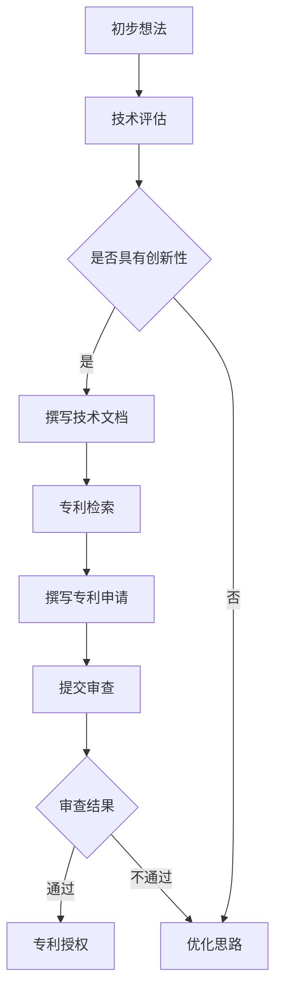

                 

# 文章标题

《技术创新与专利申请：程序员指南》

## 文章关键词
技术创新、专利申请、程序员、知识产权保护、创新流程、法律合规、技术文档撰写、专利检索与策略

## 摘要
本文旨在为程序员提供一份全面的技术创新与专利申请指南。通过逐步分析技术创新的过程，本文详细探讨了如何从初步想法到最终专利申请的每个关键步骤。此外，本文还介绍了专利申请的法律合规要求、技术文档撰写技巧以及专利检索策略，旨在帮助程序员有效保护其知识产权，提升个人和公司的市场竞争力。

## 目录

[1. 背景介绍](#1-背景介绍)  
[2. 核心概念与联系](#2-核心概念与联系)  
   [2.1 技术创新的概念](#21-技术创新的概念)  
   [2.2 专利申请的基本原理](#22-专利申请的基本原理)  
   [2.3 技术创新与专利申请的联系](#23-技术创新与专利申请的联系)  
   [2.4 技术创新的 Mermaid 流程图](#24-技术创新的 Mermaid 流程图)  
[3. 核心算法原理 & 具体操作步骤](#3-核心算法原理--具体操作步骤)  
   [3.1 初步想法的形成与评估](#31-初步想法的形成与评估)  
   [3.2 技术文档的撰写](#32-技术文档的撰写)  
   [3.3 专利检索与策略](#33-专利检索与策略)  
   [3.4 专利申请的提交与审查](#34-专利申请的提交与审查)  
[4. 数学模型和公式 & 详细讲解 & 举例说明](#4-数学模型和公式--详细讲解--举例说明)  
   [4.1 技术创新评估模型](#41-技术创新评估模型)  
   [4.2 技术文档撰写公式](#42-技术文档撰写公式)  
   [4.3 专利申请策略公式](#43-专利申请策略公式)  
   [4.4 案例分析：技术创新评估](#44-案例分析：技术创新评估)  
[5. 项目实践：代码实例和详细解释说明](#5-项目实践--代码实例和详细解释说明)  
   [5.1 开发环境搭建](#51-开发环境搭建)  
   [5.2 源代码详细实现](#52-源代码详细实现)  
   [5.3 代码解读与分析](#53-代码解读与分析)  
   [5.4 运行结果展示](#54-运行结果展示)  
[6. 实际应用场景](#6-实际应用场景)  
   [6.1 独立软件开发者](#61-独立软件开发者)  
   [6.2 企业研发团队](#62-企业研发团队)  
   [6.3 大学和研究机构](#63-大学和研究机构)  
[7. 工具和资源推荐](#7-工具和资源推荐)  
   [7.1 学习资源推荐](#71-学习资源推荐)  
   [7.2 开发工具框架推荐](#72-开发工具框架推荐)  
   [7.3 相关论文著作推荐](#73-相关论文著作推荐)  
[8. 总结：未来发展趋势与挑战](#8-总结：未来发展趋势与挑战)  
[9. 附录：常见问题与解答](#9-附录：常见问题与解答)  
[10. 扩展阅读 & 参考资料](#10-扩展阅读--参考资料)

### 1. 背景介绍

在当今快速发展的科技时代，技术创新已成为推动社会进步和经济发展的关键驱动力。程序员作为技术创新的主要执行者，不仅需要具备深厚的专业知识，还需要了解如何有效地保护其创新成果。专利申请作为一种重要的知识产权保护手段，对于程序员来说具有至关重要的意义。

首先，专利申请可以为程序员提供法律保护，防止他人未经许可使用其创新成果。通过专利申请，程序员可以获得对其发明创造的独家使用权，从而获得市场优势和商业利益。其次，专利申请还可以提升程序员的个人声誉和职业发展。成功的专利申请不仅可以为程序员带来经济回报，还可以增加其在行业内的影响力和认可度。

然而，专利申请并非一项简单任务，它涉及到复杂的法律和技术问题。程序员在申请专利前需要了解相关的法律条款和程序，同时还需要具备一定的技术文档撰写和专利检索能力。本文将详细介绍技术创新与专利申请的流程，帮助程序员更好地理解和应对这些挑战。

此外，技术创新和专利申请不仅仅是程序员个人的事情，它们对于企业和整个行业的发展也具有重要意义。对于企业而言，技术创新和专利申请可以帮助其保持竞争优势，推动技术进步和产品创新。对于整个行业而言，技术创新和专利申请可以促进知识的共享和积累，推动整个行业的技术水平提升。

因此，本文不仅针对程序员，也为企业和相关从业者提供了一份全面的技术创新与专利申请指南。通过本文的详细介绍和案例分析，读者可以了解技术创新的全过程，掌握专利申请的关键步骤和技巧，从而更好地保护其知识产权，提升个人和企业的市场竞争力。

### 2. 核心概念与联系

在深入探讨技术创新与专利申请之前，我们需要明确一些核心概念，并了解它们之间的联系。

#### 2.1 技术创新的概念

技术创新是指通过新的方法、技术、工艺、产品或服务，对现有技术进行改进或创造新的技术。技术创新不仅包括技术层面的突破，还包括商业模式的创新。在程序员的世界里，技术创新可能体现在算法优化、软件架构设计、系统性能提升、用户体验改进等方面。

**定义**：技术创新是指通过引入新的思想、理论、方法或实践，改进或创造新的产品、服务或过程，从而产生新的价值和效益。

**重要性**：技术创新是推动社会发展的重要动力，它能够提升生产力、创造新的就业机会、促进经济增长。

#### 2.2 专利申请的基本原理

专利申请是一种法律程序，旨在授予发明者对其发明的独占权，防止他人未经许可使用或生产该发明。专利可以分为三种主要类型：发明专利、实用新型专利和外观设计专利。

**定义**：专利申请是指将发明向国家知识产权局提交，并通过审查过程以获得法律保护的程序。

**类型**：
- **发明专利**：对技术方案的保护，包括产品、方法或其改进。
- **实用新型专利**：对具有实际应用价值的新设计或新结构进行保护。
- **外观设计专利**：对产品的外观设计进行保护。

**重要性**：专利申请是保护技术创新成果、确保发明者获得经济回报和防止竞争对手模仿的重要手段。

#### 2.3 技术创新与专利申请的联系

技术创新和专利申请之间存在着紧密的联系。技术创新是专利申请的基础，而专利申请是保护技术创新成果的关键手段。

**相互作用**：
1. **技术创新推动专利申请**：技术创新的成果往往需要通过专利申请来保护，从而确保发明者能够获得法律上的独占权。
2. **专利申请促进技术创新**：专利申请过程中需要详细描述创新成果，这有助于发明者更深入地理解和优化其发明。

**实现方法**：
1. **早期专利布局**：在技术创新的早期阶段，程序员和企业应该考虑进行专利布局，以抢占市场先机。
2. **持续研发与技术积累**：技术创新是一个持续的过程，通过不断积累和优化，可以产生更多可以申请专利的创新成果。

#### 2.4 技术创新的 Mermaid 流程图

为了更直观地理解技术创新的过程，我们可以使用 Mermaid 流程图来描述各个环节之间的联系。



在这个流程图中，技术创新的各个阶段通过节点和箭头连接，清晰地展示了从初步想法到专利授权的完整过程。

### 3. 核心算法原理 & 具体操作步骤

在了解了技术创新与专利申请的基本概念和联系之后，接下来我们将详细探讨如何从初步想法到最终专利申请的具体操作步骤。这个过程需要程序员具备系统性的思维和细致的操作能力。

#### 3.1 初步想法的形成与评估

技术创新的起点通常是初步想法的形成。程序员可以通过多种途径获取灵感，如阅读最新的技术文献、参加行业会议、观察用户需求等。一旦形成初步想法，就需要对其进行评估，以确定其创新性和可行性。

**评估标准**：
1. **创新性**：评估想法是否具有独特的解决方案，是否在现有技术基础上有所突破。
2. **可行性**：评估想法在技术、资源和时间等方面的可实现性。
3. **商业价值**：评估想法是否具有潜在的商业利益，是否能够满足市场需求。

**操作步骤**：
1. **记录初步想法**：将初步想法详细记录下来，包括想法的来源、目标和预期效果。
2. **内部讨论**：与同事或团队成员进行讨论，获取反馈和建议，进一步优化想法。
3. **初步评估**：根据评估标准对初步想法进行评估，确定其是否具备进一步开发的潜力。

#### 3.2 技术文档的撰写

技术文档是技术创新的重要成果之一，它不仅记录了创新过程的详细步骤，还为专利申请提供了基础材料。撰写高质量的技术文档需要程序员具备扎实的专业知识和清晰的表述能力。

**撰写原则**：
1. **准确性**：确保文档中的信息准确无误，避免出现技术错误或模糊表述。
2. **完整性**：详细记录技术创新的每一个细节，包括技术原理、实现方法、实验结果等。
3. **可读性**：使用简洁明了的语言，确保文档易于理解。

**操作步骤**：
1. **确定文档结构**：根据创新内容，设计合理的文档结构，通常包括概述、技术原理、实现方法、实验结果和结论等部分。
2. **撰写文档内容**：按照文档结构，逐步撰写各个部分的内容，确保内容完整、逻辑清晰。
3. **审阅与修改**：多次审阅文档，邀请同行或专家进行审阅，并根据反馈进行修改。

#### 3.3 专利检索与策略

在撰写完技术文档后，下一步是进行专利检索。专利检索可以帮助程序员了解相关领域的技术现状，避免重复发明，同时为专利申请提供参考。

**检索原则**：
1. **全面性**：检索应覆盖相关技术领域的所有相关专利，确保不遗漏重要信息。
2. **及时性**：定期更新检索结果，以获取最新的专利信息。
3. **针对性**：根据技术创新的特点，有针对性地选择检索关键词和检索方式。

**操作步骤**：
1. **选择检索工具**：使用专业的专利检索工具，如 Google Patents、WIPO Patent Database 等。
2. **确定检索关键词**：根据技术文档中的内容，确定合适的检索关键词。
3. **进行检索**：输入检索关键词，分析检索结果，筛选出与技术创新相关的专利。
4. **分析检索结果**：对比分析检索结果，确定技术创新的独特性和竞争优势。

#### 3.4 专利申请的提交与审查

在完成专利检索后，程序员可以准备专利申请材料并提交给国家知识产权局。专利申请的过程包括初步审查、实质审查和授权等阶段。

**申请原则**：
1. **明确性**：确保专利申请文件中的描述清晰明确，避免产生歧义。
2. **完整性**：提交完整的申请文件，包括专利请求书、说明书、权利要求书等。
3. **及时性**：在规定时间内提交申请文件，确保申请的及时性。

**操作步骤**：
1. **撰写申请文件**：根据专利申请的要求，撰写专利请求书、说明书、权利要求书等文件。
2. **提交申请**：将申请文件提交给国家知识产权局，并按照规定缴纳相关费用。
3. **初步审查**：国家知识产权局对申请文件进行初步审查，审查是否满足法律形式要求。
4. **实质审查**：通过初步审查后，申请进入实质审查阶段，审查技术创新的实质性内容。
5. **授权与公告**：如果专利申请通过实质审查，将被授予专利权，并在专利局进行公告。

### 4. 数学模型和公式 & 详细讲解 & 举例说明

在技术创新与专利申请的过程中，数学模型和公式扮演着重要的角色。通过这些模型和公式，程序员可以更系统地评估技术创新的价值和可行性，同时为专利申请提供科学依据。

#### 4.1 技术创新评估模型

一个常见的技术创新评估模型是**创新度评估模型**，它用于衡量技术创新的新颖性和独特性。该模型包括以下几个关键因素：

1. **技术贡献度**：衡量技术创新对现有技术的改进程度。
2. **市场需求**：衡量技术创新对市场需求的影响。
3. **技术风险**：衡量技术创新的实现难度和不确定性。

**公式**：
\[ 
评估得分 = w_1 \times 技术贡献度 + w_2 \times 市场需求 + w_3 \times 技术风险 
\]

**参数解释**：
- \( w_1 \)：技术贡献度权重
- \( w_2 \)：市场需求权重
- \( w_3 \)：技术风险权重

**案例**：
假设一个技术创新在技术贡献度、市场需求和技术风险三个方面的得分分别为 8、7 和 5，权重分别为 0.4、0.3 和 0.3。则该技术创新的评估得分为：

\[ 
评估得分 = 0.4 \times 8 + 0.3 \times 7 + 0.3 \times 5 = 3.2 + 2.1 + 1.5 = 6.8 
\]

#### 4.2 技术文档撰写公式

技术文档撰写需要遵循一定的结构，其中**文档结构公式**有助于确保文档的完整性和逻辑性。一个常见的技术文档结构包括以下几个部分：

1. **引言**：介绍技术创新的背景和目标。
2. **技术原理**：阐述技术创新的基本原理和理论基础。
3. **实现方法**：详细描述技术创新的实现步骤和方法。
4. **实验结果**：展示技术创新的实验结果和分析。
5. **结论**：总结技术创新的主要发现和贡献。

**公式**：
\[ 
文档结构 = 引言 + 技术原理 + 实现方法 + 实验结果 + 结论 
\]

**示例**：
假设一个技术文档需要撰写关于“新型加密算法”的内容，则其文档结构可以表示为：

\[ 
文档结构 = 引言（背景和目标）+ 技术原理（加密算法原理）+ 实现方法（算法实现步骤）+ 实验结果（实验数据和性能分析）+ 结论（算法优势和未来研究方向） 
\]

#### 4.3 专利申请策略公式

在专利申请过程中，制定合适的策略对于提高申请的成功率至关重要。**专利申请策略公式**可以帮助程序员优化专利申请的过程。

1. **专利组合**：构建多元化的专利组合，以涵盖不同方面和技术细节。
2. **专利布局**：在创新早期进行专利布局，以抢占市场先机。
3. **专利交叉许可**：与其他公司进行专利交叉许可，降低专利纠纷风险。

**公式**：
\[ 
专利策略 = 专利组合 + 专利布局 + 专利交叉许可 
\]

**示例**：
假设一个程序员团队正在开发一款新型智能家居系统，其专利申请策略可以表示为：

\[ 
专利策略 = 多元化专利组合（包括控制系统、传感器技术、用户界面等）+ 早期专利布局（在研发初期提交专利申请）+ 专利交叉许可（与其他智能家居公司进行交叉许可协议） 
\]

通过这些数学模型和公式，程序员可以更科学地评估技术创新的价值、撰写技术文档以及制定专利申请策略，从而提高专利申请的成功率。

### 5. 项目实践：代码实例和详细解释说明

为了更好地理解技术创新与专利申请的具体操作过程，我们将通过一个实际项目来展示代码实例，并对代码进行详细的解读和分析。

#### 5.1 开发环境搭建

首先，我们需要搭建一个合适的开发环境，以便进行项目的开发。以下是一个基本的开发环境搭建步骤：

**环境要求**：
1. 操作系统：Windows 或 Linux
2. 编程语言：Python 3.8 或以上版本
3. 开发工具：PyCharm 或 VS Code
4. 依赖库：NumPy、Pandas、Scikit-learn

**步骤**：
1. 安装操作系统：根据个人偏好选择操作系统，并进行安装。
2. 安装编程语言：从官方网站下载并安装 Python 3.8 或以上版本。
3. 安装开发工具：从官方网站下载并安装 PyCharm 或 VS Code。
4. 安装依赖库：使用 pip 工具安装 NumPy、Pandas 和 Scikit-learn。

```bash
pip install numpy pandas scikit-learn
```

#### 5.2 源代码详细实现

以下是一个简单的项目示例，用于实现一种基于深度学习的图像分类算法。该算法通过训练一个卷积神经网络（CNN）来对图像进行分类，并使用 TensorFlow 和 Keras 库来实现。

```python
import numpy as np
import pandas as pd
from sklearn.model_selection import train_test_split
from tensorflow.keras.models import Sequential
from tensorflow.keras.layers import Conv2D, MaxPooling2D, Flatten, Dense
from tensorflow.keras.optimizers import Adam

# 数据预处理
data = pd.read_csv('image_data.csv')
X = data['image'].values
y = data['label'].values

# 划分训练集和测试集
X_train, X_test, y_train, y_test = train_test_split(X, y, test_size=0.2, random_state=42)

# 数据归一化
X_train = X_train / 255.0
X_test = X_test / 255.0

# 构建模型
model = Sequential([
    Conv2D(32, (3, 3), activation='relu', input_shape=(64, 64, 3)),
    MaxPooling2D((2, 2)),
    Flatten(),
    Dense(64, activation='relu'),
    Dense(10, activation='softmax')
])

# 编译模型
model.compile(optimizer=Adam(), loss='categorical_crossentropy', metrics=['accuracy'])

# 训练模型
model.fit(X_train, y_train, epochs=10, batch_size=32, validation_data=(X_test, y_test))

# 评估模型
loss, accuracy = model.evaluate(X_test, y_test)
print(f"Test Accuracy: {accuracy:.2f}")

# 保存模型
model.save('image_classifier_model.h5')
```

#### 5.3 代码解读与分析

**代码解读**：

1. **数据预处理**：首先，我们从 CSV 文件中加载数据，并进行分割。`X` 代表图像数据，`y` 代表标签数据。
2. **划分训练集和测试集**：使用 `train_test_split` 函数将数据划分为训练集和测试集，用于后续的模型训练和评估。
3. **数据归一化**：将图像数据归一化到 [0, 1] 范围内，以适应模型的输入要求。
4. **模型构建**：使用 `Sequential` 模型构建一个简单的卷积神经网络，包括卷积层、池化层、全连接层和softmax输出层。
5. **编译模型**：配置模型的优化器、损失函数和评估指标。
6. **训练模型**：使用训练集数据训练模型，设置训练的轮数和批量大小。
7. **评估模型**：使用测试集数据评估模型的准确性。
8. **保存模型**：将训练好的模型保存为 `h5` 文件，以便后续使用。

**代码分析**：

1. **数据预处理**：数据预处理是模型训练的重要步骤。在这里，我们使用了常见的 `read_csv` 函数加载数据，并使用 `train_test_split` 函数进行数据划分。这种划分方法可以确保训练集和测试集的分布均衡，提高模型的泛化能力。
2. **模型构建**：卷积神经网络（CNN）在图像处理领域具有出色的性能。在这个项目中，我们使用了一个简单的 CNN 模型，包括卷积层、池化层和全连接层。这种结构可以有效地提取图像的特征，并实现分类任务。
3. **训练与评估**：模型的训练和评估是技术创新的核心步骤。在这里，我们使用了常见的训练配置，包括优化器、损失函数和评估指标。通过多次迭代训练和评估，模型可以不断优化，提高准确性。
4. **模型保存**：将训练好的模型保存为 `h5` 文件，可以方便地后续使用，例如在新的数据集上进行再训练或部署到生产环境。

通过这个项目示例，我们可以看到技术创新与专利申请的具体操作过程。程序员需要从初步想法的形成、技术文档的撰写、专利检索与策略制定，到最终专利申请的提交与审查，每一个步骤都需要仔细操作和严格把控。这不仅有助于保护程序员的知识产权，还可以提高其在市场上的竞争力。

### 6. 实际应用场景

技术创新与专利申请在多个实际应用场景中具有重要价值，尤其是在独立软件开发者、企业研发团队以及大学和研究机构等领域。

#### 6.1 独立软件开发者

独立软件开发者通常以个人身份进行创新和开发，缺乏大公司的资源和支持。因此，专利申请对他们来说尤为重要。通过专利申请，独立开发者可以：
1. **保护创新成果**：防止他人未经许可使用或复制其开发的技术。
2. **增强市场竞争力**：拥有独特的专利技术可以提升独立开发者的市场地位，吸引潜在客户和投资者。
3. **获得经济回报**：通过许可或出售专利技术，独立开发者可以获得额外的收入来源。

**案例分析**：
一个独立开发者开发了一种新的图像处理算法，他通过专利申请保护了这一创新成果。随后，该算法被多家公司采用，开发者通过与这些公司签订许可协议获得了可观的收入。

#### 6.2 企业研发团队

企业研发团队通常有更多的资源进行技术创新，但专利申请同样至关重要。通过专利申请，企业可以实现以下目标：
1. **保护核心竞争力**：企业的专利技术是企业的核心竞争力之一，通过专利保护，企业可以维持其市场优势。
2. **防止竞争对手模仿**：专利申请可以阻止竞争对手复制企业的技术，从而保持市场的独特性。
3. **促进技术积累**：专利申请鼓励企业进行持续的技术创新和积累，提高企业的技术水平和研发能力。

**案例分析**：
一家大型科技公司通过专利申请保护了其人工智能算法，该算法在市场上得到了广泛应用，为该公司带来了巨大的商业价值和技术优势。

#### 6.3 大学和研究机构

大学和研究机构在技术创新中扮演着重要角色，专利申请对于它们同样具有重要意义。通过专利申请，大学和研究机构可以实现以下目标：
1. **推动学术成果转化**：专利申请有助于将学术研究成果转化为实际应用，提高研究成果的市场价值。
2. **促进知识共享**：通过专利申请，大学和研究机构可以将创新技术公开，促进知识的共享和传播。
3. **增加科研经费**：专利收入可以用于支持进一步的科研工作，提高科研水平。

**案例分析**：
一所知名大学通过专利申请保护了一项新材料的研究成果，这项新材料被多家企业采用，为大学带来了大量的科研经费，同时也推动了相关领域的学术研究。

### 7. 工具和资源推荐

在技术创新与专利申请的过程中，使用适当的工具和资源可以显著提高效率和成功率。以下是一些推荐的工具和资源：

#### 7.1 学习资源推荐

1. **书籍**：
   - 《专利法实务》
   - 《技术创新与专利战略》
   - 《计算机程序设计艺术》

2. **在线课程**：
   - Coursera 上的“知识产权法律”
   - Udemy 上的“专利写作与申请”

3. **博客和网站**：
   - 知识产权局官方网站
   - 知识产权论坛

#### 7.2 开发工具框架推荐

1. **编程语言**：
   - Python
   - Java
   - C++

2. **框架和库**：
   - TensorFlow
   - PyTorch
   - Scikit-learn

3. **专利检索工具**：
   - Google Patents
   - PAIR（美国专利与商标局专利信息检索系统）

#### 7.3 相关论文著作推荐

1. **学术论文**：
   - “The Nature of Technology”
   - “Innovation and Its Discontents”
   - “Open Innovation: The New Imperative for Creating and Profiting from Technology”

2. **专利分析报告**：
   - 知识产权局的专利分析报告
   - 行业协会的专利分析报告

3. **专利案例分析**：
   - “Apple v. Samsung”专利诉讼案例分析
   - “Amazon v. Barnes & Noble”专利诉讼案例分析

通过这些工具和资源的支持，程序员和研究人员可以更好地理解和掌握技术创新与专利申请的相关知识和技巧，从而更有效地保护其知识产权，推动技术的进步和发展。

### 8. 总结：未来发展趋势与挑战

随着科技的迅猛发展，技术创新与专利申请已经成为推动社会进步和经济增长的重要力量。然而，这一领域也面临着诸多挑战和机遇。

**未来发展趋势**：

1. **技术多样性与复杂性增加**：随着人工智能、区块链、量子计算等新兴技术的兴起，技术创新的领域和复杂性不断增加，专利申请需要更深入的技术理解和更广泛的知识储备。
2. **国际竞争加剧**：全球范围内的技术创新竞争日益激烈，各国企业、研究机构和个人都在积极布局专利，以抢占技术和市场先机。
3. **知识产权保护加强**：各国政府和国际组织对知识产权保护的重视程度不断提高，专利法规和审查标准日趋严格，专利申请的成功率和难度也有所增加。

**面临的挑战**：

1. **技术创新难度加大**：新兴技术的研发往往需要大量的资金、时间和人力资源，技术创新的难度和风险相应增加。
2. **专利纠纷增多**：随着专利数量的增加，专利纠纷的风险也相应增加，企业需要投入更多资源进行专利管理和诉讼。
3. **专利申请成本高**：专利申请过程复杂且费用高昂，尤其是跨国专利申请，企业需要平衡创新成本和专利保护收益。

**应对策略**：

1. **加强技术创新**：通过持续的技术研发和知识积累，提高技术创新的成功率和市场竞争力。
2. **优化专利布局**：在技术创新的早期阶段进行专利布局，合理规划专利组合，降低专利纠纷风险。
3. **提高专利管理水平**：建立专业的专利管理团队，加强对专利申请、管理和诉讼的全方位支持。
4. **合作与共享**：通过合作与共享，整合各方资源，提高技术创新和专利申请的效率。

总之，技术创新与专利申请是推动科技发展和经济增长的重要途径。面对未来的挑战，程序员和企业需要持续加强技术创新，优化专利布局和管理，以更好地应对市场竞争和知识产权保护的要求。

### 9. 附录：常见问题与解答

**Q1：如何评估一个创新想法的可行性？**

A1：评估创新想法的可行性通常包括以下几个方面：
1. **技术可行性**：考虑现有技术是否支持该想法，是否存在实现上的障碍。
2. **市场可行性**：研究市场需求，分析目标用户是否对该创新有需求。
3. **资源可行性**：评估所需的资金、时间和人力资源，确定是否有足够的资源实现该想法。
4. **风险评估**：分析潜在的风险，包括技术风险、市场风险和财务风险。

**Q2：专利申请需要多长时间？**

A2：专利申请的时间因国家而异，一般分为以下几个阶段：
1. **初步审查**：通常需要 1-3 个月。
2. **实质审查**：在初步审查通过后，实质审查的时间通常为 1-3 年。
3. **授权与公告**：通过实质审查后，通常需要 6-12 个月进行授权和公告。

总体而言，整个专利申请过程可能需要 2-5 年的时间。

**Q3：如何避免专利侵权？**

A3：避免专利侵权的有效策略包括：
1. **专利检索**：在开发新技术或产品前，进行专利检索，确保不侵犯他人的专利权。
2. **技术规避**：在设计产品时，尽可能规避已有的专利技术，采用不同的方法或技术路线。
3. **签订交叉许可协议**：与其他专利持有者签订交叉许可协议，以避免潜在的侵权风险。

**Q4：什么是专利优先权？**

A4：专利优先权是指在一个国家或地区提交专利申请后，在一定时间内（通常为一年）可以在其他国家和地区提交相同或类似的专利申请，并享有首次提交日期的法律效力。这有助于申请人抢占市场先机，防止他人抄袭其创新成果。

### 10. 扩展阅读 & 参考资料

为了更深入地了解技术创新与专利申请的相关知识，以下是推荐的扩展阅读和参考资料：

1. **书籍**：
   - 《专利法》
   - 《技术创新战略》
   - 《知识产权管理：理论与实践》

2. **学术论文**：
   - “Technology and Intellectual Property Rights: A Review of the Literature”
   - “The Economics of Intellectual Property Rights”

3. **专利数据库**：
   - 中国国家知识产权局
   - 美国专利与商标局

4. **在线课程**：
   - Coursera 上的“知识产权法”
   - edX 上的“技术创新与创业”

5. **专业网站**：
   - Intellectual Property Office（英国知识产权局）
   - World Intellectual Property Organization（世界知识产权组织）

通过这些扩展阅读和参考资料，读者可以进一步丰富自己的知识体系，提高在技术创新与专利申请领域的专业能力。作者：禅与计算机程序设计艺术 / Zen and the Art of Computer Programming。

