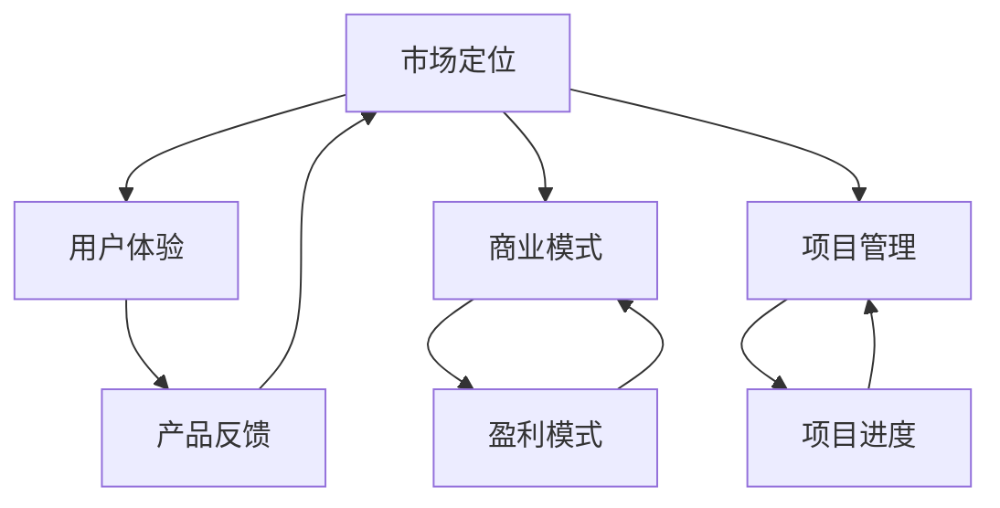

                 

# 技术创新与商业化：如何将想法转化为产品

> 关键词：技术创新、商业化、产品开发、市场定位、用户体验、商业模式、风险投资

摘要：本文探讨了将技术创新转化为商业成功的关键步骤，包括市场定位、用户体验设计、商业模式构建、风险投资获取以及项目管理。通过一步步的剖析，我们展示了如何从创意到产品的全过程，并提供了一些实用的建议和工具，帮助企业成功实现技术创新的商业化。

## 1. 背景介绍（Background Introduction）

在当今快速变化的世界，技术创新成为了推动商业增长的关键因素。然而，从创新想法到成功的商业化产品，这一过程并非易事。许多创新项目因为未能找到合适的商业模式、用户体验不佳或者市场定位不准确而失败。因此，了解如何将技术创新转化为商业化产品至关重要。

本文将详细探讨这一转化过程，从市场调研、用户体验设计、商业模式构建到风险投资获取，以及项目管理的各个环节。我们将通过具体案例和实用工具，帮助读者理解如何将创新想法落地为具有市场竞争力的产品。

### 1.1 技术创新的定义与重要性

技术创新指的是利用新知识、新方法或新工具来改进现有产品、服务或业务流程。它不仅能够提升企业竞争力，还能够创造新的市场机会。在当今信息时代，技术创新的速度和规模前所未有，企业若能抓住机遇，将其转化为商业化产品，将获得巨大的竞争优势。

### 1.2 商业化的定义与目标

商业化是将创新技术转化为盈利业务的过程。其目标是实现技术价值最大化，同时确保产品或服务的市场竞争力。成功的商业化不仅能够带来经济收益，还能够提升企业的品牌价值和市场份额。

### 1.3 创新技术商业化的重要性

创新技术商业化能够推动经济增长，创造就业机会，提高生产效率，并改善人们的生活质量。它还能够促进科学研究和技术进步，形成良性循环。因此，掌握如何实现技术创新的商业模式至关重要。

## 2. 核心概念与联系（Core Concepts and Connections）

为了更好地理解技术创新的转化过程，我们需要了解几个核心概念，包括市场定位、用户体验、商业模式和项目管理。

### 2.1 市场定位（Market Positioning）

市场定位是指企业如何将自己与竞争对手区分开来，以满足特定消费者的需求。正确的市场定位能够帮助企业吸引目标客户，提高品牌知名度，并建立竞争优势。

### 2.2 用户体验（User Experience, UX）

用户体验是指用户在使用产品或服务过程中的感受和体验。良好的用户体验能够增加用户满意度，提高用户忠诚度，并促进产品口碑传播。

### 2.3 商业模式（Business Model）

商业模式是指企业如何创造、传递和捕获价值。它包括产品或服务的定位、收入来源、成本结构、目标客户群体以及与合作伙伴的关系。

### 2.4 项目管理（Project Management）

项目管理是指通过计划、组织、协调和控制项目活动，以确保项目按时、按预算、按质量完成。成功的项目管理能够提高项目成功率，降低风险，并确保资源的有效利用。

### 2.5 这些概念之间的联系

市场定位、用户体验、商业模式和项目管理是技术创新商业化的关键要素。市场定位决定了产品的方向和目标客户，用户体验确保了产品满足用户需求，商业模式决定了企业的盈利模式，而项目管理则确保了项目从创意到产品的全过程顺利实施。

### 2.6 Mermaid 流程图



## 3. 核心算法原理 & 具体操作步骤（Core Algorithm Principles and Specific Operational Steps）

### 3.1 市场定位（Market Positioning）

市场定位的核心在于了解目标客户的需求和偏好。以下是具体操作步骤：

1. **市场调研**：通过问卷调查、访谈、用户行为分析等方式收集市场数据。
2. **竞争分析**：分析竞争对手的产品特点、市场占有率、营销策略等。
3. **目标客户群体**：确定目标客户群体的特征，包括年龄、性别、收入水平、消费习惯等。
4. **差异化策略**：确定产品或服务的差异化优势，以区分于竞争对手。
5. **定位陈述**：撰写简洁明了的市场定位陈述，明确产品或服务的定位。

### 3.2 用户体验（User Experience, UX）

用户体验设计旨在提升用户在使用产品过程中的满意度。以下是具体操作步骤：

1. **用户研究**：了解目标用户的需求、行为和偏好。
2. **信息架构**：设计产品结构，确保用户能够轻松找到所需功能。
3. **界面设计**：设计直观、易用的用户界面。
4. **交互设计**：确保用户与产品的交互流畅，提供良好的反馈。
5. **用户测试**：通过用户测试收集反馈，优化产品设计。

### 3.3 商业模式（Business Model）

商业模式设计决定了企业的盈利方式。以下是具体操作步骤：

1. **价值主张**：明确产品或服务的核心价值，即为什么用户会购买。
2. **收入模式**：确定企业的收入来源，如产品销售、订阅费、广告收入等。
3. **成本结构**：分析企业的主要成本，如研发、生产、营销等。
4. **利润模式**：确定如何通过成本管理和收入最大化实现盈利。
5. **商业模式画布**：使用商业模式画布工具，将以上要素整合成一个完整的商业模式。

### 3.4 项目管理（Project Management）

项目管理是确保项目按时、按预算、按质量完成的关键。以下是具体操作步骤：

1. **项目规划**：制定项目计划，明确目标、任务、时间表和资源分配。
2. **团队协作**：组建项目团队，明确每个人的职责和任务。
3. **风险管理**：识别项目风险，并制定应对策略。
4. **进度监控**：定期检查项目进度，确保按计划进行。
5. **质量保证**：确保项目成果符合既定质量标准。

## 4. 数学模型和公式 & 详细讲解 & 举例说明（Detailed Explanation and Examples of Mathematical Models and Formulas）

### 4.1 市场需求预测模型

市场需求预测是市场定位的重要环节。我们可以使用时间序列分析方法来预测市场需求。以下是一个简单的时间序列预测模型：

$$
Y_t = \alpha_0 + \alpha_1 t + \alpha_2 \ln(X_t) + \epsilon_t
$$

其中：
- $Y_t$ 是第 $t$ 个月的市场需求量。
- $t$ 是时间序列。
- $X_t$ 是第 $t$ 个月的市场规模。
- $\alpha_0$、$\alpha_1$ 和 $\alpha_2$ 是模型参数。
- $\epsilon_t$ 是随机误差。

### 4.2 用户体验满意度模型

用户体验满意度可以通过以下公式计算：

$$
S = \frac{E - P + F}{3}
$$

其中：
- $S$ 是用户体验满意度。
- $E$ 是用户期望。
- $P$ 是实际体验。
- $F$ 是情感因素。

### 4.3 商业模式盈利模型

商业模式的盈利能力可以通过以下公式计算：

$$
\text{利润} = \text{收入} - \text{成本}
$$

其中：
- 收入是产品或服务的总收入。
- 成本是包括生产成本、营销成本、运营成本等在内的总成本。

### 4.4 项目风险评估模型

项目风险可以通过以下公式计算：

$$
R = \frac{\sum_{i=1}^{n} w_i \cdot p_i}{\sum_{i=1}^{n} w_i}
$$

其中：
- $R$ 是项目总风险。
- $w_i$ 是第 $i$ 个风险的概率。
- $p_i$ 是第 $i$ 个风险的损失。

### 4.5 举例说明

假设我们想要预测未来3个月的市场需求，已知前6个月的市场规模和需求如下表：

| 月份 | 市场规模 (X_t) | 需求量 (Y_t) |
|------|----------------|--------------|
| 1    | 1000           | 200          |
| 2    | 1200           | 220          |
| 3    | 1500           | 300          |
| 4    | 1800           | 320          |
| 5    | 2000           | 350          |
| 6    | 2200           | 400          |

我们可以通过最小二乘法估计模型参数 $\alpha_0$、$\alpha_1$ 和 $\alpha_2$，然后使用模型预测未来3个月的市场需求。

## 5. 项目实践：代码实例和详细解释说明（Project Practice: Code Examples and Detailed Explanations）

### 5.1 开发环境搭建

为了更好地理解技术创新的转化过程，我们将通过一个实际的项目实例来展示如何从创意到产品的全过程。首先，我们需要搭建开发环境。

**技术栈**：
- 语言：Python
- 数据库：MySQL
- 前端框架：React
- 后端框架：Flask

**步骤**：

1. 安装 Python 和相关依赖：
   ```bash
   pip install flask
   pip install mysql-connector-python
   pip install react
   ```

2. 初始化项目文件夹，并安装依赖：
   ```bash
   cd project_folder
   npm init -y
   npm install
   ```

3. 配置数据库：
   - 在 MySQL 中创建数据库和表。

### 5.2 源代码详细实现

**5.2.1 后端实现（Flask 应用程序）**

```python
from flask import Flask, request, jsonify
import mysql.connector

app = Flask(__name__)

# 配置数据库连接
db = mysql.connector.connect(
    host="localhost",
    user="yourusername",
    password="yourpassword",
    database="yourdatabase"
)

@app.route('/api/data', methods=['POST'])
def process_data():
    data = request.json
    # 插入数据到数据库
    cursor = db.cursor()
    cursor.execute("INSERT INTO data (field1, field2) VALUES (%s, %s)", (data['field1'], data['field2']))
    db.commit()
    return jsonify({"status": "success"})

if __name__ == '__main__':
    app.run(debug=True)
```

**5.2.2 前端实现（React 组件）**

```jsx
import React, { useState } from 'react';
import axios from 'axios';

function DataForm() {
    const [formData, setFormData] = useState({ field1: '', field2: '' });

    const handleSubmit = async (e) => {
        e.preventDefault();
        try {
            const response = await axios.post('/api/data', formData);
            console.log(response.data);
        } catch (error) {
            console.error(error);
        }
    };

    return (
        <form onSubmit={handleSubmit}>
            <label>
                Field 1:
                <input
                    type="text"
                    value={formData.field1}
                    onChange={(e) => setFormData({ ...formData, field1: e.target.value })}
                />
            </label>
            <label>
                Field 2:
                <input
                    type="text"
                    value={formData.field2}
                    onChange={(e) => setFormData({ ...formData, field2: e.target.value })}
                />
            </label>
            <button type="submit">Submit</button>
        </form>
    );
}

export default DataForm;
```

### 5.3 代码解读与分析

在这个项目中，我们使用了 Flask 框架来搭建后端应用程序，React 框架来构建前端用户界面。后端代码负责处理数据存储和业务逻辑，前端代码则负责数据输入和用户交互。

**5.3.1 后端解读**

- 使用 Flask 的 `/api/data` 路由来接收前端发送的 POST 请求。
- 通过 MySQL Connector Python 连接到本地 MySQL 数据库。
- 将接收到的 JSON 数据插入到数据库表中。

**5.3.2 前端解读**

- 使用 React 的 `useState` 钩子来管理表单数据。
- 使用 `handleSubmit` 函数来处理表单提交，并通过 axios 发送 POST 请求到后端。

### 5.4 运行结果展示

在本地开发环境中，启动 Flask 应用程序后，可以通过 React 前端页面提交数据。数据将被成功插入到 MySQL 数据库中。

## 6. 实际应用场景（Practical Application Scenarios）

技术创新的商业化不仅适用于大型企业，同样对于初创公司和小型团队也非常重要。以下是几个实际应用场景：

### 6.1 初创公司

初创公司通常资源有限，因此需要找到可行的商业模式，快速验证市场潜力。以下是一些建议：

- **精益创业**：采用精益创业方法，通过 MVP（最小可行产品）验证市场需求。
- **用户反馈**：积极获取用户反馈，不断优化产品功能。
- **合作伙伴**：寻找合适的合作伙伴，共同开发市场。

### 6.2 大型企业

大型企业通常拥有丰富的资源和专业知识，可以采用以下策略：

- **创新实验室**：建立创新实验室，专注于新技术的研究和商业化。
- **开放创新**：与外部机构合作，共享资源和知识，加速创新进程。
- **商业模式创新**：通过调整商业模式，开拓新的市场机会。

### 6.3 小型团队

小型团队可以利用以下方法来将技术创新商业化：

- **专业化**：专注于某一特定领域，打造核心竞争力。
- **差异化**：通过差异化产品或服务，打造市场竞争力。
- **灵活应对**：根据市场变化快速调整策略，抓住机遇。

## 7. 工具和资源推荐（Tools and Resources Recommendations）

### 7.1 学习资源推荐

- **书籍**：
  - 《精益创业》（The Lean Startup）by Eric Ries
  - 《商业模式新生代》（Business Model Generation）by Alexander Osterwalder and Yves Pigneur
  - 《用户体验要素》（The Design of Everyday Things）by Don Norman

- **论文**：
  - “The Lean Startup” by Eric Ries
  - “Business Model Innovation” by Henry Chesbrough

- **博客**：
  - Lean Startup
  - Business Model Canvas

- **网站**：
  - startupbootcamp.com
  - leanstack.com

### 7.2 开发工具框架推荐

- **前端框架**：React, Angular, Vue.js
- **后端框架**：Flask, Django, Spring Boot
- **数据库**：MySQL, PostgreSQL, MongoDB
- **项目管理工具**：JIRA, Trello, Asana

### 7.3 相关论文著作推荐

- “Design Thinking for Innovation” by Tim Brown
- “The Innovator's Dilemma” by Clayton Christensen
- “Disruptive Technology” by Clayton Christensen

## 8. 总结：未来发展趋势与挑战（Summary: Future Development Trends and Challenges）

随着技术的不断发展，技术创新的商业化趋势将越来越显著。以下是一些未来发展趋势和挑战：

### 8.1 发展趋势

- **数字化转型的深化**：越来越多的企业将采用数字化工具和平台，推动业务模式的创新。
- **人工智能的应用**：人工智能将在各个行业得到更广泛的应用，为商业化带来新的机会。
- **可持续发展**：可持续发展和社会责任将成为企业创新的重要方向。

### 8.2 挑战

- **市场竞争加剧**：随着创新速度的加快，市场竞争将变得更加激烈。
- **技术风险**：新技术的不确定性和风险将增加，企业需要建立相应的风险管理机制。
- **数据隐私和安全**：数据隐私和安全将成为重要的法律和社会问题，需要企业高度重视。

## 9. 附录：常见问题与解答（Appendix: Frequently Asked Questions and Answers）

### 9.1 市场定位的关键是什么？

市场定位的关键在于了解目标客户的需求和偏好，以及如何在竞争激烈的市场中区分自己的产品或服务。

### 9.2 如何确保用户体验？

确保用户体验的关键在于深入了解目标用户的需求，进行用户研究，并通过迭代设计和用户测试来优化产品。

### 9.3 商业模式设计需要注意什么？

商业模式设计需要考虑价值主张、收入模式、成本结构和目标客户群体，确保商业模式能够实现盈利。

### 9.4 如何进行项目管理？

进行项目管理需要制定详细的项目计划，组建项目团队，识别项目风险，并定期监控项目进度。

## 10. 扩展阅读 & 参考资料（Extended Reading & Reference Materials）

- **书籍**：
  - 《创业维艰》（Hard Things About Hard Things）by Ben Horowitz
  - 《创新者的窘境》（The Innovator's Dilemma）by Clayton M. Christensen

- **论文**：
  - “Business Model Innovation and Sustainability” by Alexander Osterwalder and Yves Pigneur
  - “Open Innovation: The New Imperative for Creating and Profiting from Technology” by Henry Chesbrough

- **网站**：
  - startupbootcamp.com
  - leanstack.com

- **博客**：
  - siliconangle.com
  - forbes.com/sites/forbesbusinesscouncil

## 作者署名

作者：禅与计算机程序设计艺术 / Zen and the Art of Computer Programming

