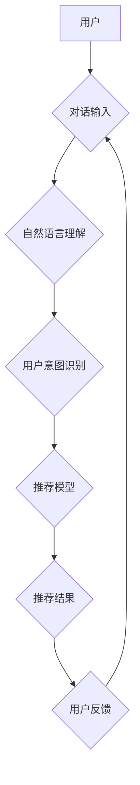

                 

## 电商平台中的对话式推荐系统个性化优化

> 关键词：对话式推荐系统、个性化推荐、电商平台、自然语言处理、深度学习、用户行为分析、推荐算法

## 1. 背景介绍

在当今数据爆炸的时代，电商平台面临着激烈的竞争压力。如何精准地推荐用户感兴趣的产品，提升用户体验和转化率，成为平台发展的重要课题。传统的基于内容或协同过滤的推荐系统，虽然取得了一定的效果，但缺乏对用户个性化需求的深度理解和动态响应能力。

对话式推荐系统作为一种新兴的推荐技术，通过与用户进行自然语言交互，能够更深入地了解用户的需求和偏好，并根据用户的实时反馈进行个性化推荐。它打破了传统推荐系统单向推送的模式，实现了用户与推荐系统的双向互动，从而提升了推荐的精准度和用户体验。

## 2. 核心概念与联系

### 2.1  对话式推荐系统的核心概念

对话式推荐系统是指通过自然语言交互，与用户进行对话，并根据对话内容进行个性化推荐的推荐系统。它融合了自然语言处理 (NLP)、机器学习 (ML) 和推荐算法等多个技术领域，旨在实现更智能、更人性化的推荐体验。

### 2.2  对话式推荐系统与传统推荐系统的区别

| 特征 | 传统推荐系统 | 对话式推荐系统 |
|---|---|---|
| 交互方式 | 单向推送 | 双向互动 |
| 推荐方式 | 基于内容、协同过滤等静态算法 | 基于对话上下文、用户意图等动态信息 |
| 个性化程度 | 有限 | 高度个性化 |
| 用户体验 | 较差 | 更加自然、人性化 |

### 2.3  对话式推荐系统架构



**架构说明：**

1. **用户** 通过自然语言与对话式推荐系统进行交互。
2. **对话输入** 包含用户的文本查询、评论、反馈等信息。
3. **自然语言理解** 模块对用户的对话输入进行分析，提取关键信息和语义。
4. **用户意图识别** 模块识别用户的对话意图，例如查询商品、获取产品信息、表达需求等。
5. **推荐模型** 根据用户的意图和历史行为，从商品库中筛选出最合适的推荐结果。
6. **推荐结果** 以文本、图片、视频等多种形式呈现给用户。
7. **用户反馈** 包含用户的点击、评分、评论等行为，用于模型的持续学习和优化。

## 3. 核心算法原理 & 具体操作步骤

### 3.1  算法原理概述

对话式推荐系统通常采用基于深度学习的推荐算法，例如 Transformer、BERT 等，这些算法能够有效地捕捉用户对话中的语义关系和上下文信息，从而实现更精准的推荐。

### 3.2  算法步骤详解

1. **数据预处理:** 收集用户对话数据，进行清洗、格式化和标注等预处理工作。
2. **特征提取:** 利用 NLP 技术，从用户对话中提取关键词、实体、情感等特征。
3. **模型训练:** 使用深度学习框架，训练推荐模型，例如 Transformer，使其能够学习用户对话与商品之间的关系。
4. **推荐生成:** 当用户提出新的对话请求时，模型会根据用户的对话上下文和历史行为，生成最合适的推荐结果。
5. **结果评估:** 通过用户反馈和指标评估，评估推荐系统的性能，并不断优化模型参数和算法策略。

### 3.3  算法优缺点

**优点:**

* **个性化程度高:** 可以根据用户的对话内容和历史行为，提供个性化的推荐。
* **交互性强:** 用户可以通过自然语言与系统进行交互，提升用户体验。
* **推荐精准度高:** 深度学习算法能够有效地捕捉用户需求和偏好。

**缺点:**

* **数据依赖性强:** 需要大量的用户对话数据进行训练。
* **模型复杂度高:** 深度学习模型训练和部署成本较高。
* **对话理解能力有限:** 对于复杂或模糊的对话请求，模型可能难以理解用户意图。

### 3.4  算法应用领域

对话式推荐系统广泛应用于电商平台、社交媒体、新闻资讯、教育培训等领域，例如：

* **电商平台:** 提供个性化的商品推荐、购物咨询、售后服务等。
* **社交媒体:** 推荐好友、兴趣小组、相关内容等。
* **新闻资讯:** 推荐个性化的新闻资讯、热点话题、相关文章等。
* **教育培训:** 推荐个性化的学习资源、课程推荐、学习计划等。

## 4. 数学模型和公式 & 详细讲解 & 举例说明

### 4.1  数学模型构建

对话式推荐系统的核心数学模型通常基于深度学习框架，例如 Transformer，其目标是学习用户对话与商品之间的关系，并预测用户对特定商品的兴趣。

**模型输入:** 用户对话历史记录，包括用户发出的文本消息和系统回复的文本消息。

**模型输出:** 对特定商品的兴趣预测分数。

### 4.2  公式推导过程

Transformer 模型的核心是自注意力机制，它能够捕捉用户对话中的语义关系和上下文信息。

**自注意力机制公式:**

$$
Attention(Q, K, V) = \frac{exp(Q \cdot K^T / \sqrt{d_k})}{exp(Q \cdot K^T / \sqrt{d_k})} \cdot V
$$

其中：

* $Q$：查询矩阵
* $K$：键矩阵
* $V$：值矩阵
* $d_k$：键向量的维度

**Transformer 模型的损失函数:**

$$
Loss = -\sum_{i=1}^{N} log(P(y_i | x_i))
$$

其中：

* $N$：样本数量
* $x_i$：第 $i$ 个样本的输入
* $y_i$：第 $i$ 个样本的真实标签
* $P(y_i | x_i)$：模型预测第 $i$ 个样本标签的概率

### 4.3  案例分析与讲解

假设用户在电商平台上与对话式推荐系统进行以下对话：

**用户:** 我想买一件舒适的T恤。

**系统:** 您喜欢什么颜色的T恤？

**用户:** 我喜欢蓝色。

**系统:** 好的，我推荐您这款蓝色T恤：

* [商品图片]
* [商品名称]
* [商品价格]

在这个案例中，对话式推荐系统通过用户对话中的关键词“舒适”和“蓝色”，理解用户的需求，并从商品库中筛选出符合用户偏好的蓝色T恤进行推荐。

## 5. 项目实践：代码实例和详细解释说明

### 5.1  开发环境搭建

* Python 3.7+
* TensorFlow 2.0+
* PyTorch 1.0+
* NLTK
* SpaCy

### 5.2  源代码详细实现

```python
# 导入必要的库
import tensorflow as tf
from tensorflow.keras.layers import Embedding, LSTM, Dense

# 定义对话式推荐模型
class RecommenderModel(tf.keras.Model):
    def __init__(self, vocab_size, embedding_dim, lstm_units):
        super(RecommenderModel, self).__init__()
        self.embedding = Embedding(vocab_size, embedding_dim)
        self.lstm = LSTM(lstm_units)
        self.dense = Dense(1, activation='sigmoid')

    def call(self, inputs):
        # 将用户对话历史记录嵌入到词向量空间
        embedded_inputs = self.embedding(inputs)
        # 使用 LSTM 层提取对话语义信息
        lstm_output = self.lstm(embedded_inputs)
        # 使用 Dense 层预测用户对商品的兴趣分数
        output = self.dense(lstm_output)
        return output

# 实例化模型
model = RecommenderModel(vocab_size=10000, embedding_dim=128, lstm_units=64)

# 编译模型
model.compile(optimizer='adam', loss='binary_crossentropy', metrics=['accuracy'])

# 训练模型
model.fit(x_train, y_train, epochs=10)

# 预测用户对商品的兴趣分数
predictions = model.predict(x_test)
```

### 5.3  代码解读与分析

* **模型定义:** 定义了一个对话式推荐模型，包含 Embedding 层、LSTM 层和 Dense 层。
* **Embedding 层:** 将用户对话中的词语映射到词向量空间。
* **LSTM 层:** 提取对话语义信息，捕捉用户对话中的上下文关系。
* **Dense 层:** 预测用户对商品的兴趣分数。
* **模型训练:** 使用训练数据训练模型，优化模型参数。
* **模型预测:** 使用训练好的模型预测用户对商品的兴趣分数。

### 5.4  运行结果展示

训练完成后，可以使用测试数据评估模型的性能，例如计算准确率、召回率等指标。

## 6. 实际应用场景

### 6.1  电商平台个性化推荐

对话式推荐系统可以帮助电商平台提供更个性化的商品推荐，例如：

* **根据用户的对话内容，推荐符合用户需求的商品。**
* **根据用户的历史购买记录和浏览记录，推荐用户可能感兴趣的商品。**
* **提供个性化的购物咨询和售后服务。**

### 6.2  社交媒体兴趣推荐

对话式推荐系统可以帮助社交媒体平台推荐用户可能感兴趣的内容，例如：

* **根据用户的对话内容，推荐相关的兴趣小组和好友。**
* **根据用户的点赞、评论和分享行为，推荐用户可能感兴趣的文章和视频。**
* **提供个性化的社交体验。**

### 6.3  新闻资讯个性化推送

对话式推荐系统可以帮助新闻资讯平台推荐用户可能感兴趣的新闻资讯，例如：

* **根据用户的对话内容，推荐相关的新闻资讯和热点话题。**
* **根据用户的阅读历史和偏好，推荐个性化的新闻资讯推送。**
* **提供更精准的新闻资讯服务。**

### 6.4  未来应用展望

对话式推荐系统在未来将有更广泛的应用场景，例如：

* **医疗保健:** 提供个性化的医疗建议和健康资讯。
* **教育培训:** 提供个性化的学习资源和课程推荐。
* **金融服务:** 提供个性化的理财建议和金融产品推荐。

## 7. 工具和资源推荐

### 7.1  学习资源推荐

* **书籍:**
    * 《深度学习》 by Ian Goodfellow, Yoshua Bengio, and Aaron Courville
    * 《自然语言处理》 by Dan Jurafsky and James H. Martin
* **在线课程:**
    * Coursera: Deep Learning Specialization
    * Udacity: Natural Language Processing Nanodegree
* **博客和网站:**
    * TensorFlow Blog: https://blog.tensorflow.org/
    * PyTorch Blog: https://pytorch.org/blog/

### 7.2  开发工具推荐

* **深度学习框架:** TensorFlow, PyTorch
* **自然语言处理库:** NLTK, SpaCy
* **数据处理工具:** Pandas, NumPy

### 7.3  相关论文推荐

* **BERT: Pre-training of Deep Bidirectional Transformers for Language Understanding**
* **Attention Is All You Need**
* **Recurrent Neural Network for Dialogue Generation**

## 8. 总结：未来发展趋势与挑战

### 8.1  研究成果总结

对话式推荐系统在电商平台、社交媒体、新闻资讯等领域取得了显著的成果，能够提供更个性化、更精准的推荐体验。

### 8.2  未来发展趋势

* **多模态对话:** 将文本、语音、图像等多模态信息融合到对话式推荐系统中，提升推荐的丰富性和准确性。
* **个性化模型:** 基于用户的个性化特征，构建个性化的推荐模型，提供更精准的推荐服务。
* **实时交互:** 实现实时对话交互，根据用户的实时反馈动态调整推荐结果。
* **解释性推荐:** 为推荐结果提供解释性信息，帮助用户理解推荐背后的逻辑。

### 8.3  面临的挑战

* **数据质量:** 对话式推荐系统依赖于高质量的用户对话数据，数据标注和清洗工作量较大。
* **模型复杂度:** 深度学习模型训练和部署成本较高，需要强大的计算资源和技术支持。
* **对话理解能力:** 对于复杂或模糊的对话请求，模型可能难以理解用户意图。
* **用户隐私:** 对话式推荐系统需要处理用户的敏感信息，需要保障用户隐私安全。

### 8.4  研究展望

未来对话式推荐系统将朝着更智能、更个性化、更安全的方向发展，为用户提供更便捷、更愉悦的体验。


## 9. 附录：常见问题与解答

**Q1: 对话式推荐系统与传统推荐系统的区别是什么？**

**A1:** 对话式推荐系统与传统推荐系统的主要区别在于交互方式和推荐方式。传统推荐系统采用单向推送的方式，而对话式推荐系统则通过双向互动的方式，更深入地了解用户的需求和偏好，从而提供更精准的推荐。

**Q2: 对话式推荐系统有哪些应用场景？**

**A2:** 对话式推荐系统广泛应用于电商平台、社交媒体、新闻资讯、教育培训等领域，例如个性化商品推荐、兴趣推荐、新闻资讯推送等。

**Q3: 如何评估对话式推荐系统的性能？**

**A3:** 对话式推荐系统的性能可以评估指标包括准确率、召回率、F1-score、用户满意度等。

**Q4: 对话式推荐系统面临哪些挑战？**

**A4:** 对话式推荐系统面临的数据质量、模型复杂度、对话理解能力、用户隐私等挑战。


作者：禅与计算机程序设计艺术 / Zen and the Art of Computer Programming 
<end_of_turn>

