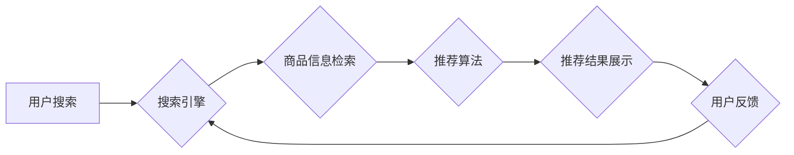

                 

## 电商平台搜索推荐系统的AI 大模型优化：提高系统性能、效率、准确率与多样性

> 关键词：电商平台、搜索推荐系统、AI 大模型、模型优化、性能、效率、准确率、多样性

## 1. 背景介绍

在当今数字化时代，电商平台已成为人们购物的首选方式。搜索推荐系统作为电商平台的核心功能之一，直接影响着用户体验和商业转化率。传统的搜索推荐系统主要依赖于基于规则的算法和特征工程，但随着用户行为数据的爆炸式增长和搜索需求的多样化，这些方法已难以满足日益增长的需求。

近年来，深度学习技术在自然语言处理、计算机视觉等领域取得了突破性进展，为电商平台搜索推荐系统的优化提供了新的机遇。AI 大模型，特别是 Transformer 架构，凭借其强大的语义理解能力和泛化能力，在搜索推荐领域展现出巨大的潜力。

## 2. 核心概念与联系

### 2.1 搜索推荐系统

搜索推荐系统旨在根据用户的搜索意图和历史行为，从海量商品中推荐最相关的商品，并提供个性化的搜索结果。

### 2.2 AI 大模型

AI 大模型是指在海量数据上训练的深度学习模型，具有强大的泛化能力和学习能力。

### 2.3 Transformer 架构

Transformer 架构是一种新型的神经网络架构，其核心是自注意力机制，能够有效捕捉文本序列中的长距离依赖关系，在自然语言处理任务中取得了优异的性能。

**Mermaid 流程图**



## 3. 核心算法原理 & 具体操作步骤

### 3.1 算法原理概述

基于 Transformer 架构的搜索推荐系统通常采用以下核心算法：

* **BERT (Bidirectional Encoder Representations from Transformers):** 用于理解用户搜索词的语义和上下文信息。
* **Seq2Seq (Sequence-to-Sequence):** 用于将用户搜索词映射到相关的商品ID。
* **Ranking 模型:** 用于对推荐结果进行排序，并根据用户偏好和搜索意图进行个性化推荐。

### 3.2 算法步骤详解

1. **数据预处理:** 收集用户搜索历史、商品信息、用户画像等数据，并进行清洗、格式化和特征提取。
2. **模型训练:** 使用 BERT 等预训练模型对用户搜索词进行语义编码，并训练 Seq2Seq 模型和 Ranking 模型。
3. **模型推理:** 当用户进行搜索时，将用户搜索词输入到 BERT 模型中获取语义表示，然后将表示输入到 Seq2Seq 模型中获取商品ID，最后将商品ID输入到 Ranking 模型中进行排序，并返回推荐结果。
4. **结果评估:** 使用准确率、召回率、NDCG 等指标评估模型性能，并根据评估结果进行模型调优。

### 3.3 算法优缺点

**优点:**

* 能够理解用户搜索词的语义和上下文信息，提高推荐结果的准确率。
* 具有强大的泛化能力，能够适应不同的搜索场景和用户群体。
* 可以进行个性化推荐，根据用户的历史行为和偏好提供更精准的推荐结果。

**缺点:**

* 训练成本高，需要大量的计算资源和训练数据。
* 模型复杂度高，部署和维护成本较高。
* 对数据质量要求较高，数据不干净或不完整会影响模型性能。

### 3.4 算法应用领域

* 电商平台商品推荐
* 搜索引擎结果排序
* 内容推荐系统
* 个性化广告推荐

## 4. 数学模型和公式 & 详细讲解 & 举例说明

### 4.1 数学模型构建

Transformer 模型的核心是自注意力机制，其数学模型可以表示为：

$$
Attention(Q, K, V) = \frac{exp(Q \cdot K^T / \sqrt{d_k})}{exp(Q \cdot K^T / \sqrt{d_k})} \cdot V
$$

其中：

* Q: 查询矩阵
* K: 键矩阵
* V: 值矩阵
* $d_k$: 键向量的维度

### 4.2 公式推导过程

自注意力机制通过计算查询向量 Q 与键向量 K 的点积，并使用 softmax 函数进行归一化，得到每个键向量的重要性权重。然后将这些权重与值向量 V 进行加权求和，得到最终的注意力输出。

### 4.3 案例分析与讲解

假设我们有一个句子 "The cat sat on the mat"，我们想要计算 "cat" 这个词与整个句子的关系。

1. 将每个词向量转换为查询向量 Q、键向量 K 和值向量 V。
2. 计算 "cat" 的查询向量与所有键向量的点积，并使用 softmax 函数进行归一化，得到每个词的注意力权重。
3. 将注意力权重与所有值向量进行加权求和，得到 "cat" 与整个句子的关系表示。

## 5. 项目实践：代码实例和详细解释说明

### 5.1 开发环境搭建

* Python 3.7+
* TensorFlow 或 PyTorch
* CUDA 和 cuDNN

### 5.2 源代码详细实现

```python
# 使用 TensorFlow 实现 BERT 模型
import tensorflow as tf

# 加载预训练的 BERT 模型
bert_model = tf.keras.applications.BERTModel.from_pretrained('bert-base-uncased')

# 定义输入层
input_layer = tf.keras.layers.Input(shape=(None,))

# 使用 BERT 模型进行语义编码
encoded_output = bert_model(input_layer)

# 定义输出层
output_layer = tf.keras.layers.Dense(units=num_classes, activation='softmax')(encoded_output)

# 创建模型
model = tf.keras.Model(inputs=input_layer, outputs=output_layer)

# 编译模型
model.compile(optimizer='adam', loss='categorical_crossentropy', metrics=['accuracy'])

# 训练模型
model.fit(x_train, y_train, epochs=10)
```

### 5.3 代码解读与分析

* 使用 TensorFlow 的 `BERTModel.from_pretrained()` 函数加载预训练的 BERT 模型。
* 定义输入层和输出层，并使用 BERT 模型进行语义编码。
* 使用 `adam` 优化器和 `categorical_crossentropy` 损失函数训练模型。

### 5.4 运行结果展示

* 训练完成后，可以使用测试数据评估模型性能。
* 可以使用准确率、召回率、NDCG 等指标评估模型性能。

## 6. 实际应用场景

### 6.1 商品推荐

* 基于用户搜索历史和浏览记录，推荐相关的商品。
* 基于用户画像和兴趣偏好，推荐个性化的商品。

### 6.2 搜索结果排序

* 根据用户搜索词和商品信息，对搜索结果进行排序，提高用户体验。
* 根据用户历史行为和偏好，个性化排序搜索结果。

### 6.3 内容推荐

* 基于用户阅读历史和兴趣偏好，推荐相关的文章、视频和音频内容。
* 基于内容主题和标签，推荐个性化的内容。

### 6.4 未来应用展望

* 更精准的个性化推荐
* 更智能的搜索体验
* 更丰富的应用场景

## 7. 工具和资源推荐

### 7.1 学习资源推荐

* **书籍:**
    * 《深度学习》
    * 《自然语言处理》
    * 《Transformer 详解》
* **在线课程:**
    * Coursera: 深度学习
    * Udacity: 自然语言处理
    * fast.ai: 深度学习

### 7.2 开发工具推荐

* **TensorFlow:** 开源深度学习框架
* **PyTorch:** 开源深度学习框架
* **Hugging Face Transformers:** 预训练 Transformer 模型库

### 7.3 相关论文推荐

* BERT: Pre-training of Deep Bidirectional Transformers for Language Understanding
* Attention Is All You Need
* Transformer-XL: Attentive Language Modeling Beyond Millions of Tokens

## 8. 总结：未来发展趋势与挑战

### 8.1 研究成果总结

基于 Transformer 架构的搜索推荐系统在提高推荐准确率、个性化程度和用户体验方面取得了显著成果。

### 8.2 未来发展趋势

* 更大规模的预训练模型
* 更有效的模型压缩和优化技术
* 更丰富的多模态融合

### 8.3 面临的挑战

* 数据质量和隐私保护
* 模型解释性和可信度
* 算法公平性和可控性

### 8.4 研究展望

未来研究将继续探索更强大的 AI 大模型，并致力于解决模型的挑战，以构建更智能、更公平、更可信的搜索推荐系统。

## 9. 附录：常见问题与解答

* **Q: 如何选择合适的预训练模型？**
* **A:** 选择预训练模型时需要考虑模型大小、参数量、训练数据规模和任务类型等因素。

* **Q: 如何评估模型性能？**
* **A:** 可以使用准确率、召回率、NDCG 等指标评估模型性能。

* **Q: 如何进行模型调优？**
* **A:** 可以通过调整模型超参数、数据预处理方法和训练策略进行模型调优。


作者：禅与计算机程序设计艺术 / Zen and the Art of Computer Programming 
<end_of_turn>

