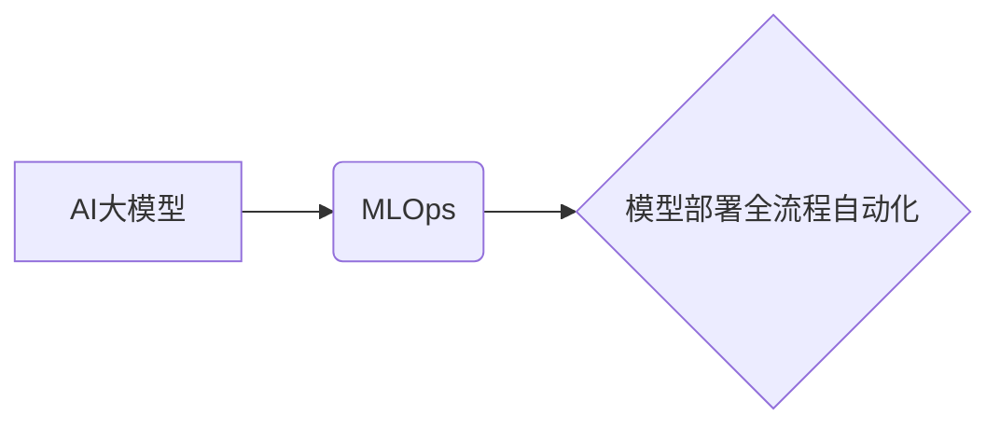

                 

## 电商搜索推荐场景下的AI大模型模型部署全流程自动化工具应用实践

> 关键词：AI大模型、模型部署、自动化工具、电商搜索推荐、MLOps、机器学习

## 1. 背景介绍

随着电商行业的蓬勃发展，用户对商品搜索和推荐的需求日益增长。传统的搜索推荐系统基于规则或特征工程，难以满足用户个性化需求和快速迭代的需求。近年来，基于深度学习的AI大模型在自然语言处理、计算机视觉等领域取得了突破性进展，为电商搜索推荐带来了新的机遇。

AI大模型能够学习用户行为、商品特征等海量数据，构建更精准的推荐模型，提升用户体验和商业价值。然而，将AI大模型应用于生产环境面临着诸多挑战，例如模型训练、模型评估、模型部署、模型监控等环节都需要进行复杂的配置和操作，这导致部署效率低下、维护成本高昂。

为了解决这些问题，我们需要构建一套全流程自动化工具，简化AI大模型的部署流程，提高效率和可靠性。

## 2. 核心概念与联系

### 2.1  AI大模型

AI大模型是指在海量数据上训练的深度学习模型，拥有强大的泛化能力和学习能力。常见的AI大模型包括BERT、GPT、T5等，它们在自然语言理解、文本生成、机器翻译等领域取得了显著成果。

### 2.2  MLOps

MLOps（机器学习运营）是一种将机器学习的开发、测试、部署和监控流程自动化和标准化的实践。它旨在提高机器学习模型的开发效率、部署可靠性和持续迭代能力。

### 2.3  模型部署全流程自动化

模型部署全流程自动化是指从模型训练到模型生产环境部署的所有环节都进行自动化，包括模型打包、模型注册、模型服务化、模型监控等。

**核心概念关系图:**



## 3. 核心算法原理 & 具体操作步骤

### 3.1  算法原理概述

模型部署全流程自动化工具通常基于以下核心算法原理：

* **模型压缩算法:** 压缩模型大小，降低部署成本和延迟。常见的压缩算法包括量化、剪枝、知识蒸馏等。
* **模型服务化框架:** 将模型封装成可供其他系统调用的服务，实现模型的复用和扩展。常见的框架包括TensorFlow Serving、TorchServe等。
* **自动化部署工具:** 自动化模型打包、部署、监控等操作，简化部署流程。常见的工具包括Kubeflow、MLflow等。

### 3.2  算法步骤详解

模型部署全流程自动化工具的具体操作步骤如下：

1. **模型训练:** 使用训练数据训练AI大模型，并进行模型评估和选择。
2. **模型压缩:** 使用模型压缩算法压缩模型大小，降低部署成本和延迟。
3. **模型打包:** 将压缩后的模型打包成可部署的格式，例如.tar.gz、.pb等。
4. **模型注册:** 将打包好的模型注册到模型仓库，方便后续部署和管理。
5. **模型服务化:** 使用模型服务化框架将模型封装成可供其他系统调用的服务。
6. **模型部署:** 使用自动化部署工具将模型服务部署到生产环境，例如容器化部署、云平台部署等。
7. **模型监控:** 实时监控模型的性能和健康状况，并进行模型更新和维护。

### 3.3  算法优缺点

**优点:**

* **提高效率:** 自动化部署流程，节省人工成本和时间。
* **提高可靠性:** 标准化部署流程，降低部署错误的风险。
* **提高可扩展性:** 模型服务化，方便模型的复用和扩展。

**缺点:**

* **工具复杂性:** 需要学习和使用多种自动化工具。
* **部署环境依赖:** 需要满足特定部署环境的要求。
* **模型维护成本:** 需要持续监控模型性能，并进行模型更新和维护。

### 3.4  算法应用领域

模型部署全流程自动化工具广泛应用于以下领域:

* **电商搜索推荐:** 自动化部署推荐模型，提高推荐精准度和用户体验。
* **金融风险控制:** 自动化部署风险模型，降低金融风险。
* **医疗诊断辅助:** 自动化部署诊断模型，辅助医生进行诊断。
* **智能客服:** 自动化部署对话模型，提高客服效率和用户满意度。

## 4. 数学模型和公式 & 详细讲解 & 举例说明

### 4.1  数学模型构建

模型部署全流程自动化工具的数学模型主要用于模型压缩、模型服务化和模型监控等环节。

* **模型压缩:** 使用量化、剪枝等算法压缩模型大小，可以构建基于信息熵、模型复杂度等指标的数学模型，优化模型压缩策略。
* **模型服务化:** 使用模型服务化框架将模型封装成可供其他系统调用的服务，可以构建基于RESTful API、gRPC等协议的数学模型，定义模型服务接口和数据格式。
* **模型监控:** 使用监控指标和机器学习算法监控模型性能和健康状况，可以构建基于预测模型、异常检测算法等数学模型，及时发现模型问题并进行干预。

### 4.2  公式推导过程

由于篇幅限制，此处仅列举模型压缩中的量化算法公式示例：

**量化公式:**

$$
y = \text{quantize}(x, b)
$$

其中：

* $x$ 是原始模型参数
* $y$ 是量化后的模型参数
* $b$ 是量化比特数

### 4.3  案例分析与讲解

**案例:**

假设电商平台需要部署一个基于BERT模型的商品搜索推荐系统。

**量化:** 使用8比特量化压缩BERT模型，降低模型大小并加速推理速度。

**服务化:** 使用TensorFlow Serving将量化后的BERT模型封装成服务，方便其他系统调用。

**监控:** 使用指标监控模型的准确率、召回率等性能指标，并使用异常检测算法监控模型的健康状况。

## 5. 项目实践：代码实例和详细解释说明

### 5.1  开发环境搭建

* 操作系统: Ubuntu 20.04
* Python 版本: 3.8
* 依赖库: TensorFlow, Flask, Docker

### 5.2  源代码详细实现

```python
# app.py
from flask import Flask, request, jsonify
import tensorflow as tf

app = Flask(__name__)

# 加载量化后的BERT模型
model = tf.keras.models.load_model('bert_model.h5')

@app.route('/predict', methods=['POST'])
def predict():
    data = request.get_json()
    query = data['query']
    # 使用BERT模型进行商品推荐
    predictions = model.predict(query)
    # 返回推荐结果
    return jsonify({'recommendations': predictions})

if __name__ == '__main__':
    app.run(debug=True)
```

### 5.3  代码解读与分析

* `app.py` 文件定义了一个Flask web应用，用于提供商品推荐服务。
* `model` 变量加载了量化后的BERT模型。
* `/predict` 路由接收用户查询，并使用BERT模型进行商品推荐。
* 返回推荐结果为JSON格式。

### 5.4  运行结果展示

启动服务后，可以使用curl命令发送请求获取推荐结果：

```bash
curl -X POST -H "Content-Type: application/json" -d '{"query": "手机"}' http://localhost:5000/predict
```

## 6. 实际应用场景

### 6.1  电商搜索推荐

AI大模型在电商搜索推荐场景中发挥着重要作用，可以根据用户的搜索历史、浏览记录、购买行为等数据，推荐更精准的商品。

### 6.2  个性化内容推荐

AI大模型可以根据用户的兴趣爱好、阅读习惯等数据，推荐个性化的新闻、文章、视频等内容。

### 6.3  智能客服

AI大模型可以用于构建智能客服系统，自动回复用户常见问题，提高客服效率和用户满意度。

### 6.4  未来应用展望

随着AI技术的不断发展，AI大模型在更多领域将发挥重要作用，例如医疗诊断、金融风险控制、自动驾驶等。

## 7. 工具和资源推荐

### 7.1  学习资源推荐

* **书籍:**
    * Deep Learning
    * Hands-On Machine Learning with Scikit-Learn, Keras & TensorFlow
* **在线课程:**
    * Coursera: Machine Learning
    * Udacity: Deep Learning Nanodegree

### 7.2  开发工具推荐

* **模型训练框架:** TensorFlow, PyTorch
* **模型服务化框架:** TensorFlow Serving, TorchServe
* **自动化部署工具:** Kubeflow, MLflow

### 7.3  相关论文推荐

* BERT: Pre-training of Deep Bidirectional Transformers for Language Understanding
* GPT-3: Language Models are Few-Shot Learners
* T5: Text-to-Text Transfer Transformer

## 8. 总结：未来发展趋势与挑战

### 8.1  研究成果总结

模型部署全流程自动化工具为将AI大模型应用于生产环境提供了有效解决方案，提高了效率、可靠性和可扩展性。

### 8.2  未来发展趋势

* **模型压缩算法的进一步优化:** 降低模型大小和延迟，提高部署效率。
* **模型服务化框架的完善:** 提供更丰富的功能和更易于使用的接口。
* **自动化部署工具的增强:** 支持更多平台和部署场景，提高部署灵活性。

### 8.3  面临的挑战

* **模型复杂性:** 随着AI模型的不断发展，模型复杂度越来越高，部署和维护难度也随之增加。
* **数据安全和隐私:** 模型训练和部署需要处理大量用户数据，数据安全和隐私保护是一个重要的挑战。
* **模型可解释性:** AI模型的决策过程往往难以理解，缺乏可解释性，难以获得用户信任。

### 8.4  研究展望

未来研究将重点关注以下方向:

* **开发更有效的模型压缩算法:** 探索新的模型压缩技术，例如神经网络结构剪枝、知识蒸馏等。
* **构建更安全可靠的模型服务化框架:** 加强模型安全性和可靠性，防止模型攻击和数据泄露。
* **提高模型可解释性:** 研究模型解释技术，使AI模型的决策过程更加透明和可理解。

## 9. 附录：常见问题与解答

**常见问题:**

* **如何选择合适的模型压缩算法?**

**解答:**

选择合适的模型压缩算法需要根据模型类型、应用场景和性能要求进行综合考虑。

* **如何部署模型到生产环境?**

**解答:**

可以使用自动化部署工具将模型部署到容器化环境、云平台等生产环境。

* **如何监控模型性能?**

**解答:**

可以使用监控指标和机器学习算法监控模型的性能和健康状况，及时发现模型问题并进行干预。


作者：禅与计算机程序设计艺术 / Zen and the Art of Computer Programming 
<end_of_turn>

