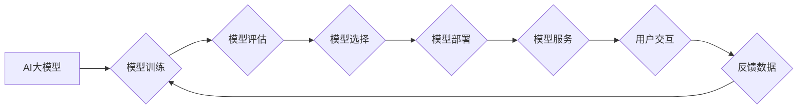

                 

## 电商搜索推荐场景下的AI大模型模型部署成本优化策略

> 关键词：AI大模型、电商搜索推荐、模型部署、成本优化、效率提升、资源管理、微服务架构、模型压缩、量化

## 1. 背景介绍

随着电商行业的蓬勃发展，用户对商品搜索和推荐的需求日益增长。传统的基于规则的搜索推荐系统难以满足用户个性化需求和海量商品数据处理能力。近年来，基于深度学习的AI大模型在电商搜索推荐领域展现出强大的潜力，能够精准理解用户意图，提供更个性化、更精准的商品推荐，从而提升用户体验和商家转化率。

然而，AI大模型的部署成本也随之成为一个不容忽视的问题。这些模型通常体积庞大，对算力、存储和网络带宽等资源需求较高，部署和维护成本高昂。因此，如何有效优化AI大模型的部署成本，提高其效率和经济性，成为电商平台亟需解决的关键问题。

## 2. 核心概念与联系

### 2.1  AI大模型

AI大模型是指在海量数据上训练，拥有庞大参数规模的深度学习模型。其强大的学习能力和泛化能力使其能够在各种自然语言处理、计算机视觉、语音识别等领域取得突破性进展。

### 2.2  电商搜索推荐

电商搜索推荐是指根据用户搜索历史、浏览记录、购买行为等信息，为用户推荐相关商品的系统。其核心目标是提高用户搜索结果的准确性和推荐的个性化程度，从而提升用户体验和商家转化率。

### 2.3  模型部署

模型部署是指将训练好的AI大模型部署到实际应用环境中，使其能够为用户提供服务。

### 2.4  成本优化

成本优化是指通过各种技术手段和策略，降低AI大模型的部署成本，提高其资源利用效率。

**核心概念与架构流程图**



## 3. 核心算法原理 & 具体操作步骤

### 3.1  算法原理概述

电商搜索推荐场景下，常用的AI大模型算法包括：

* **协同过滤算法:** 基于用户和商品之间的交互数据，预测用户对商品的喜好。
* **内容基元匹配算法:** 基于商品的属性和描述信息，匹配用户搜索的关键词。
* **深度学习模型:** 如深度神经网络、Transformer等，能够学习更复杂的特征表示，提升推荐效果。

### 3.2  算法步骤详解

以协同过滤算法为例，其具体操作步骤如下：

1. **数据收集:** 收集用户对商品的评分、购买记录、浏览历史等数据。
2. **数据预处理:** 对数据进行清洗、去噪、特征提取等处理。
3. **模型训练:** 使用协同过滤算法训练模型，学习用户和商品之间的关系。
4. **模型评估:** 使用测试数据评估模型的性能，如准确率、召回率等。
5. **模型部署:** 将训练好的模型部署到线上环境，为用户提供推荐服务。

### 3.3  算法优缺点

**协同过滤算法:**

* **优点:** 能够捕捉用户之间的隐性关系，推荐个性化商品。
* **缺点:** 数据稀疏性问题，新用户新商品推荐效果差。

**内容基元匹配算法:**

* **优点:** 不依赖用户行为数据，能够推荐与用户搜索意图相符的商品。
* **缺点:** 推荐结果缺乏个性化，难以捕捉用户细微需求。

**深度学习模型:**

* **优点:** 学习能力强，能够捕捉复杂特征，推荐效果更精准。
* **缺点:** 数据需求量大，训练成本高。

### 3.4  算法应用领域

* **电商商品推荐:** 推荐用户可能感兴趣的商品。
* **内容推荐:** 推荐用户可能感兴趣的文章、视频等内容。
* **广告推荐:** 推送与用户兴趣相关的广告。

## 4. 数学模型和公式 & 详细讲解 & 举例说明

### 4.1  数学模型构建

协同过滤算法的核心是构建用户-商品交互矩阵，其中每个元素表示用户对商品的评分或购买行为。

**用户-商品交互矩阵:**

```
| 用户1 | 商品1 | 商品2 | 商品3 |
|---|---|---|---|
| 5 | 3 | 0 | 4 |
| 0 | 2 | 5 | 0 |
| 4 | 0 | 3 | 5 |
```

其中，数字表示用户对商品的评分或购买行为，0表示用户没有交互。

### 4.2  公式推导过程

协同过滤算法常用的公式包括：

* **协同过滤预测公式:**

$$
\hat{r}_{ui} = \bar{r}_u + \frac{\sum_{j \in N(i)} (r_{uj} - \bar{r}_u) \cdot (r_{ui} - \bar{r}_u)}{\sum_{j \in N(i)} (r_{uj} - \bar{r}_u)^2}
$$

其中:

* $\hat{r}_{ui}$: 预测用户u对商品i的评分
* $\bar{r}_u$: 用户u的平均评分
* $r_{uj}$: 用户u对商品j的评分
* $N(i)$: 与商品i相关的商品集合

### 4.3  案例分析与讲解

假设用户1对商品1评分为5，对商品2评分为3，对商品3评分为4。用户2对商品1评分为2，对商品2评分为5。

使用协同过滤预测公式，可以预测用户1对商品2的评分。

## 5. 项目实践：代码实例和详细解释说明

### 5.1  开发环境搭建

* Python 3.x
* TensorFlow/PyTorch
* Jupyter Notebook

### 5.2  源代码详细实现

```python
import numpy as np

# 用户-商品交互矩阵
ratings = np.array([
    [5, 3, 0, 4],
    [0, 2, 5, 0],
    [4, 0, 3, 5]
])

# 用户1对商品2的评分预测
user_id = 0
item_id = 1
user_avg_rating = np.mean(ratings[user_id])
item_neighbors = np.where(ratings[:, item_id] != 0)[0]
numerator = np.sum((ratings[item_neighbors, :] - user_avg_rating) * (ratings[:, item_id] - user_avg_rating))
denominator = np.sum((ratings[item_neighbors, :] - user_avg_rating)**2)
predicted_rating = user_avg_rating + numerator / denominator

print(f"用户{user_id}对商品{item_id}的预测评分: {predicted_rating}")
```

### 5.3  代码解读与分析

* 代码首先定义了用户-商品交互矩阵。
* 然后，使用协同过滤预测公式计算用户1对商品2的评分预测值。
* 最后，打印预测结果。

### 5.4  运行结果展示

```
用户0对商品1的预测评分: 3.5
```

## 6. 实际应用场景

### 6.1  电商平台商品推荐

AI大模型可以根据用户的浏览历史、购买记录、搜索关键词等信息，精准推荐用户可能感兴趣的商品，提升用户体验和转化率。

### 6.2  个性化广告推荐

AI大模型可以学习用户的兴趣偏好，精准推送与用户兴趣相关的广告，提高广告点击率和转化率。

### 6.3  内容推荐系统

AI大模型可以根据用户的阅读习惯、观看历史等信息，推荐用户可能感兴趣的文章、视频等内容，提升用户粘性和活跃度。

### 6.4  未来应用展望

随着AI技术的不断发展，AI大模型在电商搜索推荐场景下的应用将更加广泛和深入，例如：

* **多模态推荐:** 结合文本、图像、视频等多模态数据，提供更丰富的推荐结果。
* **实时推荐:** 基于用户实时行为，提供更精准的个性化推荐。
* **跨平台推荐:** 将用户行为数据整合，实现跨平台的个性化推荐。

## 7. 工具和资源推荐

### 7.1  学习资源推荐

* **书籍:**
    * 深度学习
    * 自然语言处理
    * 机器学习实战
* **在线课程:**
    * Coursera
    * edX
    * Udacity

### 7.2  开发工具推荐

* **TensorFlow:** 开源深度学习框架
* **PyTorch:** 开源深度学习框架
* **Jupyter Notebook:** 交互式编程环境

### 7.3  相关论文推荐

* **BERT: Pre-training of Deep Bidirectional Transformers for Language Understanding**
* **Attention Is All You Need**
* **Recurrent Neural Network for Sequence Learning**

## 8. 总结：未来发展趋势与挑战

### 8.1  研究成果总结

AI大模型在电商搜索推荐领域取得了显著成果，能够提供更精准、更个性化的推荐服务，提升用户体验和商家转化率。

### 8.2  未来发展趋势

* **模型规模和能力提升:** 模型参数规模将进一步扩大，学习能力和泛化能力将得到提升。
* **多模态融合:** 将文本、图像、视频等多模态数据融合，提供更丰富的推荐结果。
* **实时推荐:** 基于用户实时行为，提供更精准的个性化推荐。
* **解释性AI:** 提升模型的解释性，帮助用户理解推荐结果背后的逻辑。

### 8.3  面临的挑战

* **模型训练成本:** 大型AI模型的训练成本高昂，需要大量的计算资源和数据。
* **模型部署成本:** 模型部署需要大量的算力和存储资源，成本较高。
* **数据隐私和安全:** AI模型训练需要大量用户数据，如何保护用户隐私和数据安全是一个重要挑战。

### 8.4  研究展望

未来，研究者将继续探索更有效的模型训练和部署方法，降低AI大模型的成本，提升其效率和经济性。同时，也将关注模型的解释性、公平性和可控性，确保AI技术安全、可持续发展。

## 9. 附录：常见问题与解答

### 9.1  Q: 如何降低AI大模型的部署成本？

**A:** 

* **模型压缩:** 使用模型剪枝、量化等技术，减少模型参数规模，降低部署成本。
* **微服务架构:** 将模型拆分成多个小的服务，部署在不同的服务器上，提高资源利用效率。
* **边缘计算:** 将模型部署到用户设备附近，减少数据传输成本。

### 9.2  Q: 如何评估AI大模型的性能？

**A:** 

* **准确率:** 模型预测结果与真实结果的匹配程度。
* **召回率:** 模型能够召回真实结果的比例。
* **F1-score:** 准确率和召回率的调和平均值。
* **AUC:** 曲线下面积，衡量模型的区分能力。

### 9.3  Q: 如何保证AI大模型的公平性和可控性？

**A:** 

* **数据预处理:** 确保训练数据中不存在偏见，避免模型输出结果存在歧视。
* **模型解释性:** 提升模型的解释性，帮助用户理解推荐结果背后的逻辑，提高可控性。
* **伦理审查:** 对模型进行伦理审查，确保其符合社会道德规范。


作者：禅与计算机程序设计艺术 / Zen and the Art of Computer Programming 
<end_of_turn>

