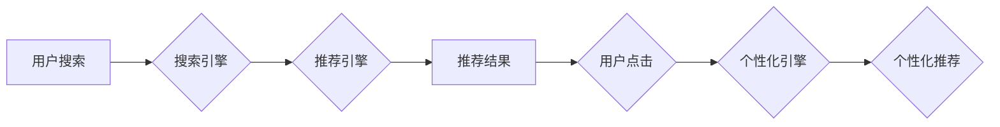

                 

## 电商搜索推荐效果优化中的AI大模型特征交叉技术

> 关键词：电商搜索、推荐系统、AI大模型、特征交叉、效果优化、深度学习

## 1. 背景介绍

在当今数据爆炸的时代，电商平台面临着巨大的用户需求和商品种类，如何精准推荐用户感兴趣的商品，提升用户体验和转化率，成为电商平台的核心竞争力。传统的推荐系统主要依赖于基于规则和协同过滤等方法，但这些方法在面对海量数据和复杂用户行为时，往往难以捕捉到用户需求的细微变化和商品之间的潜在关联。

近年来，随着深度学习技术的快速发展，AI大模型在推荐系统领域展现出强大的潜力。AI大模型能够学习用户行为、商品属性等海量数据中的复杂模式，并生成更精准的推荐结果。然而，单一的AI大模型往往难以充分挖掘数据中的特征交叉信息，导致推荐效果有限。

特征交叉技术是指将多个特征组合在一起，生成新的特征，以增强模型的表达能力和预测精度。在电商搜索推荐场景中，特征交叉技术可以有效地融合用户行为、商品属性、上下文信息等多方面特征，提升推荐系统的精准度和个性化程度。

## 2. 核心概念与联系

### 2.1  AI大模型

AI大模型是指在海量数据上训练的深度学习模型，拥有强大的学习能力和泛化能力。常见的AI大模型包括Transformer、BERT、GPT等。

### 2.2  特征交叉

特征交叉是指将多个特征组合在一起，生成新的特征，以增强模型的表达能力和预测精度。特征交叉可以分为以下几种类型：

* **手动特征交叉:** 人工根据业务经验设计特征组合规则，生成新的特征。
* **自动特征交叉:** 利用机器学习算法自动学习特征组合规则，生成新的特征。

### 2.3  电商搜索推荐系统

电商搜索推荐系统是指帮助用户在电商平台上快速找到感兴趣的商品的系统。它通常包含以下几个模块：

* **搜索引擎:** 处理用户搜索词，并返回相关商品结果。
* **推荐引擎:** 根据用户行为、商品属性等信息，推荐用户可能感兴趣的商品。
* **个性化引擎:** 根据用户的历史行为、偏好等信息，个性化推荐商品。

**Mermaid 流程图**



## 3. 核心算法原理 & 具体操作步骤

### 3.1  算法原理概述

特征交叉技术在电商搜索推荐系统中，可以有效地融合用户行为、商品属性、上下文信息等多方面特征，提升推荐系统的精准度和个性化程度。

常见的特征交叉方法包括：

* **特征拼接:** 将多个特征直接拼接在一起，形成新的特征。
* **特征点积:** 将多个特征进行点积运算，生成新的特征。
* **深度学习特征交叉:** 利用深度学习模型，自动学习特征组合规则，生成新的特征。

### 3.2  算法步骤详解

**以深度学习特征交叉为例，具体操作步骤如下：**

1. **数据预处理:** 将用户行为、商品属性、上下文信息等数据进行清洗、转换、编码等操作，使其适合深度学习模型训练。
2. **特征工程:** 设计和提取特征，包括用户特征、商品特征、上下文特征等。
3. **模型构建:** 选择合适的深度学习模型，例如Transformer、BERT等，并设计模型结构，包括输入层、隐藏层、输出层等。
4. **模型训练:** 利用训练数据训练深度学习模型，并进行模型评估，选择最佳模型参数。
5. **模型部署:** 将训练好的模型部署到线上环境，用于实时推荐。

### 3.3  算法优缺点

**优点:**

* 能够有效地融合多方面特征，提升推荐系统的精准度和个性化程度。
* 自动学习特征组合规则，无需人工设计。
* 能够处理海量数据，并不断学习和优化。

**缺点:**

* 训练深度学习模型需要大量的计算资源和时间。
* 模型解释性较差，难以理解模型是如何进行决策的。

### 3.4  算法应用领域

特征交叉技术广泛应用于各种推荐系统，例如：

* 电商推荐
* 内容推荐
* 人际关系推荐
* 广告推荐

## 4. 数学模型和公式 & 详细讲解 & 举例说明

### 4.1  数学模型构建

假设我们有N个用户，M个商品，每个用户对每个商品的评分记为$r_{ui}$。我们的目标是预测用户$u$对商品$i$的评分。

我们可以使用以下数学模型来表示用户对商品的评分预测：

$$
\hat{r}_{ui} = f(x_u, x_i, \theta)
$$

其中：

* $\hat{r}_{ui}$ 是模型预测的用户$u$对商品$i$的评分。
* $x_u$ 是用户$u$的特征向量。
* $x_i$ 是商品$i$的特征向量。
* $\theta$ 是模型参数。
* $f$ 是一个非线性函数，例如神经网络。

### 4.2  公式推导过程

为了提高模型的表达能力，我们可以使用特征交叉技术，将用户特征和商品特征进行组合，生成新的特征。

例如，我们可以将用户$u$的年龄特征$a_u$和商品$i$的价格特征$p_i$进行相乘，生成新的特征$a_u \times p_i$。

然后，我们可以将这个新的特征添加到模型的输入中：

$$
\hat{r}_{ui} = f(x_u, x_i, a_u \times p_i, \theta)
$$

### 4.3  案例分析与讲解

假设我们有一个电商平台，用户特征包括年龄、性别、购买历史等，商品特征包括价格、类别、品牌等。

我们可以使用特征交叉技术，将用户的年龄特征和商品的价格特征进行相乘，生成新的特征，表示用户对不同价格商品的偏好。

例如，对于年龄较小的用户，他们可能更倾向于购买价格较低的商品，因此我们可以将年龄特征和价格特征进行相乘，生成一个新的特征，表示用户对价格较低的商品的偏好程度。

## 5. 项目实践：代码实例和详细解释说明

### 5.1  开发环境搭建

* Python 3.7+
* TensorFlow 2.0+
* PyTorch 1.0+
* Jupyter Notebook

### 5.2  源代码详细实现

```python
import tensorflow as tf

# 定义用户特征和商品特征
user_features = tf.keras.Input(shape=(10,))
item_features = tf.keras.Input(shape=(5,))

# 定义特征交叉层
cross_layer = tf.keras.layers.Multiply()([user_features, item_features])

# 定义全连接层
dense_layer = tf.keras.layers.Dense(64, activation='relu')(cross_layer)

# 定义输出层
output_layer = tf.keras.layers.Dense(1, activation='linear')(dense_layer)

# 定义模型
model = tf.keras.Model(inputs=[user_features, item_features], outputs=output_layer)

# 编译模型
model.compile(optimizer='adam', loss='mse')

# 训练模型
model.fit(x=[user_data, item_data], y=rating_data, epochs=10)
```

### 5.3  代码解读与分析

* 我们首先定义了用户特征和商品特征的输入层。
* 然后，我们使用`Multiply()`层将用户特征和商品特征进行相乘，生成新的特征。
* 接着，我们使用全连接层和输出层，将新的特征映射到评分预测结果。
* 最后，我们编译和训练模型。

### 5.4  运行结果展示

训练完成后，我们可以使用模型预测用户对商品的评分。

## 6. 实际应用场景

### 6.1  电商搜索推荐

在电商搜索推荐场景中，特征交叉技术可以有效地融合用户搜索词、商品属性、用户行为等多方面特征，提升推荐系统的精准度和个性化程度。

### 6.2  个性化推荐

在个性化推荐场景中，特征交叉技术可以帮助模型学习用户不同的偏好和需求，并生成更精准的推荐结果。

### 6.3  广告推荐

在广告推荐场景中，特征交叉技术可以帮助模型学习用户对不同广告的兴趣和响应程度，并生成更有效的广告推荐。

### 6.4  未来应用展望

随着深度学习技术的不断发展，特征交叉技术在电商搜索推荐系统中的应用将更加广泛和深入。

未来，我们可以期待以下应用场景：

* 更复杂的特征交叉方法，例如注意力机制、图神经网络等。
* 更个性化的推荐结果，例如基于用户的兴趣爱好、生活习惯等进行推荐。
* 更智能的推荐系统，例如能够主动学习用户需求，并进行动态调整推荐策略。

## 7. 工具和资源推荐

### 7.1  学习资源推荐

* 深度学习入门书籍：
    * 《深度学习》
    * 《动手学深度学习》
* 特征交叉技术相关论文：
    * 《Attention Is All You Need》
    * 《Graph Convolutional Networks》

### 7.2  开发工具推荐

* TensorFlow
* PyTorch
* Keras

### 7.3  相关论文推荐

* 《BERT: Pre-training of Deep Bidirectional Transformers for Language Understanding》
* 《Transformer-XL: Attentive Language Models Beyond a Fixed-Length Context》

## 8. 总结：未来发展趋势与挑战

### 8.1  研究成果总结

特征交叉技术在电商搜索推荐系统中取得了显著的成果，有效地提升了推荐系统的精准度和个性化程度。

### 8.2  未来发展趋势

未来，特征交叉技术将朝着以下方向发展：

* 更复杂的特征组合方法
* 更个性化的推荐策略
* 更智能的推荐系统

### 8.3  面临的挑战

特征交叉技术也面临着一些挑战：

* 如何设计更有效的特征组合规则
* 如何处理高维特征数据
* 如何提高模型的解释性

### 8.4  研究展望

未来，我们需要继续探索更有效的特征交叉方法，并解决上述挑战，以推动电商搜索推荐系统的进一步发展。

## 9. 附录：常见问题与解答

### 9.1  Q1: 什么是特征交叉？

**A1:** 特征交叉是指将多个特征组合在一起，生成新的特征，以增强模型的表达能力和预测精度。

### 9.2  Q2: 特征交叉技术有哪些类型？

**A2:** 常见的特征交叉方法包括：

* 手动特征交叉
* 自动特征交叉

### 9.3  Q3: 特征交叉技术有哪些应用场景？

**A3:** 特征交叉技术广泛应用于各种推荐系统，例如：

* 电商推荐
* 内容推荐
* 人际关系推荐
* 广告推荐


作者：禅与计算机程序设计艺术 / Zen and the Art of Computer Programming 
<end_of_turn>

