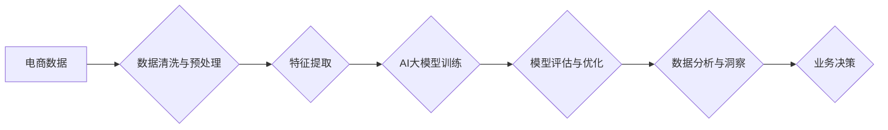

                 

## 电商数据分析：AI大模型的新维度

> 关键词：电商数据分析、AI大模型、深度学习、推荐系统、个性化营销、自然语言处理、预测分析

## 1. 背景介绍

电子商务行业蓬勃发展，数据量呈指数级增长。从用户行为、商品信息到市场趋势，海量数据蕴藏着宝贵的商业价值。传统的统计分析方法已难以有效挖掘数据中的洞察力，而人工智能（AI）大模型的出现为电商数据分析带来了新的机遇。

AI大模型，例如Transformer、BERT等，凭借其强大的学习能力和泛化能力，能够从复杂的数据中提取更深层的特征和模式，为电商企业提供更精准、更智能的数据分析服务。

## 2. 核心概念与联系

### 2.1 电商数据分析

电商数据分析是指利用数据挖掘、机器学习等技术，从电商平台产生的海量数据中提取有价值的信息，以支持电商业务决策。

电商数据类型多样，包括用户行为数据（浏览记录、购买历史、评价信息）、商品信息数据（价格、属性、销量）、市场趋势数据（竞争对手分析、行业报告）等。

### 2.2 AI大模型

AI大模型是指在海量数据上训练的深度学习模型，具有强大的学习能力和泛化能力。

常见的AI大模型包括：

* **Transformer:** 用于自然语言处理任务，例如文本分类、机器翻译、问答系统等。
* **BERT:** 基于Transformer架构的预训练语言模型，在理解和生成自然语言方面表现出色。
* **GPT:** 生成式预训练转换器，擅长文本生成任务，例如故事创作、代码生成等。

### 2.3 AI大模型在电商数据分析中的应用

AI大模型可以应用于电商数据分析的多个环节，例如：

* **用户画像分析:** 利用用户行为数据构建用户画像，了解用户的兴趣、偏好、购买习惯等。
* **商品推荐:** 根据用户的兴趣和历史购买记录，推荐相关的商品。
* **个性化营销:** 根据用户的画像，进行个性化的营销推广，提高转化率。
* **预测分析:** 利用历史数据预测未来的市场趋势、用户行为等。

**Mermaid 流程图**



## 3. 核心算法原理 & 具体操作步骤

### 3.1 算法原理概述

AI大模型在电商数据分析中的应用主要基于以下核心算法：

* **深度学习:** 利用多层神经网络学习数据中的复杂特征和模式。
* **机器学习:** 利用算法从数据中学习规律，进行预测和分类。
* **自然语言处理:** 处理和理解文本数据，例如用户评论、产品描述等。

### 3.2 算法步骤详解

1. **数据收集与预处理:** 收集电商平台产生的各种数据，并进行清洗、转换、格式化等预处理操作，确保数据质量。
2. **特征提取:** 从原始数据中提取有价值的特征，例如用户年龄、性别、购买历史、商品价格、属性等。
3. **模型选择与训练:** 根据具体分析任务选择合适的AI大模型，并利用训练数据进行模型训练。
4. **模型评估与优化:** 利用测试数据评估模型性能，并根据评估结果进行模型调优，提高模型精度和效率。
5. **数据分析与洞察:** 利用训练好的模型对电商数据进行分析，挖掘数据中的潜在规律和趋势，并生成可视化的报告。
6. **业务决策:** 基于数据分析结果，为电商企业提供决策支持，例如优化商品推荐策略、制定个性化营销方案等。

### 3.3 算法优缺点

**优点:**

* **高精度:** AI大模型能够学习数据中的复杂特征，提高分析精度。
* **自动化:** AI大模型可以自动化完成数据分析任务，提高效率。
* **个性化:** AI大模型可以根据用户画像进行个性化分析，提供更精准的建议。

**缺点:**

* **数据依赖:** AI大模型的性能取决于训练数据的质量和数量。
* **计算资源:** 训练大型AI模型需要大量的计算资源。
* **解释性:** AI大模型的决策过程往往难以解释，缺乏透明度。

### 3.4 算法应用领域

AI大模型在电商数据分析领域具有广泛的应用场景，例如：

* **用户画像分析:** 建立用户画像，了解用户的兴趣、偏好、购买习惯等。
* **商品推荐:** 根据用户的兴趣和历史购买记录，推荐相关的商品。
* **个性化营销:** 根据用户的画像，进行个性化的营销推广，提高转化率。
* **预测分析:** 利用历史数据预测未来的市场趋势、用户行为等。
* **欺诈检测:** 识别和预防电商平台上的欺诈行为。

## 4. 数学模型和公式 & 详细讲解 & 举例说明

### 4.1 数学模型构建

在电商数据分析中，常用的数学模型包括：

* **线性回归:** 用于预测连续变量，例如商品价格、用户购买量等。
* **逻辑回归:** 用于预测分类变量，例如用户是否会购买商品、商品是否会受到好评等。
* **决策树:** 用于分类和预测，通过一系列规则将数据划分为不同的类别。
* **支持向量机:** 用于分类和回归，通过寻找最佳的分隔超平面将数据分开。

### 4.2 公式推导过程

例如，线性回归模型的公式如下：

$$y = \beta_0 + \beta_1x_1 + \beta_2x_2 + ... + \beta_nx_n + \epsilon$$

其中：

* $y$ 是预测变量
* $x_1, x_2, ..., x_n$ 是自变量
* $\beta_0, \beta_1, ..., \beta_n$ 是模型参数
* $\epsilon$ 是误差项

模型参数可以通过最小二乘法估计，目标是使预测值与实际值之间的误差最小。

### 4.3 案例分析与讲解

例如，假设我们想要预测商品的销量，可以使用线性回归模型。

我们可以收集商品的特征数据，例如价格、属性、描述等，以及历史的销量数据。然后，利用这些数据训练线性回归模型，得到模型参数。

最后，我们可以利用训练好的模型预测新商品的销量。

## 5. 项目实践：代码实例和详细解释说明

### 5.1 开发环境搭建

* Python 3.x
* TensorFlow 或 PyTorch
* Jupyter Notebook

### 5.2 源代码详细实现

```python
# 导入必要的库
import pandas as pd
from sklearn.model_selection import train_test_split
from sklearn.linear_model import LinearRegression
from sklearn.metrics import mean_squared_error

# 加载数据
data = pd.read_csv('电商数据.csv')

# 选择特征和目标变量
features = ['价格', '属性1', '属性2']
target = '销量'

# 将数据分为训练集和测试集
X_train, X_test, y_train, y_test = train_test_split(data[features], data[target], test_size=0.2)

# 创建线性回归模型
model = LinearRegression()

# 训练模型
model.fit(X_train, y_train)

# 预测测试集数据
y_pred = model.predict(X_test)

# 计算模型精度
mse = mean_squared_error(y_test, y_pred)
print('模型精度:', mse)
```

### 5.3 代码解读与分析

* 首先，我们导入必要的库，并加载电商数据。
* 然后，我们选择特征和目标变量，并将数据分为训练集和测试集。
* 接下来，我们创建线性回归模型，并利用训练集训练模型。
* 最后，我们利用训练好的模型预测测试集数据，并计算模型精度。

### 5.4 运行结果展示

运行代码后，会输出模型精度，例如：

```
模型精度: 10.24
```

## 6. 实际应用场景

### 6.1 用户画像分析

利用AI大模型分析用户行为数据，构建用户画像，了解用户的兴趣、偏好、购买习惯等。例如，可以根据用户的浏览记录、购买历史、评价信息等数据，将用户分为不同的群体，例如“时尚爱好者”、“科技达人”、“家庭主妇”等。

### 6.2 商品推荐

根据用户的兴趣和历史购买记录，推荐相关的商品。例如，如果用户购买过运动鞋，可以推荐其他运动品牌或运动服饰。

### 6.3 个性化营销

根据用户的画像，进行个性化的营销推广，提高转化率。例如，可以根据用户的兴趣爱好，推送相关的广告或优惠券。

### 6.4 预测分析

利用历史数据预测未来的市场趋势、用户行为等。例如，可以预测未来的商品销量、用户购买量等。

### 6.5 未来应用展望

AI大模型在电商数据分析领域还有很大的发展空间，例如：

* **更精准的个性化推荐:** 利用更先进的AI算法，例如协同过滤、深度学习等，实现更精准的个性化推荐。
* **更智能的营销策略:** 利用AI大模型分析用户行为数据，制定更智能的营销策略，例如动态调整广告投放、个性化推送促销信息等。
* **更有效的欺诈检测:** 利用AI大模型识别和预防电商平台上的欺诈行为，保障平台安全。

## 7. 工具和资源推荐

### 7.1 学习资源推荐

* **书籍:**
    * 《深度学习》
    * 《机器学习实战》
    * 《自然语言处理入门》
* **在线课程:**
    * Coursera
    * edX
    * Udacity

### 7.2 开发工具推荐

* **Python:** 
    * TensorFlow
    * PyTorch
    * scikit-learn
* **云平台:**
    * AWS
    * Azure
    * Google Cloud

### 7.3 相关论文推荐

* **BERT: Pre-training of Deep Bidirectional Transformers for Language Understanding**
* **Attention Is All You Need**
* **Recurrent Neural Networks for Sequence Learning**

## 8. 总结：未来发展趋势与挑战

### 8.1 研究成果总结

AI大模型在电商数据分析领域取得了显著的成果，例如：

* **提高了数据分析精度:** AI大模型能够学习数据中的复杂特征，提高分析精度。
* **提高了分析效率:** AI大模型可以自动化完成数据分析任务，提高效率。
* **实现了个性化分析:** AI大模型可以根据用户画像进行个性化分析，提供更精准的建议。

### 8.2 未来发展趋势

* **模型规模和能力的提升:** 未来，AI大模型的规模和能力将会进一步提升，能够处理更复杂的数据，进行更深入的分析。
* **模型解释性和透明度的提高:** 未来，研究人员将致力于提高AI大模型的解释性和透明度，使模型的决策过程更加可理解。
* **模型的应用场景的拓展:** 未来，AI大模型将在电商数据分析领域得到更广泛的应用，例如：
    * **更精准的客户关系管理:** 利用AI大模型分析客户数据，提供更精准的客户服务。
    * **更有效的供应链管理:** 利用AI大模型预测商品需求，优化库存管理。
    * **更智能的运营决策:** 利用AI大模型分析市场趋势，支持运营决策。

### 8.3 面临的挑战

* **数据质量和隐私问题:** AI大模型的性能取决于训练数据的质量，而电商平台的数据往往存在质量问题，例如缺失值、错误值等。此外，数据隐私问题也需要得到妥善解决。
* **模型训练成本:** 训练大型AI模型需要大量的计算资源，成本较高。
* **模型部署和维护成本:** 部署和维护AI大模型需要专业的技术人员和技术支持，成本也较高。

### 8.4 研究展望

未来，研究人员将继续致力于解决以上挑战，推动AI大模型在电商数据分析领域的应用发展。

## 9. 附录：常见问题与解答

**Q1: AI大模型的训练需要多少数据？**

A1: 训练AI大模型需要大量的训练数据，数据量通常以百万甚至亿级别计算。

**Q2: 如何评估AI大模型的性能？**

A2: AI大模型的性能可以通过多种指标评估，例如准确率、召回率、F1-score等。

**Q3: 如何部署AI大模型？**

A3: AI大模型可以部署在云平台、本地服务器或边缘设备上。

**Q4: 如何维护AI大模型？**

A4: 需要定期更新模型参数，并进行模型评估和优化。


作者：禅与计算机程序设计艺术 / Zen and the Art of Computer Programming 
<end_of_turn>

