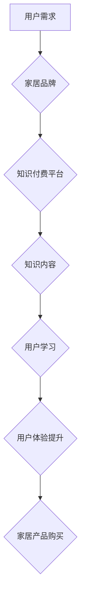

                 

## 关键词：知识付费、跨界营销、家居、人工智能、数据分析、用户体验、个性化推荐

## 1. 背景介绍

近年来，知识付费行业蓬勃发展，从线上课程、付费咨询到会员体系，各种模式层出不穷。与此同时，家居行业也面临着新的挑战和机遇。消费者对家居产品的需求越来越个性化，对家居体验的追求也日益提高。在这种背景下，知识付费与家居行业的跨界融合成为了一种新的趋势。

知识付费可以为家居行业提供以下优势：

* **提升用户粘性:** 通过提供优质的知识内容，例如家居装修技巧、家居养护知识、家居设计理念等，可以吸引用户持续关注品牌，提升用户粘性。
* **打造品牌差异化:**  知识付费可以帮助家居品牌建立专业形象，提升品牌价值，在竞争激烈的市场中形成差异化优势。
* **拓展销售渠道:**  知识付费可以作为一种引流方式，引导用户了解家居产品，最终转化为销售。

## 2. 核心概念与联系

### 2.1 知识付费

知识付费是指以知识、技能、经验等为核心内容，通过付费的方式获取和分享信息的行为。它涵盖了多种形式，例如在线课程、付费咨询、电子书、会员体系等。

### 2.2 家居跨界

家居跨界是指家居行业与其他行业进行融合，例如科技、文化、娱乐等，以满足消费者多元化的需求。

**核心概念联系：**

知识付费可以为家居跨界提供强大的支持。通过提供相关领域的知识内容，可以帮助家居品牌更好地理解用户需求，开发更符合用户需求的产品和服务，并提升用户体验。

**Mermaid 流程图：**



## 3. 核心算法原理 & 具体操作步骤

### 3.1 算法原理概述

知识付费与家居跨界的融合需要借助人工智能技术，例如推荐算法、自然语言处理等，来实现个性化推荐、智能家居控制等功能。

推荐算法的核心原理是根据用户的历史行为、偏好等信息，预测用户可能感兴趣的内容或产品。常用的推荐算法包括协同过滤、内容过滤、混合推荐等。

### 3.2 算法步骤详解

**协同过滤算法步骤：**

1. **数据收集:** 收集用户行为数据，例如用户浏览记录、购买记录、评分记录等。
2. **用户相似度计算:** 计算用户之间的相似度，例如基于物品相似度、基于用户行为相似度等。
3. **推荐生成:** 根据用户相似度，推荐与相似用户喜欢的物品或内容。

**内容过滤算法步骤：**

1. **特征提取:** 从物品或内容中提取特征，例如物品类别、描述、标签等。
2. **用户兴趣建模:** 建立用户兴趣模型，例如基于用户评分、浏览记录等数据。
3. **推荐生成:** 根据用户兴趣模型，推荐与用户兴趣相符的物品或内容。

### 3.3 算法优缺点

**协同过滤算法:**

* **优点:** 可以发现用户之间的隐性关系，推荐更精准的内容。
* **缺点:** 数据稀疏性问题，新用户或新物品难以推荐。

**内容过滤算法:**

* **优点:** 不需要用户历史行为数据，可以推荐新用户或新物品。
* **缺点:** 难以发现用户之间的隐性关系，推荐结果可能不够精准。

### 3.4 算法应用领域

推荐算法广泛应用于电商、社交媒体、视频网站等领域，在知识付费与家居跨界中，可以用于以下场景：

* **个性化家居推荐:** 根据用户的喜好、需求、预算等信息，推荐合适的家居产品。
* **家居装修方案推荐:** 根据用户的房屋面积、风格偏好等信息，推荐合适的装修方案。
* **家居养护知识推荐:** 根据用户的家居环境、家具材质等信息，推荐相关的家居养护知识。

## 4. 数学模型和公式 & 详细讲解 & 举例说明

### 4.1 数学模型构建

协同过滤算法中常用的数学模型是用户-物品评分矩阵。

**用户-物品评分矩阵:**

* 行表示用户，列表示物品。
* 每个单元格表示用户对物品的评分。

**举例说明:**

假设有 3 个用户和 3 个物品，用户-物品评分矩阵如下：

| 用户 | 物品 1 | 物品 2 | 物品 3 |
|---|---|---|---|
| 用户 1 | 5 | 3 | 4 |
| 用户 2 | 4 | 5 | 2 |
| 用户 3 | 3 | 4 | 5 |

### 4.2 公式推导过程

协同过滤算法中常用的相似度计算公式是余弦相似度。

**余弦相似度公式:**

$$
\text{相似度} = \frac{\mathbf{u} \cdot \mathbf{v}}{\|\mathbf{u}\| \|\mathbf{v}\|}
$$

其中:

* $\mathbf{u}$ 和 $\mathbf{v}$ 是两个用户的评分向量。
* $\mathbf{u} \cdot \mathbf{v}$ 是两个向量之间的点积。
* $\|\mathbf{u}\|$ 和 $\|\mathbf{v}\|$ 是两个向量的模长。

### 4.3 案例分析与讲解

假设用户 1 和用户 2 的评分向量分别为:

* $\mathbf{u} = [5, 3, 4]$
* $\mathbf{v} = [4, 5, 2]$

则它们的余弦相似度为:

$$
\text{相似度} = \frac{(5 \times 4) + (3 \times 5) + (4 \times 2)}{( \sqrt{5^2 + 3^2 + 4^2}) ( \sqrt{4^2 + 5^2 + 2^2})} = \frac{20 + 15 + 8}{\sqrt{50} \sqrt{45}} = \frac{43}{\sqrt{2250}} \approx 0.93
$$

该结果表明用户 1 和用户 2 的相似度较高，因此可以推荐用户 2 喜欢的物品给用户 1。

## 5. 项目实践：代码实例和详细解释说明

### 5.1 开发环境搭建

* Python 3.x
* Pandas
* Scikit-learn
* TensorFlow/PyTorch (可选)

### 5.2 源代码详细实现

```python
import pandas as pd
from sklearn.metrics.pairwise import cosine_similarity

# 加载用户-物品评分数据
ratings_data = pd.read_csv('ratings.csv')

# 计算用户之间的余弦相似度
user_similarity = cosine_similarity(ratings_data)

# 获取用户 1 的相似用户
similar_users = user_similarity[0].argsort()[:-6:-1]  # 排序并获取前 5 个相似用户

# 推荐给用户 1 的物品
recommended_items = ratings_data.iloc[similar_users, :].mean().sort_values(ascending=False)
```

### 5.3 代码解读与分析

* `ratings_data` 存储用户-物品评分数据。
* `cosine_similarity` 函数计算用户之间的余弦相似度。
* `similar_users` 存储用户 1 的相似用户索引。
* `recommended_items` 存储推荐给用户 1 的物品，通过计算相似用户对物品的平均评分进行排序。

### 5.4 运行结果展示

运行代码后，可以得到推荐给用户 1 的物品列表，并根据评分进行排序。

## 6. 实际应用场景

### 6.1 个性化家居推荐

家居电商平台可以利用用户浏览记录、购买记录等数据，构建用户画像，并根据用户画像推荐个性化的家居产品。

### 6.2 家居装修方案推荐

家居装修平台可以根据用户的房屋面积、风格偏好等信息，推荐合适的装修方案，并提供相关的设计图纸、材料清单等。

### 6.3 家居养护知识推荐

家居养护平台可以根据用户的家居环境、家具材质等信息，推荐相关的家居养护知识，例如如何清洁不同材质的家具、如何保养地板等。

### 6.4 未来应用展望

随着人工智能技术的不断发展，知识付费与家居跨界将呈现更加丰富的应用场景，例如：

* **智能家居控制:** 通过语音识别、图像识别等技术，实现家居设备的智能控制，例如调节灯光、温度、窗帘等。
* **虚拟家居体验:** 利用虚拟现实技术，为用户提供虚拟的家居体验，例如在线试衣、虚拟装修等。
* **个性化家居设计:** 利用人工智能技术，根据用户的喜好、需求，生成个性化的家居设计方案。

## 7. 工具和资源推荐

### 7.1 学习资源推荐

* **书籍:**
    * 《推荐系统实践》
    * 《深度学习》
* **在线课程:**
    * Coursera: 机器学习
    * Udacity: 深度学习工程师

### 7.2 开发工具推荐

* **Python:** 
    * Pandas
    * Scikit-learn
    * TensorFlow/PyTorch
* **云平台:**
    * AWS
    * Azure
    * Google Cloud

### 7.3 相关论文推荐

* **协同过滤算法:**
    * "Collaborative Filtering for Implicit Feedback Datasets"
* **深度学习推荐系统:**
    * "Deep Learning for Recommender Systems"

## 8. 总结：未来发展趋势与挑战

### 8.1 研究成果总结

知识付费与家居跨界融合，可以为用户提供更加个性化、智能化的家居体验，并为家居行业带来新的增长点。

### 8.2 未来发展趋势

* **人工智能技术应用:** 人工智能技术将更加深入地应用于家居行业，例如智能家居控制、虚拟家居体验等。
* **数据驱动决策:** 家居品牌将更加注重数据分析，利用用户数据进行精准营销和产品开发。
* **跨界合作:** 家居行业将与其他行业进行更加深入的跨界合作，例如科技、文化、娱乐等。

### 8.3 面临的挑战

* **数据隐私保护:**  家居行业需要更加重视用户数据隐私保护，确保用户数据的安全和合法使用。
* **算法模型的准确性:**  推荐算法模型的准确性需要不断提高，才能提供更加精准的推荐结果。
* **用户体验的提升:**  家居行业需要不断提升用户体验，例如提供更加便捷的交互方式、更加个性化的服务等。

### 8.4 研究展望

未来，知识付费与家居跨界将继续发展，并带来更加丰富的应用场景和商业模式。


## 9. 附录：常见问题与解答

**Q1: 知识付费如何与家居行业进行跨界？**

**A1:** 知识付费可以为家居行业提供以下支持:

* **提升用户粘性:** 通过提供优质的知识内容，例如家居装修技巧、家居养护知识、家居设计理念等，可以吸引用户持续关注品牌，提升用户粘性。
* **打造品牌差异化:**  知识付费可以帮助家居品牌建立专业形象，提升品牌价值，在竞争激烈的市场中形成差异化优势。
* **拓展销售渠道:**  知识付费可以作为一种引流方式，引导用户了解家居产品，最终转化为销售。

**Q2:  有哪些常见的知识付费模式？**

**A2:**  常见的知识付费模式包括:

* **在线课程:**  提供视频、音频、文档等学习资源，用户通过付费订阅或购买课程进行学习。
* **付费咨询:**  用户付费咨询专家，获取个性化的建议和解决方案。
* **电子书:**  用户付费购买电子书，获取知识和技能。
* **会员体系:**  用户付费成为会员，享受专属内容、服务和优惠。

**Q3:  如何评估知识付费项目的成功？**

**A3:**  评估知识付费项目的成功可以从以下几个方面进行:

* **用户参与度:**  用户注册、付费、学习、互动等行为。
* **用户满意度:**  用户对知识内容、服务质量的评价。
* **商业效益:**  知识付费项目的收入、利润等指标。


作者：禅与计算机程序设计艺术 / Zen and the Art of Computer Programming 
<end_of_turn>

