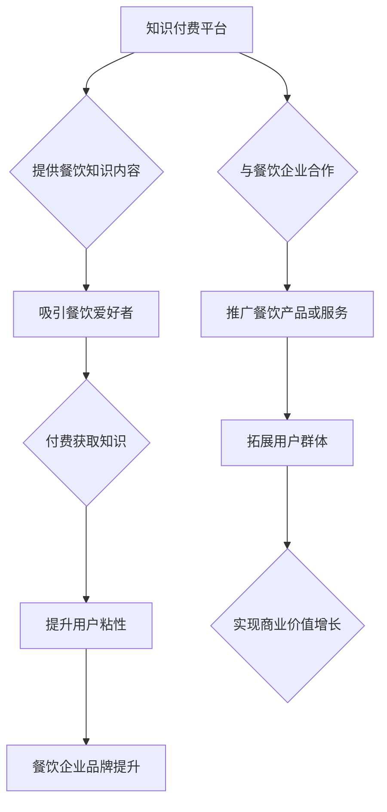

                 

## 关键词：知识付费、跨界营销、餐饮、数字化转型、用户体验、数据分析、内容营销

## 1. 背景介绍

在当今数字化时代，传统营销模式面临着越来越大的挑战。消费者信息获取渠道多元化，对个性化、定制化服务需求日益增长。知识付费作为一种新型的商业模式，凭借其独特的价值传递方式和精准的用户触达能力，正在成为一种备受关注的营销手段。同时，餐饮行业作为国民经济的重要组成部分，也面临着激烈的市场竞争和消费升级的压力。如何通过创新营销模式提升品牌竞争力，吸引更多用户，成为餐饮企业亟需解决的问题。

知识付费与餐饮行业的结合，为双方带来了新的机遇。餐饮企业可以通过知识付费平台，向用户提供餐饮相关的专业知识、技能和服务，例如烹饪技巧、营养搭配、美食文化等，从而提升用户粘性，打造品牌忠诚度。而知识付费平台则可以通过与餐饮企业的合作，拓展用户群体，丰富平台内容，实现商业价值的增长。

## 2. 核心概念与联系

### 2.1 知识付费

知识付费是指通过付费的方式获取知识、技能、经验等有价值的信息。它是一种以知识为核心、以价值为导向的商业模式，其核心价值在于为用户提供专业、权威、实用的知识内容，帮助用户提升自身能力和解决实际问题。

### 2.2 跨界营销

跨界营销是指企业将自身产品或服务与其他行业或领域的品牌、产品或服务进行合作，共同进行推广和营销活动。其目的是通过资源整合、品牌联动、用户群体拓展等方式，实现营销效果的放大，提升品牌知名度和市场竞争力。

### 2.3 餐饮行业

餐饮行业是指以提供餐饮服务为主要业务的行业，包括餐饮企业、餐饮服务平台、餐饮食材供应商等。餐饮行业是一个服务性强、竞争激烈的行业，其发展受到消费需求、市场环境、政策法规等多方面因素的影响。

**Mermaid 流程图**



## 3. 核心算法原理 & 具体操作步骤

### 3.1 算法原理概述

知识付费与餐饮跨界营销的核心算法原理在于数据分析和内容推荐。通过对用户行为数据、餐饮市场数据等进行分析，可以挖掘用户兴趣偏好、餐饮消费趋势等信息，从而精准推荐相关知识付费内容和餐饮产品或服务。

### 3.2 算法步骤详解

1. **数据收集:** 收集用户行为数据、餐饮市场数据等，包括用户浏览记录、购买记录、评价信息、餐饮店信息、菜品信息等。
2. **数据清洗:** 对收集到的数据进行清洗和处理，去除无效数据、重复数据等，确保数据质量。
3. **特征提取:** 从数据中提取用户兴趣偏好、餐饮消费趋势等特征，例如用户喜欢的菜系、用餐频率、消费水平等。
4. **模型训练:** 利用机器学习算法，对提取的特征进行训练，构建用户画像和餐饮市场预测模型。
5. **内容推荐:** 根据用户画像和餐饮市场预测模型，推荐相关知识付费内容和餐饮产品或服务。
6. **效果评估:** 对推荐效果进行评估，不断优化算法模型和推荐策略。

### 3.3 算法优缺点

**优点:**

* 精准推荐: 通过数据分析，可以精准推荐用户感兴趣的内容和产品。
* 个性化服务: 根据用户画像，提供个性化的服务体验。
* 提升用户粘性: 通过提供有价值的内容和服务，提升用户粘性。
* 提升商业价值: 通过精准营销，提升转化率和商业价值。

**缺点:**

* 数据依赖: 算法效果依赖于数据质量和量。
* 模型复杂: 模型训练和维护需要一定的技术门槛。
* 隐私安全: 数据收集和使用需要考虑用户隐私安全问题。

### 3.4 算法应用领域

* **电商平台:** 推荐商品、个性化营销
* **社交媒体:** 内容推荐、用户匹配
* **金融服务:** 风险评估、投资推荐
* **医疗健康:** 疾病诊断、个性化治疗
* **餐饮行业:** 内容推荐、精准营销

## 4. 数学模型和公式 & 详细讲解 & 举例说明

### 4.1 数学模型构建

知识付费与餐饮跨界营销的数学模型可以基于用户行为数据和餐饮市场数据构建，例如：

* **用户兴趣偏好模型:** 可以使用协同过滤算法或深度学习模型，根据用户的浏览记录、购买记录等数据，预测用户对不同菜系、餐饮风格的兴趣偏好。
* **餐饮市场预测模型:** 可以使用时间序列分析或机器学习模型，根据餐饮市场数据，预测未来一段时间内的餐饮消费趋势、热门菜品等信息。

### 4.2 公式推导过程

例如，协同过滤算法中的余弦相似度公式：

$$
\text{相似度} = \frac{\mathbf{u} \cdot \mathbf{v}}{\|\mathbf{u}\| \|\mathbf{v}\|}
$$

其中：

* $\mathbf{u}$ 和 $\mathbf{v}$ 分别表示两个用户的兴趣向量。
* $\cdot$ 表示向量点积。
* $\|\mathbf{u}\|$ 和 $\|\mathbf{v}\|$ 分别表示两个向量的模长。

### 4.3 案例分析与讲解

假设有一个用户A，他喜欢吃川菜和粤菜，另一个用户B喜欢吃湘菜和粤菜。根据协同过滤算法，可以计算出用户A和用户B的兴趣向量，并计算出他们的余弦相似度。如果相似度较高，则说明用户A和用户B的口味偏好相似，可以推荐他们相同的菜品或餐厅。

## 5. 项目实践：代码实例和详细解释说明

### 5.1 开发环境搭建

* 操作系统: Windows/macOS/Linux
* 编程语言: Python
* 框架: Flask/Django
* 数据库: MySQL/MongoDB
* 工具: Jupyter Notebook/VS Code

### 5.2 源代码详细实现

```python
# 使用Flask框架构建知识付费平台

from flask import Flask, render_template, request

app = Flask(__name__)

# 模拟用户数据
users = {
    1: {'name': '张三', 'interests': ['川菜', '粤菜']},
    2: {'name': '李四', 'interests': ['湘菜', '粤菜']}
}

@app.route('/')
def index():
    return render_template('index.html')

@app.route('/recommend', methods=['POST'])
def recommend():
    user_id = request.form.get('user_id')
    # 根据用户ID获取用户兴趣
    user_interests = users[user_id]['interests']
    # 根据用户兴趣推荐相关内容
    recommendations = []
    # ...
    return render_template('recommend.html', recommendations=recommendations)

if __name__ == '__main__':
    app.run(debug=True)
```

### 5.3 代码解读与分析

* 代码使用Flask框架构建了一个简单的知识付费平台。
* 用户数据存储在`users`字典中，每个用户都有一个ID和兴趣列表。
* `/`路由返回首页模板`index.html`。
* `/recommend`路由接收用户ID，根据用户兴趣推荐相关内容。

### 5.4 运行结果展示

运行代码后，访问`http://127.0.0.1:5000/`，即可看到首页。

## 6. 实际应用场景

### 6.1 餐饮企业案例

* **美食博主合作:** 与美食博主合作，开发线上课程，教授烹饪技巧、菜品制作等知识，吸引用户付费学习。
* **会员专属内容:** 为会员提供专属的食谱、营养搭配建议、餐厅优惠等内容，提升会员粘性。
* **线上烹饪课堂:** 开设线上烹饪课堂，邀请专业厨师进行直播教学，用户可以实时互动学习。

### 6.2 知识付费平台案例

* **餐饮知识库:** 建立餐饮知识库，提供丰富的餐饮相关知识内容，例如菜系介绍、烹饪技巧、饮食文化等。
* **餐饮社区:** 建立餐饮社区，用户可以分享美食经验、交流烹饪技巧、寻找美食推荐等。
* **餐饮服务平台:** 与餐饮企业合作，提供线上点餐、外卖配送、预订服务等，并通过知识付费的方式，为用户提供更优质的服务体验。

### 6.4 未来应用展望

随着人工智能、大数据等技术的不断发展，知识付费与餐饮跨界营销将呈现更加丰富的应用场景。例如：

* **个性化餐饮推荐:** 通过用户画像和餐饮市场预测模型，为用户提供更加精准的餐饮推荐。
* **智能化餐饮服务:** 利用人工智能技术，实现智能化点餐、外卖配送、餐厅管理等服务。
* **虚拟现实餐饮体验:** 利用虚拟现实技术，为用户提供沉浸式的餐饮体验。

## 7. 工具和资源推荐

### 7.1 学习资源推荐

* **书籍:** 《数据挖掘导论》、《机器学习实战》
* **在线课程:** Coursera、edX、Udacity
* **博客:** Towards Data Science、Machine Learning Mastery

### 7.2 开发工具推荐

* **编程语言:** Python
* **框架:** Flask、Django
* **数据库:** MySQL、MongoDB
* **机器学习库:** scikit-learn、TensorFlow、PyTorch

### 7.3 相关论文推荐

* **协同过滤算法:** "Collaborative Filtering for Implicit Feedback Datasets"
* **深度学习模型:** "Deep Learning for Recommender Systems"
* **餐饮市场预测:** "Predicting Restaurant Demand Using Machine Learning"

## 8. 总结：未来发展趋势与挑战

### 8.1 研究成果总结

知识付费与餐饮跨界营销的结合，为双方带来了新的机遇。通过数据分析和内容推荐，可以实现精准营销、个性化服务，提升用户粘性，打造品牌竞争力。

### 8.2 未来发展趋势

未来，知识付费与餐饮跨界营销将朝着以下方向发展：

* **更加精准的推荐:** 利用人工智能技术，实现更加精准的餐饮推荐。
* **更加个性化的服务:** 提供更加个性化的餐饮服务，例如定制化菜单、私人厨师等。
* **更加丰富的体验:** 利用虚拟现实、增强现实等技术，为用户提供更加丰富的餐饮体验。

### 8.3 面临的挑战

知识付费与餐饮跨界营销也面临着一些挑战：

* **数据安全:** 需要保障用户数据的安全和隐私。
* **算法准确性:** 需要不断优化算法模型，提高推荐准确率。
* **内容质量:** 需要提供高质量、有价值的内容，才能吸引用户付费。

### 8.4 研究展望

未来，需要进一步研究以下问题：

* 如何更好地利用人工智能技术，实现更加精准的餐饮推荐？
* 如何提供更加个性化、定制化的餐饮服务？
* 如何利用新兴技术，为用户提供更加丰富的餐饮体验？


## 9. 附录：常见问题与解答

**Q1: 如何保证知识付费内容的质量？**

**A1:** 知识付费平台需要严格筛选内容创作者，确保内容的专业性和权威性。同时，平台还可以建立用户评价机制，让用户对内容质量进行评价，从而提高内容质量。

**Q2: 如何防止用户付费后无法获取内容？**

**A2:** 知识付费平台需要建立完善的支付系统和内容交付机制，确保用户付费后能够顺利获取内容。

**Q3: 如何提升用户粘性？**

**A3:** 知识付费平台可以提供会员制度、积分奖励、互动社区等方式，提升用户粘性。

**Q4: 如何进行跨界营销推广？**

**A4:** 知识付费平台可以与餐饮企业合作，进行联合推广活动，例如线上线下联动、优惠券促销等。

**Q5: 如何保障用户隐私安全？**

**A5:** 知识付费平台需要严格遵守用户隐私政策，保护用户个人信息安全。


作者：禅与计算机程序设计艺术 / Zen and the Art of Computer Programming 
<end_of_turn>

