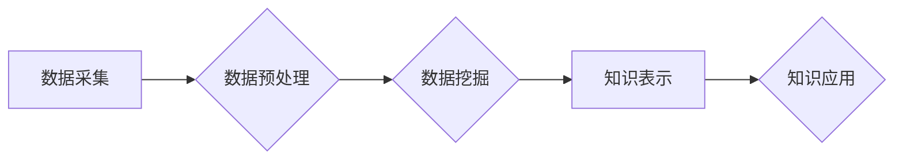

                 

## 知识发现引擎如何加速科学突破

> 关键词：知识发现引擎、机器学习、数据挖掘、科学研究、人工智能、数据分析、模式识别、科学突破

## 1. 背景介绍

科学研究的本质是探索未知，揭示规律，推动人类文明进步。然而，随着科学知识的日益增长，传统的科研方法面临着越来越大的挑战。海量数据、复杂系统、跨学科交叉等问题使得科学发现变得更加困难和耗时。

知识发现引擎 (Knowledge Discovery Engine，KDE) 作为一种新型的智能工具，正逐渐成为加速科学突破的重要力量。KDE 通过对海量数据进行智能分析和挖掘，能够帮助科学家发现隐藏的模式、关系和规律，从而加速科研进程，推动科学发现。

## 2. 核心概念与联系

知识发现引擎的核心是将机器学习、数据挖掘、人工智能等技术应用于科学研究领域。它通过以下几个关键环节实现知识发现：

* **数据采集:** 从各种来源收集相关数据，包括实验数据、文献数据、网络数据等。
* **数据预处理:** 对收集到的数据进行清洗、转换、整合等处理，使其能够被算法有效地理解和分析。
* **数据挖掘:** 利用机器学习算法和数据挖掘技术，从数据中发现隐藏的模式、关系和规律。
* **知识表示:** 将发现的知识以可理解的形式表示出来，例如知识图谱、规则等。
* **知识应用:** 将发现的知识应用于科学研究中，例如提出新的假设、设计新的实验、解释已有的现象等。

**Mermaid 流程图:**



## 3. 核心算法原理 & 具体操作步骤

### 3.1  算法原理概述

知识发现引擎中常用的算法包括：

* **关联规则挖掘:** 发现数据中频繁出现的项集之间的关联关系。例如，发现哪些药物组合具有协同治疗效果。
* **分类算法:** 将数据分类到不同的类别。例如，根据基因序列预测疾病类型。
* **聚类算法:** 将数据按照相似性聚类到不同的组别。例如，将患者按照疾病症状进行分组。
* **预测算法:** 根据历史数据预测未来的趋势。例如，预测疾病的发生率。

### 3.2  算法步骤详解

以关联规则挖掘为例，其具体操作步骤如下：

1. **构建频繁项集:** 从数据中找出频繁出现的项集，例如，在超市购物篮数据中，找出经常一起购买的商品组合。
2. **计算支持度:** 计算每个频繁项集的支持度，即该项集在整个数据集中的出现频率。
3. **计算置信度:** 计算每个关联规则的置信度，即在某个项集出现的前提下，另一个项集出现的概率。
4. **筛选关联规则:** 根据预设的支持度和置信度阈值，筛选出满足条件的关联规则。

### 3.3  算法优缺点

**优点:**

* 能够发现隐藏的模式和关系。
* 可以处理海量数据。
* 可以自动化知识发现过程。

**缺点:**

* 算法的性能受数据质量的影响。
* 算法的解释性较差。
* 算法需要大量的计算资源。

### 3.4  算法应用领域

关联规则挖掘算法广泛应用于以下领域：

* **市场营销:** 发现客户购买行为的模式，进行精准营销。
* **推荐系统:** 根据用户的历史行为推荐感兴趣的商品或服务。
* **医疗诊断:** 发现疾病的潜在关联因素，辅助医生进行诊断。
* **金融风险管理:** 发现潜在的金融风险，进行风险控制。

## 4. 数学模型和公式 & 详细讲解 & 举例说明

### 4.1  数学模型构建

关联规则挖掘算法的核心是频繁项集的挖掘。频繁项集的定义是：在数据集中的出现频率超过一定阈值的项集。

**支持度:**

$$
Support(X) = \frac{Number of transactions containing X}{Total number of transactions}
$$

其中，X 是一个项集，$Number of transactions containing X$ 是包含 X 的交易数，$Total number of transactions$ 是总交易数。

**置信度:**

$$
Confidence(X \rightarrow Y) = \frac{Support(X \cup Y)}{Support(X)}
$$

其中，X 和 Y 是两个项集，$Support(X \cup Y)$ 是包含 X 和 Y 的交易数，$Support(X)$ 是包含 X 的交易数。

### 4.2  公式推导过程

支持度和置信度是衡量关联规则强度的指标。支持度反映了项集在数据集中的出现频率，置信度反映了在某个项集出现的前提下，另一个项集出现的概率。

### 4.3  案例分析与讲解

假设我们有一个超市购物篮数据，其中包含以下交易记录：

* {牛奶, 面包, 鸡蛋}
* {牛奶, 鸡蛋, 香蕉}
* {牛奶, 面包, 香蕉}
* {牛奶, 鸡蛋}
* {面包, 香蕉}

其中，牛奶、面包、鸡蛋和香蕉是商品，交易记录表示顾客购买的商品组合。

我们可以计算出以下关联规则的支持度和置信度：

* {牛奶} -> {面包}: Support = 3/5, Confidence = 3/3 = 1
* {牛奶} -> {鸡蛋}: Support = 3/5, Confidence = 3/3 = 1
* {牛奶} -> {香蕉}: Support = 2/5, Confidence = 2/3 = 0.67

从结果可以看出，{牛奶} -> {面包} 和 {牛奶} -> {鸡蛋} 的置信度都为 1，说明在购买牛奶的前提下，购买面包和鸡蛋的概率为 100%。

## 5. 项目实践：代码实例和详细解释说明

### 5.1  开发环境搭建

* **操作系统:** Linux 或 macOS
* **编程语言:** Python
* **库:** scikit-learn, pandas, numpy

### 5.2  源代码详细实现

```python
from collections import defaultdict
from itertools import combinations

def apriori(transactions, min_support):
    # 1. 构建频繁项集
    itemsets = defaultdict(int)
    for transaction in transactions:
        for item in transaction:
            itemsets[item] += 1

    frequent_1_itemsets = [item for item, count in itemsets.items() if count >= min_support]

    # 2. 迭代构建频繁项集
    k = 2
    while True:
        candidate_itemsets = generate_candidate_itemsets(frequent_itemsets, k)
        frequent_itemsets = {}
        for itemset in candidate_itemsets:
            support = calculate_support(transactions, itemset)
            if support >= min_support:
                frequent_itemsets[itemset] = support
        if len(frequent_itemsets) == 0:
            break
        k += 1

    return frequent_itemsets

def generate_candidate_itemsets(frequent_itemsets, k):
    # 生成候选 k-项集
    candidates = []
    for itemset1 in frequent_itemsets:
        for itemset2 in frequent_itemsets:
            if len(itemset1) == k - 1 and len(itemset2) == k - 1 and itemset1[:-1] == itemset2[:-1]:
                candidates.append(itemset1 + itemset2[-1])
    return candidates

def calculate_support(transactions, itemset):
    # 计算项集的支持度
    support = 0
    for transaction in transactions:
        if all(item in transaction for item in itemset):
            support += 1
    return support / len(transactions)

# 示例数据
transactions = [
    {'牛奶', '面包', '鸡蛋'},
    {'牛奶', '鸡蛋', '香蕉'},
    {'牛奶', '面包', '香蕉'},
    {'牛奶', '鸡蛋'},
    {'面包', '香蕉'}
]

# 设置最小支持度
min_support = 0.4

# 运行关联规则挖掘算法
frequent_itemsets = apriori(transactions, min_support)

# 打印频繁项集
print(frequent_itemsets)
```

### 5.3  代码解读与分析

* `apriori()` 函数实现关联规则挖掘算法的核心逻辑。
* `generate_candidate_itemsets()` 函数生成候选 k-项集。
* `calculate_support()` 函数计算项集的支持度。
* 示例数据和最小支持度设置可以根据实际需求进行修改。

### 5.4  运行结果展示

运行代码后，会输出频繁项集及其支持度。

## 6. 实际应用场景

知识发现引擎在科学研究领域有着广泛的应用场景：

* **药物研发:** 发现潜在的药物靶点和药物组合，加速药物研发进程。
* **疾病诊断:** 发现疾病的潜在关联因素，辅助医生进行诊断和治疗。
* **材料科学:** 发现新的材料组合和结构，设计具有特定性能的材料。
* **气候变化研究:** 分析气候变化数据，预测未来气候趋势，制定应对措施。

### 6.4  未来应用展望

随着人工智能技术的不断发展，知识发现引擎将发挥越来越重要的作用。未来，知识发现引擎将更加智能化、自动化，能够处理更加复杂的数据，发现更加深刻的知识，从而加速科学突破。

## 7. 工具和资源推荐

### 7.1  学习资源推荐

* **书籍:**
    * "Data Mining: Concepts and Techniques" by Jiawei Han, Micheline Kamber, and Jian Pei
    * "Introduction to Machine Learning" by Ethem Alpaydin
* **在线课程:**
    * Coursera: Machine Learning by Andrew Ng
    * edX: Data Science Fundamentals

### 7.2  开发工具推荐

* **Python:** 广泛应用于数据挖掘和机器学习领域，拥有丰富的库和工具。
* **R:** 专注于统计分析和数据可视化，适合进行数据探索和分析。
* **Weka:** 一个开源的机器学习工具包，提供各种算法和数据处理工具。

### 7.3  相关论文推荐

* "A Survey of Knowledge Discovery and Data Mining" by Fayyad, U., Piatetsky-Shapiro, G., Smyth, P., &  
  Thomas, R.
* "Association Rule Mining: A Data Mining Task" by Agrawal, R., Imielinski, T., & Swami, A.

## 8. 总结：未来发展趋势与挑战

### 8.1  研究成果总结

知识发现引擎已经取得了显著的成果，在科学研究、商业分析、医疗诊断等领域发挥着越来越重要的作用。

### 8.2  未来发展趋势

* **更智能的算法:** 开发更加智能、高效的算法，能够处理更加复杂的数据，发现更加深刻的知识。
* **更强大的计算能力:** 利用云计算、分布式计算等技术，提升知识发现引擎的计算能力，处理海量数据。
* **更丰富的知识表示:** 开发更加丰富的知识表示形式，例如知识图谱、逻辑推理等，更好地表达和利用发现的知识。

### 8.3  面临的挑战

* **数据质量问题:** 知识发现引擎的性能受数据质量的影响，如何保证数据质量是重要的挑战。
* **算法解释性问题:** 许多机器学习算法的解释性较差，如何提高算法的解释性是重要的研究方向。
* **伦理问题:** 知识发现引擎可能会发现一些敏感信息，如何保护隐私和避免伦理问题是需要关注的议题。

### 8.4  研究展望

未来，知识发现引擎将继续朝着更加智能、自动化、可解释的方向发展，为科学研究、社会发展做出更大的贡献。


## 9. 附录：常见问题与解答

* **Q: 知识发现引擎和数据挖掘有什么区别？**

* **A:** 知识发现引擎是一种更高级的数据挖掘工具，它不仅能够挖掘数据中的模式和关系，还可以将这些知识转化为可理解的形式，并应用于实际问题。

* **Q: 知识发现引擎需要哪些技术基础？**

* **A:** 知识发现引擎需要掌握机器学习、数据挖掘、人工智能、数据库等相关技术。

* **Q: 如何选择合适的知识发现引擎？**

* **A:** 选择合适的知识发现引擎需要根据具体的应用场景、数据类型、算法需求等因素进行考虑。


作者：禅与计算机程序设计艺术 / Zen and the Art of Computer Programming 
<end_of_turn>

