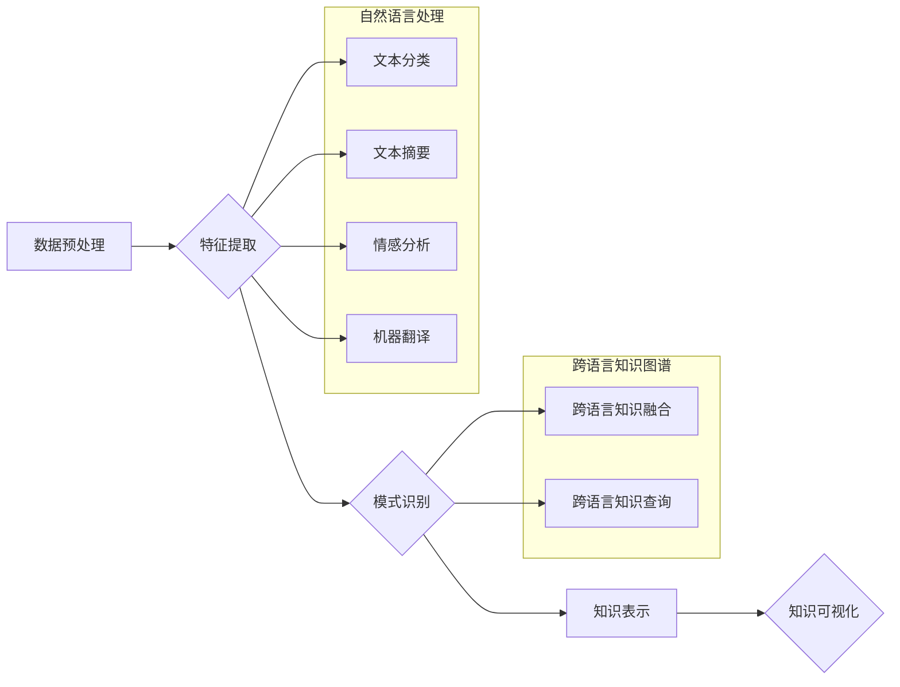

                 

## 知识发现引擎的多语言支持

> 关键词：知识发现引擎、多语言支持、自然语言处理、机器翻译、跨语言知识图谱、语义理解、信息检索

## 1. 背景介绍

知识发现引擎 (Knowledge Discovery Engine, KDE) 旨在从海量数据中自动提取有价值的知识和模式，为用户提供洞察力和决策支持。随着全球化进程的加速，数据的多样性和异构性日益增加，其中包含大量不同语言的数据。单一语言的知识发现引擎无法有效处理这些多语言数据，限制了其应用范围和价值。因此，构建能够支持多语言的知识发现引擎成为一个重要的研究方向。

多语言支持对于知识发现引擎具有以下重要意义：

* **扩展数据范围**:  能够处理不同语言的数据，大幅扩展了知识发现引擎的数据资源，从而挖掘更丰富、更全面的知识。
* **提升知识发现准确性**:  不同语言的表达方式和文化背景差异较大，多语言支持可以帮助引擎更好地理解数据中的语义，提高知识发现的准确性和可靠性。
* **促进跨文化交流**:  多语言支持可以帮助人们跨越语言障碍，更有效地共享和利用知识，促进跨文化交流和合作。

## 2. 核心概念与联系

### 2.1  知识发现引擎

知识发现引擎 (KDE) 是一个用于从数据中自动提取知识和模式的软件系统。它通常包含以下几个核心模块：

* **数据预处理**:  对原始数据进行清洗、转换和格式化，使其能够被引擎理解和处理。
* **特征提取**:  从数据中提取有意义的特征，例如文本中的关键词、时间序列中的趋势等。
* **模式识别**:  使用机器学习、数据挖掘等算法识别数据中的模式和规律。
* **知识表示**:  将发现的知识以可理解的形式表示出来，例如知识图谱、规则等。
* **知识可视化**:  将知识以图形化的形式展示出来，方便用户理解和分析。

### 2.2  自然语言处理

自然语言处理 (NLP) 是计算机科学的一个分支，致力于使计算机能够理解、处理和生成人类语言。NLP技术在多语言支持的知识发现引擎中扮演着至关重要的角色，主要用于以下方面：

* **文本分类**:  根据文本内容自动将文本归类到不同的类别，例如新闻、评论、社交媒体帖子等。
* **文本摘要**:  从长文本中提取关键信息，生成简洁的文本摘要。
* **情感分析**:  分析文本中的情感倾向，例如正面、负面、中性等。
* **机器翻译**:  将文本从一种语言翻译成另一种语言。

### 2.3  跨语言知识图谱

跨语言知识图谱 (Cross-lingual Knowledge Graph, CLKG) 是将不同语言的知识融合在一起的知识图谱。它可以帮助知识发现引擎跨越语言障碍，发现跨语言的知识关系和模式。

**Mermaid 流程图**



## 3. 核心算法原理 & 具体操作步骤

### 3.1  算法原理概述

多语言支持的知识发现引擎通常采用以下核心算法：

* **统计语言模型**:  基于统计方法，学习不同语言的词语分布和语法规则，用于文本分类、文本摘要和机器翻译等任务。
* **深度学习模型**:  利用深度神经网络，学习更复杂的语言表示，例如词向量、句向量等，提高自然语言理解和生成能力。
* **知识图谱嵌入**:  将知识图谱中的实体和关系映射到低维向量空间，方便进行跨语言知识融合和查询。

### 3.2  算法步骤详解

**1. 数据预处理**:  对多语言数据进行清洗、格式化和分词，例如去除停用词、标点符号等，并将文本转换为统一的格式。

**2. 特征提取**:  使用自然语言处理技术提取文本中的关键词、主题、情感等特征，并将其转换为数字向量。

**3. 模式识别**:  使用机器学习算法，例如决策树、支持向量机、神经网络等，识别数据中的模式和规律。

**4. 知识表示**:  将发现的知识以知识图谱、规则等形式表示出来，并进行跨语言知识融合。

**5. 知识可视化**:  将知识以图形化的形式展示出来，方便用户理解和分析。

### 3.3  算法优缺点

**优点**:

* 能够处理多语言数据，扩展知识发现范围。
* 提高知识发现的准确性和可靠性。
* 促进跨文化交流和合作。

**缺点**:

* 需要处理语言差异带来的复杂性。
* 需要大量的多语言数据进行训练。
* 跨语言知识融合仍然是一个挑战。

### 3.4  算法应用领域

* **跨语言信息检索**:  根据用户的多语言查询，从多语言数据中检索相关信息。
* **跨语言文本摘要**:  从多语言文本中提取关键信息，生成多语言摘要。
* **跨语言知识管理**:  构建跨语言知识图谱，管理和共享多语言知识。
* **跨语言机器翻译**:  利用知识发现引擎辅助机器翻译，提高翻译质量。

## 4. 数学模型和公式 & 详细讲解 & 举例说明

### 4.1  数学模型构建

**词向量模型**:  将词语映射到低维向量空间，例如Word2Vec、GloVe等模型。

**公式**:

$$
\mathbf{v}(w) = \mathbf{W} \mathbf{x}(w)
$$

其中：

* $\mathbf{v}(w)$ 是词语 $w$ 的词向量。
* $\mathbf{W}$ 是词嵌入矩阵。
* $\mathbf{x}(w)$ 是词语 $w$ 的词索引向量。

**举例说明**:

假设我们有一个词语集合 {“猫”，“狗”，“跑”，“吃”}，可以使用Word2Vec模型训练一个词嵌入矩阵，将每个词语映射到一个低维向量空间。例如，"猫" 和 "狗" 的词向量可能比较接近，因为它们都是动物。

### 4.2  公式推导过程

**词相似度计算**:  可以使用余弦相似度等方法计算两个词语的相似度。

**公式**:

$$
\text{similarity}(w_1, w_2) = \frac{\mathbf{v}(w_1) \cdot \mathbf{v}(w_2)}{\|\mathbf{v}(w_1)\|\|\mathbf{v}(w_2)\|}
$$

其中：

* $\mathbf{v}(w_1)$ 和 $\mathbf{v}(w_2)$ 是词语 $w_1$ 和 $w_2$ 的词向量。
* $\cdot$ 表示点积运算。
* $\|\mathbf{v}(w_1)\|$ 和 $\|\mathbf{v}(w_2)\|$ 表示词向量 $\mathbf{v}(w_1)$ 和 $\mathbf{v}(w_2)$ 的范数。

### 4.3  案例分析与讲解

**跨语言知识融合**:  可以使用词向量模型和知识图谱嵌入技术，将不同语言的知识融合在一起。例如，可以将英文的维基百科知识图谱和中文的百度百科知识图谱融合在一起，构建一个跨语言的知识图谱。

## 5. 项目实践：代码实例和详细解释说明

### 5.1  开发环境搭建

* 操作系统: Ubuntu 20.04
* Python 版本: 3.8
* 必要的库: spaCy, Gensim, NetworkX, RDFlib

### 5.2  源代码详细实现

```python
# 使用 spaCy 进行文本分类
import spacy

nlp = spacy.load("en_core_web_sm")

text = "This is a sample text."
doc = nlp(text)

for token in doc:
    print(token.text, token.pos_)

# 使用 Gensim 进行词向量训练
from gensim.models import Word2Vec

sentences = [
    ["This", "is", "a", "sample", "sentence."],
    ["Another", "sentence", "for", "training."],
]

model = Word2Vec(sentences, min_count=1)

# 获取词向量
vector = model.wv["sentence"]
print(vector)

# 使用 NetworkX 构建知识图谱
import networkx as nx

G = nx.Graph()

G.add_node("猫")
G.add_node("狗")
G.add_edge("猫", "动物")
G.add_edge("狗", "动物")

# 使用 RDFlib 进行知识图谱存储和查询
from rdflib import Graph, Literal, URIRef

g = Graph()

g.add((URIRef("http://example.org/cat"), URIRef("http://example.org/isA"), URIRef("http://example.org/animal")))
g.add((URIRef("http://example.org/dog"), URIRef("http://example.org/isA"), URIRef("http://example.org/animal")))

```

### 5.3  代码解读与分析

* **文本分类**:  使用 spaCy 库进行文本分类，识别文本中的词性。
* **词向量训练**:  使用 Gensim 库训练词向量模型，学习词语之间的语义关系。
* **知识图谱构建**:  使用 NetworkX 库构建知识图谱，表示实体和关系。
* **知识图谱存储和查询**:  使用 RDFlib 库存储和查询知识图谱，方便知识管理和推理。

### 5.4  运行结果展示

* 文本分类结果将显示文本中每个词语的词性。
* 词向量训练结果将输出每个词语的词向量表示。
* 知识图谱构建结果将显示一个图形化的知识图谱，其中实体和关系用节点和边表示。
* 知识图谱存储和查询结果将显示知识图谱中的实体和关系。

## 6. 实际应用场景

### 6.1  跨语言信息检索

多语言支持的知识发现引擎可以帮助用户从多语言数据中检索相关信息。例如，用户可以使用英文查询中文数据库，引擎可以根据语义理解，找到与查询相关的中文文档。

### 6.2  跨语言文本摘要

多语言支持的知识发现引擎可以帮助用户生成多语言文本摘要。例如，用户可以将一篇英文文章输入引擎，引擎可以生成中文摘要，方便用户快速了解文章内容。

### 6.3  跨语言知识管理

多语言支持的知识发现引擎可以帮助企业构建跨语言知识图谱，管理和共享多语言知识。例如，一家跨国公司可以将不同国家的知识融合在一起，构建一个全球性的知识库。

### 6.4  未来应用展望

* **个性化知识发现**:  根据用户的语言偏好、兴趣和需求，提供个性化的知识发现服务。
* **跨语言对话系统**:  构建能够理解和生成多语言对话的智能助手。
* **跨语言机器翻译**:  利用知识发现引擎辅助机器翻译，提高翻译质量和准确性。

## 7. 工具和资源推荐

### 7.1  学习资源推荐

* **Stanford NLP Group**: https://nlp.stanford.edu/
* **ACL Anthology**: https://aclanthology.org/
* **Hugging Face**: https://huggingface.co/

### 7.2  开发工具推荐

* **spaCy**: https://spacy.io/
* **Gensim**: https://radimrehurek.com/gensim/
* **NetworkX**: https://networkx.org/
* **RDFlib**: https://rdflib.readthedocs.io/en/stable/

### 7.3  相关论文推荐

* **Word2Vec**: https://arxiv.org/abs/1301.3781
* **GloVe**: https://nlp.stanford.edu/projects/glove/
* **TransE**: https://arxiv.org/abs/1301.0783

## 8. 总结：未来发展趋势与挑战

### 8.1  研究成果总结

多语言支持的知识发现引擎取得了显著进展，例如词向量模型、知识图谱嵌入技术等取得了突破性进展。这些技术为跨语言知识发现提供了新的思路和方法。

### 8.2  未来发展趋势

* **更强大的多语言模型**:  开发更强大的多语言模型，能够更好地理解和生成不同语言的文本。
* **更有效的跨语言知识融合**:  研究更有效的跨语言知识融合方法，将不同语言的知识更好地融合在一起。
* **更个性化的知识发现**:  根据用户的语言偏好、兴趣和需求，提供更个性化的知识发现服务。

### 8.3  面临的挑战

* **数据稀缺**:  多语言数据往往稀缺，这使得模型训练和评估更加困难。
* **语言差异**:  不同语言的语法、词汇和文化背景差异较大，这使得跨语言知识发现更加复杂。
* **评估指标**:  缺乏有效的跨语言知识发现评估指标，使得模型性能评估更加困难。

### 8.4  研究展望

未来，多语言支持的知识发现引擎将朝着更智能、更个性化、更跨域的方向发展。随着人工智能技术的不断发展，相信多语言知识发现将为人类社会带来更多价值。

## 9. 附录：常见问题与解答

**Q1: 如何处理不同语言的文本格式差异？**

**A1:**  在数据预处理阶段，需要对不同语言的文本进行格式化，例如去除停用词、标点符号等，并将文本转换为统一的格式。

**Q2: 如何评估多语言知识发现引擎的性能？**

**A2:**  目前缺乏有效的跨语言知识发现评估指标，可以参考传统的文本分类、信息检索等指标，也可以根据具体应用场景设计评估指标。

**Q3: 如何解决多语言数据稀缺的问题？**

**A3:**  可以尝试使用跨语言数据增强技术，例如机器翻译、语义相似度等方法，扩充多语言数据规模。


作者：禅与计算机程序设计艺术 / Zen and the Art of Computer Programming<end_of_turn>

