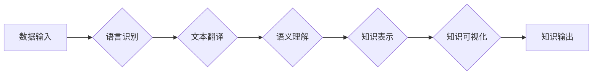

                 

## 知识发现引擎的多语言支持实现

> 关键词：知识发现引擎、多语言支持、自然语言处理、机器翻译、跨语言知识图谱、语义理解、深度学习

## 1. 背景介绍

知识发现引擎 (Knowledge Discovery Engine, KDE) 旨在从海量数据中自动提取有价值的知识和洞察力。随着全球化进程的加速，数据的多样性和异构性日益增加，其中包含大量不同语言的数据。这使得构建能够处理多种语言数据的知识发现引擎成为一项重要的挑战。

传统的知识发现引擎主要针对单一语言数据进行设计和开发，缺乏对多语言数据的处理能力。这限制了其在处理全球化数据中的应用范围，也阻碍了跨语言知识共享和融合的发展。

## 2. 核心概念与联系

**2.1 知识发现引擎**

知识发现引擎 (KDE) 是一个用于从数据中自动提取知识和洞察力的系统。它通常包含以下几个关键模块：

* **数据预处理模块:** 对原始数据进行清洗、转换和格式化，使其适合后续的知识发现过程。
* **特征提取模块:** 从数据中提取有意义的特征，例如文本主题、关系模式、异常值等。
* **模式识别模块:** 利用机器学习、数据挖掘等算法识别数据中的潜在模式和规律。
* **知识表示模块:** 将发现的知识以可理解和可操作的形式进行表示，例如知识图谱、规则等。
* **知识可视化模块:** 将知识以图形化的形式展示，方便用户理解和分析。

**2.2 多语言支持**

多语言支持是指知识发现引擎能够处理多种语言的数据的能力。实现多语言支持需要解决以下几个关键问题：

* **语言识别:** 识别数据所属的语言。
* **文本翻译:** 将不同语言的文本翻译成统一的语言。
* **跨语言语义理解:** 理解不同语言中表达的相同或相似的概念。
* **跨语言知识图谱构建:** 将不同语言的知识整合到一个统一的知识图谱中。

**2.3 架构图**



## 3. 核心算法原理 & 具体操作步骤

**3.1 算法原理概述**

多语言支持的知识发现引擎通常采用以下几种核心算法：

* **统计机器翻译:** 基于统计语言模型和词典，将文本从一种语言翻译成另一种语言。
* **神经机器翻译:** 利用深度学习模型，学习语言之间的映射关系，实现更准确和流畅的翻译。
* **跨语言语义嵌入:** 将不同语言的词语或句子映射到同一个语义空间，使得不同语言的语义信息可以进行比较和融合。
* **知识图谱对齐:** 将不同语言的知识图谱进行对齐，建立跨语言知识的连接。

**3.2 算法步骤详解**

1. **数据预处理:** 对多语言数据进行清洗、格式化和分词。
2. **语言识别:** 使用语言识别模型识别数据的语言类型。
3. **文本翻译:** 使用机器翻译模型将不同语言的文本翻译成统一的语言。
4. **语义理解:** 使用语义分析模型理解翻译后的文本语义。
5. **知识表示:** 将理解后的语义信息表示为知识图谱或其他形式的知识表示。
6. **知识融合:** 将不同语言的知识进行融合，构建跨语言知识图谱。
7. **知识可视化:** 将跨语言知识图谱以可视化的形式展示。

**3.3 算法优缺点**

* **统计机器翻译:** 优点是算法简单易实现，缺点是翻译质量相对较低，难以处理复杂的语义关系。
* **神经机器翻译:** 优点是翻译质量更高，能够更好地处理复杂的语义关系，缺点是模型训练需要大量数据，计算资源消耗较大。
* **跨语言语义嵌入:** 优点是能够捕捉语言之间的语义相似性，缺点是需要大量的语料数据进行训练，难以处理细粒度的语义差异。
* **知识图谱对齐:** 优点是能够建立跨语言知识的连接，缺点是需要对齐不同语言的知识图谱，这本身是一个复杂的任务。

**3.4 算法应用领域**

多语言支持的知识发现引擎在以下领域具有广泛的应用前景：

* **跨语言信息检索:** 能够检索不同语言的数据，满足用户的多语言信息需求。
* **跨语言知识管理:** 能够整合不同语言的知识，构建跨语言知识库，促进知识共享和融合。
* **跨语言文本分析:** 能够对不同语言的文本进行分析，提取有价值的信息，例如情感分析、主题提取等。
* **跨语言机器学习:** 能够利用不同语言的数据进行机器学习训练，提高模型的泛化能力。

## 4. 数学模型和公式 & 详细讲解 & 举例说明

**4.1 数学模型构建**

在多语言支持的知识发现引擎中，常用的数学模型包括：

* **词嵌入模型:** 将词语映射到一个低维的向量空间，使得语义相似的词语拥有相似的向量表示。常用的词嵌入模型包括 Word2Vec、GloVe 和 FastText。
* **句嵌入模型:** 将句子映射到一个低维的向量空间，使得语义相似的句子拥有相似的向量表示。常用的句嵌入模型包括 Sentence-BERT 和 Universal Sentence Encoder。
* **知识图谱对齐模型:** 将不同语言的知识图谱进行对齐，建立跨语言知识的连接。常用的知识图谱对齐模型包括 TransE、TransR 和 ComplEx。

**4.2 公式推导过程**

例如，Word2Vec 模型使用负采样方法训练词嵌入。其目标函数为：

$$
J(\theta) = \sum_{i=1}^{N} \sum_{j \in \mathcal{C}_i} \log \sigma(v_i^T v_j) + \sum_{i=1}^{N} \sum_{j \notin \mathcal{C}_i} \log \sigma(-v_i^T v_j)
$$

其中：

* $\theta$ 是模型参数
* $N$ 是训练样本数量
* $i$ 是词语索引
* $\mathcal{C}_i$ 是词语 $i$ 的上下文词集合
* $v_i$ 是词语 $i$ 的词向量
* $\sigma$ 是 sigmoid 函数

**4.3 案例分析与讲解**

假设我们有一个包含英文和中文的文本数据集，想要构建一个跨语言的知识图谱。我们可以使用以下步骤：

1. 使用 Word2Vec 模型训练英文和中文的词嵌入。
2. 使用跨语言语义嵌入模型将英文和中文的词向量映射到同一个语义空间。
3. 使用知识图谱对齐模型将英文和中文的知识图谱进行对齐，建立跨语言知识的连接。

## 5. 项目实践：代码实例和详细解释说明

**5.1 开发环境搭建**

* Python 3.x
* TensorFlow 或 PyTorch
* NLTK 或 spaCy

**5.2 源代码详细实现**

```python
# 使用 Word2Vec 模型训练英文词嵌入
from gensim.models import Word2Vec

# 训练数据
sentences = [["This", "is", "a", "sentence", "in", "English"], ["这是一个", "中文", "句子"]]

# 训练模型
model = Word2Vec(sentences, vector_size=100, window=5, min_count=5)

# 保存模型
model.save("english_word2vec.model")

# 使用 Word2Vec 模型训练中文词嵌入
# ...

# 使用跨语言语义嵌入模型将英文和中文词向量映射到同一个语义空间
# ...

# 使用知识图谱对齐模型将英文和中文的知识图谱进行对齐
# ...
```

**5.3 代码解读与分析**

* 使用 Word2Vec 模型训练词嵌入，可以将词语映射到一个低维的向量空间。
* 使用跨语言语义嵌入模型可以将不同语言的词向量映射到同一个语义空间，使得不同语言的词语可以进行比较和融合。
* 使用知识图谱对齐模型可以将不同语言的知识图谱进行对齐，建立跨语言知识的连接。

**5.4 运行结果展示**

* 可以使用训练好的词嵌入模型进行词语相似度计算，例如计算 "king" 和 "queen" 之间的相似度。
* 可以使用跨语言语义嵌入模型计算不同语言词语之间的相似度，例如计算 "hello" 和 "你好" 之间的相似度。
* 可以使用知识图谱对齐模型构建跨语言知识图谱，并进行查询和分析。

## 6. 实际应用场景

**6.1 跨语言信息检索**

多语言支持的知识发现引擎可以帮助用户检索不同语言的数据，例如在搜索引擎中搜索不同语言的网页，或者在数据库中查询不同语言的记录。

**6.2 跨语言知识管理**

多语言支持的知识发现引擎可以帮助企业整合不同语言的知识，构建跨语言知识库，促进知识共享和融合。例如，一家跨国公司可以利用多语言支持的知识发现引擎，将不同国家的员工知识进行整合，形成一个统一的知识库。

**6.3 跨语言文本分析**

多语言支持的知识发现引擎可以帮助分析不同语言的文本，提取有价值的信息，例如情感分析、主题提取等。例如，可以利用多语言支持的知识发现引擎，分析不同语言的社交媒体评论，了解用户对产品的评价。

**6.4 未来应用展望**

随着人工智能技术的不断发展，多语言支持的知识发现引擎将有更广泛的应用场景，例如：

* **跨语言机器翻译:** 利用多语言支持的知识发现引擎，可以构建更准确、更流畅的机器翻译模型。
* **跨语言对话系统:** 利用多语言支持的知识发现引擎，可以构建能够理解和回复不同语言用户的对话系统。
* **跨语言个性化推荐:** 利用多语言支持的知识发现引擎，可以根据用户的语言偏好进行个性化推荐。

## 7. 工具和资源推荐

**7.1 学习资源推荐**

* **Stanford NLP Group:** https://nlp.stanford.edu/
* **ACL Anthology:** https://aclanthology.org/
* **Hugging Face:** https://huggingface.co/

**7.2 开发工具推荐**

* **TensorFlow:** https://www.tensorflow.org/
* **PyTorch:** https://pytorch.org/
* **NLTK:** https://www.nltk.org/
* **spaCy:** https://spacy.io/

**7.3 相关论文推荐**

* **BERT: Pre-training of Deep Bidirectional Transformers for Language Understanding**
* **XLNet: Generalized Autoregressive Pretraining for Language Understanding**
* **T5: Text-to-Text Transfer Transformer**

## 8. 总结：未来发展趋势与挑战

**8.1 研究成果总结**

近年来，多语言支持的知识发现引擎取得了显著进展，例如：

* **跨语言语义嵌入模型的不断发展:** 能够更好地捕捉不同语言之间的语义相似性。
* **知识图谱对齐技术的不断完善:** 能够更准确地建立跨语言知识的连接。
* **多语言机器翻译模型的不断提升:** 能够实现更准确、更流畅的翻译。

**8.2 未来发展趋势**

未来，多语言支持的知识发现引擎将朝着以下几个方向发展：

* **更强大的跨语言语义理解能力:** 能够理解更复杂的语义关系，例如隐喻、讽刺等。
* **更灵活的知识表示形式:** 能够支持多种形式的知识表示，例如图、文本、音频等。
* **更个性化的知识发现体验:** 能够根据用户的语言偏好、知识背景等进行个性化推荐。

**8.3 面临的挑战**

多语言支持的知识发现引擎仍然面临一些挑战：

* **数据稀缺性:** 许多语言的数据量相对较少，难以训练高质量的模型。
* **语义差异:** 不同语言的语义表达方式存在差异，难以进行准确的跨语言理解。
* **文化差异:** 不同文化的背景知识和价值观也会影响知识发现的结果。

**8.4 研究展望**

未来，需要进一步研究以下几个方面：

* **跨语言语义理解的深度学习方法:** 探索更有效的深度学习模型，能够更好地理解跨语言语义关系。
* **跨语言知识图谱的构建和维护:** 研究更有效的知识图谱对齐和融合技术，构建更完整、更准确的跨语言知识图谱。
* **多语言知识发现的个性化方法:** 研究个性化推荐算法，能够根据用户的语言偏好、知识背景等进行个性化知识发现。


## 9. 附录：常见问题与解答

**9.1 如何选择合适的跨语言语义嵌入模型？**

选择合适的跨语言语义嵌入模型需要考虑以下几个因素：

* **目标任务:** 不同的任务对语义嵌入模型的要求不同。例如，文本相似度计算需要模型能够捕捉语义相似性，而机器翻译需要模型能够捕捉语法和语义关系。
* **语言对:** 不同的语言对之间存在语义差异，需要选择针对特定语言对的模型。
* **数据量:** 不同的模型对训练数据的需求不同。例如，BERT 模型需要大量的训练数据，而 FastText 模型对数据量要求较低。

**9.2 如何评估跨语言语义嵌入模型的性能？**

常用的评估指标包括：

* **语义相似度:** 使用测试语料计算模型预测的语义相似度与真实语义相似度的相关性。
* **机器翻译质量:** 使用 BLEU 等指标评估模型的机器翻译质量。
* **跨语言知识图谱对齐准确率:** 使用测试知识图谱计算模型对齐的准确率。

**9.3 如何构建跨语言知识图谱？**

构建跨语言知识图谱需要以下几个步骤：

* **数据收集:** 收集不同语言的知识数据，例如维基百科、DBpedia 等。
* **数据清洗:** 对收集到的数据进行清洗，例如去除重复数据、错误数据等。
* **知识抽取:** 使用知识抽取算法从文本数据中提取知识 triples。
* **知识对齐:** 使用知识图谱对齐模型将不同语言的知识图谱进行对齐。
* **知识融合:** 将对齐后的知识图谱进行融合，构建跨语言知识图谱。


作者：禅与计算机程序设计艺术 / Zen and the Art of Computer Programming<end_of_turn>

