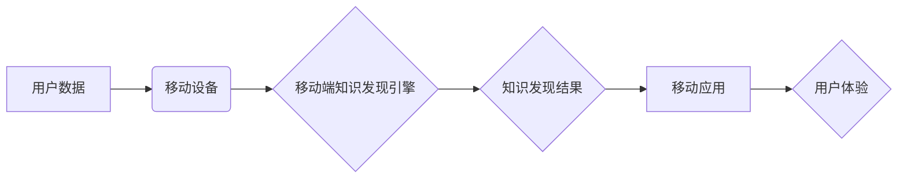

                 

## 知识发现引擎的移动应用开发

> 关键词：知识发现引擎、移动应用、数据挖掘、机器学习、自然语言处理、深度学习、云计算

## 1. 背景介绍

随着移动互联网的快速发展，海量数据在移动设备上日益积累。如何有效地从这些海量数据中挖掘出有价值的知识，并将其转化为可行动的洞察，成为一个重要的挑战。知识发现引擎 (Knowledge Discovery Engine, KDE) 作为一种数据挖掘和知识提取技术，能够帮助我们从复杂的数据中发现隐藏的模式、趋势和关系，从而为移动应用提供个性化服务、智能决策支持和数据驱动的创新。

传统的知识发现引擎主要部署在服务器端，需要用户将数据上传到云端进行处理。然而，随着移动设备计算能力的提升和用户对隐私保护的重视，将知识发现引擎部署到移动端，能够更好地满足用户对实时性、本地化和隐私保护的需求。

## 2. 核心概念与联系

### 2.1  知识发现引擎 (KDE)

知识发现引擎 (KDE) 是指能够从海量数据中自动发现、提取和表示有价值知识的系统。它通常包含以下几个核心模块：

* **数据预处理模块:** 对原始数据进行清洗、转换和格式化，使其适合后续的知识发现算法处理。
* **数据挖掘模块:** 使用各种数据挖掘算法，例如关联规则挖掘、分类、聚类和序列模式挖掘等，从数据中发现隐藏的模式和关系。
* **知识表示模块:** 将发现的知识以可理解的形式表示出来，例如规则、图谱、文本等。
* **知识可视化模块:** 将知识表示以直观的方式呈现出来，帮助用户理解和分析发现的知识。

### 2.2  移动应用

移动应用是指运行在移动设备上的软件应用程序。它通常具有以下特点：

* **轻量化:** 体积小、资源消耗低，能够在移动设备上流畅运行。
* **交互性强:** 提供丰富的用户交互方式，例如触摸屏、语音识别、传感器等。
* **本地化:** 可以离线运行，并根据用户的地理位置、语言等信息提供个性化服务。
* **实时性:** 可以实时获取和处理数据，提供及时更新的信息和服务。

### 2.3  移动端知识发现引擎

将知识发现引擎部署到移动端，能够为移动应用提供以下优势：

* **实时性:** 可以实时处理用户产生的数据，提供即时反馈和个性化服务。
* **本地化:** 可以离线运行，并根据用户的地理位置、语言等信息提供个性化服务。
* **隐私保护:** 用户数据可以本地处理，减少数据上传到云端的风险。
* **效率提升:** 可以减少数据传输的延迟和网络带宽消耗。

**核心概念与联系流程图:**



## 3. 核心算法原理 & 具体操作步骤

### 3.1  算法原理概述

移动端知识发现引擎通常采用轻量化、高效的算法，例如：

* **关联规则挖掘:** 发现数据中频繁出现的项集之间的关联关系，例如市场营销中发现哪些商品经常一起购买。
* **聚类分析:** 将数据按照相似性进行分组，例如用户画像分析，将用户根据兴趣爱好、消费习惯等进行分类。
* **文本挖掘:** 从文本数据中提取关键词、主题、情感等信息，例如社交媒体分析，了解用户对产品的评价和反馈。

### 3.2  算法步骤详解

以关联规则挖掘为例，其具体操作步骤如下：

1. **数据预处理:** 对原始数据进行清洗、转换和格式化，例如去除停用词、标准化文本等。
2. **频繁项集挖掘:** 使用Apriori算法或FP-Growth算法等，找出数据中频繁出现的项集。
3. **关联规则生成:** 根据频繁项集，使用支持度和置信度等指标，生成关联规则。
4. **规则筛选:** 根据业务需求，筛选出具有实际意义的关联规则。

### 3.3  算法优缺点

**关联规则挖掘算法的优缺点:**

* **优点:** 能够发现数据中隐藏的关联关系，为业务决策提供支持。
* **缺点:** 算法复杂度较高，处理海量数据时效率较低。

### 3.4  算法应用领域

关联规则挖掘算法广泛应用于以下领域:

* **市场营销:** 发现商品关联关系，进行商品推荐和促销活动。
* **推荐系统:** 发现用户兴趣关联关系，进行个性化推荐。
* **医疗诊断:** 发现疾病症状关联关系，辅助医生进行诊断。
* **金融风险控制:** 发现交易异常关联关系，进行风险预警。

## 4. 数学模型和公式 & 详细讲解 & 举例说明

### 4.1  数学模型构建

关联规则挖掘的核心是频繁项集的挖掘。频繁项集是指在数据集中的出现频率高于某个阈值的项集。

**定义:**

* **项集:** 数据集中的一组项。
* **支持度:** 项集在数据集中的出现频率。
* **置信度:** 某个条件项集在另一个项集出现的概率。

**公式:**

* **支持度:**  $support(X) = \frac{count(X)}{total\_count}$

* **置信度:** $confidence(X \rightarrow Y) = \frac{support(X \cup Y)}{support(X)}$

其中:

* $X$ 和 $Y$ 是两个项集。
* $count(X)$ 是项集 $X$ 在数据集中的出现次数。
* $total\_count$ 是数据集的总记录数。

### 4.2  公式推导过程

支持度和置信度是衡量关联规则强度的指标。

* **支持度:** 反映了项集在数据集中的流行程度。
* **置信度:** 反映了在某个条件项集出现的情况下，另一个项集出现的概率。

### 4.3  案例分析与讲解

**案例:**

假设我们有一个数据集，包含以下交易记录:

* {苹果, 香蕉}
* {苹果, 橙子}
* {香蕉, 橙子}
* {苹果, 香蕉, 橙子}

**分析:**

* 项集 {苹果, 香蕉} 的支持度为 2/4 = 0.5。
* 项集 {苹果} 的支持度为 3/4 = 0.75。
* 关联规则 {苹果} -> {香蕉} 的置信度为 2/3 = 0.67。

**解释:**

* 项集 {苹果, 香蕉} 在数据集中的出现频率为 0.5，说明它是一个比较常见的项集。
* 关联规则 {苹果} -> {香蕉} 表示，当购买苹果时，购买香蕉的概率为 0.67。

## 5. 项目实践：代码实例和详细解释说明

### 5.1  开发环境搭建

* **操作系统:** Android 或 iOS
* **编程语言:** Java 或 Swift
* **开发工具:** Android Studio 或 Xcode
* **数据存储:** SQLite 或 Realm

### 5.2  源代码详细实现

```java
// Java 代码示例，使用 Apriori 算法进行关联规则挖掘

import java.util.ArrayList;
import java.util.HashMap;
import java.util.List;
import java.util.Map;

public class Apriori {

    private List<List<String>> dataset;
    private int minSupport;

    public Apriori(List<List<String>> dataset, int minSupport) {
        this.dataset = dataset;
        this.minSupport = minSupport;
    }

    public List<List<String>> findFrequentItemsets() {
        // 1. 构建候选项集
        // 2. 计算每个候选项集的支持度
        // 3. 筛选出满足最小支持度的频繁项集
        // ...
    }

    public List<String> generateAssociationRules(List<List<String>> frequentItemsets) {
        // 1. 遍历频繁项集
        // 2. 计算每个频繁项集的关联规则
        // 3. 筛选出满足置信度阈值的关联规则
        // ...
    }
}
```

### 5.3  代码解读与分析

* **数据集:** 存储了所有交易记录，每个记录是一个项集。
* **最小支持度:** 设定一个阈值，只有支持度高于该阈值的项集才被认为是频繁项集。
* **Apriori 算法:** 是一种经典的关联规则挖掘算法，它通过迭代的方式，从频繁项集的子集出发，逐步构建出更大的频繁项集。
* **关联规则生成:** 根据频繁项集，生成关联规则，并根据置信度阈值进行筛选。

### 5.4  运行结果展示

运行代码后，可以得到一系列频繁项集和关联规则。这些结果可以用于指导业务决策，例如商品推荐、促销活动设计等。

## 6. 实际应用场景

### 6.1  个性化推荐

移动端知识发现引擎可以分析用户的浏览历史、购买记录、评分等数据，发现用户的兴趣偏好，并推荐个性化的商品、服务或内容。

### 6.2  智能客服

移动端知识发现引擎可以分析用户咨询的文本内容，识别用户的意图和需求，并提供相应的智能回复，提高客服效率和用户体验。

### 6.3  精准营销

移动端知识发现引擎可以分析用户的地理位置、年龄、性别等信息，以及他们的消费行为和兴趣爱好，进行精准的营销推送，提高广告转化率。

### 6.4  未来应用展望

随着移动设备计算能力的提升和数据量的增长，移动端知识发现引擎将有更广泛的应用场景，例如：

* **医疗诊断辅助:** 分析患者的症状、病史和检查结果，辅助医生进行诊断。
* **教育个性化学习:** 分析学生的学习进度和知识掌握情况，提供个性化的学习建议和辅导。
* **金融风险控制:** 分析用户的交易行为和信用记录，识别潜在的风险。

## 7. 工具和资源推荐

### 7.1  学习资源推荐

* **书籍:**
    * 《数据挖掘：概念与技术》
    * 《机器学习》
    * 《深度学习》
* **在线课程:**
    * Coursera: 数据挖掘和机器学习
    * edX: 深度学习
    * Udacity: 移动开发

### 7.2  开发工具推荐

* **Android Studio:** Android 应用开发工具
* **Xcode:** iOS 应用开发工具
* **TensorFlow Lite:** 轻量级深度学习框架
* **Scikit-learn:** Python 数据挖掘和机器学习库

### 7.3  相关论文推荐

* **Apriori Algorithm:** Agrawal, R., Imielinski, T., & Swami, A. (1993). Mining association rules between sets of items in large databases. In Proceedings of the 1993 ACM SIGMOD International Conference on Management of Data (pp. 207-216).
* **FP-Growth Algorithm:** Han, J., Pei, J., & Yin, Y. (2000). Mining frequent patterns without candidate generation. In Proceedings of the 2000 ACM SIGMOD International Conference on Management of Data (pp. 1-10).

## 8. 总结：未来发展趋势与挑战

### 8.1  研究成果总结

移动端知识发现引擎的研究取得了显著进展，已经能够应用于各种移动应用场景，为用户提供个性化服务和智能决策支持。

### 8.2  未来发展趋势

* **轻量化算法:** 开发更轻量化、高效的算法，能够在移动设备上快速处理海量数据。
* **联邦学习:** 利用联邦学习技术，在不上传用户数据的情况下，实现跨设备的知识发现。
* **边缘计算:** 将知识发现引擎部署到边缘设备，实现更低延迟、更私密的知识发现。
* **多模态数据挖掘:** 融合文本、图像、音频等多模态数据，进行更深入的知识发现。

### 8.3  面临的挑战

* **数据隐私保护:** 如何保护用户数据隐私，是移动端知识发现引擎面临的重大挑战。
* **计算资源限制:** 移动设备的计算资源有限，需要开发更轻量化的算法和模型。
* **算法解释性:** 许多深度学习算法的决策过程难以解释，需要开发更可解释的算法。

### 8.4  研究展望

未来，移动端知识发现引擎将朝着更智能、更安全、更私密的方向发展，为用户提供更丰富的个性化服务和体验。


## 9. 附录：常见问题与解答

**Q1: 移动端知识发现引擎和云端知识发现引擎有什么区别？**

**A1:** 移动端知识发现引擎部署在移动设备上，能够提供更低延迟、更私密的知识发现服务。而云端知识发现引擎部署在云服务器上，能够处理更大的数据量，并提供更强大的计算能力。

**Q2: 如何选择合适的移动端知识发现引擎算法？**

**A2:** 选择合适的算法需要根据具体的应用场景和数据特点进行考虑。例如，如果需要进行个性化推荐，可以使用基于协同过滤的算法；如果需要进行市场营销分析，可以使用关联规则挖掘算法。

**Q3: 如何保护用户数据隐私？**

**A3:** 可以采用以下方法保护用户数据隐私：

* **数据加密:** 对用户数据进行加密，防止未经授权的访问。
* **联邦学习:** 利用联邦学习技术，在不上传用户数据的情况下，实现跨设备的知识发现。
* **匿名化处理:** 对用户数据进行匿名化处理，去除个人识别信息。


作者：禅与计算机程序设计艺术 / Zen and the Art of Computer Programming 
<end_of_turn>

