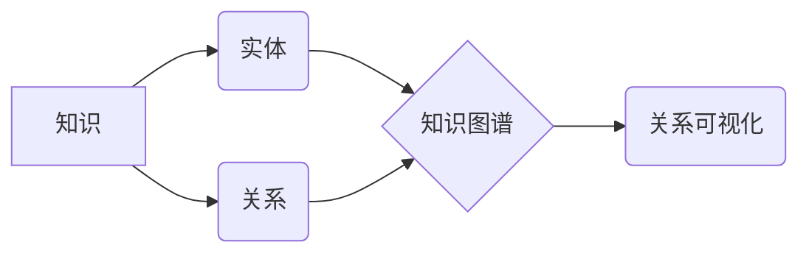

                 

## 知识的网络科学：复杂关系的可视化

> 关键词：知识图谱、网络科学、关系可视化、复杂系统、数据挖掘

## 1. 背景介绍

在信息爆炸的时代，海量数据无处不在，而知识的获取和理解变得越来越复杂。传统的线性思维模式难以有效处理复杂关系网络中的信息。知识网络科学应运而生，它将网络科学的理论和方法应用于知识的表示、分析和可视化，为我们提供了一种全新的视角去理解和探索知识世界。

知识网络科学的核心是构建知识图谱，知识图谱是一种以实体和关系为节点的图结构，用来表示知识的结构化表示。通过构建知识图谱，我们可以将分散的知识点连接起来，揭示出隐藏在其中的复杂关系和模式。

关系可视化是知识网络科学的重要应用之一，它通过图形化的方式呈现知识网络中的关系，帮助我们直观地理解知识结构和知识之间的关联。关系可视化技术的发展，使得我们可以更深入地探索知识网络，发现新的知识和洞察。

## 2. 核心概念与联系

### 2.1 知识图谱

知识图谱是一种基于知识表示的数据库，它以实体和关系为基本单元，将知识表示为图结构。

* **实体:** 指知识网络中的基本对象，例如人物、地点、事件等。
* **关系:** 指实体之间的连接，例如“出生于”、“位于”、“参与”等。

知识图谱可以表示各种类型的知识，例如事实、概念、规则等。

### 2.2 网络科学

网络科学研究复杂网络的结构、动力学和功能。复杂网络是指由大量节点和连接组成的网络，节点可以是任何类型的对象，连接代表着它们之间的关系。

网络科学的理论和方法可以应用于知识网络的分析，例如：

* **度分布:** 研究网络中节点的连接数分布。
* **聚类系数:** 研究网络中节点之间的聚集程度。
* **路径长度:** 研究网络中两个节点之间的距离。

### 2.3 关系可视化

关系可视化是指将复杂的关系网络以图形化的方式呈现出来。关系可视化技术可以帮助我们直观地理解知识结构和知识之间的关联。

关系可视化技术常用的图形表示方式包括：

* **节点图:** 使用节点和边来表示实体和关系。
* **树图:** 使用树状结构来表示知识层次关系。
* **力导向图:** 使用物理模拟算法来布局节点和边，使得节点之间的关系更加清晰。

**Mermaid 流程图**



## 3. 核心算法原理 & 具体操作步骤

### 3.1 算法原理概述

关系可视化算法的核心是将知识图谱中的实体和关系映射到图形空间中，并根据一定的规则布局节点和边，使得图形更加清晰易懂。常用的关系可视化算法包括：

* **力导向算法:**  模拟物理世界的力学原理，将节点视为质点，边视为弹簧，通过计算节点之间的相互作用力，将节点布局到一个稳定的状态。
* **层次聚类算法:** 将知识图谱中的实体按照层次关系进行聚类，并将每个层次的实体以树状结构进行表示。
* **基于图着色算法:**  将知识图谱中的实体按照不同的颜色进行分类，并根据关系类型进行边线的绘制，使得不同类型的实体和关系更加清晰。

### 3.2 算法步骤详解

以力导向算法为例，其具体操作步骤如下：

1. **构建节点和边:** 将知识图谱中的实体和关系分别转换为节点和边，并赋予每个节点和边相应的属性，例如节点的形状、颜色、大小，边的颜色、宽度等。
2. **计算节点之间的相互作用力:** 根据节点之间的连接关系和属性，计算节点之间的吸引力和排斥力。吸引力是指节点之间连接的强度，排斥力是指节点之间的距离。
3. **更新节点的位置:** 根据节点之间的相互作用力，更新每个节点的位置，使得节点朝着吸引力方向移动，远离排斥力方向。
4. **重复步骤2和3:** 重复步骤2和3，直到节点的位置达到稳定状态。

### 3.3 算法优缺点

**优点:**

* 可以直观地展示知识网络的结构和关系。
* 可以根据节点属性和关系类型进行不同的布局和着色，使得图形更加清晰易懂。
* 可以动态地更新图形，反映知识网络的变化。

**缺点:**

* 对于大型知识图谱，计算节点之间的相互作用力可能会比较耗时。
* 算法参数的设置会影响图形的布局效果。

### 3.4 算法应用领域

关系可视化算法广泛应用于以下领域：

* **知识管理:**  帮助用户理解和探索知识网络，发现隐藏的知识和关系。
* **数据挖掘:**  帮助用户发现数据中的模式和趋势。
* **生物信息学:**  帮助用户研究生物网络和基因调控网络。
* **社会网络分析:**  帮助用户分析社交关系和群体行为。

## 4. 数学模型和公式 & 详细讲解 & 举例说明

### 4.1 数学模型构建

力导向算法的数学模型可以描述为一个系统动力学模型，其中节点的位置是系统状态，节点之间的相互作用力是系统驱动力。

**节点位置向量:**  每个节点可以用一个三维向量 $p_i = (x_i, y_i, z_i)$ 表示，其中 $(x_i, y_i, z_i)$ 分别代表节点在x、y、z轴上的坐标。

**相互作用力:**  节点之间的相互作用力可以分为吸引力和排斥力。

* **吸引力:**  节点 $i$ 和节点 $j$ 之间的吸引力 $F_{ij}$ 可以表示为：

$$F_{ij} = k \frac{w_{ij}}{d_{ij}^2}$$

其中 $k$ 是一个常数， $w_{ij}$ 是节点 $i$ 和节点 $j$ 之间的连接权重， $d_{ij}$ 是节点 $i$ 和节点 $j$ 之间的距离。

* **排斥力:**  节点 $i$ 和节点 $j$ 之间的排斥力 $F_{ij}$ 可以表示为：

$$F_{ij} = \begin{cases}
  \alpha \frac{1}{d_{ij}^2} & \text{if } d_{ij} < r \\
  0 & \text{otherwise}
\end{cases}$$

其中 $\alpha$ 是一个常数， $r$ 是节点之间的最小允许距离。

**总力:**  节点 $i$ 的总力 $F_i$ 是所有相互作用力的矢量和：

$$F_i = \sum_{j \neq i} F_{ij}$$

### 4.2 公式推导过程

节点的位置更新可以通过牛顿第二定律进行描述：

$$m \frac{d^2 p_i}{dt^2} = F_i$$

其中 $m$ 是节点的质量， $t$ 是时间。

通过数值积分方法，可以求解节点的位置更新方程，从而得到节点的最终位置。

### 4.3 案例分析与讲解

假设我们有一个知识图谱，其中包含三个实体：A、B、C，以及两个关系：A-B 和 B-C。

* 实体 A、B、C 的位置向量分别为 $(0, 0, 0)$, $(1, 0, 0)$, $(0, 1, 0)$.
* 关系 A-B 和 B-C 的连接权重分别为 1 和 2.

我们可以使用力导向算法计算节点之间的相互作用力，并更新节点的位置。最终，节点 A、B、C 会按照一定的规则布局，形成一个图形表示知识网络的结构。

## 5. 项目实践：代码实例和详细解释说明

### 5.1 开发环境搭建

本项目使用 Python 语言进行开发，并使用以下工具和库：

* Python 3.x
* NetworkX
* Matplotlib

### 5.2 源代码详细实现

```python
import networkx as nx
import matplotlib.pyplot as plt

# 创建知识图谱
graph = nx.Graph()
graph.add_edge('A', 'B', weight=1)
graph.add_edge('B', 'C', weight=2)

# 使用力导向算法布局节点
pos = nx.spring_layout(graph)

# 绘制知识图谱
nx.draw(graph, pos, with_labels=True, node_size=500, node_color='skyblue', font_size=12)
plt.show()
```

### 5.3 代码解读与分析

* 首先，我们使用 NetworkX 库创建了一个无向图，并添加了两个边，分别表示关系 A-B 和 B-C。
* 然后，我们使用 `nx.spring_layout()` 函数对图进行布局，该函数使用力导向算法将节点布局到一个稳定的状态。
* 最后，我们使用 Matplotlib 库绘制图，并设置节点的属性，例如颜色、大小和字体大小。

### 5.4 运行结果展示

运行上述代码，将会生成一个图形表示知识网络的结构，其中节点 A、B、C 分别位于不同的位置，边 A-B 和 B-C 连接着它们。

## 6. 实际应用场景

关系可视化技术在各个领域都有着广泛的应用，例如：

### 6.1  知识管理

关系可视化可以帮助用户理解和探索知识网络，发现隐藏的知识和关系。例如，在企业知识管理系统中，可以利用关系可视化技术展示员工之间的关系、部门之间的关系、知识库中的知识关系等，帮助用户更好地管理和利用知识资源。

### 6.2  数据挖掘

关系可视化可以帮助用户发现数据中的模式和趋势。例如，在社交网络分析中，可以利用关系可视化技术展示用户之间的关系、用户群体的结构、信息传播路径等，帮助用户更好地理解社交网络的运作机制。

### 6.3  生物信息学

关系可视化可以帮助用户研究生物网络和基因调控网络。例如，在蛋白质相互作用网络分析中，可以利用关系可视化技术展示蛋白质之间的相互作用关系、蛋白质功能模块等，帮助用户更好地理解生物系统的复杂性。

### 6.4  未来应用展望

随着人工智能和数据科学的发展，关系可视化技术将会得到更广泛的应用。例如，未来可以利用关系可视化技术：

* 建立更加智能的知识管理系统，能够自动识别和提取知识关系，并提供个性化的知识推荐。
* 开发更加强大的数据挖掘工具，能够自动发现数据中的隐藏模式和趋势，并提供更深入的分析结果。
* 研究更加复杂的生物网络和基因调控网络，揭示生物系统的奥秘。

## 7. 工具和资源推荐

### 7.1 学习资源推荐

* **书籍:**
    * 《网络科学导论》
    * 《知识图谱》
    * 《关系数据库》
* **在线课程:**
    * Coursera 上的网络科学课程
    * edX 上的知识图谱课程
* **博客和论坛:**
    * NetworkX 官方博客
    * 数据科学社区

### 7.2 开发工具推荐

* **Python:**  Python 是一个非常适合进行关系可视化开发的语言，因为它拥有丰富的库和工具，例如 NetworkX 和 Matplotlib。
* **NetworkX:**  NetworkX 是一个用于构建、分析和可视化网络的 Python 库。
* **Matplotlib:**  Matplotlib 是一个用于创建静态、交互式和动画图形的 Python 库。
* **Gephi:**  Gephi 是一个开源的网络可视化软件，可以处理大型网络数据。

### 7.3 相关论文推荐

* **The Structure and Dynamics of Networks**
* **Knowledge Graphs**
* **Network Analysis for Social Media**

## 8. 总结：未来发展趋势与挑战

### 8.1 研究成果总结

知识网络科学和关系可视化技术取得了显著的进展，为我们理解和探索复杂关系提供了新的视角和工具。

### 8.2 未来发展趋势

未来，知识网络科学和关系可视化技术将会朝着以下方向发展：

* **更加智能的知识图谱构建:**  利用人工智能技术自动识别和提取知识关系，构建更加智能和动态的知识图谱。
* **更加交互式的关系可视化:**  开发更加交互式的关系可视化工具，允许用户动态地探索知识网络，并进行个性化的定制。
* **更加深入的知识挖掘:**  利用关系可视化技术挖掘知识网络中的隐藏模式和趋势，提供更深入的知识洞察。

### 8.3 面临的挑战

知识网络科学和关系可视化技术也面临着一些挑战：

* **数据规模和复杂性:**  随着数据量的不断增长，如何处理和分析大型知识图谱是一个重要的挑战。
* **知识表示和推理:**  如何更好地表示和推理知识关系是一个需要进一步研究的问题。
* **可解释性和用户体验:**  如何使关系可视化结果更加易于理解和解释，并提供更好的用户体验是一个重要的挑战。

### 8.4 研究展望

未来，我们将继续致力于知识网络科学和关系可视化技术的研究，希望能够开发出更加智能、交互式和深入的工具，帮助人们更好地理解和利用知识。

## 9. 附录：常见问题与解答

### 9.1  常见问题

* **什么是知识图谱？**

知识图谱是一种基于知识表示的数据库，它以实体和关系为基本单元，将知识表示为图结构。

* **什么是关系可视化？**

关系可视化是指将复杂的关系网络以图形化的方式呈现出来。

* **如何选择合适的力导向算法？**

选择合适的力导向算法取决于具体的应用场景和数据特点。

* **如何评估关系可视化的效果？**

评估关系可视化的效果可以从以下几个方面考虑：

* **可读性:**  图形是否清晰易懂。
* **准确性:**  图形是否准确地反映了知识网络的结构。
* **交互性:**  用户是否能够方便地交互和探索图形。

### 9.2  解答

* **知识图谱的构建方法:**

知识图谱的构建方法有很多种，例如：

* **人工构建:**  专家根据领域知识手动构建知识图谱。
* **自动提取:**  利用自然语言处理技术自动从文本数据中提取知识关系。
* **半自动构建:**  结合人工和自动的方法构建知识图谱。

* **关系可视化技术的应用领域:**

关系可视化技术广泛应用于以下领域：

* **知识管理**
* **数据挖掘**
* **生物信息学**
* **社会网络分析**

* **力导向算法的优缺点:**

力导向算法的优点是能够直观地展示知识网络的结构和关系，并根据节点属性和关系类型进行不同的布局和着色。缺点是对于大型知识图谱，计算节点之间的相互作用力可能会比较耗时。


作者：禅与计算机程序设计艺术 / Zen and the Art of Computer Programming<end_of_turn>

