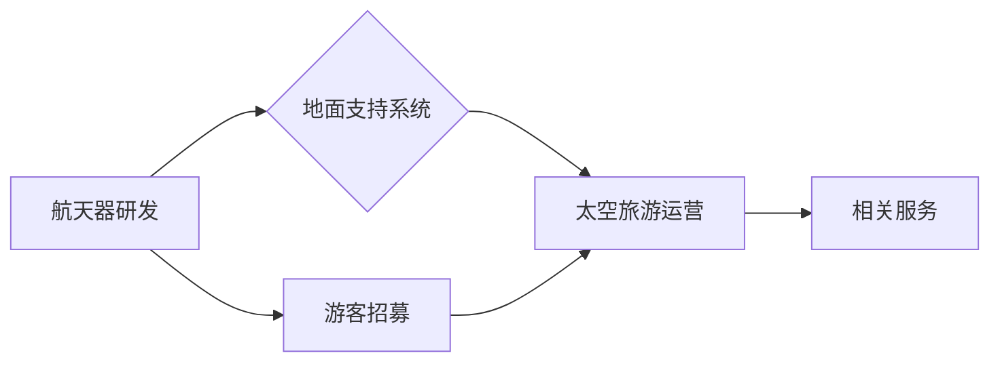

                 

## 硅谷太空旅游产业的发展瓶颈

> 关键词：太空旅游、商业航天、技术瓶颈、成本问题、安全风险、法规监管、可持续发展

### 1. 背景介绍

21世纪初，随着商业航天技术的快速发展，太空旅游逐渐从科幻小说走向现实。硅谷作为全球科技创新的中心，涌现出一批致力于太空旅游的企业，如SpaceX、Blue Origin、Virgin Galactic等。这些公司利用先进的火箭技术和航天器设计，为富裕的游客提供体验太空的独特机会。

然而，尽管太空旅游产业展现出巨大的潜力，但其发展也面临着诸多瓶颈。技术瓶颈、成本问题、安全风险、法规监管、可持续发展等挑战都需要克服，才能让太空旅游真正成为大众化的出行方式。

### 2. 核心概念与联系

**2.1  太空旅游概念**

太空旅游是指人类利用航天器，进入太空进行观赏、体验、探险等活动的商业活动。它涵盖了多种形式，包括：

* **亚轨道太空旅行:**  航天器进入太空，但未绕地球运行一周，通常停留几分钟到几小时，游客可体验失重感和俯瞰地球的壮丽景色。
* **轨道太空旅行:**  航天器绕地球运行，游客可长时间停留太空，进行科学实验、太空漫步等活动。
* **月球旅行:**  航天器抵达月球，游客可登上月球表面，进行探险和采样等活动。

**2.2  太空旅游产业链**

太空旅游产业链涉及多个环节，包括：

* **航天器研发与制造:**  设计、制造和发射能够载人进入太空的航天器。
* **地面支持系统:**  提供发射、回收、维护和保障等地面服务。
* **太空旅游运营:**  组织和管理太空旅行活动，包括游客招募、培训、安全保障等。
* **相关服务:**  提供太空旅行相关的旅游服务，如酒店住宿、餐饮服务、纪念品销售等。

**2.3  核心技术**

太空旅游产业的核心技术包括：

* **火箭技术:**  提供强大的推力，将航天器送入太空。
* **航天器设计:**  设计安全可靠、舒适便捷的航天器。
* **导航与控制:**  确保航天器准确到达目标位置并安全返回。
* **生命支持系统:**  为游客提供氧气、温度控制、水源等生命保障。

**2.4  Mermaid 流程图**



### 3. 核心算法原理 & 具体操作步骤

**3.1  算法原理概述**

太空旅游的导航与控制系统主要基于轨道力学和控制理论。通过精确计算航天器的运动轨迹，并根据实时数据进行调整，确保航天器安全抵达目标位置并返回地球。

**3.2  算法步骤详解**

1. **初始状态确定:**  根据航天器的初始位置、速度和目标位置，确定初始状态参数。
2. **轨道力学模型建立:**  建立描述航天器运动的轨道力学模型，考虑引力、空气阻力等因素。
3. **数值积分:**  利用数值积分方法，根据轨道力学模型计算航天器的运动轨迹。
4. **控制策略设计:**  设计控制策略，根据实时数据调整航天器的姿态和推进力，使之沿着预定的轨迹飞行。
5. **轨迹修正:**  根据实际飞行数据和预定轨迹，进行轨迹修正，确保航天器安全抵达目标位置。

**3.3  算法优缺点**

* **优点:**  能够精确计算航天器的运动轨迹，确保飞行安全。
* **缺点:**  计算复杂度高，需要强大的计算能力。

**3.4  算法应用领域**

* **太空旅游:**  导航和控制航天器，确保游客安全抵达太空。
* **卫星导航:**  计算卫星的轨道位置，提供导航服务。
* **空间探测:**  规划探测器的飞行轨迹，探索宇宙奥秘。

### 4. 数学模型和公式 & 详细讲解 & 举例说明

**4.1  数学模型构建**

太空旅游的导航与控制系统基于牛顿万有引力定律和轨道力学模型。

* **牛顿万有引力定律:**  描述两个物体之间相互吸引的力的大小。

$$F = G \frac{m_1 m_2}{r^2}$$

其中：

* $F$ 是万有引力
* $G$ 是万有引力常数
* $m_1$ 和 $m_2$ 分别是两个物体的质量
* $r$ 是两个物体之间的距离

* **轨道力学模型:**  描述航天器在引力场中运动的规律。

**4.2  公式推导过程**

根据牛顿万有引力定律和轨道力学模型，可以推导出航天器的运动方程，并利用数值积分方法求解航天器的运动轨迹。

**4.3  案例分析与讲解**

假设一颗卫星绕地球运行，其质量为 $m$，地球的质量为 $M$，地球的半径为 $R$，万有引力常数为 $G$。

根据牛顿万有引力定律，卫星受到地球引力的作用力为：

$$F = G \frac{mM}{r^2}$$

其中 $r$ 是卫星到地球中心的距离。

根据牛顿第二定律，卫星的加速度为：

$$a = \frac{F}{m} = G \frac{M}{r^2}$$

卫星的运动轨迹可以用轨道方程来描述：

$$r = \frac{h^2}{GM(1 + e \cos \theta)}$$

其中：

* $h$ 是卫星的角动量
* $e$ 是轨道离心率
* $\theta$ 是轨道角

通过解上述方程，可以得到卫星的运动轨迹。

### 5. 项目实践：代码实例和详细解释说明

**5.1  开发环境搭建**

* **操作系统:**  Linux 或 macOS
* **编程语言:**  Python
* **库:**  NumPy、SciPy、Matplotlib

**5.2  源代码详细实现**

```python
import numpy as np
from scipy.integrate import odeint

# 万有引力常数
G = 6.67430e-11

# 地球质量
M = 5.972e24

# 初始条件
r0 = np.array([7000e3, 0])  # 初始位置
v0 = np.array([0, 7.9e3])  # 初始速度

# 轨道力学模型
def orbit_model(state, t):
    r = state[0]
    v = state[1]
    a = -G * M / np.linalg.norm(r)**2 * r / np.linalg.norm(r)
    return np.array([v, a])

# 时间点
t = np.linspace(0, 86400, 1000)

# 求解轨道
solution = odeint(orbit_model, np.concatenate((r0, v0)), t)

# 绘制轨道
import matplotlib.pyplot as plt
plt.plot(solution[:, 0], solution[:, 1])
plt.xlabel('x (m)')
plt.ylabel('y (m)')
plt.title('卫星轨道')
plt.show()
```

**5.3  代码解读与分析**

* 该代码首先定义了万有引力常数、地球质量、初始位置和初始速度。
* 然后定义了一个轨道力学模型函数，该函数计算航天器的加速度。
* 利用 `odeint` 函数求解轨道方程，得到航天器的运动轨迹。
* 最后使用 `Matplotlib` 库绘制航天器的轨道。

**5.4  运行结果展示**

运行代码后，将生成一个卫星轨迹的图形，展示卫星绕地球运行的轨迹。

### 6. 实际应用场景

**6.1  太空观光**

太空旅游公司利用火箭将游客送入太空，体验失重感和俯瞰地球的壮丽景色。

**6.2  太空研究**

科学家利用太空旅行进行科学研究，例如观测宇宙、收集太空样本等。

**6.3  商业活动**

未来，太空旅游可能成为新的商业活动，例如太空酒店、太空餐厅等。

**6.4  未来应用展望**

随着技术的进步，太空旅游将更加普及，并发展出更多新的应用场景。例如：

* **太空旅游度假村:**  提供更舒适、更便捷的太空旅行体验。
* **太空资源开发:**  利用太空资源，例如矿产、水资源等。
* **太空殖民:**  建立人类在太空的永久居住地。

### 7. 工具和资源推荐

**7.1  学习资源推荐**

* **书籍:**  《太空旅行的未来》
* **网站:**  NASA、SpaceX、Blue Origin

**7.2  开发工具推荐**

* **编程语言:**  Python、C++
* **仿真软件:**  STK、Simulink

**7.3  相关论文推荐**

* **太空旅行的安全性:**  [https://www.nasa.gov/pdf/616546main_SpaceflightSafety.pdf](https://www.nasa.gov/pdf/616546main_SpaceflightSafety.pdf)
* **太空旅游的经济效益:**  [https://www.emerald.com/insight/content/doi/10.1108/14720701411516553/full/html](https://www.emerald.com/insight/content/doi/10.1108/14720701411516553/full/html)

### 8. 总结：未来发展趋势与挑战

**8.1  研究成果总结**

太空旅游产业取得了显著进展，技术水平不断提高，成本逐渐降低。

**8.2  未来发展趋势**

* **太空旅行更加普及:**  随着技术的进步和成本的降低，太空旅行将更加普及。
* **太空旅游体验更加丰富:**  未来，太空旅游将提供更加丰富的体验，例如太空漫步、太空酒店等。
* **太空旅游与其他产业融合:**  太空旅游将与其他产业融合，例如旅游、教育、科研等。

**8.3  面临的挑战**

* **技术瓶颈:**  太空旅游技术仍面临着诸多挑战，例如航天器安全性、生命支持系统可靠性等。
* **成本问题:**  太空旅行成本仍然较高，需要进一步降低。
* **安全风险:**  太空旅行存在一定的安全风险，需要采取有效措施保障游客安全。
* **法规监管:**  太空旅游缺乏完善的法律法规，需要制定相应的政策和标准。
* **可持续发展:**  太空旅游需要考虑环境保护和资源利用问题，实现可持续发展。

**8.4  研究展望**

未来，需要加强太空旅游技术的研发，降低成本，提高安全性，完善法规监管，促进太空旅游的可持续发展。


### 9. 附录：常见问题与解答

**9.1  太空旅行安全吗？**

太空旅行存在一定的风险，但太空旅游公司会采取各种措施保障游客安全，例如进行严格的培训、使用可靠的航天器和生命支持系统等。

**9.2  太空旅行需要多少钱？**

目前，太空旅行的成本较高，通常需要花费数十万美元甚至数百万美元。随着技术的进步和成本的降低，未来太空旅行的成本将逐渐降低。

**9.3  太空旅行需要什么条件？**

太空旅行需要一定的健康条件和体能素质，例如良好的心脏功能、视力、听力等。

**9.4  太空旅行的体验是什么样的？**

太空旅行的体验非常独特，游客可以体验失重感、俯瞰地球的壮丽景色、观看流星雨等。

**9.5  未来太空旅行会更加普及吗？**

是的，随着技术的进步和成本的降低，未来太空旅行将更加普及。


作者：禅与计算机程序设计艺术 / Zen and the Art of Computer Programming 
<end_of_turn>

