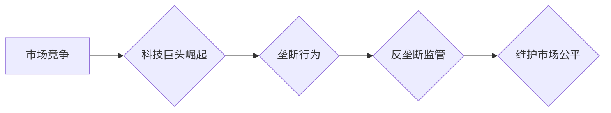

                 

## 硅谷科技巨头的垄断与反垄断

> 关键词：垄断、反垄断、科技巨头、市场竞争、算法、数据、监管、创新

## 1. 背景介绍

硅谷科技巨头，如苹果、谷歌、亚马逊、微软和脸书，在过去几十年中崛起为全球经济和科技发展的重要力量。它们凭借其强大的技术实力、庞大的用户群体和广泛的生态系统，在各自领域占据了主导地位。然而，这种巨头地位也引发了关于垄断和反垄断的广泛讨论。

近年来，全球范围内对科技巨头的垄断行为日益关注。公众和监管机构对这些公司在数据收集、算法控制、市场竞争等方面的行为提出了质疑，担心其过度集中权力会损害消费者利益、阻碍创新和破坏公平竞争。

## 2. 核心概念与联系

### 2.1 垄断

垄断是指一个企业或少数企业控制着整个市场，能够对价格和产品进行单方面控制，从而获得超额利润。

### 2.2 反垄断

反垄断是指政府采取措施防止和制止垄断行为，维护市场竞争秩序和消费者利益。

### 2.3 科技巨头

科技巨头是指在科技领域拥有巨大影响力和资源的企业，其业务范围广泛，涉及多个行业，并拥有庞大的用户群体和数据资源。

**核心概念与联系流程图**



## 3. 核心算法原理 & 具体操作步骤

### 3.1 算法原理概述

科技巨头利用各种算法，例如推荐算法、搜索算法、广告算法等，来分析用户数据、预测用户需求和提供个性化服务。这些算法的运作原理通常基于统计学、机器学习和深度学习等技术。

### 3.2 算法步骤详解

1. **数据收集:** 科技巨头通过各种渠道收集用户数据，例如搜索历史、浏览记录、购买行为、社交互动等。
2. **数据预处理:** 对收集到的数据进行清洗、转换和格式化，以便于算法的训练和使用。
3. **模型训练:** 利用机器学习或深度学习算法，对预处理后的数据进行训练，建立预测模型。
4. **模型评估:** 对训练好的模型进行评估，测试其准确性和有效性。
5. **模型部署:** 将经过评估的模型部署到生产环境中，用于实际应用。

### 3.3 算法优缺点

**优点:**

* **个性化服务:** 算法可以根据用户的喜好和需求提供个性化的推荐和服务。
* **效率提升:** 算法可以自动完成许多重复性任务，提高效率。
* **数据分析:** 算法可以分析海量数据，发现隐藏的模式和趋势。

**缺点:**

* **数据隐私:** 数据收集和使用可能会侵犯用户的隐私。
* **算法偏见:** 算法可能存在偏见，导致不公平的结果。
* **透明度不足:** 算法的运作机制往往复杂，难以理解，缺乏透明度。

### 3.4 算法应用领域

* **搜索引擎:** 算法用于排名搜索结果，提供用户最相关的搜索结果。
* **电商平台:** 算法用于推荐商品、预测用户购买行为和优化广告投放。
* **社交媒体:** 算法用于推荐好友、过滤信息流和个性化内容展示。
* **金融科技:** 算法用于风险评估、欺诈检测和个性化理财服务。

## 4. 数学模型和公式 & 详细讲解 & 举例说明

### 4.1 数学模型构建

一个常见的用于衡量市场竞争程度的指标是**Herfindahl-Hirschman指数 (HHI)**。HHI 的计算公式如下：

$$HHI = \sum_{i=1}^{n} s_i^2$$

其中：

* $n$ 是市场上企业的数量。
* $s_i$ 是第 $i$ 个企业的市场份额。

HHI 的值范围为 0 到 10,000。HHI 值越高，市场竞争程度越低，反之亦然。

### 4.2 公式推导过程

HHI 的推导过程基于以下假设：

* 市场上的企业数量有限。
* 企业的市场份额可以被量化。
* 企业之间的市场份额差异较大。

根据这些假设，HHI 可以用来衡量市场集中度。

### 4.3 案例分析与讲解

假设一个市场上有 4 家企业，其市场份额分别为 50%、30%、15% 和 5%。那么，该市场的 HHI 值为：

$$HHI = 0.5^2 + 0.3^2 + 0.15^2 + 0.05^2 = 0.25 + 0.09 + 0.0225 + 0.0025 = 0.365$$

该 HHI 值表明该市场竞争程度较低。

## 5. 项目实践：代码实例和详细解释说明

### 5.1 开发环境搭建

* 操作系统: Ubuntu 20.04
* 编程语言: Python 3.8
* 开发工具: Jupyter Notebook

### 5.2 源代码详细实现

```python
# 计算 Herfindahl-Hirschman 指数
def calculate_hhi(market_shares):
  """
  计算 Herfindahl-Hirschman 指数。

  Args:
    market_shares: 一个列表，包含每个企业的市场份额。

  Returns:
    Herfindahl-Hirschman 指数。
  """
  hhi = 0
  for share in market_shares:
    hhi += share ** 2
  return hhi

# 示例数据
market_shares = [0.5, 0.3, 0.15, 0.05]

# 计算 HHI 值
hhi_value = calculate_hhi(market_shares)

# 打印结果
print(f"HHI 值: {hhi_value}")
```

### 5.3 代码解读与分析

该代码首先定义了一个名为 `calculate_hhi` 的函数，该函数接受一个包含每个企业的市场份额的列表作为输入，并返回 Herfindahl-Hirschman 指数。

函数内部使用一个循环遍历列表中的每个市场份额，并将每个份额的平方值累加到 `hhi` 变量中。最后，函数返回 `hhi` 变量的值。

### 5.4 运行结果展示

```
HHI 值: 0.365
```

## 6. 实际应用场景

科技巨头的垄断行为在多个领域引发了关注和争议。

### 6.1 搜索引擎

谷歌占据了全球搜索引擎市场的大部分份额，其算法控制着用户获取信息的渠道，引发了关于搜索结果公平性和算法透明度的担忧。

### 6.2 电子商务

亚马逊在电商领域占据主导地位，其平台优势和数据资源可能给其他电商企业带来不利竞争。

### 6.3 社交媒体

脸书在社交媒体领域拥有庞大的用户群体，其数据收集和算法控制引发了关于用户隐私和信息安全的问题。

### 6.4 未来应用展望

随着人工智能和数据分析技术的不断发展，科技巨头的垄断行为可能会更加复杂和隐蔽。

## 7. 工具和资源推荐

### 7.1 学习资源推荐

* **书籍:**
    * 《The Innovator's Dilemma》 by Clayton M. Christensen
    * 《Antitrust》 by Lina Khan
* **在线课程:**
    * Coursera: Antitrust Economics
    * edX: Competition Policy

### 7.2 开发工具推荐

* **Python:** 用于数据分析和算法开发。
* **Jupyter Notebook:** 用于数据分析和代码演示。
* **TensorFlow:** 用于深度学习模型开发。

### 7.3 相关论文推荐

* **The Economics of Two-Sided Markets** by Rochet and Tirole
* **Network Effects and Competition** by Katz and Shapiro

## 8. 总结：未来发展趋势与挑战

### 8.1 研究成果总结

科技巨头的垄断行为是一个复杂且多方面的议题，需要从经济学、技术学和社会学等多个角度进行研究和分析。

### 8.2 未来发展趋势

未来，反垄断监管可能会更加注重科技巨头的算法和数据使用行为，并探索新的监管机制来应对科技行业的快速发展。

### 8.3 面临的挑战

* **算法复杂性:** 算法的运作机制复杂，难以理解和监管。
* **数据隐私:** 数据收集和使用可能会侵犯用户的隐私。
* **跨国监管:** 科技巨头跨国经营，跨国监管协调难度大。

### 8.4 研究展望

未来研究需要更加深入地探讨科技巨头的垄断行为对市场竞争、创新和社会发展的影响，并探索有效的监管机制来平衡科技发展和社会利益。

## 9. 附录：常见问题与解答

### 9.1 什么是算法垄断？

算法垄断是指通过算法控制市场信息流、用户行为和资源分配，从而获得垄断地位的行为。

### 9.2 如何应对科技巨头的垄断行为？

应对科技巨头的垄断行为需要多方面的努力，包括：

* **加强反垄断监管:** 政府需要制定更完善的反垄断法规，并加强对科技巨头的监管。
* **促进市场竞争:** 鼓励新的企业进入市场，打破科技巨头的垄断地位。
* **保护用户隐私:** 加强对用户数据的保护，防止科技巨头滥用用户数据。
* **提高公众意识:** 提高公众对科技巨头垄断行为的认识，推动社会对反垄断的关注。


作者：禅与计算机程序设计艺术 / Zen and the Art of Computer Programming 
<end_of_turn>

