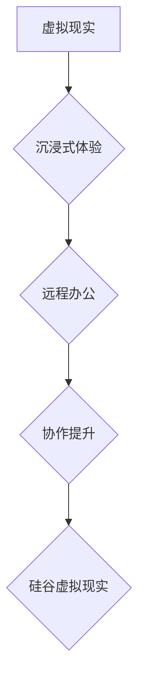

                 

## 硅谷虚拟现实在远程办公中的作用

> 关键词：虚拟现实、远程办公、协作、沉浸式体验、元宇宙、硅谷、未来工作

## 1. 背景介绍

随着科技的飞速发展，远程办公已成为一种越来越普遍的工作模式。新冠疫情的爆发更是加速了这一趋势。然而，远程办公也带来了新的挑战，例如缺乏面对面交流、团队协作效率低下等。为了解决这些问题，硅谷科技巨头们开始探索新的解决方案，其中虚拟现实（VR）技术被认为是未来远程办公的重要组成部分。

硅谷虚拟现实技术发展迅速，从最初的娱乐应用，逐渐扩展到教育、医疗、工业设计等多个领域。其沉浸式体验和交互性，为远程办公提供了全新的可能性。通过VR技术，员工可以身临其境地体验虚拟办公室，与同事进行面对面交流，共同完成项目，从而提升协作效率和工作体验。

## 2. 核心概念与联系

### 2.1 虚拟现实（VR）

虚拟现实是指利用计算机技术模拟真实环境或虚构场景，并通过头戴式显示器、手柄等设备，让用户沉浸其中，体验身临其境的感觉。VR技术主要包括以下几个方面：

* **3D图形渲染：** 创建逼真的虚拟环境和物体。
* **头戴式显示器：** 提供立体视觉效果，模拟用户视角。
* **传感器追踪：** 跟踪用户的动作和位置，实现虚拟环境中的交互。
* **音频技术：** 提供沉浸式的音频体验，增强用户感官体验。

### 2.2 远程办公

远程办公是指员工在远离公司办公场所，通过网络连接的方式进行工作。远程办公模式可以提高员工的工作效率，降低办公成本，并提供更灵活的工作时间。

### 2.3 硅谷虚拟现实

硅谷是全球科技创新中心，拥有众多科技巨头和创业公司。硅谷在虚拟现实技术领域投入巨大，不断推动VR技术的进步和应用。

**核心概念与联系流程图**



## 3. 核心算法原理 & 具体操作步骤

### 3.1 算法原理概述

硅谷虚拟现实在远程办公中的应用主要基于以下核心算法：

* **3D建模和渲染算法：** 用于创建逼真的虚拟环境和物体。
* **传感器追踪算法：** 用于跟踪用户的动作和位置，实现虚拟环境中的交互。
* **网络传输算法：** 用于将虚拟环境数据实时传输到用户的设备。
* **人工智能算法：** 用于模拟虚拟环境中的角色行为，提供更逼真的交互体验。

### 3.2 算法步骤详解

1. **环境建模：** 使用3D建模软件创建虚拟办公室的模型，包括墙壁、地板、家具等。
2. **纹理贴图：** 为模型添加纹理贴图，使其更加逼真。
3. **光照效果：** 设置光照效果，模拟真实环境中的光线照射。
4. **传感器追踪：** 使用头戴式显示器和手柄等设备，跟踪用户的动作和位置。
5. **数据传输：** 将虚拟环境数据实时传输到用户的设备。
6. **渲染和显示：** 用户设备接收虚拟环境数据，并将其渲染成图像显示。
7. **交互操作：** 用户可以通过手柄或语音控制，与虚拟环境中的物体进行交互。

### 3.3 算法优缺点

**优点：**

* 沉浸式体验：VR技术可以提供身临其境的感觉，增强用户参与度。
* 增强协作：虚拟环境可以模拟真实场景，方便员工进行面对面交流和协作。
* 提高效率：VR技术可以帮助员工更快地完成任务，提高工作效率。

**缺点：**

* 技术成本高：VR设备和软件成本较高，需要一定的投入。
* 硬件限制：VR体验受硬件性能限制，需要配备高性能设备。
* 眩晕感：部分用户可能在使用VR设备时出现眩晕感。

### 3.4 算法应用领域

* **远程会议和培训：** 虚拟会议室可以模拟真实会议场景，方便远程员工进行交流和培训。
* **协作设计：** 虚拟环境可以帮助设计师进行协同设计，提高设计效率。
* **产品演示：** 虚拟现实可以用于产品演示，让客户身临其境地体验产品功能。

## 4. 数学模型和公式 & 详细讲解 & 举例说明

### 4.1 数学模型构建

虚拟现实技术涉及到多个数学模型，例如3D图形渲染、传感器追踪、网络传输等。

* **3D图形渲染：** 使用矩阵变换和光线追踪算法，将3D模型渲染成二维图像。
* **传感器追踪：** 使用卡尔曼滤波算法，估计用户的运动轨迹。
* **网络传输：** 使用数据压缩和网络协议，保证虚拟环境数据的实时传输。

### 4.2 公式推导过程

* **矩阵变换：** 

$$
T = \begin{bmatrix}
a & b & c & d \\
e & f & g & h \\
i & j & k & l \\
0 & 0 & 0 & 1
\end{bmatrix}
$$

其中，T为变换矩阵，用于将3D模型进行旋转、缩放、平移等操作。

* **卡尔曼滤波：**

$$
\hat{x}_{k} = \hat{x}_{k-1} + K_k (y_k - H\hat{x}_{k-1})
$$

其中，$\hat{x}_k$为状态估计，$K_k$为卡尔曼增益，$y_k$为传感器测量值，$H$为观测矩阵。

### 4.3 案例分析与讲解

* **3D图形渲染：** 在游戏开发中，可以使用矩阵变换将游戏角色进行移动和旋转，并使用光线追踪算法计算光线与物体之间的交互，从而渲染出逼真的游戏场景。
* **传感器追踪：** 在VR游戏开发中，可以使用卡尔曼滤波算法跟踪用户的头部和手部运动，并将其映射到虚拟环境中，实现用户与虚拟环境的交互。

## 5. 项目实践：代码实例和详细解释说明

### 5.1 开发环境搭建

* **操作系统：** Windows 10 或更高版本
* **编程语言：** C# 或 Python
* **开发工具：** Unity 或 Unreal Engine
* **VR设备：** Oculus Rift 或 HTC Vive

### 5.2 源代码详细实现

以下是一个简单的C#代码示例，用于在Unity引擎中创建虚拟办公室：

```csharp
using UnityEngine;

public class VirtualOffice : MonoBehaviour
{
    public GameObject desk;
    public GameObject chair;
    public GameObject computer;

    void Start()
    {
        // 创建虚拟办公桌
        Instantiate(desk, new Vector3(0, 0, 0), Quaternion.identity);

        // 创建虚拟办公椅
        Instantiate(chair, new Vector3(0, 0, 2), Quaternion.identity);

        // 创建虚拟电脑
        Instantiate(computer, new Vector3(0, 0, 4), Quaternion.identity);
    }
}
```

### 5.3 代码解读与分析

* `using UnityEngine;`：导入Unity引擎的API。
* `public class VirtualOffice : MonoBehaviour`：定义一个名为VirtualOffice的脚本类，继承自MonoBehaviour。
* `public GameObject desk;`、`public GameObject chair;`、`public GameObject computer;`：声明三个公共变量，分别代表虚拟办公桌、办公椅和电脑的预制体。
* `void Start()`：在游戏开始时执行的函数。
* `Instantiate(desk, new Vector3(0, 0, 0), Quaternion.identity);`：实例化虚拟办公桌，并将其放置在世界坐标原点。
* `Instantiate(chair, new Vector3(0, 0, 2), Quaternion.identity);`：实例化虚拟办公椅，并将其放置在世界坐标(0, 0, 2)处。
* `Instantiate(computer, new Vector3(0, 0, 4), Quaternion.identity);`：实例化虚拟电脑，并将其放置在世界坐标(0, 0, 4)处。

### 5.4 运行结果展示

运行该代码后，将创建一个虚拟办公室，包含虚拟办公桌、办公椅和电脑。

## 6. 实际应用场景

### 6.1 远程会议

虚拟现实可以创建逼真的虚拟会议室，让远程员工身临其境地进行交流。

* **优势：** 增强互动性，提高会议效率，减少沟通误差。
* **应用场景：** 公司会议、团队协作、远程培训。

### 6.2 协作设计

虚拟现实可以为设计师提供一个共享的虚拟空间，方便进行协同设计。

* **优势：** 提高设计效率，减少设计误差，增强团队协作。
* **应用场景：** 建筑设计、产品设计、游戏开发。

### 6.3 产品演示

虚拟现实可以用于产品演示，让客户身临其境地体验产品功能。

* **优势：** 增强用户体验，提高产品销售转化率。
* **应用场景：** 汽车、房地产、电子产品等行业。

### 6.4 未来应用展望

随着虚拟现实技术的不断发展，其在远程办公中的应用场景将更加广泛。未来，虚拟现实将可能实现以下应用：

* **虚拟办公环境：** 创建更加逼真的虚拟办公环境，模拟真实办公室场景。
* **沉浸式培训：** 提供沉浸式的培训体验，让员工在虚拟环境中进行模拟操作。
* **远程协作工具：** 开发更加强大的远程协作工具，例如虚拟白板、虚拟会议室等。

## 7. 工具和资源推荐

### 7.1 学习资源推荐

* **Unity官方文档：** https://docs.unity3d.com/
* **Unreal Engine官方文档：** https://docs.unrealengine.com/
* **VR开发教程：** https://www.youtube.com/results?search_query=vr+development+tutorial

### 7.2 开发工具推荐

* **Unity：** https://unity.com/
* **Unreal Engine：** https://www.unrealengine.com/
* **SteamVR：** https://store.steampowered.com/app/353380/SteamVR/

### 7.3 相关论文推荐

* **Virtual Reality for Remote Collaboration:** https://ieeexplore.ieee.org/document/8818661
* **The Impact of Virtual Reality on Remote Work:** https://www.researchgate.net/publication/340969908_The_Impact_of_Virtual_Reality_on_Remote_Work

## 8. 总结：未来发展趋势与挑战

### 8.1 研究成果总结

硅谷虚拟现实技术在远程办公领域的应用取得了显著成果，为员工提供了更加沉浸式、高效的远程工作体验。

### 8.2 未来发展趋势

* **更加逼真的虚拟环境：** 未来虚拟环境将更加逼真，能够模拟更加复杂的场景和交互体验。
* **更强大的协作工具：** 未来将开发更加强大的协作工具，例如虚拟白板、虚拟会议室等，提高远程团队协作效率。
* **更广泛的应用场景：** 虚拟现实将应用于更多远程办公场景，例如远程培训、远程教育、远程医疗等。

### 8.3 面临的挑战

* **技术成本高：** 虚拟现实设备和软件成本较高，需要一定的投入。
* **硬件限制：** 虚拟现实体验受硬件性能限制，需要配备高性能设备。
* **用户接受度：** 部分用户可能对虚拟现实技术感到陌生或不适应。

### 8.4 研究展望

未来，我们需要继续研究虚拟现实技术的应用，解决技术成本、硬件限制和用户接受度等挑战，推动虚拟现实技术在远程办公领域的广泛应用。


## 9. 附录：常见问题与解答

**Q1：虚拟现实技术是否安全？**

A1：虚拟现实技术本身是安全的，但使用过程中需要注意一些安全问题，例如避免长时间使用，避免在使用过程中进行危险活动。

**Q2：虚拟现实技术是否适合所有人？**

A2：虚拟现实技术并非适合所有人，部分用户可能在使用过程中出现眩晕感或其他不适症状。

**Q3：虚拟现实技术的发展前景如何？**

A3：虚拟现实技术发展前景广阔，未来将应用于更多领域，例如教育、医疗、娱乐等。


作者：禅与计算机程序设计艺术 / Zen and the Art of Computer Programming 
<end_of_turn>

