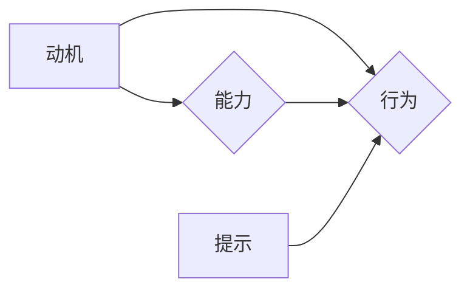

                 

## 福格行为模型:培养团队良好习惯的秘诀

> 关键词：福格行为模型，团队习惯，软件开发，协作效率，沟通技巧，项目管理，团队建设

### 1. 背景介绍

在当今快速迭代的软件开发环境中，团队协作效率和良好习惯的养成至关重要。高效的团队能够更快地交付高质量的软件，并能够更好地应对不断变化的需求。然而，团队协作并非易事，沟通障碍、工作流程混乱、缺乏明确的责任划分等问题常常困扰着软件开发团队。

福格行为模型（Fogg Behavior Model）提供了一种理解和改变行为的框架，它可以帮助我们分析团队成员的行为模式，并制定有效的策略来培养团队良好的习惯。

### 2. 核心概念与联系

福格行为模型的核心概念是“行为发生的三要素：**动机、能力和提示**”。

* **动机**：是指个体想要执行行为的意愿和渴望。
* **能力**：是指个体执行行为所需的技能、知识和资源。
* **提示**：是指能够提醒个体执行行为的外部或内部信号。

这三个要素相互关联，只有当这三个要素都满足时，行为才会发生。

**Mermaid 流程图**

福格行为模型认为，我们可以通过改变这三个要素的强度来影响团队成员的行为。例如，我们可以通过提高团队成员对良好习惯的认知，增强他们的动机；我们可以通过提供必要的培训和工具，提升他们的能力；我们可以通过建立明确的流程和规范，提供有效的提示。

### 3. 核心算法原理 & 具体操作步骤

福格行为模型本身不是一个算法，而是一种行为模型。它提供了一种框架来理解和改变行为，但没有具体的算法步骤。

**3.1 算法原理概述**

福格行为模型的核心原理是通过分析动机、能力和提示三个要素，并根据团队的具体情况进行调整，从而引导团队成员养成良好的习惯。

**3.2 算法步骤详解**

1. **识别目标行为**: 首先要明确团队想要培养的良好习惯。
2. **分析动机**: 了解团队成员想要执行目标行为的动机是什么，以及是什么因素阻碍了他们的动机。
3. **评估能力**: 评估团队成员执行目标行为所需的技能、知识和资源是否充足。
4. **识别提示**: 识别能够提醒团队成员执行目标行为的外部或内部信号。
5. **制定策略**: 根据分析结果，制定具体的策略来提高动机、能力和提示的强度，从而引导团队成员养成目标行为。
6. **实施和评估**: 将策略付诸实践，并定期评估策略的效果，根据实际情况进行调整。

**3.3 算法优缺点**

* **优点**: 
    * 易于理解和应用。
    * 能够针对不同的团队和行为进行定制化。
    * 强调了行为发生的三要素，提供了全面的分析框架。
* **缺点**: 
    * 缺乏具体的算法步骤，需要根据实际情况进行灵活调整。
    * 难以量化动机、能力和提示的强度。

**3.4 算法应用领域**

福格行为模型可以应用于各种团队和组织，例如：

* 软件开发团队
* 产品设计团队
* 市场营销团队
* 教育机构
* 医疗机构

### 4. 数学模型和公式 & 详细讲解 & 举例说明

福格行为模型本身没有严格的数学模型和公式。它更侧重于行为分析和策略制定。

**4.1 数学模型构建**

由于福格行为模型的核心是行为发生的三要素，我们可以尝试用数学模型来表示这三个要素之间的关系。

例如，我们可以用以下公式来表示行为发生的概率：

$$P(行为) = f(动机, 能力, 提示)$$

其中，P(行为) 表示行为发生的概率，动机、能力和提示分别表示这三个要素的强度。

f() 是一个复杂的函数，它描述了这三个要素之间的相互作用关系。

**4.2 公式推导过程**

由于 f() 函数的复杂性，很难用数学公式精确地推导出来。

**4.3 案例分析与讲解**

我们可以通过案例分析来理解福格行为模型的应用。

例如，假设我们想要提高团队成员的代码审查习惯。

* **动机**: 团队成员可能缺乏对代码审查重要性的认知，或者认为代码审查浪费时间。
* **能力**: 团队成员可能缺乏代码审查的技能和经验。
* **提示**: 团队成员可能没有明确的代码审查流程和规范。

我们可以通过以下策略来提高团队成员的代码审查习惯：

* **提高动机**: 通过强调代码审查对软件质量和团队协作的重要性，提高团队成员的认知。
* **提升能力**: 提供代码审查的培训和指导，帮助团队成员掌握相关的技能和经验。
* **提供提示**: 建立明确的代码审查流程和规范，并使用工具自动提醒团队成员进行代码审查。

### 5. 项目实践：代码实例和详细解释说明

由于福格行为模型本身不是一个代码实例，因此无法提供具体的代码实现。

**5.1 开发环境搭建**

福格行为模型的应用不需要特定的开发环境。

**5.2 源代码详细实现**

福格行为模型的应用更多的是基于策略和流程的调整，而不是代码实现。

**5.3 代码解读与分析**

福格行为模型的应用需要团队成员的理解和参与，而不是简单的代码解读。

**5.4 运行结果展示**

福格行为模型的应用效果需要通过团队成员的行为变化来体现，而不是通过代码运行结果来展示。

### 6. 实际应用场景

福格行为模型可以应用于各种软件开发团队的场景，例如：

* **提高代码质量**: 通过鼓励代码审查、单元测试等良好习惯，提高团队的代码质量。
* **提升协作效率**: 通过建立明确的沟通流程和规范，提高团队成员之间的协作效率。
* **增强团队凝聚力**: 通过共同的目标和良好的团队文化，增强团队成员之间的凝聚力。

**6.4 未来应用展望**

随着人工智能技术的不断发展，福格行为模型可以与人工智能技术结合，更加智能化地分析团队成员的行为模式，并提供更精准的策略建议。

### 7. 工具和资源推荐

**7.1 学习资源推荐**

* 《行为设计：改变行为的艺术》
* 《Hooked: How to Build Habit-Forming Products》

**7.2 开发工具推荐**

* 团队协作工具：Jira, Slack, Microsoft Teams
* 代码审查工具：GitHub, GitLab, Bitbucket

**7.3 相关论文推荐**

* Fogg, B. J. (2009). Persuasive technology: Using computers to change what we think and do. Morgan Kaufmann.

### 8. 总结：未来发展趋势与挑战

福格行为模型为团队建设和行为改变提供了有效的框架和思路。

**8.1 研究成果总结**

福格行为模型已经成功应用于各种领域，并取得了显著的成果。

**8.2 未来发展趋势**

未来，福格行为模型将更加智能化、个性化，并与人工智能技术深度融合。

**8.3 面临的挑战**

* 如何更准确地量化动机、能力和提示的强度。
* 如何将福格行为模型应用于更复杂和动态的团队环境。

**8.4 研究展望**

未来研究将继续探索福格行为模型的应用场景，并开发更先进的模型和工具，以帮助团队更好地培养良好习惯，提高协作效率。

### 9. 附录：常见问题与解答

* **问题**: 如何判断团队成员的动机是否足够强？
* **解答**: 可以通过问卷调查、访谈等方式了解团队成员对目标行为的认知和态度。

* **问题**: 如何提高团队成员的能力？
* **解答**: 可以提供培训、指导、实践机会等方式帮助团队成员提升相关技能和经验。

* **问题**: 如何建立有效的提示机制？
* **解答**: 可以通过建立明确的流程和规范、使用工具自动提醒等方式建立有效的提示机制。

作者：禅与计算机程序设计艺术 / Zen and the Art of Computer Programming 
<end_of_turn>

