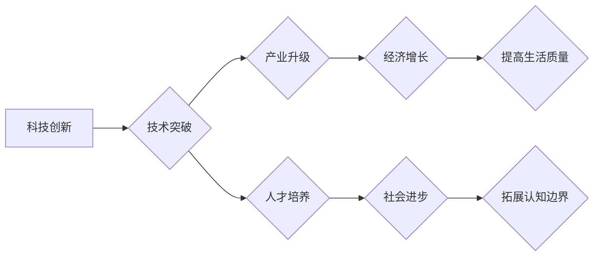

                 

## 科技创新：社会进步的阶梯

> 关键词：人工智能、科技创新、社会进步、算法、机器学习、深度学习、数据科学、未来趋势

## 1. 背景介绍

人类文明的发展历程，始终伴随着科技创新的不断涌现。从火的使用到互联网的普及，每一次科技突破都深刻地改变着人类的生活方式、社会结构和价值观。科技创新是推动社会进步的引擎，它不仅提升了生产力，也催生了新的产业、新的就业机会，并不断拓展着人类的认知边界。

然而，科技创新并非一帆风顺。它需要跨学科的融合、人才的培养、资金的投入以及政策的引导。同时，科技创新也面临着伦理、安全和可持续性等挑战。如何更好地把握科技创新的机遇，规避潜在的风险，是摆在我们面前的重要课题。

## 2. 核心概念与联系

**2.1  科技创新与社会进步的内在联系**

科技创新是社会进步的阶梯，它为社会发展提供着动力和方向。科技创新可以带来以下方面的社会进步：

* **提高生产力:** 科技创新可以提高生产效率，降低生产成本，从而促进经济增长。
* **改善生活质量:** 科技创新可以带来新的产品和服务，改善人们的生活水平和生活质量。
* **促进社会公平:** 科技创新可以帮助解决社会问题，促进社会公平正义。
* **拓展人类认知:** 科技创新可以帮助人类更好地理解世界，拓展人类的认知边界。

**2.2  科技创新驱动社会变革的机制**

科技创新驱动社会变革的机制是一个复杂的过程，它涉及到多个方面：

* **技术突破:** 新技术的出现往往会打破旧的生产方式和生活方式，从而引发社会变革。
* **产业升级:** 科技创新可以推动产业结构的调整和升级，促进经济转型发展。
* **人才培养:** 科技创新需要大量的技术人才，人才的培养是科技创新的基础。
* **政策引导:** 政府的政策引导可以促进科技创新的发展，并引导科技创新朝着有利于社会发展的方向发展。

**2.3  科技创新与社会责任的平衡**

科技创新带来的进步的同时，也可能带来一些负面影响，例如：

* **就业问题:** 科技创新可能会导致一些传统产业的衰落，从而造成失业问题。
* **伦理问题:** 一些新技术，例如人工智能，可能会引发伦理问题，例如算法偏见、隐私泄露等。
* **安全问题:** 一些新技术，例如生物技术，可能会带来安全风险，例如生物武器的出现。

因此，在推动科技创新发展的同时，我们也需要关注科技创新的社会责任，并采取措施规避潜在的风险。

**Mermaid 流程图**



## 3. 核心算法原理 & 具体操作步骤

**3.1  算法原理概述**

深度学习算法是一种基于人工神经网络的机器学习算法，它能够从海量数据中学习复杂的模式和特征。深度学习算法的核心思想是通过多层神经网络来模拟人类大脑的学习过程，从而实现对数据的自动学习和分析。

**3.2  算法步骤详解**

深度学习算法的具体操作步骤如下：

1. **数据预处理:** 将原始数据进行清洗、转换和特征工程，使其能够被深度学习算法所理解。
2. **网络结构设计:** 根据具体任务需求，设计深度神经网络的结构，包括神经元的数量、连接方式和激活函数等。
3. **模型训练:** 使用训练数据对深度神经网络进行训练，通过调整网络参数，使网络能够准确地预测目标输出。
4. **模型评估:** 使用测试数据对训练好的模型进行评估，并根据评估结果进行模型调优。
5. **模型部署:** 将训练好的模型部署到实际应用场景中，用于进行预测或分析。

**3.3  算法优缺点**

**优点:**

* **强大的学习能力:** 深度学习算法能够从海量数据中学习复杂的模式和特征，从而实现对数据的自动学习和分析。
* **高精度:** 深度学习算法在许多任务中，例如图像识别、语音识别和自然语言处理等，能够达到很高的精度。
* **自动化程度高:** 深度学习算法的训练和部署过程可以高度自动化，从而降低了人工成本。

**缺点:**

* **数据依赖性强:** 深度学习算法需要大量的训练数据才能达到较高的精度。
* **计算资源消耗大:** 深度学习算法的训练过程需要大量的计算资源，例如GPU和TPU。
* **可解释性差:** 深度学习算法的决策过程比较复杂，难以解释其背后的逻辑。

**3.4  算法应用领域**

深度学习算法在各个领域都有广泛的应用，例如：

* **计算机视觉:** 图像识别、目标检测、图像分割、人脸识别等。
* **语音识别:** 语音转文本、语音合成、语音助手等。
* **自然语言处理:** 文本分类、情感分析、机器翻译、聊天机器人等。
* **医疗诊断:** 疾病诊断、影像分析、药物研发等。
* **金融分析:** 风险评估、欺诈检测、投资预测等。

## 4. 数学模型和公式 & 详细讲解 & 举例说明

**4.1  数学模型构建**

深度学习算法的核心是多层神经网络，每个神经元接收多个输入信号，并通过加权求和和激活函数进行处理，最终输出一个信号。

**神经网络模型:**

$$
y = f(W_L x_L + b_L)
$$

其中：

* $y$ 是神经元的输出
* $x_L$ 是上一层神经元的输出
* $W_L$ 是连接上一层和本层的权重矩阵
* $b_L$ 是本层的偏置向量
* $f$ 是激活函数

**4.2  公式推导过程**

深度学习算法的训练过程是通过反向传播算法来进行的。反向传播算法的核心思想是通过计算误差信号，并反向传播到网络的每一层，从而调整网络参数，使网络能够更好地预测目标输出。

**反向传播算法:**

$$\frac{\partial Loss}{\partial W} = \frac{\partial Loss}{\partial y} \cdot \frac{\partial y}{\partial W}$$

其中：

* $Loss$ 是损失函数
* $W$ 是网络参数

**4.3  案例分析与讲解**

例如，在图像识别任务中，深度学习算法可以学习到图像中不同物体特征的表示，并将其用于分类。

**举例说明:**

假设我们有一个深度神经网络，用于识别猫和狗的图像。网络的输入是图像像素值，输出是猫和狗的概率。

在训练过程中，网络会根据输入图像和真实标签，计算损失函数，并通过反向传播算法调整网络参数。

经过多次训练，网络能够学习到猫和狗的特征，并能够准确地识别出图像中是猫还是狗。

## 5. 项目实践：代码实例和详细解释说明

**5.1  开发环境搭建**

深度学习算法的开发环境通常需要安装深度学习框架，例如TensorFlow、PyTorch等，以及必要的库和工具。

**5.2  源代码详细实现**

以下是一个使用TensorFlow实现图像分类的简单代码示例：

```python
import tensorflow as tf

# 定义模型结构
model = tf.keras.models.Sequential([
  tf.keras.layers.Conv2D(32, (3, 3), activation='relu', input_shape=(28, 28, 1)),
  tf.keras.layers.MaxPooling2D((2, 2)),
  tf.keras.layers.Conv2D(64, (3, 3), activation='relu'),
  tf.keras.layers.MaxPooling2D((2, 2)),
  tf.keras.layers.Flatten(),
  tf.keras.layers.Dense(10, activation='softmax')
])

# 编译模型
model.compile(optimizer='adam',
              loss='sparse_categorical_crossentropy',
              metrics=['accuracy'])

# 训练模型
model.fit(x_train, y_train, epochs=5)

# 评估模型
loss, accuracy = model.evaluate(x_test, y_test)
print('Test Loss:', loss)
print('Test Accuracy:', accuracy)
```

**5.3  代码解读与分析**

这段代码定义了一个简单的卷积神经网络模型，用于识别手写数字。

* `tf.keras.models.Sequential` 创建了一个顺序模型，即层级结构。
* `tf.keras.layers.Conv2D` 定义了一个卷积层，用于提取图像特征。
* `tf.keras.layers.MaxPooling2D` 定义了一个最大池化层，用于降低特征图的尺寸。
* `tf.keras.layers.Flatten` 将多维特征图转换为一维向量。
* `tf.keras.layers.Dense` 定义了一个全连接层，用于分类。
* `model.compile` 编译模型，指定优化器、损失函数和评价指标。
* `model.fit` 训练模型，使用训练数据进行训练。
* `model.evaluate` 评估模型，使用测试数据进行评估。

**5.4  运行结果展示**

训练完成后，模型能够对新的手写数字图像进行分类，并输出相应的类别概率。

## 6. 实际应用场景

深度学习算法在各个领域都有广泛的应用，例如：

* **医疗诊断:** 深度学习算法可以帮助医生诊断疾病，例如癌症、糖尿病等。
* **金融分析:** 深度学习算法可以帮助金融机构进行风险评估、欺诈检测和投资预测。
* **自动驾驶:** 深度学习算法可以帮助自动驾驶汽车识别道路、交通信号和行人。
* **个性化推荐:** 深度学习算法可以帮助电商平台提供个性化的商品推荐。

**6.4  未来应用展望**

未来，深度学习算法将应用于更多领域，例如：

* **科学研究:** 深度学习算法可以帮助科学家分析大规模实验数据，加速科学发现。
* **教育:** 深度学习算法可以帮助个性化教学，提高学生的学习效率。
* **艺术创作:** 深度学习算法可以帮助艺术家创作新的艺术作品。

## 7. 工具和资源推荐

**7.1  学习资源推荐**

* **书籍:**
    * 深度学习 (Deep Learning) - Ian Goodfellow, Yoshua Bengio, Aaron Courville
    * 深度学习实践 (Hands-On Machine Learning with Scikit-Learn, Keras & TensorFlow) - Aurélien Géron
* **在线课程:**
    * TensorFlow 官方教程: https://www.tensorflow.org/tutorials
    * PyTorch 官方教程: https://pytorch.org/tutorials/
    * Coursera 深度学习课程: https://www.coursera.org/specializations/deep-learning

**7.2  开发工具推荐**

* **深度学习框架:** TensorFlow, PyTorch, Keras
* **编程语言:** Python
* **数据处理工具:** Pandas, NumPy

**7.3  相关论文推荐**

* **AlexNet:** ImageNet Classification with Deep Convolutional Neural Networks
* **VGGNet:** Very Deep Convolutional Networks for Large-Scale Image Recognition
* **ResNet:** Deep Residual Learning for Image Recognition

## 8. 总结：未来发展趋势与挑战

**8.1  研究成果总结**

近年来，深度学习算法取得了显著的进展，在图像识别、语音识别、自然语言处理等领域取得了突破性的成果。

**8.2  未来发展趋势**

未来，深度学习算法将朝着以下方向发展:

* **模型更深更广:** 研究更深层次、更广阔结构的神经网络，以提高模型的学习能力和泛化能力。
* **数据更丰富更有效:** 研究新的数据采集和处理方法，以获取更丰富、更有效的训练数据。
* **算法更智能更可解释:** 研究更智能、更可解释的深度学习算法，以提高模型的鲁棒性和可信度。

**8.3  面临的挑战**

深度学习算法也面临着一些挑战:

* **计算资源需求高:** 训练大型深度学习模型需要大量的计算资源，这限制了模型的规模和应用范围。
* **数据偏差问题:** 深度学习算法容易受到训练数据偏差的影响，导致模型产生偏见和歧视。
* **安全性和隐私问题:** 深度学习算法的训练和应用可能涉及到敏感数据，需要保障数据的安全性和隐私。

**8.4  研究展望**

未来，我们需要继续加强对深度学习算法的研究，解决其面临的挑战，并将其应用于更多领域，推动社会进步。

## 9. 附录：常见问题与解答

**常见问题:**

* **什么是深度学习?**

深度学习是一种机器学习算法，它使用多层神经网络来模拟人类大脑的学习过程。

* **深度学习算法有哪些?**

常见的深度学习算法包括卷积神经网络 (CNN)、循环神经网络 (RNN) 和生成对抗网络 (GAN)。

* **如何训练深度学习模型?**

训练深度学习模型需要使用大量的训练数据和强大的计算资源。常用的训练方法包括反向传播算法和梯度下降算法。

* **深度学习算法有哪些应用?**

深度学习算法在各个领域都有广泛的应用，例如图像识别、语音识别、自然语言处理、医疗诊断和金融分析。

**作者：禅与计算机程序设计艺术 / Zen and the Art of Computer Programming**<end_of_turn>

