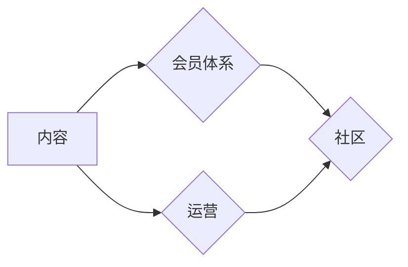

                 

## 程序员如何打造订阅制知识服务

> 关键词：订阅制知识服务、程序员、在线教育、知识付费、社区建设、内容运营、技术博客、会员体系

## 1. 背景介绍

在当今数字化时代，知识已成为最宝贵的资源。程序员作为科技发展的重要力量，对持续学习和提升技能有着迫切的需求。传统的教育模式难以满足程序员个性化学习的需求，而订阅制知识服务应运而生，为程序员提供了一种灵活、高效、可持续的学习方式。

订阅制知识服务是指通过订阅的方式，用户可以获得持续更新的知识内容、学习资源和社区支持。这种模式打破了传统的知识付费壁垒，让程序员可以按需付费，获取他们真正需要的知识和技能。

## 2. 核心概念与联系

订阅制知识服务的核心概念包括：

* **内容：** 提供高质量、实用、针对程序员需求的知识内容，例如技术教程、代码示例、项目案例、行业趋势分析等。
* **社区：** 建立一个活跃的在线社区，让程序员可以互相交流学习、分享经验、解决问题。
* **会员体系：** 设计不同的会员等级和订阅方案，满足不同用户需求和付费意愿。
* **运营：** 持续更新内容、维护社区活跃度、提供优质服务，提升用户粘性和留存率。

**核心概念架构图：**



## 3. 核心算法原理 & 具体操作步骤

### 3.1  算法原理概述

订阅制知识服务的核心算法原理在于内容推荐和社区匹配。

* **内容推荐算法：** 基于用户历史浏览、学习记录、兴趣偏好等数据，推荐用户感兴趣和有学习价值的内容。常用的算法包括协同过滤、内容过滤、深度学习等。
* **社区匹配算法：** 基于用户技能、经验、兴趣等信息，将用户匹配到合适的社区，促进用户之间的交流和学习。常用的算法包括基于属性的匹配、基于兴趣的匹配、基于行为的匹配等。

### 3.2  算法步骤详解

**内容推荐算法步骤：**

1. 收集用户数据：包括用户浏览记录、学习记录、评分反馈、评论等。
2. 数据预处理：清洗数据、转换格式、特征提取等。
3. 模型训练：选择合适的算法模型，训练模型并评估模型性能。
4. 内容推荐：根据用户数据和模型预测，推荐用户感兴趣的内容。
5. 反馈优化：收集用户反馈，不断优化模型参数和推荐策略。

**社区匹配算法步骤：**

1. 收集用户信息：包括用户技能、经验、兴趣、工作领域等。
2. 用户画像构建：将用户信息转换为用户画像，描述用户的特征和属性。
3. 社区特征提取：提取社区的主题、活跃度、用户结构等特征。
4. 匹配算法：根据用户画像和社区特征，使用匹配算法将用户匹配到合适的社区。
5. 社区管理：根据用户匹配结果，进行社区管理和运营，促进用户之间的交流和学习。

### 3.3  算法优缺点

**内容推荐算法：**

* **优点：** 可以根据用户兴趣推荐个性化内容，提高用户学习效率和满意度。
* **缺点：** 需要大量用户数据进行训练，算法模型复杂，需要不断优化。

**社区匹配算法：**

* **优点：** 可以帮助用户找到志同道合的伙伴，促进学习和交流。
* **缺点：** 需要准确的用户信息和社区特征，算法匹配效果需要不断改进。

### 3.4  算法应用领域

* **在线教育平台：** 推荐课程、学习资源、学习计划等。
* **技术博客平台：** 推荐文章、技术社区、开发者工具等。
* **社交媒体平台：** 推荐兴趣小组、话题讨论、好友连接等。

## 4. 数学模型和公式 & 详细讲解 & 举例说明

### 4.1  数学模型构建

**内容推荐算法：**

可以使用协同过滤算法构建数学模型，例如基于用户的协同过滤模型：

$$
r_{ui} = \alpha \cdot \overline{r_u} + (1-\alpha) \cdot \frac{\sum_{j \in N(i)} r_{uj} \cdot sim(u, v_j)}{\sum_{j \in N(i)} sim(u, v_j)}
$$

其中：

* $r_{ui}$：用户 $u$ 对物品 $i$ 的评分
* $\overline{r_u}$：用户 $u$ 的平均评分
* $r_{uj}$：用户 $u$ 对物品 $j$ 的评分
* $sim(u, v_j)$：用户 $u$ 和用户 $v_j$ 之间的相似度

**社区匹配算法：**

可以使用基于属性的匹配算法构建数学模型，例如Jaccard相似度：

$$
J(A, B) = \frac{|A \cap B|}{|A \cup B|}
$$

其中：

* $A$：用户 $u$ 的属性集合
* $B$：社区 $c$ 的属性集合
* $|A \cap B|$：用户 $u$ 和社区 $c$ 的共同属性数量
* $|A \cup B|$：用户 $u$ 和社区 $c$ 的所有属性数量

### 4.2  公式推导过程

**协同过滤算法的公式推导：**

协同过滤算法的基本思想是：如果用户 $u$ 和用户 $v$ 对某些物品的评分相似，那么用户 $u$ 可能也喜欢用户 $v$ 喜欢的物品。

协同过滤算法的公式推导过程可以参考相关机器学习书籍和论文。

**Jaccard相似度的公式推导：**

Jaccard相似度是衡量两个集合相似度的指标，其值介于0到1之间，其中0表示两个集合没有交集，1表示两个集合完全相同。

Jaccard相似度的公式推导过程可以参考相关数学和统计学书籍和论文。

### 4.3  案例分析与讲解

**内容推荐算法案例：**

假设一个在线教育平台，用户 $A$ 对编程课程评分较高，用户 $B$ 和用户 $A$ 对相同的编程课程评分较高，那么可以推断用户 $B$ 也可能喜欢用户 $A$ 喜欢的编程课程。

**社区匹配算法案例：**

假设一个技术博客平台，用户 $C$ 擅长前端开发，社区 $D$ 的主题是前端开发，那么可以将用户 $C$ 匹配到社区 $D$，方便用户 $C$ 与其他前端开发人员交流学习。

## 5. 项目实践：代码实例和详细解释说明

### 5.1  开发环境搭建

* **操作系统：** Linux/macOS/Windows
* **编程语言：** Python
* **框架：** Flask/Django
* **数据库：** MySQL/PostgreSQL
* **工具：** Git、Docker

### 5.2  源代码详细实现

以下是一个简单的Python代码示例，演示如何使用Flask框架构建一个订阅制知识服务平台的基本功能：

```python
from flask import Flask, render_template, request

app = Flask(__name__)

# 模拟用户数据
users = {
    1: {'name': 'Alice', 'email': 'alice@example.com', 'subscription': 'basic'},
    2: {'name': 'Bob', 'email': 'bob@example.com', 'subscription': 'premium'},
}

# 模拟内容数据
contents = [
    {'id': 1, 'title': 'Python基础教程', 'type': 'article'},
    {'id': 2, 'title': '机器学习入门', 'type': 'video'},
    {'id': 3, 'title': '数据结构与算法', 'type': 'ebook'},
]

@app.route('/')
def index():
    return render_template('index.html', contents=contents)

@app.route('/login')
def login():
    return render_template('login.html')

@app.route('/subscribe', methods=['POST'])
def subscribe():
    user_id = request.form.get('user_id')
    subscription_type = request.form.get('subscription_type')
    users[user_id]['subscription'] = subscription_type
    return '订阅成功!'

if __name__ == '__main__':
    app.run(debug=True)
```

### 5.3  代码解读与分析

* **Flask框架：** 使用Flask框架构建Web应用程序，简化开发流程。
* **用户数据模拟：** 使用字典模拟用户数据，包括用户ID、姓名、邮箱和订阅类型。
* **内容数据模拟：** 使用列表模拟内容数据，包括内容ID、标题和类型。
* **路由定义：** 定义不同的路由，对应不同的页面和功能。
* **模板渲染：** 使用Jinja2模板引擎渲染HTML页面。
* **表单处理：** 使用POST请求处理订阅表单数据。

### 5.4  运行结果展示

运行以上代码，可以启动一个简单的订阅制知识服务平台，用户可以访问首页查看内容列表，登录并选择订阅类型。

## 6. 实际应用场景

订阅制知识服务在程序员领域有着广泛的应用场景：

* **在线学习平台：** Udemy、Coursera、Codecademy等平台提供各种编程课程和学习资源，用户可以根据自己的需求订阅不同类型的课程。
* **技术博客平台：** Hacker News、Medium、Dev.to等平台汇聚了大量的技术文章和博客，用户可以订阅感兴趣的作者或主题，获取最新的技术资讯和学习内容。
* **社区论坛：** Stack Overflow、GitHub、Reddit等平台提供了程序员交流学习的平台，用户可以订阅特定话题或社区，参与讨论和解决问题。

### 6.4  未来应用展望

随着人工智能、大数据等技术的不断发展，订阅制知识服务将更加智能化、个性化和互动化。

* **智能内容推荐：** 利用机器学习算法，更加精准地推荐用户感兴趣的内容。
* **个性化学习路径：** 根据用户的学习进度和目标，定制个性化的学习路径。
* **虚拟现实/增强现实学习：** 利用VR/AR技术，提供更加沉浸式的学习体验。
* **社区社交化：** 更加注重社区建设，促进用户之间的交流和合作。

## 7. 工具和资源推荐

### 7.1  学习资源推荐

* **书籍：** 《Python编程：从入门到实践》、《机器学习实战》、《深度学习》
* **在线课程：** Coursera、Udemy、edX
* **博客和网站：** Hacker News、Medium、Dev.to

### 7.2  开发工具推荐

* **编程语言：** Python、JavaScript、Java
* **框架：** Flask、Django、React、Vue.js
* **数据库：** MySQL、PostgreSQL、MongoDB
* **云平台：** AWS、Azure、GCP

### 7.3  相关论文推荐

* **协同过滤算法：** "Collaborative Filtering: A User-Based Approach"
* **内容推荐算法：** "Content-Based Recommendation Systems"
* **社区匹配算法：** "Community Detection in Social Networks"

## 8. 总结：未来发展趋势与挑战

### 8.1  研究成果总结

订阅制知识服务为程序员提供了灵活、高效、可持续的学习方式，并促进了技术社区的建设和发展。

### 8.2  未来发展趋势

订阅制知识服务将更加智能化、个性化和互动化，并与其他技术融合，例如人工智能、大数据、虚拟现实/增强现实等。

### 8.3  面临的挑战

* **内容质量控制：** 确保提供高质量、有价值的内容，避免信息过载和内容重复。
* **用户体验优化：** 提供更加便捷、流畅的用户体验，提高用户粘性和留存率。
* **商业模式创新：** 探索新的商业模式，实现可持续发展。

### 8.4  研究展望

未来研究方向包括：

* **更精准的个性化推荐算法：** 利用深度学习等先进算法，更加精准地推荐用户感兴趣的内容。
* **更智能的社区匹配算法：** 基于用户行为和兴趣，更加智能地匹配用户到合适的社区。
* **更沉浸式的学习体验：** 利用VR/AR技术，提供更加沉浸式的学习体验。


## 9. 附录：常见问题与解答

* **Q：如何保证内容质量？**

A：可以通过建立严格的内容审核机制，邀请专家和行业人士参与内容评审，并鼓励用户反馈和评价内容质量。

* **Q：如何吸引用户订阅？**

A：可以通过提供高质量、有价值的内容，设计优惠的订阅方案，以及举办线上线下活动，吸引用户订阅。

* **Q：如何提高用户留存率？**

A：可以通过提供个性化的学习体验，建立活跃的社区氛围，以及定期更新内容和功能，提高用户留存率。


作者：禅与计算机程序设计艺术 / Zen and the Art of Computer Programming 
<end_of_turn>

