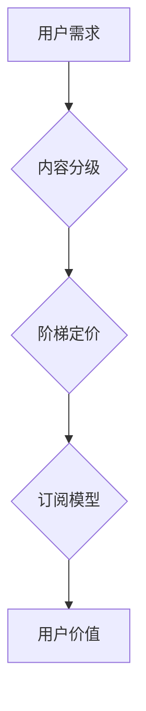

                 

## 程序员如何设计知识付费的阶梯定价策略

> 关键词：知识付费、阶梯定价、程序员、定价策略、用户价值、内容分级、订阅模型

## 1. 背景介绍

知识付费已成为互联网时代的重要商业模式，尤其是在技术领域，程序员对学习新技术、提升技能的需求日益增长。作为程序员，你拥有宝贵的技术知识和经验，可以考虑通过知识付费的方式将这些资源转化为收益。

阶梯定价策略是一种常见的知识付费模式，它根据用户需求和付费意愿，提供不同层次的内容和服务，以满足不同用户的需求，并最大化收入。

## 2. 核心概念与联系

### 2.1 阶梯定价策略

阶梯定价策略是指将产品或服务划分为多个价格层级，每个层级提供不同的价值和功能。用户可以选择适合自己需求和预算的层级付费。

### 2.2 用户价值

用户价值是指用户从产品或服务中获得的价值，它可以是知识、技能、时间、金钱等方面的收益。

### 2.3 内容分级

内容分级是指将知识或技能按照难度、深度、广度等维度进行分类，形成不同的内容层级。

### 2.4 订阅模型

订阅模型是一种持续付费模式，用户每月或每年支付一定的费用，即可获得持续更新的内容和服务。

**Mermaid 流程图**



## 3. 核心算法原理 & 具体操作步骤

### 3.1 算法原理概述

阶梯定价策略的核心算法原理是根据用户价值和内容分级，设计不同的价格层级，以最大化收入和用户满意度。

### 3.2 算法步骤详解

1. **用户调研:** 了解目标用户的需求、付费意愿和学习习惯。
2. **内容规划:** 根据用户调研结果，规划不同层次的内容，并确定每个层级的价值和功能。
3. **价格层级设计:** 根据内容价值和市场竞争，设计不同的价格层级，并确定每个层级的价格。
4. **订阅模型设计:** 选择合适的订阅模型，例如每月订阅、年订阅等。
5. **推广和营销:** 通过线上线下渠道推广知识付费产品，吸引用户订阅。
6. **用户反馈收集:** 收集用户反馈，不断优化内容和定价策略。

### 3.3 算法优缺点

**优点:**

* 满足不同用户需求，提高用户满意度。
* 提高收入，实现可持续发展。
* 增强用户粘性，促进用户复购。

**缺点:**

* 需要投入大量时间和精力进行用户调研和内容规划。
* 需要不断优化内容和定价策略，才能保持竞争力。

### 3.4 算法应用领域

阶梯定价策略广泛应用于知识付费领域，例如：

* 在线课程
* 软件开发教程
* 技术博客
* 咨询服务

## 4. 数学模型和公式 & 详细讲解 & 举例说明

### 4.1 数学模型构建

假设：

* $C_i$ 表示第 $i$ 个价格层级的成本
* $R_i$ 表示第 $i$ 个价格层级的收入
* $U_i$ 表示第 $i$ 个价格层级的用户数量
* $P_i$ 表示第 $i$ 个价格层级的价格

目标函数：

$$
\text{最大化总利润} = \sum_{i=1}^{n} (R_i - C_i)
$$

### 4.2 公式推导过程

利润最大化问题是一个典型的优化问题，可以通过数学模型和算法进行求解。

* 首先，需要确定用户数量与价格之间的关系。可以假设用户数量与价格呈反比关系，即当价格越高，用户数量越少。
* 然后，需要确定收入与用户数量之间的关系。可以假设收入与用户数量呈正比关系，即当用户数量越多，收入越高。

### 4.3 案例分析与讲解

假设一个程序员开发了一个在线课程，分为三个价格层级：

* **基础层级:** 价格为 $100 元，用户数量为 $1000 人$
* **进阶层级:** 价格为 $200 元，用户数量为 $500 人$
* **高级层级:** 价格为 $300 元，用户数量为 $200 人$

每个层级的成本为 $50 元。

根据上述数据，可以计算出每个层级的利润：

* **基础层级:** $1000 * 100 - 50 * 1000 = 50000 元$
* **进阶层级:** $500 * 200 - 50 * 500 = 50000 元$
* **高级层级:** $200 * 300 - 50 * 200 = 50000 元$

因此，三个价格层级的总利润为 $150000 元$。

## 5. 项目实践：代码实例和详细解释说明

### 5.1 开发环境搭建

* 语言: Python
* 库: pandas, matplotlib

### 5.2 源代码详细实现

```python
import pandas as pd
import matplotlib.pyplot as plt

# 数据
data = {
    '价格': [100, 200, 300],
    '用户数量': [1000, 500, 200],
    '成本': [50, 50, 50],
}
df = pd.DataFrame(data)

# 计算收入和利润
df['收入'] = df['价格'] * df['用户数量']
df['利润'] = df['收入'] - df['成本']

# 绘制图表
plt.figure(figsize=(8, 6))
plt.plot(df['价格'], df['利润'], marker='o', linestyle='-', color='blue')
plt.xlabel('价格')
plt.ylabel('利润')
plt.title('阶梯定价策略利润分析')
plt.grid(True)
plt.show()

# 打印利润数据
print(df[['价格', '用户数量', '收入', '成本', '利润']])
```

### 5.3 代码解读与分析

* 代码首先定义了数据，包括价格、用户数量和成本。
* 然后，计算了收入和利润。
* 最后，使用 matplotlib 库绘制了利润与价格之间的关系图，并打印了利润数据。

### 5.4 运行结果展示

运行代码后，会生成一个利润与价格之间的关系图，以及利润数据表格。

## 6. 实际应用场景

阶梯定价策略在知识付费领域有很多实际应用场景，例如：

### 6.1 在线课程

在线课程可以根据难度和内容深度，设计不同的价格层级，例如：

* **基础课程:** 价格较低，适合初学者学习基础知识。
* **进阶课程:** 价格较高，适合有一定基础的学习者学习更深入的内容。
* **高级课程:** 价格最高，适合专业人士学习最新的技术和技能。

### 6.2 软件开发教程

软件开发教程可以根据编程语言、框架和技术难度，设计不同的价格层级，例如：

* **入门教程:** 价格较低，适合初学者学习编程基础知识。
* **进阶教程:** 价格较高，适合有一定基础的学习者学习特定编程语言或框架。
* **高级教程:** 价格最高，适合专业开发人员学习最新的技术和工具。

### 6.3 技术博客

技术博客可以根据内容深度、原创性、实用性等维度，设计不同的订阅层级，例如：

* **免费层级:** 提供部分免费内容，例如技术文章、代码示例等。
* **付费层级:** 提供更多原创内容、深度分析、技术交流等服务。

### 6.4 咨询服务

技术咨询服务可以根据服务内容、服务时长、服务级别等维度，设计不同的价格层级，例如：

* **基础咨询:** 价格较低，提供简单的技术解答和建议。
* **进阶咨询:** 价格较高，提供更深入的技术分析和解决方案。
* **高级咨询:** 价格最高，提供定制化的技术方案和项目支持。

## 7. 工具和资源推荐

### 7.1 学习资源推荐

* **Coursera:** https://www.coursera.org/
* **edX:** https://www.edx.org/
* **Udemy:** https://www.udemy.com/

### 7.2 开发工具推荐

* **Python:** https://www.python.org/
* **Pandas:** https://pandas.pydata.org/
* **Matplotlib:** https://matplotlib.org/

### 7.3 相关论文推荐

* **The Economics of Freemium: A Survey**
* **Pricing Strategies for Online Courses: A Literature Review**

## 8. 总结：未来发展趋势与挑战

### 8.1 研究成果总结

阶梯定价策略是一种有效的知识付费模式，可以满足不同用户需求，提高收入和用户满意度。

### 8.2 未来发展趋势

* **个性化定价:** 基于用户行为和偏好，提供更个性化的价格方案。
* **人工智能驱动:** 利用人工智能技术，自动分析用户需求和市场趋势，优化定价策略。
* **混合定价模式:** 结合阶梯定价、订阅模式、会员制等多种定价模式，打造更灵活的付费体系。

### 8.3 面临的挑战

* **用户付费意愿:** 提高用户付费意愿，需要提供高质量、有价值的内容和服务。
* **市场竞争:** 知识付费市场竞争激烈，需要不断创新和优化产品和服务。
* **技术发展:** 需要不断学习和掌握新的技术，才能更好地应用于知识付费领域。

### 8.4 研究展望

未来，阶梯定价策略将更加智能化、个性化和多元化，为用户提供更丰富的知识付费体验。


## 9. 附录：常见问题与解答

**Q1: 如何确定每个价格层级的价值和功能？**

**A1:** 可以通过用户调研、市场分析和竞争对手研究，确定每个价格层级的价值和功能。

**Q2: 如何选择合适的订阅模型？**

**A2:** 可以根据目标用户、产品内容和市场情况，选择合适的订阅模型，例如每月订阅、年订阅等。

**Q3: 如何优化阶梯定价策略？**

**A3:** 可以通过收集用户反馈、分析数据和跟踪市场趋势，不断优化阶梯定价策略。


作者：禅与计算机程序设计艺术 / Zen and the Art of Computer Programming 
<end_of_turn>

