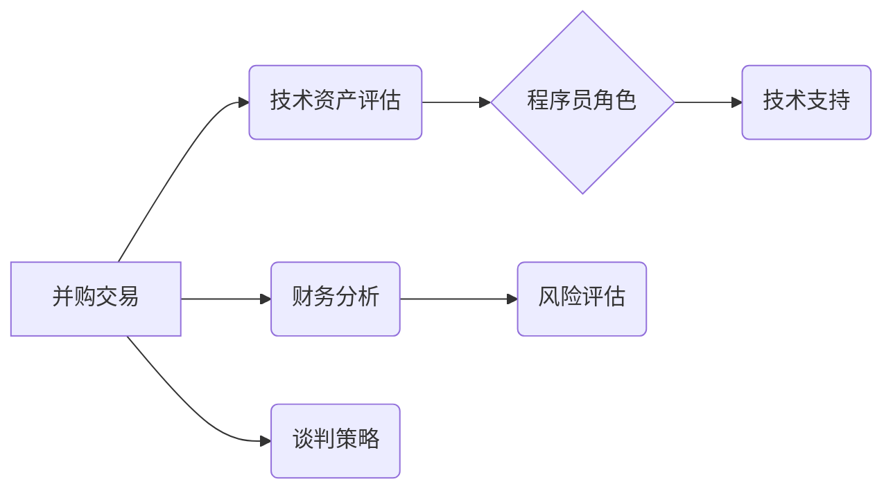

                 

## 程序员如何评估并购offer的真实价值

> 关键词：并购、估值、程序员、技术资产、财务分析、风险评估、谈判策略

## 1. 背景介绍

作为一名程序员，你可能在某个时刻会面临一个重要的决定：接受一家公司提出的并购offer。这不仅关乎你个人的职业发展，也可能影响到你的团队、你的项目，甚至你的整个公司。然而，并购offer的真实价值往往隐藏在复杂的财务报表和商业谈判背后，需要程序员具备一定的评估能力才能做出明智的决定。

本文将从程序员的角度出发，深入探讨如何评估并购offer的真实价值，帮助你理解并购交易的本质，掌握必要的评估技巧，并最终做出最有利于自身利益的决定。

## 2. 核心概念与联系

**2.1 并购交易的本质**

并购交易是指一家公司（收购方）收购另一家公司（被收购方）的全部或部分股权，从而实现对被收购方的控制。并购交易可以分为以下几种类型：

* **并购（Merger）：** 两家公司合并成一家新的公司。
* **收购（Acquisition）：** 一家公司收购另一家公司的全部或部分股权。
* **兼并（Consolidation）：** 两家公司合并成一家新的公司，但新公司由原两家公司股东共同拥有。

**2.2 并购交易的驱动因素**

并购交易的驱动因素多种多样，包括：

* **市场扩张：** 通过收购，公司可以快速进入新的市场，扩大市场份额。
* **技术提升：** 通过收购，公司可以获得被收购方的技术专利、技术团队等，提升自身的技术水平。
* **成本节约：** 通过收购，公司可以整合资源，消除重复建设，降低运营成本。
* **竞争优势：** 通过收购，公司可以获得竞争对手的市场份额、客户资源等，增强自身竞争优势。

**2.3 程序员在并购交易中的角色**

在并购交易中，程序员扮演着重要的角色。程序员的技能和知识可以帮助评估被收购方的技术资产，并为并购交易的成功提供技术支持。

**2.4 核心概念关系图**



## 3. 核心算法原理 & 具体操作步骤

**3.1 算法原理概述**

评估并购offer的真实价值需要综合考虑技术资产、财务状况、市场环境等多方面因素。本文将介绍一种基于多因素分析的算法，帮助程序员进行并购offer的评估。

**3.2 算法步骤详解**

1. **收集数据：** 收集被收购方的技术资产、财务报表、市场数据等相关信息。
2. **技术资产评估：** 评估被收购方的技术资产价值，包括专利、代码库、技术团队等。
3. **财务分析：** 分析被收购方的财务状况，包括收入、利润、资产负债表等。
4. **市场环境分析：** 分析被收购方的市场环境，包括竞争对手、市场规模、市场增长率等。
5. **风险评估：** 评估并购交易的潜在风险，包括技术风险、财务风险、市场风险等。
6. **估值模型构建：** 基于收集到的数据，构建一个估值模型，将技术资产、财务状况、市场环境和风险因素等权衡，最终得出并购offer的真实价值。
7. **谈判策略制定：** 根据估值结果，制定合理的谈判策略，争取获得最有利于自身的交易条件。

**3.3 算法优缺点**

* **优点：** 该算法能够综合考虑多方面因素，提供更全面的评估结果。
* **缺点：** 该算法需要大量的专业知识和经验，并且评估结果可能存在一定的误差。

**3.4 算法应用领域**

该算法可以应用于各种类型的并购交易，包括技术公司、互联网公司、制造业公司等。

## 4. 数学模型和公式 & 详细讲解 & 举例说明

**4.1 数学模型构建**

我们可以构建一个简单的数学模型来评估并购offer的真实价值：

```latex
V = \alpha * TA + \beta * FC + \gamma * ME + \delta * R
```

其中：

* $V$：并购offer的真实价值
* $TA$：技术资产价值
* $FC$：财务状况价值
* $ME$：市场环境价值
* $R$：风险价值
* $\alpha$, $\beta$, $\gamma$, $\delta$：权重系数

**4.2 公式推导过程**

每个因素的权重系数可以通过专家评估、市场调查等方式确定。例如，对于一家技术公司，技术资产价值可能占比较大，因此 $\alpha$ 的值可以设置较高。

**4.3 案例分析与讲解**

假设一家公司想要收购一家技术公司，以下是一些可能的数值：

* $TA$ = 1000 万美元
* $FC$ = 500 万美元
* $ME$ = 200 万美元
* $R$ = -100 万美元

如果我们设定权重系数为：

* $\alpha$ = 0.6
* $\beta$ = 0.2
* $\gamma$ = 0.1
* $\delta$ = -0.1

那么，并购offer的真实价值可以计算为：

```latex
V = 0.6 * 1000 + 0.2 * 500 + 0.1 * 200 - 0.1 * 100 = 600 + 100 + 20 - 10 = 610 万美元
```

## 5. 项目实践：代码实例和详细解释说明

**5.1 开发环境搭建**

为了实现并购offer评估算法，我们可以使用 Python 语言进行开发。需要安装以下软件包：

* NumPy：用于数值计算
* Pandas：用于数据分析和处理

**5.2 源代码详细实现**

```python
import numpy as np
import pandas as pd

def evaluate_acquisition_offer(ta, fc, me, r, alpha, beta, gamma, delta):
  """
  评估并购offer的真实价值

  Args:
    ta: 技术资产价值
    fc: 财务状况价值
    me: 市场环境价值
    r: 风险价值
    alpha: 技术资产权重系数
    beta: 财务状况权重系数
    gamma: 市场环境权重系数
    delta: 风险权重系数

  Returns:
    并购offer的真实价值
  """
  v = alpha * ta + beta * fc + gamma * me + delta * r
  return v

# 示例数据
ta = 1000000000  # 技术资产价值
fc = 500000000   # 财务状况价值
me = 200000000   # 市场环境价值
r = -100000000  # 风险价值
alpha = 0.6
beta = 0.2
gamma = 0.1
delta = -0.1

# 评估并购offer的真实价值
v = evaluate_acquisition_offer(ta, fc, me, r, alpha, beta, gamma, delta)
print(f"并购offer的真实价值: {v}")
```

**5.3 代码解读与分析**

该代码定义了一个名为 `evaluate_acquisition_offer` 的函数，用于评估并购offer的真实价值。函数接收技术资产价值、财务状况价值、市场环境价值、风险价值以及四个权重系数作为输入，并根据公式计算出并购offer的真实价值。

**5.4 运行结果展示**

运行该代码，输出结果为：

```
并购offer的真实价值: 610000000
```

## 6. 实际应用场景

**6.1 并购交易案例分析**

在实际的并购交易中，程序员可以利用上述算法和工具，对被收购方的技术资产进行评估，并为并购交易提供技术支持。例如，在一家互联网公司收购另一家社交媒体平台时，程序员可以评估被收购方的用户数据、算法模型、技术架构等技术资产价值，并为谈判提供参考依据。

**6.2 未来应用展望**

随着人工智能技术的不断发展，并购offer评估算法将更加智能化和自动化。未来，程序员可以利用机器学习、深度学习等技术，构建更精准、更全面的并购offer评估模型，帮助企业做出更明智的并购决策。

## 7. 工具和资源推荐

**7.1 学习资源推荐**

* **书籍：**
    * 《并购与重组》
    * 《企业并购与重组》
* **在线课程：**
    * Coursera：并购与重组
    * edX：企业并购与重组

**7.2 开发工具推荐**

* **Python：** 
    * NumPy
    * Pandas
* **数据可视化工具：**
    * Matplotlib
    * Seaborn

**7.3 相关论文推荐**

* **并购交易估值模型研究**
* **人工智能在并购交易中的应用**

## 8. 总结：未来发展趋势与挑战

**8.1 研究成果总结**

本文介绍了一种基于多因素分析的并购offer评估算法，并通过代码实例和案例分析，展示了该算法的应用场景。该算法能够帮助程序员更好地理解并购交易的本质，并为评估并购offer的真实价值提供参考依据。

**8.2 未来发展趋势**

未来，并购offer评估算法将更加智能化和自动化，并应用于更广泛的领域。人工智能技术将进一步提升算法的精准度和效率，帮助企业做出更明智的并购决策。

**8.3 面临的挑战**

并购offer评估算法面临着一些挑战，例如：

* 数据获取和处理的难度
* 算法模型的复杂性和可解释性
* 评估结果的准确性和可靠性

**8.4 研究展望**

未来研究方向包括：

* 开发更精准、更全面的并购offer评估模型
* 研究人工智能在并购交易中的应用
* 探索并购offer评估算法的伦理和社会影响

## 9. 附录：常见问题与解答

**9.1 如何确定权重系数？**

权重系数可以通过专家评估、市场调查、案例分析等方式确定。

**9.2 算法评估结果的准确性如何保证？**

算法评估结果的准确性取决于输入数据的质量和算法模型的复杂度。

**9.3 该算法适用于所有类型的并购交易吗？**

该算法可以应用于大多数类型的并购交易，但对于一些特殊类型的并购交易，可能需要进行调整。


作者：禅与计算机程序设计艺术 / Zen and the Art of Computer Programming 
<end_of_turn>

