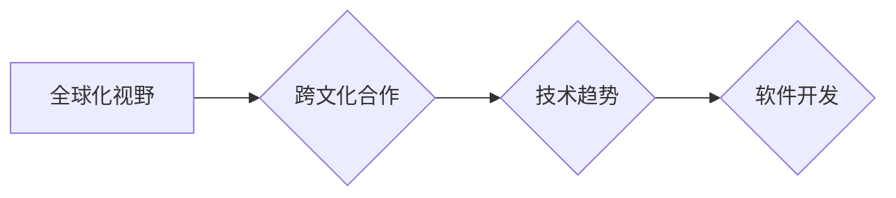

                 

## 程序员的全球化视野：机遇与挑战

> 关键词：全球化、程序员、技术趋势、跨文化合作、职业发展、人工智能、云计算、数据科学

### 1. 背景介绍

在当今全球化加速发展的时代，科技创新无处不在，软件开发作为科技创新的核心驱动力，也面临着前所未有的机遇和挑战。程序员作为科技创新的关键力量，需要具备更广阔的全球化视野，才能在激烈的竞争中脱颖而出，实现个人职业发展和价值实现。

随着互联网技术的普及和发展，全球范围内软件开发的合作模式日益增多，跨国团队、远程协作、开源项目等成为常态。程序员需要具备跨文化沟通能力、团队合作精神和适应性强的学习能力，才能在全球化的软件开发环境中高效协作。

同时，全球化的技术趋势也对程序员提出了更高的要求。人工智能、云计算、大数据等新兴技术正在迅速发展，程序员需要不断学习和掌握新的技术知识，才能跟上时代步伐，保持竞争力。

### 2. 核心概念与联系

**2.1 全球化视野**

全球化视野是指程序员对全球科技发展趋势、文化差异、市场需求等方面有深入的理解和认识，能够将自身的技术能力与全球化发展趋势相结合，为全球用户提供优质的软件产品和服务。

**2.2 跨文化合作**

跨文化合作是指来自不同文化背景的程序员团队协同开发软件项目。程序员需要具备跨文化沟通能力，理解不同文化背景下的人际交往方式和工作习惯，才能有效地进行跨文化合作。

**2.3 技术趋势**

全球化的技术趋势是指全球范围内软件开发领域的技术发展方向和热点。程序员需要关注全球化的技术趋势，不断学习和掌握新的技术知识，才能保持竞争力。

**Mermaid 流程图**

**2.4 软件开发**

软件开发是指利用编程语言和软件开发工具，根据用户需求设计、开发和维护软件系统。程序员需要具备扎实的软件开发基础知识和技能，才能进行高效的软件开发。

### 3. 核心算法原理 & 具体操作步骤

**3.1 算法原理概述**

在全球化软件开发环境中，程序员需要掌握各种算法和数据结构，才能高效地解决问题，提高软件开发效率。例如，排序算法、搜索算法、图算法等都是程序员常用的算法，它们在数据处理、信息检索、网络路由等方面都有广泛的应用。

**3.2 算法步骤详解**

以排序算法为例，常见的排序算法包括冒泡排序、插入排序、快速排序、归并排序等。每个排序算法都有其独特的步骤和原理，程序员需要根据实际情况选择合适的排序算法，才能实现最佳的排序效果。

**3.3 算法优缺点**

不同的排序算法具有不同的优缺点，例如，冒泡排序简单易实现，但效率较低；快速排序效率较高，但对于部分数据可能存在性能瓶颈。程序员需要根据实际情况权衡算法的优缺点，选择最合适的算法。

**3.4 算法应用领域**

算法在软件开发领域有着广泛的应用，例如，搜索引擎的排名算法、电商平台的推荐算法、社交网络的图算法等，都离不开算法的支撑。程序员需要了解不同算法的应用领域，才能更好地运用算法解决实际问题。

### 4. 数学模型和公式 & 详细讲解 & 举例说明

**4.1 数学模型构建**

在软件开发中，数学模型可以用来描述和分析软件系统的行为，例如，使用概率论和统计学来分析软件系统的可靠性，使用图论来分析软件系统的架构，使用代数来分析软件系统的性能。

**4.2 公式推导过程**

例如，在分析软件系统的可靠性时，可以使用马尔可夫链模型来描述软件系统的状态转移，并推导出软件系统的可靠性公式。

**4.3 案例分析与讲解**

例如，在分析软件系统的性能时，可以使用大 O 符号来描述算法的时间复杂度和空间复杂度，并根据算法的时间复杂度和空间复杂度来评估软件系统的性能。

**数学公式**

$$
Reliability(t) = e^{-λt}
$$

其中：

* $Reliability(t)$ 表示软件系统在时间 $t$ 的可靠性
* $λ$ 表示软件系统的故障率

**4.4 举例说明**

例如，如果软件系统的故障率为 $0.1$，则在 $1$ 小时内软件系统的可靠性为：

$$
Reliability(1) = e^{-0.1 * 1} = 0.9048
$$

这意味着在 $1$ 小时内，软件系统发生故障的概率为 $9.52\%$。

### 5. 项目实践：代码实例和详细解释说明

**5.1 开发环境搭建**

程序员需要根据项目需求选择合适的开发环境，例如，使用 Linux 操作系统、Java 开发环境、Python 开发环境等。

**5.2 源代码详细实现**

程序员需要根据项目需求编写源代码，并进行代码测试和调试。

**5.3 代码解读与分析**

程序员需要对源代码进行解读和分析，理解代码的功能和逻辑，并进行代码优化和改进。

**5.4 运行结果展示**

程序员需要运行代码，并观察运行结果，确保代码能够正常运行并满足项目需求。

### 6. 实际应用场景

**6.1 跨国团队合作**

在全球化的软件开发环境中，跨国团队合作成为常态。程序员需要具备跨文化沟通能力，才能有效地与来自不同文化背景的团队成员合作。

**6.2 开源项目贡献**

程序员可以参与开源项目，贡献自己的代码和技术，与全球开发者共同推动软件开发的进步。

**6.3 全球化市场拓展**

程序员可以将自己的软件产品或服务拓展到全球市场，为全球用户提供优质的软件解决方案。

**6.4 未来应用展望**

随着人工智能、云计算、大数据等新兴技术的快速发展，程序员将面临更多新的应用场景和挑战，例如，开发智能机器人、构建云计算平台、分析大数据等。

### 7. 工具和资源推荐

**7.1 学习资源推荐**

* 在线学习平台：Coursera、edX、Udemy等
* 技术博客和论坛：Stack Overflow、GitHub、Medium等
* 书籍和电子书：

**7.2 开发工具推荐**

* 编程语言：Java、Python、C++、JavaScript等
* 软件开发工具：Eclipse、IntelliJ IDEA、Visual Studio Code等
* 版本控制系统：Git、GitHub等

**7.3 相关论文推荐**

* ACM Digital Library
* IEEE Xplore

### 8. 总结：未来发展趋势与挑战

**8.1 研究成果总结**

全球化视野对于程序员来说至关重要，它能够帮助程序员更好地理解全球软件开发环境，掌握全球化技术趋势，并提升自身的职业竞争力。

**8.2 未来发展趋势**

未来，全球化软件开发将更加深入，跨文化合作将更加频繁，人工智能、云计算、大数据等新兴技术将更加普及，程序员需要不断学习和适应新的技术发展趋势。

**8.3 面临的挑战**

程序员面临着全球化竞争加剧、技术更新迭代速度加快、跨文化沟通障碍等挑战。

**8.4 研究展望**

未来研究方向包括：

* 探索更有效的跨文化合作模式
* 研究人工智能、云计算、大数据等新兴技术在软件开发领域的应用
* 培养程序员的全球化视野和跨文化沟通能力

### 9. 附录：常见问题与解答

**9.1 如何提升跨文化沟通能力？**

* 学习不同文化背景下的语言和习俗
* 参加跨文化交流活动
* 阅读相关书籍和文章

**9.2 如何关注全球化技术趋势？**

* 阅读科技新闻和博客
* 参加技术会议和研讨会
* 关注行业领袖和专家

**9.3 如何保持职业竞争力？**

* 不断学习和掌握新的技术知识
* 提升自身的软件开发技能
* 积极参与开源项目和社区活动

作者：禅与计算机程序设计艺术 / Zen and the Art of Computer Programming 
<end_of_turn>

