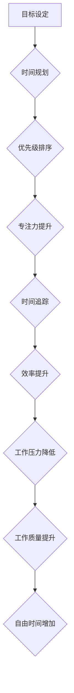

                 

## 程序员的时间管理：效率即财富

> 关键词：时间管理、程序员效率、工作流程、优先级、专注力、番茄工作法、时间追踪、自动化

### 1. 背景介绍

在当今科技飞速发展的时代，程序员作为构建数字世界的关键力量，面临着日益激烈的竞争和不断增长的工作压力。高效地管理时间，提升工作效率，已成为程序员职业生涯成功的关键因素。然而，许多程序员往往陷入时间管理的困境，难以平衡工作和生活，导致工作效率低下、压力过大。

### 2. 核心概念与联系

**2.1 时间管理的核心概念**

时间管理的核心概念在于有效地规划、分配和利用时间，以实现个人和职业目标。它涉及到以下几个关键方面：

* **目标设定:** 明确自己的短期和长期目标，为时间分配提供方向。
* **时间规划:** 制定详细的时间表，安排工作任务和个人活动。
* **优先级排序:** 根据任务重要性和紧急程度，确定优先执行的顺序。
* **专注力提升:** 避免分心，集中精力完成当前任务。
* **时间追踪:** 记录时间使用情况，分析时间浪费，优化时间分配。

**2.2 程序员时间管理的特殊性**

程序员的时间管理与其他职业存在一些特殊性：

* **任务复杂性:** 程序员的工作通常涉及复杂的技术问题，需要长时间的专注和思考。
* **工作节奏波动:** 程序员的工作节奏往往不固定，需要根据项目进度和需求进行调整。
* **学习需求:** 程序员需要不断学习新技术和知识，这需要投入大量的时间和精力。

**2.3 时间管理与程序员效率的联系**

高效的时间管理是提升程序员效率的关键。通过合理规划和利用时间，程序员可以：

* **提高工作产出:** 在有限的时间内完成更多工作任务。
* **降低工作压力:** 避免时间紧迫带来的焦虑和压力。
* **提升工作质量:** 集中精力完成任务，提高工作质量和准确性。
* **获得更多自由时间:** 腾出更多时间用于学习、休息和个人爱好。

**2.4 Mermaid 流程图**



### 3. 核心算法原理 & 具体操作步骤

**3.1 算法原理概述**

时间管理算法的核心在于高效地分配和利用时间资源。常见的算法包括：

* **番茄工作法:** 将工作时间划分为25分钟的“番茄”和5分钟的休息时间，循环进行，提高专注力。
* **艾森豪威尔矩阵:** 根据任务重要性和紧急程度，将任务分类，优先处理重要且紧急的任务。
* **时间盒:** 将时间划分为固定长度的“时间盒”，用于完成特定任务，提高时间利用率。

**3.2 算法步骤详解**

**3.2.1 番茄工作法**

1. 选择一个需要专注完成的任务。
2. 设置一个番茄计时器，工作25分钟。
3. 工作结束后，休息5分钟。
4. 重复步骤2和3，完成4个番茄后，休息20-30分钟。

**3.2.2 艾森豪威尔矩阵**

1. 列出所有待办事项。
2. 将任务按照重要性和紧急程度分类：
    * **重要且紧急:** 立即处理。
    * **重要但不紧急:** 安排时间处理。
    * **紧急但不重要:** 委托他人处理。
    * **不重要也不紧急:** 删除或忽略。

**3.2.3 时间盒**

1. 将一天的时间划分为多个时间盒，每个时间盒长度可根据个人情况设定。
2. 为每个时间盒分配一个特定的任务。
3. 在时间盒内专注完成任务，避免分心。

**3.3 算法优缺点**

**3.3.1 番茄工作法**

* **优点:** 提高专注力，避免疲劳，提高工作效率。
* **缺点:** 不适合所有类型的任务，需要一定的自律性。

**3.3.2 艾森豪威尔矩阵**

* **优点:** 帮助优先处理重要任务，提高时间利用率。
* **缺点:** 需要花费时间进行分类，可能难以准确判断任务重要性和紧急程度。

**3.3.3 时间盒**

* **优点:** 提高时间利用率，避免任务拖延，提高工作计划的可执行性。
* **缺点:** 需要提前规划，可能难以应对突发事件。

**3.4 算法应用领域**

以上算法适用于各种程序员工作场景，例如：

* **代码编写:** 使用番茄工作法提高专注力，避免代码错误。
* **项目管理:** 使用艾森豪威尔矩阵优先处理重要任务，确保项目按时完成。
* **学习新技术:** 使用时间盒安排学习时间，提高学习效率。

### 4. 数学模型和公式 & 详细讲解 & 举例说明

**4.1 数学模型构建**

时间管理可以抽象为一个资源分配模型，其中时间是有限的资源，任务是需要分配资源的任务。我们可以使用以下数学模型来描述时间管理问题：

* **时间资源:** T
* **任务集合:** S = {s1, s2, ..., sn}
* **任务时间需求:** t(si)
* **任务优先级:** p(si)

**4.2 公式推导过程**

目标是找到一个时间分配方案，使得所有任务都能完成，并最大化时间利用率。我们可以使用以下公式来衡量时间利用率：

$$
Utilization = \frac{\sum_{i=1}^{n} t(si)}{\sum_{i=1}^{n} p(si)}
$$

其中：

* **Utilization:** 时间利用率
* **∑t(si):** 所有任务的时间需求之和
* **∑p(si):** 所有任务的优先级之和

**4.3 案例分析与讲解**

假设程序员有 8 小时的时间资源，需要完成以下三个任务：

* 任务1: 写代码，时间需求为 3 小时，优先级为 3。
* 任务2: 测试代码，时间需求为 2 小时，优先级为 2。
* 任务3: 学习新技术，时间需求为 1 小时，优先级为 1。

根据公式，我们可以计算时间利用率：

$$
Utilization = \frac{3 + 2 + 1}{3 + 2 + 1} = 1
$$

这意味着程序员可以有效地利用所有时间资源，完成所有任务。

### 5. 项目实践：代码实例和详细解释说明

**5.1 开发环境搭建**

* 操作系统: Windows/macOS/Linux
* 编程语言: Python
* 工具: 

**5.2 源代码详细实现**

```python
import time

def pomodoro_timer(work_time, break_time):
    """
    番茄工作法计时器
    """
    for _ in range(4):
        print(f"开始工作，时间: {work_time} 分钟")
        time.sleep(work_time * 60)
        print("休息时间，时间: {break_time} 分钟")
        time.sleep(break_time * 60)

if __name__ == "__main__":
    pomodoro_timer(25, 5)
```

**5.3 代码解读与分析**

* 该代码实现了一个简单的番茄工作法计时器。
* `pomodoro_timer()` 函数接受工作时间和休息时间作为参数。
* 函数内部使用循环，每循环一次代表一个番茄工作周期。
* `time.sleep()` 函数用于暂停程序执行，模拟工作和休息时间。

**5.4 运行结果展示**

运行该代码后，程序会打印出工作和休息的时间提示，并暂停执行相应的时长。

### 6. 实际应用场景

**6.1 代码编写**

程序员可以使用番茄工作法来提高代码编写效率，避免长时间专注导致疲劳和错误。

**6.2 项目管理**

程序员可以使用艾森豪威尔矩阵来优先处理项目任务，确保重要任务得到及时完成。

**6.3 学习新技术**

程序员可以使用时间盒来安排学习新技术的时间，提高学习效率和专注力。

**6.4 未来应用展望**

随着人工智能技术的不断发展，时间管理工具将更加智能化和个性化。未来，程序员可以利用人工智能算法，自动分析工作习惯和时间使用情况，提供更精准的建议和帮助。

### 7. 工具和资源推荐

**7.1 学习资源推荐**

* **书籍:**

    * 《Getting Things Done: The Art of Stress-Free Productivity》
    * 《Deep Work: Rules for Focused Success in a Distracted World》

* **网站:**

    * **番茄工作法:** https://www.tomato-timer.com/
    * **艾森豪威尔矩阵:** https://www.mindtools.com/pages/article/newHTE_90.htm

**7.2 开发工具推荐**

* **时间追踪工具:** Toggl Track, RescueTime
* **项目管理工具:** Trello, Asana
* **番茄工作法应用:** Focus To-Do, Forest

**7.3 相关论文推荐**

* **时间管理算法研究:** https://www.researchgate.net/search.Search.html?type=publication&query=time%20management%20algorithm

### 8. 总结：未来发展趋势与挑战

**8.1 研究成果总结**

时间管理研究取得了显著成果，提出了多种时间管理算法和工具，帮助程序员提高工作效率和生活质量。

**8.2 未来发展趋势**

未来时间管理研究将更加注重个性化、智能化和自动化。

* **个性化:** 根据程序员的个人工作习惯和需求，定制个性化的时间管理方案。
* **智能化:** 利用人工智能算法，自动分析程序员的工作习惯和时间使用情况，提供更精准的建议和帮助。
* **自动化:** 自动化时间管理任务，例如自动安排会议、提醒工作截止日期等。

**8.3 面临的挑战**

* **数据隐私:** 时间管理工具需要收集程序员的工作数据，如何保护数据隐私是一个重要挑战。
* **算法准确性:** 人工智能算法需要大量数据进行训练，才能提供准确的建议。
* **用户接受度:** 程序员需要接受新的时间管理工具和方法，这需要一定的推广和教育工作。

**8.4 研究展望**

未来时间管理研究将继续探索新的算法和技术，为程序员提供更有效的工具和方法，帮助他们更好地管理时间，提高工作效率和生活质量。

### 9. 附录：常见问题与解答

**9.1 如何选择合适的番茄工作法时间？**

番茄工作法的最佳时间取决于个人工作习惯和任务类型。一般来说，25 分钟的工作时间和 5 分钟的休息时间是一个不错的起点。

**9.2 如何避免艾森豪威尔矩阵的误判？**

在使用艾森豪威尔矩阵时，需要谨慎判断任务的优先级和紧急程度。可以参考以下原则：

* **重要性:** 任务对个人目标和职业发展的影响程度。
* **紧急程度:** 任务需要在短期内完成的程度。

**9.3 如何克服时间管理的困难？**

* **设定明确的目标:** 明确自己的工作目标和时间分配计划。
* **优先处理重要任务:** 使用艾森豪威尔矩阵或其他方法，优先处理重要任务。
* **避免分心:** 创造一个专注的工作环境，避免外界干扰。
* **定期回顾和调整:** 定期回顾时间管理计划，根据实际情况进行调整。


作者：禅与计算机程序设计艺术 / Zen and the Art of Computer Programming 
<end_of_turn>

