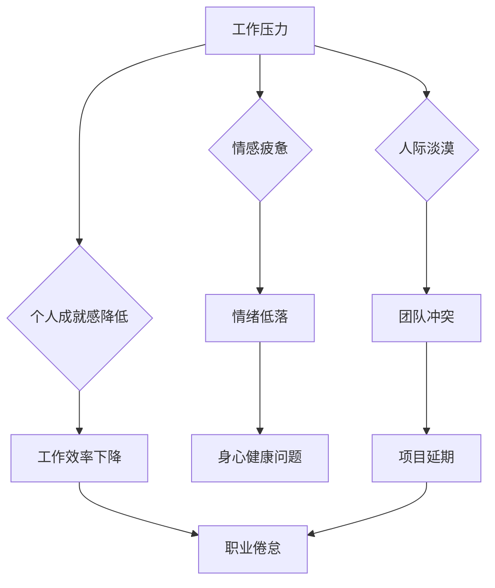

                 

## 程序员的职业倦怠：预防与应对

> 关键词：程序员倦怠、职业倦怠、心理健康、工作压力、技术行业、预防措施、应对策略

### 1. 背景介绍

在当今科技飞速发展的时代，程序员作为数字世界的构建者，肩负着重大的责任和使命。然而，这份充满挑战和机遇的职业也伴随着巨大的压力和竞争。长时间面对屏幕、紧迫的项目deadline、不断更新的技术迭代，以及复杂的团队协作，都可能导致程序员出现职业倦怠。

职业倦怠是一种持续的、耗尽身心状态，通常表现为对工作的消极情绪、缺乏动力、效率下降、甚至对工作失去兴趣。对于程序员来说，职业倦怠可能导致代码质量下降、项目进度延迟、团队合作问题，最终影响个人职业发展和企业效益。

根据调查数据，程序员的职业倦怠率远高于其他职业群体。这表明，程序员群体面临着独特的职业压力和挑战，需要采取有效的预防和应对措施。

### 2. 核心概念与联系

#### 2.1 职业倦怠的构成要素

职业倦怠是一个复杂的心理状态，通常由以下三个主要要素构成：

* **情感疲惫 (Emotional Exhaustion):**  对工作的过度消耗，感到情感空虚、疲惫不堪，缺乏精力投入工作。
* ** depersonalization (人际淡漠):** 对工作和同事产生冷漠、麻木、甚至负面情绪，难以建立良好的工作关系。
* **个人成就感降低 (Reduced Personal Accomplishment):** 对自身工作能力和价值感到怀疑，缺乏成就感和满足感。

#### 2.2 职业倦怠的形成机制

程序员职业倦怠的形成是一个多因素综合作用的结果，主要包括：

* **工作压力:**  紧迫的项目deadline、高强度的工作量、不断变化的技术环境，都可能导致程序员承受巨大的压力。
* **工作环境:**  缺乏工作与生活的平衡、不合理的薪酬待遇、不健康的团队文化，都可能加剧程序员的职业倦怠。
* **个人因素:**  性格特点、心理素质、生活压力等个人因素也会影响程序员对工作的态度和应对能力。

#### 2.3 职业倦怠的危害

职业倦怠对程序员个人和企业都具有严重危害：

* **个人层面:**  导致情绪低落、焦虑、抑郁、睡眠障碍、身体健康问题等。
* **企业层面:**  降低员工工作效率、增加员工流失率、影响项目进度和企业效益。

**Mermaid 流程图**



### 3. 核心算法原理 & 具体操作步骤

#### 3.1 算法原理概述

预防和应对职业倦怠需要从多个方面入手，结合个人努力和企业支持，才能有效缓解问题。

#### 3.2 算法步骤详解

**3.2.1 个人层面:**

1. **自我认知:**  了解自身的工作压力来源、性格特点、心理承受能力，以及职业倦怠的早期征兆。
2. **时间管理:**  合理安排工作时间，避免过度加班，保证充足的休息时间。
3. **工作与生活平衡:**  培养兴趣爱好，保持社交活动，将工作与生活分开，避免过度投入工作。
4. **情绪管理:**  学习放松技巧，如冥想、瑜伽、深呼吸等，有效缓解压力和焦虑情绪。
5. **寻求支持:**  与家人、朋友、同事或心理咨询师沟通，寻求情感支持和帮助。

**3.2.2 企业层面:**

1. **建立健康的工作文化:**  倡导工作与生活的平衡，尊重员工个人时间，营造积极向上的团队氛围。
2. **优化工作流程:**  合理分配工作任务，避免过度加班，提供必要的技术支持和培训。
3. **提供心理健康服务:**  为员工提供心理咨询、压力管理培训等服务，帮助员工应对工作压力和情绪问题。
4. **关注员工福利:**  提供合理的薪酬待遇、带薪休假、医疗保险等福利，保障员工的物质和精神需求。
5. **定期评估员工心理健康:**  通过问卷调查、访谈等方式，了解员工的心理状态，及时发现和解决问题。

#### 3.3 算法优缺点

**优点:**

* **针对性强:**  针对程序员职业特点，提出了针对性的预防和应对措施。
* **可操作性强:**  提供了具体的步骤和建议，方便程序员和企业实施。
* **综合性强:**  从个人和企业两个层面入手，多角度解决问题。

**缺点:**

* **个性化程度不够:**  每个程序员的状况不同，需要根据自身情况进行调整。
* **需要长期坚持:**  预防和应对职业倦怠是一个长期的过程，需要持续的努力和关注。

#### 3.4 算法应用领域

该算法适用于所有程序员群体，包括软件开发工程师、网站开发人员、游戏开发人员等。

### 4. 数学模型和公式 & 详细讲解 & 举例说明

#### 4.1 数学模型构建

职业倦怠的形成是一个复杂的过程，可以用数学模型来描述。例如，我们可以用以下公式来表示程序员职业倦怠的程度：

$$
倦怠程度 = f(工作压力, 工作环境, 个人因素)
$$

其中：

* 倦怠程度：表示程序员职业倦怠的程度，可以用数值或等级来表示。
* 工作压力：指程序员所承受的工作压力，可以用工作量、deadline压力、技术难度等指标来衡量。
* 工作环境：指程序员的工作环境，可以用团队氛围、工作节奏、薪酬待遇等指标来衡量。
* 个人因素：指程序员个人的性格特点、心理素质、生活压力等因素。

#### 4.2 公式推导过程

该公式的推导过程需要考虑多个因素之间的相互作用关系。例如，工作压力会直接影响程序员的情绪状态，而工作环境会影响程序员的工作效率和心理健康。个人因素也会影响程序员对工作压力的承受能力和应对方式。

#### 4.3 案例分析与讲解

假设有两个程序员，A和B，他们的工作压力、工作环境和个人因素都不同。

* A的压力较大，工作环境较差，个人因素也较为脆弱，因此他的倦怠程度较高。
* B的压力较小，工作环境较好，个人因素较为坚韧，因此他的倦怠程度较低。

通过分析他们的具体情况，我们可以看到，职业倦怠的程度是由多个因素综合作用的结果，而不是单一因素决定的。

### 5. 项目实践：代码实例和详细解释说明

#### 5.1 开发环境搭建

为了更好地理解和应用职业倦怠预防和应对的算法，我们可以开发一个简单的项目，例如一个程序员心理健康评估工具。

开发环境可以根据个人需求选择，例如使用Python语言和Flask框架构建一个Web应用程序。

#### 5.2 源代码详细实现

以下是一个简单的Python代码示例，用于评估程序员的职业倦怠程度：

```python
def assess_burnout(work_pressure, work_environment, personal_factors):
  """
  评估程序员的职业倦怠程度。

  Args:
    work_pressure: 工作压力得分 (1-5 分)
    work_environment: 工作环境得分 (1-5 分)
    personal_factors: 个人因素得分 (1-5 分)

  Returns:
    倦怠程度等级 (1-5 级)
  """
  burnout_score = (work_pressure + work_environment + personal_factors) / 3
  if burnout_score >= 4:
    return "严重倦怠"
  elif burnout_score >= 3:
    return "中度倦怠"
  elif burnout_score >= 2:
    return "轻度倦怠"
  else:
    return "无倦怠"

# 示例用法
work_pressure = 4
work_environment = 3
personal_factors = 2
burnout_level = assess_burnout(work_pressure, work_environment, personal_factors)
print(f"您的职业倦怠程度为: {burnout_level}")
```

#### 5.3 代码解读与分析

该代码定义了一个函数`assess_burnout`，用于根据工作压力、工作环境和个人因素三个指标，评估程序员的职业倦怠程度。

函数首先计算三个指标的平均值，然后根据平均值的大小，将程序员的倦怠程度分为四个等级：严重倦怠、中度倦怠、轻度倦怠和无倦怠。

#### 5.4 运行结果展示

运行该代码，可以得到程序员的职业倦怠程度等级。例如，如果工作压力为4，工作环境为3，个人因素为2，则程序员的倦怠程度为“轻度倦怠”。

### 6. 实际应用场景

#### 6.1 职业倦怠风险评估

该算法可以用于评估程序员的职业倦怠风险，帮助企业识别高风险员工，及时采取预防措施。

#### 6.2 针对性干预措施

根据程序员的职业倦怠程度，可以制定针对性的干预措施，例如提供心理咨询、压力管理培训、工作时间调整等。

#### 6.3 工作环境优化

通过分析程序员的工作环境因素，可以帮助企业优化工作环境，减少工作压力，提高员工的工作满意度和幸福感。

#### 6.4 未来应用展望

随着人工智能技术的不断发展，该算法可以进一步完善，例如结合大数据分析、机器学习等技术，实现更精准的职业倦怠预测和干预。

### 7. 工具和资源推荐

#### 7.1 学习资源推荐

* **书籍:** 《程序员的自我救赎》、《高效能人士的七个习惯》
* **网站:**  https://www.psychologytoday.com/us/blog/the-mysteries-love/201409/burnout-and-the-workplace
* **课程:**  Coursera 上的“心理健康”课程

#### 7.2 开发工具推荐

* **Python:**  用于开发程序员心理健康评估工具
* **Flask:**  用于构建Web应用程序
* **Jupyter Notebook:**  用于数据分析和可视化

#### 7.3 相关论文推荐

* **Burnout and the Workplace:** https://www.ncbi.nlm.nih.gov/pmc/articles/PMC4093527/
* **Preventing Burnout in Software Developers:** https://dl.acm.org/doi/10.1145/3313276.3316309

### 8. 总结：未来发展趋势与挑战

#### 8.1 研究成果总结

本文介绍了程序员职业倦怠的构成要素、形成机制、危害以及预防和应对的算法。该算法结合了个人努力和企业支持，提供了针对性的解决方案。

#### 8.2 未来发展趋势

随着人工智能技术的不断发展，程序员职业倦怠的预防和应对将更加智能化和个性化。例如，可以利用机器学习算法，分析程序员的工作行为、情绪状态等数据，预测其职业倦怠风险，并提供个性化的干预措施。

#### 8.3 面临的挑战

* **数据隐私保护:**  收集和分析程序员个人数据需要考虑隐私保护问题。
* **算法准确性:**  需要不断完善算法模型，提高其预测准确率和可靠性。
* **社会认知:**  需要提高社会对程序员职业倦怠问题的认知，营造更加关注心理健康的工作环境。

#### 8.4 研究展望

未来研究将重点关注以下几个方面：

* **开发更精准的职业倦怠预测模型:**  利用大数据分析、机器学习等技术，提高预测准确率和可靠性。
* **探索更有效的干预措施:**  根据程序员的个性化需求，开发更有效的干预措施，例如个性化心理咨询、压力管理培训等。
* **构建更加关注心理健康的企业文化:**  鼓励企业重视员工心理健康，营造更加积极向上的工作环境。

### 9. 附录：常见问题与解答

**Q1: 如何判断自己是否患有职业倦怠？**

**A1:**  如果你经常感到疲惫、情绪低落、对工作失去兴趣、难以集中注意力，甚至出现身体不适，那么你可能患有职业倦怠。建议及时寻求专业人士的帮助。

**Q2: 如何预防职业倦怠？**

**A2:**  可以通过以下方法预防职业倦怠：

* **合理安排工作时间:**  避免过度加班，保证充足的休息时间。
* **保持工作与生活平衡:**  培养兴趣爱好，保持社交活动，将工作与生活分开。
* **学会放松技巧:**  学习冥想、瑜伽、深呼吸等放松技巧，有效缓解压力和焦虑情绪。
* **寻求支持:**  与家人、朋友、同事或心理咨询师沟通，寻求情感支持和帮助。

**Q3: 如何应对职业倦怠？**

**A3:**  如果你已经患有职业倦怠，可以通过以下方法应对：

* **调整工作方式:**  尝试改变工作方式，例如分阶段完成任务、寻求同事合作等。
* **寻求心理咨询:**  专业的心理咨询师可以帮助你了解职业倦怠的原因，并提供有效的应对策略。
* **调整生活方式:**  保证充足的睡眠、健康饮食、适度运动，改善生活质量。
* **寻求职业发展机会:**  尝试学习新的技能、寻找新的工作机会，提升职业发展动力。


作者：禅与计算机程序设计艺术 / Zen and the Art of Computer Programming 
<end_of_turn>

