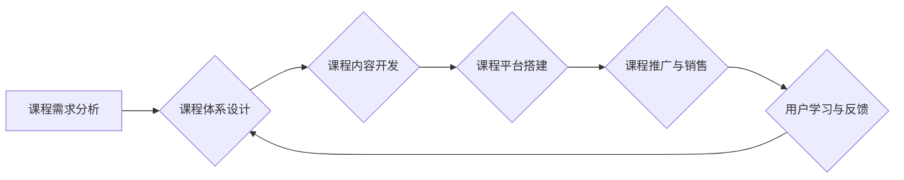

                 

## 程序员知识付费：打造套餐式课程

> 关键词：知识付费、程序员、课程体系、套餐式、在线教育、技术技能

### 1. 背景介绍

近年来，随着互联网技术的发展和普及，在线教育平台蓬勃发展，知识付费市场也呈现出爆发式增长。程序员作为高需求、高收入的职业群体，其技术技能的学习和提升一直备受关注。因此，针对程序员的知识付费市场也逐渐兴起，涌现出众多在线课程平台和课程产品。

然而，现有的程序员知识付费课程往往存在以下问题：

* **碎片化：** 课程内容分散，缺乏系统性，难以形成完整的知识体系。
* **单一化：** 课程侧重于单一技术或技能，难以满足程序员多方面学习需求。
* **缺乏针对性：** 课程缺乏针对不同编程语言、开发框架和职业阶段的定制化设计。
* **学习体验差：** 课程缺乏互动性、实践性，难以激发学习兴趣和提升学习效果。

为了解决上述问题，本文将探讨如何打造高效的程序员知识付费套餐式课程，帮助程序员系统地学习和提升技术技能，实现职业发展目标。

### 2. 核心概念与联系

**套餐式课程**是指将多个相关课程整合在一起，形成一个完整的学习体系，满足用户多方面的学习需求。

**程序员知识付费**是指程序员通过付费的方式获取技术技能学习资源，包括在线课程、书籍、视频教程等。

**课程体系**是指将课程内容按照一定的逻辑结构和层次进行组织和排列，形成一个完整的知识体系。

**Mermaid 流程图**



### 3. 核心算法原理 & 具体操作步骤

**3.1 算法原理概述**

套餐式课程的打造需要遵循以下核心算法原理：

* **需求导向：** 课程体系的设计和内容开发应以用户需求为导向，针对不同编程语言、开发框架和职业阶段的程序员提供定制化的学习方案。
* **知识结构化：** 课程内容应按照一定的逻辑结构和层次进行组织和排列，形成一个完整的知识体系，帮助用户系统地学习和理解技术知识。
* **实践性强：** 课程应注重实践操作，通过案例分析、项目实战等方式，帮助用户将理论知识应用到实际开发中。
* **互动性高：** 课程应鼓励用户互动，通过论坛、直播、答疑等方式，促进用户之间的交流和学习。

**3.2 算法步骤详解**

打造套餐式课程的具体操作步骤如下：

1. **需求分析：** 通过市场调研、用户问卷调查等方式，了解程序员的学习需求、痛点和期望。
2. **课程体系设计：** 根据需求分析结果，设计一个完整的课程体系，包括课程主题、课程层次、课程内容等。
3. **课程内容开发：** 根据课程体系，开发高质量的课程内容，包括视频讲解、文字教程、代码示例等。
4. **课程平台搭建：** 选择合适的在线教育平台，搭建课程发布和管理系统。
5. **课程推广与销售：** 通过线上线下推广渠道，推广课程产品，吸引用户购买。
6. **用户学习与反馈：** 提供完善的用户学习体验，收集用户反馈，不断优化课程内容和教学方式。

**3.3 算法优缺点**

**优点：**

* **系统性强：** 套餐式课程能够提供一个完整的学习体系，帮助用户系统地学习和掌握技术知识。
* **针对性强：** 课程可以针对不同编程语言、开发框架和职业阶段的程序员提供定制化的学习方案。
* **性价比高：** 相比购买单门课程，套餐式课程能够以更优惠的价格获得更丰富的学习资源。

**缺点：**

* **开发成本高：** 套餐式课程的开发成本相对较高，需要投入大量的时间和人力资源。
* **更新迭代难度大：** 随着技术的不断发展，课程内容需要不断更新迭代，这对于套餐式课程的维护和更新带来了挑战。

**3.4 算法应用领域**

套餐式课程的应用领域非常广泛，包括：

* **编程语言学习：** 提供不同编程语言的学习套餐，例如Python、Java、C++等。
* **开发框架学习：** 提供不同开发框架的学习套餐，例如Spring、React、Vue.js等。
* **职业技能提升：** 提供针对不同职业阶段的程序员的学习套餐，例如初级程序员、中级程序员、高级程序员等。

### 4. 数学模型和公式 & 详细讲解 & 举例说明

**4.1 数学模型构建**

套餐式课程的构建可以抽象为一个数学模型，其中：

* **课程数量 (N)**：套餐中包含的课程数量。
* **课程时长 (T)**：每个课程的时长。
* **学习进度 (P)**：用户学习的课程进度。
* **知识掌握度 (K)**：用户掌握的知识量。

**4.2 公式推导过程**

我们可以建立以下公式来描述套餐式课程的学习效果：

$$K = f(N, T, P)$$

其中，f()为一个复杂的函数，需要考虑课程内容的难度、学习方式、用户学习能力等因素。

**4.3 案例分析与讲解**

假设一个程序员学习一个包含5门课程的Python开发套餐，每门课程时长为20小时，学习进度为80%。根据上述公式，我们可以推算出该程序员掌握的Python开发知识量。

### 5. 项目实践：代码实例和详细解释说明

**5.1 开发环境搭建**

* 安装Python环境
* 安装必要的开发工具，例如IDE、版本控制系统等

**5.2 源代码详细实现**

```python
# 课程内容示例代码
def hello_world():
  print("Hello, World!")

hello_world()
```

**5.3 代码解读与分析**

这段代码定义了一个名为`hello_world`的函数，该函数打印出“Hello, World!”的字符串。

**5.4 运行结果展示**

运行这段代码后，会在控制台输出“Hello, World!”

### 6. 实际应用场景

套餐式课程可以应用于以下场景：

* **企业内部培训：** 企业可以根据员工的职业发展需求，定制开发套餐式课程，提升员工的技术技能和工作效率。
* **个人职业发展：** 程序员可以通过购买套餐式课程，系统地学习和掌握新的技术知识，提升职业竞争力。
* **教育机构教学：** 教育机构可以利用套餐式课程，构建完整的编程教学体系，提高教学质量和效率。

**6.4 未来应用展望**

未来，套餐式课程将更加个性化、智能化和互动化。

* **个性化定制：** 课程内容将根据用户的学习进度、学习风格和职业目标进行个性化定制。
* **智能化推荐：** 课程平台将利用人工智能技术，根据用户的学习历史和兴趣爱好，智能推荐合适的课程套餐。
* **增强现实/虚拟现实技术：** 课程将利用增强现实/虚拟现实技术，提供更加沉浸式的学习体验。

### 7. 工具和资源推荐

**7.1 学习资源推荐**

* **在线学习平台：** Udemy、Coursera、edX等
* **编程社区：** Stack Overflow、GitHub等
* **技术博客：** Hacker News、Medium等

**7.2 开发工具推荐**

* **IDE：** PyCharm、VS Code、Eclipse等
* **版本控制系统：** Git、GitHub等
* **云平台：** AWS、Azure、GCP等

**7.3 相关论文推荐**

* **The Effectiveness of Online Learning:** A Meta-Analysis and Review of the Research
* **Personalized Learning: A Review of the Literature**
* **The Future of Education: Artificial Intelligence and Machine Learning**

### 8. 总结：未来发展趋势与挑战

**8.1 研究成果总结**

本文探讨了程序员知识付费套餐式课程的打造方法，包括需求分析、课程体系设计、课程内容开发、课程平台搭建、课程推广与销售、用户学习与反馈等环节。

**8.2 未来发展趋势**

未来，程序员知识付费套餐式课程将更加个性化、智能化和互动化，并与人工智能、增强现实/虚拟现实等新技术深度融合。

**8.3 面临的挑战**

* **内容更新迭代难度大**
* **用户学习体验提升**
* **知识付费市场竞争激烈**

**8.4 研究展望**

未来研究将重点关注以下方面：

* **开发更智能化的课程推荐算法**
* **探索更有效的互动学习模式**
* **研究知识付费市场的发展趋势和用户需求**

### 9. 附录：常见问题与解答

**常见问题：**

* **如何选择合适的套餐式课程？**

**解答：**

选择套餐式课程时，应根据自己的学习目标、编程语言和开发框架需求进行选择。

* **如何提高学习效率？**

**解答：**

* 制定学习计划，坚持每天学习。
* 积极参与课程互动，与其他学习者交流。
* 将所学知识应用到实际项目中，巩固学习成果。

* **如何获得课程售后服务？**

**解答：**

大多数在线教育平台都提供课程售后服务，包括答疑、技术支持等。

作者：禅与计算机程序设计艺术 / Zen and the Art of Computer Programming 


<end_of_turn>

