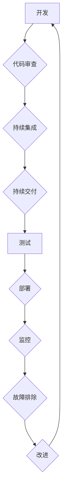

                 

## 站点可靠性工程（SRE）实践：保持系统可靠

> 关键词：站点可靠性工程（SRE）、系统可靠性、DevOps、监控、故障排除、自动化、容量规划、性能优化

### 1. 背景介绍

在当今数字化时代，网站和应用程序已成为企业核心业务不可或缺的一部分。用户对网站和应用程序的可用性和可靠性要求越来越高，任何中断或故障都可能导致严重的后果，包括业务损失、品牌损害和客户流失。因此，确保网站和应用程序的可靠性成为企业面临的重大挑战。

站点可靠性工程（Site Reliability Engineering，简称SRE）应运而生，它是一种将软件工程的最佳实践应用于网站和应用程序可靠性的工程化方法。SRE的目标是通过自动化、监控和故障排除等手段，提高网站和应用程序的可用性、性能和稳定性。

### 2. 核心概念与联系

SRE的核心概念是将运营和开发团队紧密结合，共同负责网站和应用程序的可靠性。SRE将软件工程的理念应用于运营工作，例如使用自动化工具来管理基础设施、监控系统性能和快速响应故障。

SRE与DevOps理念密切相关，两者共同致力于提高软件交付速度和可靠性。DevOps强调自动化、持续集成和持续交付，而SRE则专注于确保软件在生产环境中的可靠运行。

**SRE流程图**



### 3. 核心算法原理 & 具体操作步骤

SRE的核心算法原理是基于数据驱动和自动化决策。通过收集和分析系统运行数据，SRE可以识别潜在的故障点和性能瓶颈，并采取自动化措施来解决这些问题。

#### 3.1 算法原理概述

SRE算法的核心是利用机器学习和统计分析技术，从系统运行数据中提取有价值的信息。这些信息可以用于预测故障、优化性能和提高系统可靠性。

#### 3.2 算法步骤详解

1. **数据收集:** 收集系统运行数据，包括CPU使用率、内存使用率、网络流量、错误日志等。
2. **数据预处理:** 对收集到的数据进行清洗、转换和格式化，以便于后续分析。
3. **特征提取:** 从预处理后的数据中提取有价值的特征，例如平均响应时间、错误率、系统负载等。
4. **模型训练:** 利用机器学习算法对提取的特征进行训练，建立预测故障、优化性能的模型。
5. **模型评估:** 对训练好的模型进行评估，验证其预测准确性和性能优化效果。
6. **自动化决策:** 基于模型预测结果，自动执行相应的措施，例如调整系统配置、启动备份机制、触发报警等。

#### 3.3 算法优缺点

**优点:**

* **提高预测准确性:** 利用机器学习算法可以提高故障预测的准确性。
* **自动化决策:** 自动化决策可以提高响应速度和降低人工错误。
* **数据驱动:** 基于数据驱动决策可以更加客观和科学。

**缺点:**

* **数据依赖:** 算法的准确性依赖于数据质量和数量。
* **模型复杂性:** 训练和维护复杂的机器学习模型需要专业知识和技术。
* **解释性:** 一些机器学习模型的决策过程难以解释，这可能导致信任问题。

#### 3.4 算法应用领域

SRE算法广泛应用于各种系统可靠性领域，例如：

* **故障预测:** 预先识别潜在的故障点，并采取措施进行预防。
* **性能优化:** 分析系统性能瓶颈，并优化系统配置以提高性能。
* **容量规划:** 根据历史数据和预测模型，规划系统容量以满足未来需求。
* **安全监控:** 检测系统安全威胁，并采取措施进行防御。

### 4. 数学模型和公式 & 详细讲解 & 举例说明

SRE中常用的数学模型和公式主要用于系统可靠性分析、性能评估和容量规划。

#### 4.1 数学模型构建

**可靠性模型:**

SRE中常用的可靠性模型包括：

* **故障率模型:** 描述系统在特定时间段内发生故障的概率。常见的故障率模型包括指数分布、威布尔分布和泊松分布。
* **可用性模型:** 描述系统在特定时间段内处于可用状态的概率。可用性模型通常基于故障率模型和修复时间模型。

**性能模型:**

性能模型用于描述系统在特定负载下的性能指标，例如响应时间、吞吐量和资源利用率。常见的性能模型包括：

* **线性模型:** 假设系统性能与负载呈线性关系。
* **非线性模型:** 假设系统性能与负载呈非线性关系，例如指数模型或幂律模型。

#### 4.2 公式推导过程

**故障率:**

$$
\lambda = \frac{N}{T}
$$

其中：

* $\lambda$ 表示故障率
* $N$ 表示系统在特定时间段内发生的故障次数
* $T$ 表示系统运行的时间

**可用性:**

$$
A = 1 - \int_0^T \lambda(t) dt
$$

其中：

* $A$ 表示系统可用性
* $\lambda(t)$ 表示系统在时间 $t$ 处的故障率

#### 4.3 案例分析与讲解

**案例:**

假设一个网站的故障率为 0.01/小时，平均修复时间为 1 小时。

**计算可用性:**

$$
A = 1 - \int_0^{24} 0.01 dt = 1 - 0.24 = 0.76
$$

因此，该网站的可用性为 96%。

### 5. 项目实践：代码实例和详细解释说明

SRE实践需要结合实际项目进行，以下是一个简单的代码实例，演示如何使用 Python 脚本监控网站性能指标。

#### 5.1 开发环境搭建

* Python 3.x 环境
* requests 库
* time 库
* matplotlib 库

#### 5.2 源代码详细实现

```python
import requests
import time
import matplotlib.pyplot as plt

def monitor_website(url):
    """
    监控网站性能指标
    """
    response_times = []
    for i in range(10):
        start_time = time.time()
        response = requests.get(url)
        end_time = time.time()
        response_times.append(end_time - start_time)
        time.sleep(1)

    # 计算平均响应时间
    average_response_time = sum(response_times) / len(response_times)

    # 绘制响应时间分布图
    plt.hist(response_times, bins=5)
    plt.xlabel("响应时间 (秒)")
    plt.ylabel("频率")
    plt.title("网站响应时间分布")
    plt.show()

    print(f"平均响应时间: {average_response_time:.2f} 秒")

if __name__ == "__main__":
    website_url = "https://www.example.com"
    monitor_website(website_url)
```

#### 5.3 代码解读与分析

该代码首先定义了一个 `monitor_website` 函数，该函数接受网站 URL 作为参数。

函数内部使用循环获取网站响应时间，并记录在 `response_times` 列表中。

然后，代码计算平均响应时间并绘制响应时间分布图。

最后，代码打印平均响应时间。

#### 5.4 运行结果展示

运行该代码后，将生成一个响应时间分布图和平均响应时间。

### 6. 实际应用场景

SRE实践在各种实际应用场景中发挥着重要作用，例如：

* **电商平台:** 确保电商平台的可用性和性能，以满足高峰流量和交易需求。
* **社交媒体平台:** 提高社交媒体平台的稳定性和可靠性，以保证用户体验。
* **云计算平台:** 提供高可用性和弹性伸缩的云计算服务。
* **金融服务:** 保证金融系统的安全性和可靠性，以防止数据泄露和资金损失。

### 6.4 未来应用展望

随着云计算、人工智能和物联网等技术的快速发展，SRE将面临新的挑战和机遇。

未来，SRE将更加注重自动化、智能化和可观测性。

* **自动化:** 利用人工智能和机器学习技术，实现更自动化和智能化的系统管理。
* **智能化:** 利用机器学习和数据分析技术，预测和预防故障，提高系统可靠性。
* **可观测性:** 利用监控和日志分析技术，提高对系统运行状态的了解，以便更快地发现和解决问题。

### 7. 工具和资源推荐

#### 7.1 学习资源推荐

* **书籍:**

    * 《站点可靠性工程（SRE）实践：保持系统可靠》
    * 《The Site Reliability Workbook》
    * 《Designing Data-Intensive Applications》

* **在线课程:**

    * Google Cloud SRE Fundamentals
    * Udemy SRE Courses

#### 7.2 开发工具推荐

* **监控工具:** Prometheus, Grafana, Datadog
* **自动化工具:** Ansible, Terraform, Kubernetes
* **日志分析工具:** Elasticsearch, Logstash, Kibana

#### 7.3 相关论文推荐

* **The Site Reliability Engineering Model**
* **Building a Culture of Reliability**
* **Chaos Engineering: A Practical Guide**

### 8. 总结：未来发展趋势与挑战

SRE已经成为现代软件开发和运维的重要实践，它帮助企业提高系统可靠性、性能和可用性。

未来，SRE将继续发展和演进，面临着新的挑战和机遇。

#### 8.1 研究成果总结

SRE实践已经取得了显著的成果，例如：

* **提高系统可靠性:** SRE实践可以有效降低系统故障率和恢复时间。
* **优化系统性能:** SRE实践可以帮助企业识别和解决系统性能瓶颈。
* **降低运营成本:** SRE实践可以自动化许多运营任务，降低人力成本。

#### 8.2 未来发展趋势

* **自动化:** SRE将更加注重自动化，利用人工智能和机器学习技术实现更智能化的系统管理。
* **智能化:** SRE将更加注重智能化，利用机器学习和数据分析技术预测和预防故障。
* **可观测性:** SRE将更加注重可观测性，利用监控和日志分析技术提高对系统运行状态的了解。

#### 8.3 面临的挑战

* **人才短缺:** SRE需要具备软件工程、系统管理和数据分析等多方面的技能，人才短缺是一个挑战。
* **文化转变:** SRE需要企业文化转变，鼓励团队合作和持续改进。
* **技术复杂性:** SRE涉及到许多复杂的技术，需要不断学习和更新知识。

#### 8.4 研究展望

未来，SRE的研究方向将包括：

* **更智能的自动化:** 开发更智能的自动化工具，能够自动识别和解决问题。
* **更有效的故障预测:** 开发更有效的故障预测模型，提高故障预测的准确性。
* **更全面的可观测性:** 开发更全面的可观测性工具，能够提供更深入的系统运行状态信息。

### 9. 附录：常见问题与解答

**常见问题:**

* **SRE 和 DevOps 的区别是什么？**

**解答:** SRE 和 DevOps 都是提高软件交付速度和可靠性的实践，但侧重点不同。DevOps 侧重于开发和运维团队的协作，而 SRE 则侧重于系统可靠性的工程化。

* **如何学习 SRE？**

**解答:** 可以通过阅读书籍、参加在线课程、参与开源项目等方式学习 SRE。

* **SRE 需要哪些技能？**

**解答:** SRE 需要具备软件工程、系统管理、数据分析、自动化和沟通等多方面的技能。

**作者：禅与计算机程序设计艺术 / Zen and the Art of Computer Programming**


<end_of_turn>

