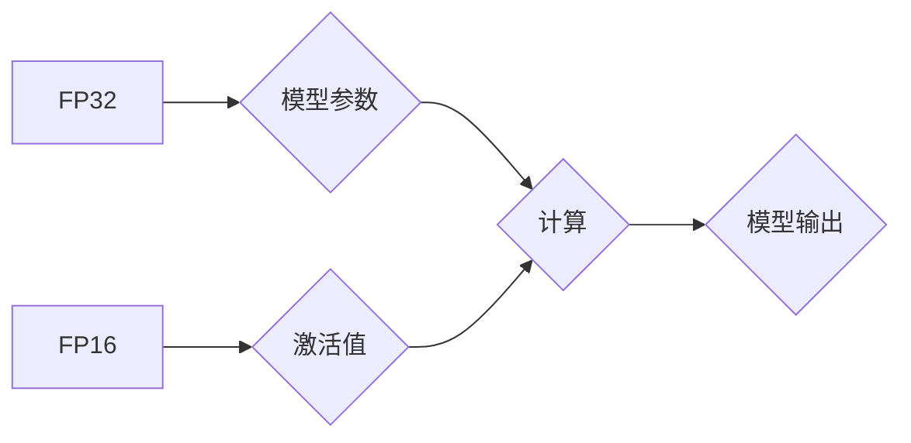

                 

## 第九章：混合精度训练的优势

> 关键词：混合精度训练、浮点精度、INT8、FP16、模型压缩、训练效率、性能提升、深度学习

### 1. 背景介绍

深度学习模型的规模不断增长，训练这些庞大模型需要大量的计算资源和时间。为了提高训练效率和降低成本，混合精度训练 (Mixed Precision Training) 成为了一种重要的优化技术。传统的深度学习训练通常使用单精度浮点 (FP32) 格式表示模型参数和激活值，但 FP32 占用较多的内存和计算资源。混合精度训练通过使用低精度浮点格式 (如 FP16) 来表示部分模型参数和激活值，从而减少内存占用和计算量，同时保持模型精度。

### 2. 核心概念与联系

混合精度训练的核心概念是利用不同精度浮点格式的优势，在训练过程中动态地选择合适的精度格式。

**Mermaid 流程图:**



**核心概念原理和架构:**

* **FP32:**  标准的单精度浮点格式，精度高，但占用内存和计算资源多。
* **FP16:** 半精度浮点格式，精度相对较低，但内存占用和计算量减少一半。
* **INT8:** 整数格式，精度最低，但内存占用和计算量最少。

混合精度训练通常使用 FP16 表示模型激活值，而使用 FP32 表示模型权重。在训练过程中，FP16 运算可以加速计算，而 FP32 保证了模型权重的精度。

### 3. 核心算法原理 & 具体操作步骤

#### 3.1 算法原理概述

混合精度训练的核心算法原理是利用低精度浮点格式 (如 FP16) 来表示模型激活值，并使用 FP32 格式来表示模型权重。在训练过程中，模型的激活值使用 FP16 进行计算，而权重使用 FP32 进行计算。

#### 3.2 算法步骤详解

1. **模型转换:** 将原始模型转换为支持混合精度训练的格式。
2. **数据类型转换:** 将模型输入数据和模型权重转换为相应的精度格式。
3. **前向传播:** 使用 FP16 格式计算模型激活值，并使用 FP32 格式计算模型输出。
4. **反向传播:** 使用 FP32 格式计算梯度，并使用 FP16 格式更新模型权重。
5. **精度转换:** 将 FP16 格式的权重转换为 FP32 格式，以确保模型的精度。

#### 3.3 算法优缺点

**优点:**

* **提高训练速度:** 使用 FP16 格式计算激活值可以显著加速训练速度。
* **降低内存占用:** FP16 格式占用内存比 FP32 格式少一半。
* **降低训练成本:** 由于训练速度和内存占用降低，混合精度训练可以降低训练成本。

**缺点:**

* **精度损失:** 使用 FP16 格式计算可能会导致精度损失。
* **硬件支持:** 混合精度训练需要支持 FP16 格式的硬件。

#### 3.4 算法应用领域

混合精度训练广泛应用于各种深度学习任务，例如图像分类、目标检测、自然语言处理等。

### 4. 数学模型和公式 & 详细讲解 & 举例说明

#### 4.1 数学模型构建

混合精度训练的数学模型与传统的深度学习模型类似，只是在计算过程中使用了不同的精度格式。

#### 4.2 公式推导过程

混合精度训练的公式推导过程与传统的深度学习模型相同，只是在计算激活值和梯度时使用了 FP16 格式。

#### 4.3 案例分析与讲解

假设我们有一个简单的线性模型，其输出为：

$$y = Wx + b$$

其中，$W$ 是权重矩阵，$x$ 是输入向量，$b$ 是偏置项。

在混合精度训练中，我们可以使用 FP16 格式表示 $x$ 和 $y$，使用 FP32 格式表示 $W$ 和 $b$。

**前向传播:**

$$y_{fp16} = W_{fp32}x_{fp16} + b_{fp32}$$

**反向传播:**

$$\frac{\partial L}{\partial W} = \frac{\partial L}{\partial y} \cdot \frac{\partial y}{\partial W}$$

其中，$L$ 是损失函数。

### 5. 项目实践：代码实例和详细解释说明

#### 5.1 开发环境搭建

混合精度训练可以使用 TensorFlow 或 PyTorch 等深度学习框架实现。

#### 5.2 源代码详细实现

```python
import tensorflow as tf

# 定义模型
model = tf.keras.Sequential([
    tf.keras.layers.Dense(10, activation='relu', dtype=tf.float16),
    tf.keras.layers.Dense(1, dtype=tf.float32)
])

# 编译模型
model.compile(optimizer='adam', loss='mse')

# 训练模型
model.fit(x_train, y_train, epochs=10)
```

#### 5.3 代码解读与分析

* 使用 `dtype=tf.float16` 指定激活值使用 FP16 格式。
* 使用 `dtype=tf.float32` 指定权重使用 FP32 格式。
* 使用 `tf.keras.layers.Dense` 定义全连接层。
* 使用 `tf.keras.optimizers.Adam` 定义优化器。
* 使用 `tf.keras.losses.mse` 定义均方误差损失函数。

#### 5.4 运行结果展示

训练完成后，可以评估模型的性能，例如使用测试集计算模型的均方误差。

### 6. 实际应用场景

混合精度训练在各种深度学习应用场景中都有着广泛的应用，例如：

* **图像分类:** 混合精度训练可以显著提高图像分类模型的训练速度和效率。
* **目标检测:** 混合精度训练可以帮助训练更准确的目标检测模型。
* **自然语言处理:** 混合精度训练可以加速自然语言处理模型的训练，例如机器翻译和文本生成。

#### 6.4 未来应用展望

随着深度学习模型规模的不断增长，混合精度训练将成为深度学习训练中不可或缺的技术之一。未来，混合精度训练可能会应用于更多领域，例如：

* **自动驾驶:** 混合精度训练可以帮助训练更强大的自动驾驶模型。
* **医疗诊断:** 混合精度训练可以加速医疗图像分析和诊断模型的训练。
* **科学研究:** 混合精度训练可以帮助科学家更快地训练和部署科学计算模型。

### 7. 工具和资源推荐

#### 7.1 学习资源推荐

* **TensorFlow Mixed Precision Training:** https://www.tensorflow.org/guide/mixed_precision
* **PyTorch Mixed Precision Training:** https://pytorch.org/docs/stable/notes/amp.html

#### 7.2 开发工具推荐

* **TensorFlow:** https://www.tensorflow.org/
* **PyTorch:** https://pytorch.org/

#### 7.3 相关论文推荐

* **Mixed Precision Training:** https://arxiv.org/abs/1710.03740
* **Training Deep Neural Networks with Mixed Precision:** https://arxiv.org/abs/1901.08261

### 8. 总结：未来发展趋势与挑战

#### 8.1 研究成果总结

混合精度训练是一种有效的深度学习训练优化技术，可以显著提高训练速度和效率，同时降低训练成本。

#### 8.2 未来发展趋势

未来，混合精度训练可能会朝着以下方向发展：

* **更广泛的精度格式支持:** 除了 FP16，未来可能会支持更多低精度浮点格式，例如 INT8 和 BF16。
* **更智能的精度选择策略:** 未来可能会开发更智能的精度选择策略，根据模型结构和训练任务动态选择最佳精度格式。
* **混合精度训练的硬件加速:** 未来可能会开发专门用于混合精度训练的硬件加速器，进一步提高训练速度和效率。

#### 8.3 面临的挑战

混合精度训练也面临一些挑战，例如：

* **精度损失:** 使用低精度浮点格式计算可能会导致精度损失，需要找到平衡精度和效率的方法。
* **硬件支持:** 混合精度训练需要支持相应的精度格式的硬件，这可能会限制其应用范围。
* **模型转换复杂度:** 将模型转换为支持混合精度训练的格式可能会比较复杂。

#### 8.4 研究展望

未来，混合精度训练的研究方向包括：

* **开发更精确的混合精度训练算法:** 减少精度损失，提高模型精度。
* **研究更智能的精度选择策略:** 根据模型结构和训练任务动态选择最佳精度格式。
* **开发针对混合精度训练的硬件加速器:** 进一步提高训练速度和效率。

### 9. 附录：常见问题与解答

**Q1: 混合精度训练的精度损失如何解决？**

**A1:** 混合精度训练的精度损失可以通过以下方法解决：

* 使用更精确的低精度浮点格式，例如 BF16。
* 在训练过程中使用混合精度训练的技巧，例如梯度裁剪和量化。
* 在模型部署时使用 FP32 格式进行推理。

**Q2: 混合精度训练需要哪些硬件支持？**

**A2:** 混合精度训练需要支持 FP16 格式的硬件，例如 NVIDIA 的 Tensor Cores。

**Q3: 如何将模型转换为支持混合精度训练的格式？**

**A3:** 可以使用 TensorFlow 或 PyTorch 等深度学习框架提供的工具将模型转换为支持混合精度训练的格式。


作者：禅与计算机程序设计艺术 / Zen and the Art of Computer Programming 
<end_of_turn>

