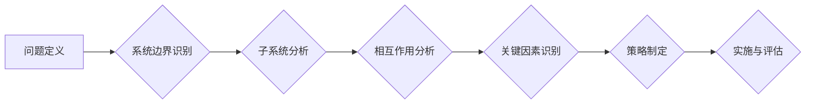

                 

## 1. 背景介绍

在当今瞬息万变的商业环境中，组织变革已成为企业持续发展的必要条件。然而，许多组织在变革过程中遭遇各种挑战，例如阻力、混乱、缺乏清晰的战略方向等，导致变革目标难以实现。 

传统项目管理方法往往侧重于局部优化，缺乏对整体系统和复杂相互作用的理解。而系统思考则提供了一种全新的视角，帮助组织从宏观角度分析变革的复杂性，识别关键因素，并制定更有效的变革策略。

## 2. 核心概念与联系

系统思考的核心概念是“系统”，它强调事物之间的相互关联和相互影响。一个系统由多个相互作用的子系统组成，每个子系统都对整个系统的行为产生影响。系统思考认为，要理解一个系统的整体行为，必须考虑其所有子系统之间的相互作用，而不是仅仅关注单个子系统的孤立行为。

**系统思考与组织变革的联系**

系统思考可以帮助组织在变革过程中：

* **识别关键因素：** 通过系统视角，组织可以识别变革中影响最大的因素，并优先考虑这些因素。
* **理解复杂性：** 系统思考可以帮助组织理解变革过程中的复杂性，避免简单化和局部的思考模式。
* **制定更有效的策略：** 基于对系统的整体理解，组织可以制定更全面的变革策略，并考虑不同子系统之间的相互影响。
* **增强变革的韧性：** 系统思考可以帮助组织识别潜在的风险和挑战，并制定应对措施，增强变革的韧性。

**系统思考流程图**



## 3. 核心算法原理 & 具体操作步骤

系统思考本身不是一个算法，而是是一种思维方式。它没有固定的算法步骤，但可以借鉴一些工具和方法来辅助思考。

### 3.1  算法原理概述

系统思考的核心原理是：

* **整体大于部分之和：** 系统的整体行为不能仅仅通过分析其各个部分来理解。
* **相互关联：** 系统中的各个部分相互关联，相互影响。
* **反馈机制：** 系统中的行为会产生反馈，影响系统的未来状态。
* **复杂性：** 系统往往具有复杂的结构和行为模式。

### 3.2  算法步骤详解

系统思考的应用步骤可以概括为以下几个方面：

1. **问题定义：** 明确组织变革的目标和问题。
2. **系统边界识别：** 确定变革所涉及的范围，包括哪些子系统和利益相关者。
3. **子系统分析：** 对每个子系统进行深入分析，了解其结构、功能和行为模式。
4. **相互作用分析：** 分析不同子系统之间的相互作用，识别关键的因果关系。
5. **关键因素识别：** 识别影响变革的关键因素，并分析其相互影响。
6. **策略制定：** 基于对系统的整体理解，制定更全面的变革策略，并考虑不同子系统之间的相互影响。
7. **实施与评估：** 实施变革策略，并定期评估其效果，根据评估结果进行调整。

### 3.3  算法优缺点

**优点：**

* **全面的视角：** 系统思考可以帮助组织从宏观角度分析变革，避免局部的思考模式。
* **更有效的策略：** 基于对系统的整体理解，组织可以制定更全面的变革策略。
* **增强变革的韧性：** 系统思考可以帮助组织识别潜在的风险和挑战，并制定应对措施。

**缺点：**

* **复杂性：** 系统思考需要对复杂系统进行深入分析，需要较高的认知能力和分析能力。
* **时间成本：** 系统思考需要投入较多的时间和精力，才能获得有效的成果。
* **缺乏定量化指标：** 系统思考的分析结果往往是定性的，难以量化评估。

### 3.4  算法应用领域

系统思考可以应用于各种组织变革场景，例如：

* **企业战略转型：** 帮助企业从宏观角度分析市场环境和竞争格局，制定更有效的战略转型方案。
* **组织结构重组：** 帮助企业分析现有组织结构的优缺点，并制定更合理的组织结构重组方案。
* **流程优化：** 帮助企业分析现有流程的效率和问题，并制定更有效的流程优化方案。
* **文化变革：** 帮助企业分析现有文化环境，并制定更有效的文化变革方案。

## 4. 数学模型和公式 & 详细讲解 & 举例说明

系统思考虽然不是一个严格的数学模型，但可以借助数学工具来进行更精确的分析和预测。例如，可以使用差分方程来描述系统中的反馈机制，可以使用网络理论来分析系统中的相互作用关系。

### 4.1  数学模型构建

一个常见的系统思考数学模型是**反馈回路模型**。反馈回路模型描述了系统中信息流动的过程，以及信息如何反馈到系统中，影响系统的未来状态。

**反馈回路模型的组成部分：**

* **输入：** 系统接收到的外部信息。
* **处理：** 系统对输入信息的处理过程。
* **输出：** 系统产生的结果。
* **反馈：** 输出信息反馈到系统输入，影响系统的未来状态。

### 4.2  公式推导过程

反馈回路模型可以用以下公式来描述：

$$
y(t) = f(x(t), u(t))
$$

其中：

* $y(t)$ 是系统在时间 $t$ 的输出。
* $x(t)$ 是系统在时间 $t$ 的状态。
* $u(t)$ 是系统在时间 $t$ 的输入。
* $f$ 是系统处理信息的函数。

### 4.3  案例分析与讲解

**举例：温度控制系统**

一个简单的温度控制系统可以看作是一个反馈回路系统。

* **输入：** 环境温度。
* **处理：** 温度传感器测量环境温度，并将信息传递给控制器。控制器根据设定温度和当前温度，计算出加热器的功率。
* **输出：** 加热器的功率。
* **反馈：** 加热器产生的热量会影响环境温度，环境温度的变化会反馈到温度传感器，从而影响控制器的决策。

在这个例子中，环境温度是系统的输入，加热器的功率是系统的输出，温度传感器和控制器是系统的处理单元。反馈回路机制使得系统能够自动调节温度，保持在设定值附近。

## 5. 项目实践：代码实例和详细解释说明

系统思考的应用需要结合实际项目进行实践，才能更好地理解其原理和方法。以下是一个简单的代码实例，演示了如何使用Python语言模拟一个简单的反馈回路系统。

### 5.1  开发环境搭建

* Python 3.x 环境

### 5.2  源代码详细实现

```python
import time

# 设置系统参数
set_point = 25  # 设置温度目标值
K = 0.5  # 控制系数
dt = 0.1  # 时间步长

# 初始化系统状态
current_temperature = 20

# 主循环
while True:
    # 计算误差
    error = set_point - current_temperature

    # 计算控制量
    control_output = K * error

    # 更新系统状态
    current_temperature += control_output * dt

    # 打印输出
    print(f"当前温度: {current_temperature:.2f}")

    # 等待一段时间
    time.sleep(dt)
```

### 5.3  代码解读与分析

* 该代码模拟了一个简单的温度控制系统。
* `set_point` 设置了目标温度，`K` 是控制系数，决定了系统对误差的响应程度。
* `dt` 是时间步长，控制了系统更新的频率。
* `current_temperature` 表示当前温度，`error` 表示温度误差，`control_output` 表示控制量。
* 主循环不断计算误差、控制量和更新温度，模拟了反馈回路机制。

### 5.4  运行结果展示

运行该代码后，你会看到当前温度逐渐接近目标温度，并最终稳定在目标温度附近。

## 6. 实际应用场景

系统思考在组织变革中有着广泛的应用场景，例如：

### 6.1  企业战略转型

系统思考可以帮助企业从宏观角度分析市场环境和竞争格局，制定更有效的战略转型方案。例如，一家传统制造企业想要转型为智能制造企业，需要考虑各个子系统的相互影响，例如生产流程、技术研发、人才培养、供应链管理等。

### 6.2  组织结构重组

系统思考可以帮助企业分析现有组织结构的优缺点，并制定更合理的组织结构重组方案。例如，一家企业想要扁平化组织结构，需要考虑各个部门之间的职责划分、沟通机制、决策流程等。

### 6.3  流程优化

系统思考可以帮助企业分析现有流程的效率和问题，并制定更有效的流程优化方案。例如，一家企业想要优化客户服务流程，需要考虑客户需求、服务人员能力、技术支持等因素。

### 6.4  文化变革

系统思考可以帮助企业分析现有文化环境，并制定更有效的文化变革方案。例如，一家企业想要打造创新文化，需要考虑员工的价值观、激励机制、沟通方式等因素。

## 7. 工具和资源推荐

### 7.1  学习资源推荐

* **书籍：**
    * 《系统思考》 - Peter Senge
    * 《第五项修炼》 - Jim Collins
    * 《复杂系统》 - Melanie Mitchell
* **在线课程：**
    * Coursera: Systems Thinking
    * edX: Systems Thinking for Sustainability
    * MIT OpenCourseWare: Introduction to Systems Thinking

### 7.2  开发工具推荐

* **流程图工具：**
    * Lucidchart
    * Draw.io
    * Miro
* **数据分析工具：**
    * Python
    * R
    * Tableau

### 7.3  相关论文推荐

* **The Fifth Discipline: The Art and Practice of the Learning Organization** - Peter Senge
* **Thinking in Systems: A Primer** - Donella Meadows
* **Complexity and the Economy** - Brian Arthur

## 8. 总结：未来发展趋势与挑战

系统思考在组织变革中具有重要的应用价值，但其发展也面临着一些挑战。

### 8.1  研究成果总结

* 系统思考已经成为一种成熟的管理思想，并被广泛应用于各种组织变革场景。
* 系统思考的理论和方法不断发展完善，并与其他学科交叉融合，例如数据科学、人工智能等。

### 8.2  未来发展趋势

* 系统思考将更加注重数据驱动和模型化，利用数据分析和人工智能技术，提高系统思考的精准性和效率。
* 系统思考将更加注重跨学科合作，整合不同领域的知识和经验，解决更复杂的问题。
* 系统思考将更加注重实践应用，将理论成果转化为实际的变革方案，帮助组织实现可持续发展。

### 8.3  面临的挑战

* 系统思考需要较高的认知能力和分析能力，需要组织成员进行系统性的培训和学习。
* 系统思考的分析结果往往是定性的，难以量化评估，需要开发更有效的评估方法。
* 系统思考的应用需要跨部门协作，需要克服部门之间的壁垒和信息孤岛。

### 8.4  研究展望

* 研究更有效的系统思考方法和工具，提高其应用效率和精准度。
* 研究系统思考与其他学科的交叉融合，拓展其应用领域。
* 研究系统思考在不同文化背景下的应用，使其更加普适和可操作。

## 9. 附录：常见问题与解答

**问题：** 系统思考和传统项目管理有什么区别？

**解答：** 系统思考和传统项目管理侧重点不同。传统项目管理侧重于局部优化，关注项目进度、成本和质量等指标。而系统思考则关注整体系统，强调系统之间的相互作用和反馈机制，旨在从宏观角度分析变革的复杂性，制定更全面的变革策略。

**问题：** 如何才能更好地运用系统思考？

**解答：** 

* 提升认知能力：学习系统思考的理论和方法，了解系统思维的原理和应用。
* 培养观察能力：关注系统中的各个子系统和相互作用关系，识别关键因素和潜在风险。
* 增强沟通能力：与不同部门和利益相关者进行有效的沟通，协同解决问题。
* 坚持实践：将系统思考应用于实际项目，不断总结经验，提高应用能力。


作者：禅与计算机程序设计艺术 / Zen and the Art of Computer Programming 
<end_of_turn>

