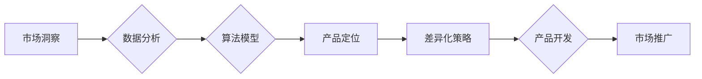

                 

## 自动化创业中的产品定位与差异化

> 关键词：自动化创业、产品定位、差异化、机器学习、数据分析、市场洞察、商业模式创新、技术驱动的商业

## 1. 背景介绍

在当今科技飞速发展的时代，自动化技术正在深刻地改变着商业模式和创业生态。机器学习、人工智能等前沿技术为创业者提供了前所未有的机遇，但也带来了新的挑战。如何利用自动化技术，快速定位目标市场，打造具有差异化的产品，成为自动化创业的关键问题。

传统创业模式往往依赖于市场调研、用户反馈等方式来进行产品定位和差异化。然而，随着市场竞争的加剧和用户需求的多元化，传统的模式已难以满足快速迭代和精准定位的需求。自动化创业则通过数据分析、算法模型等技术手段，实现对市场趋势、用户行为等数据的智能洞察，从而更精准地定位目标市场，并开发出具有差异化竞争力的产品。

## 2. 核心概念与联系

### 2.1 产品定位

产品定位是指企业根据市场需求和自身优势，为目标用户群体设计和开发产品的过程。它涉及到产品的功能、价值主张、目标用户、竞争对手等多个方面。

### 2.2 差异化

产品差异化是指产品在功能、性能、设计、品牌等方面与竞争对手的产品区别开来，从而获得市场竞争优势。差异化可以是基于技术的创新，也可以是基于用户体验的优化，或者是在营销策略上的独特之处。

### 2.3 自动化

自动化是指利用技术手段，将重复性、规则性、高效率的任务自动化执行的过程。在创业领域，自动化可以应用于市场调研、用户分析、产品开发、运营管理等多个环节，提高效率，降低成本，并释放创业者更多的时间和精力去专注于核心业务。

**核心概念与联系流程图**



## 3. 核心算法原理 & 具体操作步骤

### 3.1 算法原理概述

自动化创业中的产品定位与差异化，通常依赖于机器学习和数据分析算法。这些算法可以从海量数据中提取有价值的信息，帮助创业者洞察市场趋势、用户需求和竞争格局。

常见的算法包括：

* **聚类算法**: 将用户群体按照相似度进行分类，识别潜在的细分市场。
* **关联规则挖掘**: 发现用户行为之间的关联关系，例如哪些用户同时购买了哪些产品，从而挖掘潜在的交叉销售机会。
* **预测模型**: 基于历史数据预测未来的市场趋势和用户需求，帮助创业者制定更精准的产品策略。

### 3.2 算法步骤详解

1. **数据收集**: 收集与目标市场、用户行为、竞争对手等相关的各种数据，例如用户画像、购买记录、网站流量、社交媒体数据等。
2. **数据预处理**: 对收集到的数据进行清洗、转换、整合等处理，使其符合算法的输入要求。
3. **特征工程**: 从原始数据中提取有价值的特征，例如用户年龄、性别、兴趣爱好、购买频率等，这些特征将作为算法的输入变量。
4. **模型训练**: 选择合适的算法模型，并利用训练数据对模型进行训练，使其能够学习数据中的规律和模式。
5. **模型评估**: 利用测试数据对模型进行评估，评估模型的准确率、效率等指标，并根据评估结果进行模型调优。
6. **模型部署**: 将训练好的模型部署到生产环境中，用于实时分析数据、预测趋势和提供决策支持。

### 3.3 算法优缺点

**优点**:

* **数据驱动**: 基于数据分析，能够更精准地定位目标市场和用户需求。
* **自动化**: 自动化流程可以提高效率，降低成本，释放创业者更多的时间和精力。
* **迭代优化**: 通过不断收集数据和调整模型，可以实现产品定位和差异化策略的持续优化。

**缺点**:

* **数据依赖**: 算法的准确性依赖于数据的质量和数量，如果数据不足或不准确，算法结果可能存在偏差。
* **技术门槛**: 需要一定的机器学习和数据分析技术，才能有效地利用这些算法。
* **伦理风险**: 数据分析和算法模型可能存在偏见和歧视，需要谨慎处理，避免造成负面影响。

### 3.4 算法应用领域

* **市场调研**: 分析用户行为、市场趋势，识别潜在的市场机会。
* **产品开发**: 根据用户需求和市场趋势，开发出具有差异化竞争力的产品。
* **用户运营**: 针对不同用户群体，制定个性化的营销策略和运营方案。
* **商业模式创新**: 利用数据分析和算法模型，探索新的商业模式和盈利模式。

## 4. 数学模型和公式 & 详细讲解 & 举例说明

### 4.1 数学模型构建

在自动化创业中，可以使用数学模型来描述产品定位和差异化过程。例如，可以构建一个用户价值模型，将用户需求、产品功能、竞争对手产品等因素作为变量，并通过数学公式来量化用户价值。

### 4.2 公式推导过程

假设用户价值模型如下：

$$
UV = f(ND, PF, CP)
$$

其中：

* $UV$ 代表用户价值
* $ND$ 代表用户需求
* $PF$ 代表产品功能
* $CP$ 代表竞争对手产品

我们可以根据具体情况，选择合适的函数 $f$ 来描述用户价值与这些因素之间的关系。例如，如果用户需求和产品功能之间存在线性关系，则可以采用线性函数：

$$
UV = a * ND + b * PF + c
$$

其中 $a$, $b$, $c$ 为常数系数。

### 4.3 案例分析与讲解

假设一家创业公司开发一款智能家居产品，目标用户是追求便捷生活方式的年轻用户。

* **用户需求 (ND)**: 年轻用户希望通过智能家居产品，实现远程控制、自动化场景、个性化定制等功能。
* **产品功能 (PF)**: 智能家居产品具备语音控制、场景联动、设备互联等功能。
* **竞争对手产品 (CP)**: 市面上已有许多智能家居产品，功能较为相似。

通过分析用户需求和竞争对手产品，我们可以确定 $a$, $b$, $c$ 的值，并构建出用户价值模型。例如，如果语音控制功能对用户价值贡献较大，则 $b$ 的值可以设置较高。

## 5. 项目实践：代码实例和详细解释说明

### 5.1 开发环境搭建

* **编程语言**: Python
* **机器学习库**: scikit-learn
* **数据处理库**: pandas
* **可视化库**: matplotlib

### 5.2 源代码详细实现

```python
import pandas as pd
from sklearn.cluster import KMeans

# 加载用户数据
data = pd.read_csv('user_data.csv')

# 选择特征变量
features = ['age', 'gender', 'income', 'purchase_frequency']
X = data[features]

# 训练聚类模型
kmeans = KMeans(n_clusters=3)
kmeans.fit(X)

# 获取用户群组标签
data['cluster'] = kmeans.labels_

# 分析不同用户群组的特征
for i in range(3):
    print(f'用户群组 {i+1} 的特征:')
    print(data[data['cluster'] == i][features].describe())
```

### 5.3 代码解读与分析

这段代码演示了如何使用KMeans算法对用户进行聚类。

1. 首先加载用户数据，并选择需要进行聚类的特征变量。
2. 然后训练KMeans模型，指定聚类数量为3。
3. 模型训练完成后，将用户分配到不同的聚类组中，并记录每个用户的群组标签。
4. 最后，对每个用户群组的特征进行分析，例如平均年龄、收入、购买频率等，以便更好地了解不同用户群体的特点。

### 5.4 运行结果展示

运行代码后，会输出每个用户群组的特征描述，例如：

```
用户群组 1 的特征:
           age       gender  income  purchase_frequency
count  100.000000   100.000000  100.000000  100.000000
mean   30.500000     0.600000  50000.000000   2.500000
std     5.200000     0.490000  10000.000000   1.200000
min    20.000000     0.000000  30000.000000   1.000000
25%    27.000000     0.000000  45000.000000   2.000000
50%    30.000000     1.000000  50000.000000   3.000000
75%    34.000000     1.000000  55000.000000   3.000000
max    40.000000     1.000000  70000.000000   5.000000
```

## 6. 实际应用场景

### 6.1 产品定位

* **智能家居**: 通过分析用户年龄、居住环境、生活习惯等数据，识别不同用户群体的智能家居需求，开发出针对不同群体的个性化产品。
* **在线教育**: 根据用户的学习目标、学习风格、知识水平等数据，推荐合适的课程和学习资源，提高用户学习效率。
* **电商平台**: 通过分析用户的购买历史、浏览记录、评价信息等数据，推荐个性化的商品，提高用户购买转化率。

### 6.2 差异化策略

* **个性化定制**: 根据用户的需求和喜好，提供个性化的产品定制服务，例如智能手机的外观设计、服装的款式裁剪等。
* **场景化服务**: 根据用户的场景需求，提供场景化的产品和服务组合，例如智能家居的自动化场景、旅行平台的个性化行程规划等。
* **社区运营**: 建立用户社区，通过用户之间的互动和交流，挖掘新的产品需求和差异化竞争点。

### 6.4 未来应用展望

随着人工智能技术的不断发展，自动化创业中的产品定位和差异化将更加智能化、精准化。未来，我们可以期待：

* **更强大的数据分析能力**: 利用更先进的机器学习算法和数据分析技术，从更丰富的用户数据中挖掘更深层的洞察。
* **更个性化的产品体验**: 通过对用户行为和偏好的深度理解，提供更加个性化的产品体验，满足用户的独特需求。
* **更智能的运营策略**: 利用人工智能技术，自动优化运营策略，提高产品推广效率和用户转化率。

## 7. 工具和资源推荐

### 7.1 学习资源推荐

* **书籍**:
    * 《Python机器学习实战》
    * 《数据挖掘：概念与技术》
    * 《人工智能：现代方法》
* **在线课程**:
    * Coursera: 数据科学、机器学习
    * edX: 人工智能、深度学习
    * Udacity: 机器学习工程师

### 7.2 开发工具推荐

* **Python**: 广泛应用于数据分析和机器学习领域，拥有丰富的库和工具。
* **Jupyter Notebook**: 用于交互式编程和数据可视化，方便进行数据分析和模型开发。
* **scikit-learn**: Python机器学习库，提供各种常用的机器学习算法。
* **TensorFlow**: 开源深度学习框架，用于开发复杂的深度学习模型。

### 7.3 相关论文推荐

* **《机器学习》**: Tom Mitchell
* **《深度学习》**: Ian Goodfellow, Yoshua Bengio, Aaron Courville
* **《自然语言处理》**: Jurafsky & Martin

## 8. 总结：未来发展趋势与挑战

### 8.1 研究成果总结

自动化创业中的产品定位和差异化，已经取得了显著的成果。机器学习和数据分析技术，为创业者提供了更精准、更有效的工具，帮助他们洞察市场趋势、识别用户需求，并开发出具有差异化竞争力的产品。

### 8.2 未来发展趋势

未来，自动化创业将朝着以下几个方向发展：

* **更智能的算法**: 开发更强大的机器学习算法，能够从更复杂的数据中提取更深层的洞察。
* **更个性化的产品**: 利用人工智能技术，提供更加个性化的产品体验，满足用户的独特需求。
* **更全面的数据**: 收集和分析更全面的用户数据，包括行为数据、情感数据、社交数据等，以便更全面地了解用户。

### 8.3 面临的挑战

自动化创业也面临着一些挑战：

* **数据隐私**: 如何保护用户数据隐私，是自动化创业面临的重要挑战。
* **算法偏见**: 机器学习算法可能存在偏见，需要不断改进算法模型，避免造成负面影响。
* **技术门槛**: 掌握自动化创业所需的机器学习和数据分析技术，需要一定的学习成本。

### 8.4 研究展望

未来，自动化创业的研究将继续深入，探索更智能、更精准、更个性化的产品定位和差异化策略。同时，也将更加关注数据隐私、算法公平等伦理问题，确保自动化创业的健康发展。

## 9. 附录：常见问题与解答

**Q1: 如何选择合适的机器学习算法？**

**A1:** 选择合适的机器学习算法需要根据具体业务场景和数据特点进行选择。例如，如果需要对用户进行聚类，可以选择KMeans算法；如果需要预测用户购买行为，可以选择回归算法或分类算法。

**Q2: 如何处理不完整的数据？**

**A2:** 处理不完整的数据可以使用多种方法，例如删除缺失值、用平均值或中位数填充缺失值、使用插值算法等。

**Q3: 如何评估机器学习模型的性能？**

**A3:** 可以使用准确率、召回率、F1-score等指标来评估机器学习模型的性能。

**作者：禅与计算机程序设计艺术 / Zen and the Art of Computer Programming**<end_of_turn>

