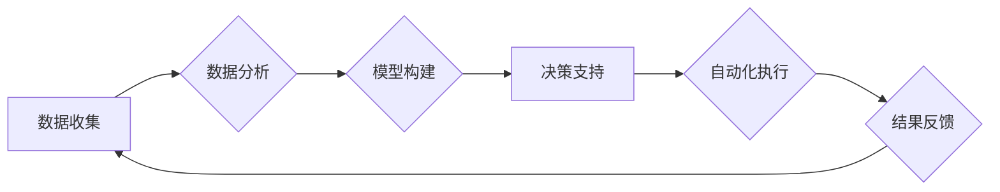

                 

## 自动化创业中的数据驱动决策

> 关键词：数据驱动决策、自动化创业、机器学习、人工智能、数据分析、创业模式、商业智能

## 1. 背景介绍

在当今数字化时代，数据已成为企业最重要的资产。数据驱动决策，即利用数据分析和机器学习等技术，为创业决策提供科学依据，已成为企业取得成功的重要驱动力。自动化创业，则是指利用技术手段，自动化完成创业过程中的多个环节，例如市场调研、产品开发、营销推广等。

结合这两个趋势，数据驱动决策在自动化创业中扮演着至关重要的角色。通过数据分析，创业者可以更深入地了解市场需求、用户行为、竞争对手情况等，从而制定更精准、更有效的创业策略。同时，数据驱动决策还可以帮助创业者自动化完成一些重复性的工作，例如客户关系管理、订单处理等，从而提高效率，降低成本。

## 2. 核心概念与联系

### 2.1 数据驱动决策

数据驱动决策是指利用数据分析和机器学习等技术，为创业决策提供科学依据。其核心思想是：

* **数据为王：** 充分收集、整理和分析数据，是数据驱动决策的基础。
* **数据分析：** 利用统计学、数据挖掘等方法，从海量数据中提取有价值的信息。
* **模型构建：** 基于数据分析结果，构建预测模型，例如用户行为预测模型、市场趋势预测模型等。
* **决策支持：** 利用模型预测结果，为创业决策提供参考和支持。

### 2.2 自动化创业

自动化创业是指利用技术手段，自动化完成创业过程中的多个环节，例如：

* **市场调研：** 利用数据分析工具，自动收集和分析市场数据，了解用户需求和竞争对手情况。
* **产品开发：** 利用人工智能技术，自动生成产品原型，并根据用户反馈进行迭代优化。
* **营销推广：** 利用自动化营销平台，自动执行营销活动，例如精准广告投放、邮件营销等。
* **客户服务：** 利用聊天机器人等技术，自动处理客户咨询和投诉。

### 2.3 数据驱动决策与自动化创业的联系

数据驱动决策和自动化创业是相互促进、相互依存的关系。数据驱动决策为自动化创业提供决策依据，而自动化创业则为数据收集和分析提供了更便捷高效的途径。

**Mermaid 流程图：**



## 3. 核心算法原理 & 具体操作步骤

### 3.1 算法原理概述

在数据驱动决策中，常用的算法包括：

* **回归分析：** 用于预测连续型变量，例如用户购买金额、产品销量等。
* **分类算法：** 用于预测离散型变量，例如用户是否会购买产品、产品是否会成功等。
* **聚类算法：** 用于将数据点分组，例如将用户分为不同消费群体、不同兴趣爱好群体等。
* **关联规则挖掘：** 用于发现数据之间的关联关系，例如哪些产品经常一起购买、哪些用户具有相似的购买行为等。

### 3.2 算法步骤详解

以回归分析为例，其具体操作步骤如下：

1. **数据收集和预处理：** 收集相关数据，并进行清洗、转换、编码等预处理工作。
2. **特征选择：** 选择与目标变量相关的特征，并进行特征工程，例如特征缩放、特征组合等。
3. **模型训练：** 利用训练数据，训练回归模型，例如线性回归、逻辑回归等。
4. **模型评估：** 利用测试数据，评估模型的性能，例如R-squared、MSE等指标。
5. **模型调优：** 根据模型评估结果，调整模型参数，提高模型性能。
6. **模型部署：** 将训练好的模型部署到生产环境，用于预测新的数据。

### 3.3 算法优缺点

不同的算法具有不同的优缺点，需要根据实际情况选择合适的算法。

* **回归分析：** 优点：易于理解和实现，计算效率高。缺点：对数据分布有较高的要求，难以处理非线性关系。
* **分类算法：** 优点：可以处理离散型变量，能够处理非线性关系。缺点：模型复杂度较高，训练时间较长。
* **聚类算法：** 优点：可以发现数据中的隐含结构，无需预先定义类别。缺点：结果难以解释，对数据质量要求较高。
* **关联规则挖掘：** 优点：可以发现数据之间的关联关系，帮助发现新的商业机会。缺点：容易产生冗余规则，对数据量要求较高。

### 3.4 算法应用领域

数据驱动决策算法广泛应用于各个领域，例如：

* **电商：** 用户行为预测、产品推荐、价格优化等。
* **金融：** 风险评估、欺诈检测、信用评分等。
* **医疗：** 疾病诊断、药物研发、患者管理等。
* **制造业：** 预测性维护、质量控制、生产优化等。

## 4. 数学模型和公式 & 详细讲解 & 举例说明

### 4.1 数学模型构建

在数据驱动决策中，常用的数学模型包括线性回归模型、逻辑回归模型、支持向量机模型等。

**线性回归模型：**

假设我们想要预测用户购买产品的金额，我们可以使用线性回归模型，其数学表达式如下：

$$y = \beta_0 + \beta_1x_1 + \beta_2x_2 + ... + \beta_nx_n + \epsilon$$

其中：

* $y$ 是目标变量，即用户购买产品的金额。
* $x_1, x_2, ..., x_n$ 是特征变量，例如用户年龄、用户收入、用户购买历史等。
* $\beta_0, \beta_1, ..., \beta_n$ 是模型参数，需要通过训练数据进行估计。
* $\epsilon$ 是误差项，代表模型预测值与实际值之间的差异。

### 4.2 公式推导过程

线性回归模型的参数估计可以通过最小二乘法进行。最小二乘法的目标是找到一组参数，使得模型预测值与实际值之间的误差平方和最小。

### 4.3 案例分析与讲解

假设我们有一个数据集，包含用户年龄、用户收入和用户购买产品的金额。我们可以使用线性回归模型，将用户年龄和用户收入作为特征变量，预测用户购买产品的金额。

通过训练数据，我们可以估计出模型参数 $\beta_0, \beta_1, \beta_2$。然后，我们可以使用这些参数，预测新用户的购买金额。

## 5. 项目实践：代码实例和详细解释说明

### 5.1 开发环境搭建

为了实现数据驱动决策，我们需要搭建一个开发环境。常用的开发环境包括：

* **Python:** Python 是一个流行的编程语言，拥有丰富的机器学习库，例如 scikit-learn、TensorFlow、PyTorch 等。
* **Jupyter Notebook:** Jupyter Notebook 是一个交互式编程环境，方便进行数据分析和模型开发。
* **云计算平台:** 云计算平台，例如 AWS、Azure、GCP 等，可以提供强大的计算资源和存储空间，方便进行大规模数据处理。

### 5.2 源代码详细实现

以下是一个使用 Python 和 scikit-learn 库实现线性回归模型的代码示例：

```python
import pandas as pd
from sklearn.linear_model import LinearRegression
from sklearn.model_selection import train_test_split

# 加载数据
data = pd.read_csv('data.csv')

# 分割数据
X = data[['年龄', '收入']]
y = data['购买金额']
X_train, X_test, y_train, y_test = train_test_split(X, y, test_size=0.2, random_state=42)

# 创建线性回归模型
model = LinearRegression()

# 训练模型
model.fit(X_train, y_train)

# 预测测试数据
y_pred = model.predict(X_test)

# 评估模型性能
from sklearn.metrics import mean_squared_error
mse = mean_squared_error(y_test, y_pred)
print('模型均方误差:', mse)
```

### 5.3 代码解读与分析

这段代码首先加载数据，然后将数据分割成训练集和测试集。接着，创建了一个线性回归模型，并使用训练集训练模型。最后，使用测试集预测结果，并评估模型性能。

### 5.4 运行结果展示

运行这段代码后，会输出模型的均方误差值。均方误差值越小，模型的预测精度越高。

## 6. 实际应用场景

### 6.1 创业模式选择

数据驱动决策可以帮助创业者选择更合适的创业模式。例如，可以通过分析市场需求和竞争对手情况，判断某个市场是否适合创业，以及哪种创业模式更具竞争力。

### 6.2 产品开发

数据驱动决策可以帮助创业者开发更符合用户需求的产品。例如，可以通过分析用户行为数据，了解用户对产品的哪些功能最感兴趣，从而开发更受欢迎的产品。

### 6.3 营销推广

数据驱动决策可以帮助创业者制定更有效的营销推广策略。例如，可以通过分析用户画像数据，精准地定位目标用户，并制定针对性的营销活动。

### 6.4 未来应用展望

随着人工智能技术的不断发展，数据驱动决策在自动化创业中的应用场景将会更加广泛。例如，未来可能会出现：

* **自动生成创业计划：** 利用人工智能技术，自动生成创业计划，包括市场分析、产品开发、营销推广等。
* **自动完成创业流程：** 利用自动化技术，自动完成创业流程中的多个环节，例如注册公司、办理许可证等。
* **智能创业导师：** 利用人工智能技术，开发智能创业导师，为创业者提供个性化的指导和支持。

## 7. 工具和资源推荐

### 7.1 学习资源推荐

* **书籍：**
    * 《数据科学实战》
    * 《Python机器学习》
    * 《人工智能：一种现代方法》
* **在线课程：**
    * Coursera
    * edX
    * Udacity

### 7.2 开发工具推荐

* **Python:** Python 是一个流行的编程语言，拥有丰富的机器学习库。
* **Jupyter Notebook:** Jupyter Notebook 是一个交互式编程环境，方便进行数据分析和模型开发。
* **scikit-learn:** scikit-learn 是一个开源的机器学习库，提供各种机器学习算法的实现。
* **TensorFlow:** TensorFlow 是一个开源的深度学习框架。
* **PyTorch:** PyTorch 是一个开源的深度学习框架。

### 7.3 相关论文推荐

* **《机器学习》**
* **《深度学习》**
* **《数据挖掘》**

## 8. 总结：未来发展趋势与挑战

### 8.1 研究成果总结

数据驱动决策在自动化创业中取得了显著的成果，例如：

* **提高创业决策的准确性：** 数据驱动决策可以帮助创业者做出更科学、更准确的决策。
* **提高创业效率：** 数据驱动决策可以自动化完成一些重复性的工作，提高创业效率。
* **降低创业成本：** 数据驱动决策可以帮助创业者避免一些不必要的风险和成本。

### 8.2 未来发展趋势

未来，数据驱动决策在自动化创业中的应用将会更加广泛和深入，例如：

* **更智能的数据分析：** 利用人工智能技术，开发更智能的数据分析工具，能够自动发现数据中的隐含规律和趋势。
* **更个性化的创业服务：** 利用数据驱动决策，为创业者提供更个性化的创业服务，例如自动生成创业计划、自动完成创业流程等。
* **更广泛的应用场景：** 数据驱动决策将会应用于创业过程中的更多环节，例如市场调研、产品开发、营销推广、客户服务等。

### 8.3 面临的挑战

数据驱动决策在自动化创业中也面临一些挑战，例如：

* **数据质量问题：** 数据质量问题会影响数据分析结果的准确性，需要加强数据清洗和预处理工作。
* **算法模型的局限性：** 现有的算法模型可能无法处理所有类型的创业问题，需要不断开发新的算法模型。
* **数据安全和隐私问题：** 数据驱动决策需要处理大量用户数据，需要加强数据安全和隐私保护工作。

### 8.4 研究展望

未来，我们需要继续加强对数据驱动决策的研究，例如：

* 开发更智能、更有效的算法模型。
* 探索新的数据驱动决策应用场景。
* 解决数据质量、算法模型和数据安全等问题。


## 9. 附录：常见问题与解答

### 9.1 如何选择合适的算法模型？

选择合适的算法模型需要根据实际情况进行判断，例如：

* **目标变量类型：** 连续型变量可以使用回归模型，离散型变量可以使用分类模型。
* **数据分布：** 不同的算法模型对数据分布有不同的要求，例如线性回归模型对数据分布有较高的要求。
* **数据量：** 对于小规模数据，可以使用简单模型，对于大规模数据，可以使用复杂模型。

### 9.2 如何评估模型性能？

常用的模型性能评估指标包括：

* **回归模型：** 均方误差 (MSE)、决定系数 (R-squared)
* **分类模型：** 精度、召回率、F1-score

### 9.3 如何解决数据质量问题？

数据质量问题可以通过以下方法解决：

* **数据清洗：** 删除重复数据、错误数据、缺失数据等。
* **数据转换：** 将数据转换为统一格式。
* **数据标准化：** 将数据转换为同一量纲。

### 9.4 如何保护数据安全和隐私？

数据安全和隐私保护可以通过以下方法实现：

* **数据加密：** 对敏感数据进行加密，防止未授权访问。
* **数据匿名化：** 删除敏感信息，保护用户隐私。
* **访问控制：** 设置访问权限，控制数据访问范围。


作者：禅与计算机程序设计艺术 / Zen and the Art of Computer Programming 
<end_of_turn>

