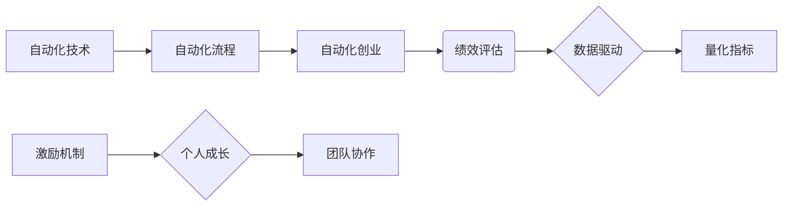

                 

## 自动化创业中的绩效评估与激励

> 关键词：自动化创业、绩效评估、激励机制、数据驱动、人工智能、机器学习、算法优化、创业团队

## 1. 背景介绍

在当今科技飞速发展的时代，自动化正在深刻地改变着各行各业，创业领域也不例外。自动化创业是指利用人工智能、机器学习等技术，构建自动化流程和系统，以提高效率、降低成本、创造新的商业模式。然而，自动化创业也带来了新的挑战，其中之一就是如何有效地评估和激励团队成员的绩效。

传统的绩效评估方法往往依赖于主观判断和经验积累，难以准确地衡量自动化创业团队成员在复杂、动态的环境下的贡献。此外，传统的激励机制也难以适应自动化创业的快速迭代和创新需求。因此，我们需要探索新的绩效评估和激励机制，以更好地激发团队成员的创造力和动力，推动自动化创业的持续发展。

## 2. 核心概念与联系

### 2.1 绩效评估

绩效评估是指对团队成员在特定时间段内工作成果、工作能力和行为表现进行系统性的评价和分析。在自动化创业中，绩效评估需要更加注重量化指标和数据驱动，以更客观地反映团队成员的贡献。

### 2.2 激励机制

激励机制是指通过各种方式激发团队成员的积极性和工作热情，以提高工作效率和达成目标的制度安排。在自动化创业中，激励机制需要更加注重个人成长和团队协作，以适应快速迭代和创新环境。

### 2.3 自动化技术

自动化技术是指利用计算机程序和算法，自动完成重复性、规则性任务，以提高效率和降低成本。在自动化创业中，自动化技术是核心驱动力，需要不断探索和应用新的技术，以实现更智能化、更高效的自动化流程。

**核心概念与联系流程图**



## 3. 核心算法原理 & 具体操作步骤

### 3.1 算法原理概述

在自动化创业中，绩效评估和激励机制可以借助机器学习算法进行优化和实现。例如，可以使用回归算法预测团队成员的未来绩效，并根据预测结果制定个性化的激励方案。

### 3.2 算法步骤详解

1. **数据收集:** 收集团队成员的工作数据，包括完成任务的时间、任务质量、参与度等指标。
2. **数据预处理:** 对收集到的数据进行清洗、转换和特征工程，以确保数据质量和算法的准确性。
3. **模型训练:** 选择合适的机器学习算法，例如线性回归、支持向量机等，对预处理后的数据进行训练，建立绩效预测模型。
4. **模型评估:** 使用测试数据对训练好的模型进行评估，并根据评估结果调整模型参数，提高模型的预测精度。
5. **激励方案制定:** 根据模型预测的结果，制定个性化的激励方案，例如奖金、晋升、培训机会等，以激励团队成员提高绩效。

### 3.3 算法优缺点

**优点:**

* 数据驱动，更加客观和准确地评估绩效。
* 个性化激励，能够更好地激发团队成员的积极性。
* 自动化流程，提高效率和降低成本。

**缺点:**

* 需要大量的数据进行训练，数据质量对模型精度影响较大。
* 模型的解释性较差，难以理解算法是如何做出预测的。
* 可能存在算法偏差，导致不公平的绩效评估和激励。

### 3.4 算法应用领域

* 绩效管理
* 人才招聘
* 薪酬福利
* 员工培训

## 4. 数学模型和公式 & 详细讲解 & 举例说明

### 4.1 数学模型构建

我们可以使用线性回归模型来预测团队成员的绩效。线性回归模型假设绩效与多个因素之间存在线性关系，可以使用以下公式表示：

$$
y = \beta_0 + \beta_1x_1 + \beta_2x_2 + ... + \beta_nx_n + \epsilon
$$

其中：

* $y$ 是团队成员的绩效得分
* $x_1, x_2, ..., x_n$ 是影响绩效的因素，例如工作时间、任务数量、团队合作度等
* $\beta_0, \beta_1, ..., \beta_n$ 是模型参数，需要通过训练数据进行估计
* $\epsilon$ 是误差项

### 4.2 公式推导过程

线性回归模型的参数估计可以通过最小二乘法进行。最小二乘法旨在找到一组参数，使得模型预测值与实际值之间的误差平方和最小。

### 4.3 案例分析与讲解

假设我们想要预测团队成员的代码质量得分，影响因素包括工作时间、代码行数、代码测试覆盖率等。我们可以收集团队成员的历史数据，并使用线性回归模型进行训练。训练完成后，我们可以使用模型预测新成员的代码质量得分，并根据预测结果制定相应的激励方案。

## 5. 项目实践：代码实例和详细解释说明

### 5.1 开发环境搭建

* Python 3.x
* scikit-learn 机器学习库
* pandas 数据处理库
* matplotlib 数据可视化库

### 5.2 源代码详细实现

```python
import pandas as pd
from sklearn.linear_model import LinearRegression
from sklearn.model_selection import train_test_split
from sklearn.metrics import mean_squared_error

# 加载数据
data = pd.read_csv('performance_data.csv')

# 选择特征和目标变量
X = data[['work_time', 'code_lines', 'test_coverage']]
y = data['code_quality']

# 将数据分为训练集和测试集
X_train, X_test, y_train, y_test = train_test_split(X, y, test_size=0.2, random_state=42)

# 创建线性回归模型
model = LinearRegression()

# 训练模型
model.fit(X_train, y_train)

# 预测测试集数据
y_pred = model.predict(X_test)

# 计算模型精度
mse = mean_squared_error(y_test, y_pred)
print(f'Mean Squared Error: {mse}')

# 可视化模型预测结果
import matplotlib.pyplot as plt
plt.scatter(y_test, y_pred)
plt.xlabel('Actual Code Quality')
plt.ylabel('Predicted Code Quality')
plt.title('Linear Regression Model Prediction')
plt.show()
```

### 5.3 代码解读与分析

这段代码首先加载了绩效数据，然后选择特征和目标变量。接着，将数据分为训练集和测试集，并创建线性回归模型。最后，训练模型并预测测试集数据，并计算模型精度。

### 5.4 运行结果展示

运行代码后，会输出模型的均方误差值，以及预测结果的可视化图。

## 6. 实际应用场景

### 6.1 自动化创业公司

自动化创业公司可以利用机器学习算法，对团队成员的绩效进行数据驱动评估，并根据评估结果制定个性化的激励方案，以提高团队效率和创新能力。

### 6.2 自动化流程优化

自动化创业过程中，可以通过数据分析和机器学习算法，识别和优化自动化流程中的瓶颈，提高效率和降低成本。

### 6.3 自动化产品开发

自动化创业公司可以利用机器学习算法，预测用户需求和市场趋势，从而更好地开发和迭代自动化产品。

### 6.4 未来应用展望

随着人工智能技术的不断发展，自动化创业中的绩效评估和激励机制将更加智能化和个性化。未来，我们可以期待看到更多基于深度学习和强化学习的算法应用，以更好地支持自动化创业的持续发展。

## 7. 工具和资源推荐

### 7.1 学习资源推荐

* **书籍:**
    * 《Python机器学习》
    * 《机器学习实战》
* **在线课程:**
    * Coursera: 机器学习
    * edX: 深度学习

### 7.2 开发工具推荐

* **Python:** 
    * scikit-learn
    * TensorFlow
    * PyTorch

* **数据可视化工具:**
    * matplotlib
    * seaborn

### 7.3 相关论文推荐

* **机器学习在绩效评估中的应用:**
    * [Predicting Employee Performance Using Machine Learning](https://arxiv.org/abs/1906.03149)
* **自动化流程优化算法:**
    * [A Survey of Process Mining Algorithms](https://dl.acm.org/doi/10.1145/3397271.3401221)

## 8. 总结：未来发展趋势与挑战

### 8.1 研究成果总结

本文探讨了自动化创业中的绩效评估和激励机制，并介绍了机器学习算法在该领域的应用。通过数据驱动和个性化激励，可以更好地激发团队成员的积极性和创造力，推动自动化创业的持续发展。

### 8.2 未来发展趋势

* **更智能化的算法:** 深度学习和强化学习算法将被更加广泛地应用于自动化创业中的绩效评估和激励机制，实现更精准和个性化的预测和激励。
* **更丰富的激励方式:** 除了传统的物质奖励，未来将出现更多基于体验、成长和成就感的激励方式，以更好地满足团队成员的多元化需求。
* **更注重伦理和公平:** 随着人工智能技术的应用，需要更加关注算法的公平性和伦理问题，确保绩效评估和激励机制不产生歧视和不公正的结果。

### 8.3 面临的挑战

* **数据质量和隐私问题:** 绩效评估和激励机制依赖于大量的数据，因此数据质量和隐私保护是需要重点关注的问题。
* **算法解释性和可信度:** 许多机器学习算法的内部机制难以解释，这可能会导致团队成员对算法结果产生怀疑和抵触。
* **技术人才短缺:** 自动化创业需要大量的技术人才，而目前技术人才的供需仍然存在较大差距。

### 8.4 研究展望

未来，我们需要继续探索更智能、更公平、更有效的自动化创业绩效评估和激励机制，以更好地支持自动化创业的持续发展和创新。


## 9. 附录：常见问题与解答

**Q1: 如何保证算法的公平性和准确性？**

**A1:** 

* 使用高质量的数据进行训练，并对数据进行清洗和预处理，以减少偏差。
* 选择合适的算法模型，并对模型参数进行调优，以提高模型的预测精度。
* 定期评估算法的性能，并根据评估结果进行调整和改进。

**Q2: 如何应对算法解释性和可信度问题？**

**A2:**

* 选择可解释性较高的算法模型，例如线性回归模型。
* 使用可视化工具，将算法的决策过程可视化，帮助团队成员理解算法是如何做出预测的。
* 建立透明的算法评估和改进机制，让团队成员参与到算法的改进过程中。

**Q3: 如何解决技术人才短缺问题？**

**A3:**

* 加强技术人才的培养和引进，建立完善的培训体系和人才激励机制。
* 积极探索开源和云计算等技术，降低技术门槛，吸引更多人才参与自动化创业。
* 鼓励跨领域合作，整合不同领域的资源和人才，共同推动自动化创业的发展。


作者：禅与计算机程序设计艺术 / Zen and the Art of Computer Programming 
<end_of_turn>

