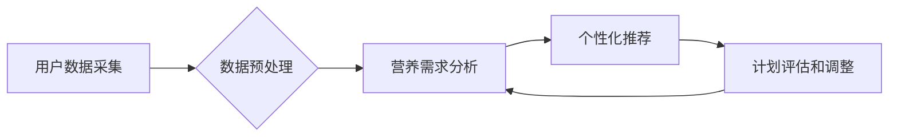

                 

## 营养计划定制：LLM 助力健康生活

> 关键词：LLM, 营养计划, 个性化推荐, 健康生活, 机器学习, 深度学习, 自然语言处理

### 1. 背景介绍

随着科技的飞速发展，人工智能（AI）已经渗透到生活的方方面面，为我们带来了诸多便利。其中，大型语言模型（LLM）凭借其强大的文本处理能力，在医疗健康领域展现出巨大的潜力。LLM能够理解和生成人类语言，并从海量数据中学习知识，为个性化医疗服务提供强有力的支持。

营养计划定制是健康生活的重要组成部分，但传统的营养咨询往往存在着时间成本高、费用昂贵、缺乏个性化等问题。而LLM的出现为解决这些问题提供了新的思路。通过训练数据，LLM可以学习到不同人群的营养需求、饮食习惯以及健康状况，并根据用户的个人信息和目标，生成个性化的营养计划。

### 2. 核心概念与联系

#### 2.1  LLM 的核心概念

大型语言模型（LLM）是一种基于深度学习的强大人工智能模型，能够理解和生成人类语言。其核心概念包括：

* **Transformer 架构:** LLM通常采用Transformer架构，该架构能够有效地处理序列数据，例如文本。
* **自监督学习:** LLM通常通过自监督学习的方式进行训练，例如预测文本的下一个词，从而学习语言的语法和语义。
* **参数量:** LLM通常拥有数亿甚至数十亿个参数，这使得它们能够学习到更复杂的语言模式。

#### 2.2  营养计划定制的流程

LLM辅助营养计划定制的流程可以概括为以下几个步骤：

* **用户数据采集:** 收集用户的个人信息，例如年龄、性别、身高、体重、活动量、饮食习惯等。
* **数据预处理:** 对收集到的用户数据进行清洗、转换和格式化。
* **营养需求分析:** 利用LLM对用户的个人信息进行分析，并根据用户的健康目标，计算出用户的营养需求。
* **个性化推荐:** 根据用户的营养需求和饮食习惯，LLM生成个性化的营养计划，包括每日膳食建议、营养素摄入目标等。
* **计划评估和调整:** 用户可以根据营养计划的建议进行饮食调整，并定期反馈给系统，以便LLM根据用户的实际情况进行计划的评估和调整。

#### 2.3  LLM 与营养计划定制的关联

LLM能够通过其强大的文本处理能力和知识学习能力，有效地辅助营养计划定制，实现以下优势：

* **个性化定制:** LLM可以根据用户的个人信息和健康目标，生成个性化的营养计划，满足用户的不同需求。
* **数据驱动:** LLM可以利用海量营养数据进行训练，提供更科学、更准确的营养建议。
* **智能化服务:** LLM可以自动生成营养计划，并根据用户的反馈进行调整，提供更智能化的服务体验。

**Mermaid 流程图**



### 3. 核心算法原理 & 具体操作步骤

#### 3.1  算法原理概述

LLM在营养计划定制中的核心算法主要包括：

* **自然语言处理 (NLP):** 用于理解用户的饮食需求、健康目标和生活习惯等信息。
* **机器学习 (ML):** 用于从海量营养数据中学习，建立营养需求与饮食建议之间的关系模型。
* **推荐系统:** 用于根据用户的个人信息和营养需求，推荐个性化的膳食方案。

#### 3.2  算法步骤详解

1. **数据收集:** 收集用户的个人信息、饮食习惯、健康状况等数据。
2. **数据预处理:** 对收集到的数据进行清洗、转换和格式化，例如将文本数据转换为数字向量。
3. **特征提取:** 从用户数据中提取关键特征，例如年龄、性别、身高、体重、活动量、喜欢的食物、不喜欢的食物等。
4. **模型训练:** 利用机器学习算法，训练一个营养需求预测模型，该模型能够根据用户的特征预测其营养需求。
5. **个性化推荐:** 根据用户的营养需求和饮食习惯，利用推荐系统生成个性化的膳食方案。
6. **计划评估和调整:** 用户可以根据营养计划的建议进行饮食调整，并定期反馈给系统，以便模型进行评估和调整。

#### 3.3  算法优缺点

**优点:**

* **个性化定制:** 能够根据用户的个人信息和健康目标，生成个性化的营养计划。
* **数据驱动:** 利用海量营养数据进行训练，提供更科学、更准确的营养建议。
* **智能化服务:** 自动生成营养计划，并根据用户的反馈进行调整，提供更智能化的服务体验。

**缺点:**

* **数据依赖:** 模型的准确性依赖于训练数据的质量和数量。
* **伦理问题:** 需谨慎处理用户隐私数据，避免数据泄露和滥用。
* **专业性限制:** 无法替代专业的营养师，对于复杂的健康问题，仍需寻求专业人士的帮助。

#### 3.4  算法应用领域

LLM辅助营养计划定制的应用领域广泛，包括：

* **个人健康管理:** 为个人用户提供个性化的营养建议，帮助他们改善健康状况。
* **慢性病管理:** 为慢性病患者提供个性化的饮食方案，帮助他们控制病情。
* **体育训练:** 为运动员提供个性化的营养计划，帮助他们提高训练效果。
* **食品行业:** 为食品企业提供营养信息分析和产品开发支持。

### 4. 数学模型和公式 & 详细讲解 & 举例说明

#### 4.1  数学模型构建

LLM在营养计划定制中，通常采用基于深度学习的推荐系统模型，例如协同过滤、内容过滤或混合推荐模型。这些模型通常使用矩阵分解、神经网络等数学方法来学习用户和物品之间的关系，并预测用户对特定物品的评分或偏好。

#### 4.2  公式推导过程

例如，协同过滤模型中常用的矩阵分解方法，可以将用户-物品交互矩阵分解成两个低维矩阵，分别表示用户特征和物品特征。

$$
R = U \cdot V^T
$$

其中：

* $R$ 是用户-物品交互矩阵，表示用户对物品的评分或偏好。
* $U$ 是用户特征矩阵，表示每个用户的特征向量。
* $V^T$ 是物品特征矩阵的转置，表示每个物品的特征向量。

通过最小化预测误差，可以学习到最优的用户特征和物品特征。

#### 4.3  案例分析与讲解

假设有一个用户-物品交互矩阵，其中用户对不同食物的评分记录如下：

| 用户 | 苹果 | 香蕉 | 橘子 |
|---|---|---|---|
| 用户1 | 5 | 4 | 3 |
| 用户2 | 3 | 5 | 4 |
| 用户3 | 4 | 3 | 5 |

可以使用矩阵分解方法，将这个交互矩阵分解成用户特征矩阵和物品特征矩阵，从而学习到每个用户对不同食物的偏好，以及每个食物的特征。

### 5. 项目实践：代码实例和详细解释说明

#### 5.1  开发环境搭建

LLM辅助营养计划定制的项目开发环境通常包括：

* **操作系统:** Linux, macOS 或 Windows
* **编程语言:** Python
* **深度学习框架:** TensorFlow, PyTorch 或 JAX
* **数据存储:** MySQL, PostgreSQL 或 MongoDB
* **云计算平台:** AWS, Azure 或 GCP

#### 5.2  源代码详细实现

以下是一个使用Python和TensorFlow实现LLM辅助营养计划定制的简单代码示例：

```python
import tensorflow as tf

# 定义用户特征和物品特征
user_features = tf.Variable(tf.random.normal([3, 10]))
item_features = tf.Variable(tf.random.normal([4, 10]))

# 定义预测函数
def predict(user_id, item_id):
  user_vector = user_features[user_id]
  item_vector = item_features[item_id]
  return tf.reduce_sum(user_vector * item_vector)

# 预测用户对特定食物的评分
user_id = 0
item_id = 0
prediction = predict(user_id, item_id)
print(f"用户 {user_id} 对食物 {item_id} 的预测评分: {prediction}")
```

#### 5.3  代码解读与分析

该代码示例定义了用户特征和物品特征，并使用一个简单的预测函数来计算用户对特定食物的评分。该函数通过计算用户特征向量和物品特征向量的点积来预测评分。

#### 5.4  运行结果展示

运行该代码后，会输出用户对特定食物的预测评分。

### 6. 实际应用场景

#### 6.1  个人健康管理

LLM可以帮助个人用户制定个性化的营养计划，例如根据用户的体重目标、饮食习惯和健康状况，推荐合适的膳食方案。

#### 6.2  慢性病管理

LLM可以帮助慢性病患者管理病情，例如根据用户的病史、药物信息和饮食习惯，推荐适合的营养方案，帮助控制血糖、血压等指标。

#### 6.3  体育训练

LLM可以帮助运动员优化训练效果，例如根据用户的运动目标、训练强度和营养需求，推荐个性化的营养计划，帮助提高运动表现。

#### 6.4  未来应用展望

LLM在营养计划定制领域的应用前景广阔，未来可能发展方向包括：

* **更精准的个性化推荐:** 利用更先进的机器学习算法和更丰富的用户数据，提供更精准的营养建议。
* **多模态输入:** 支持语音、图像等多模态输入，更加方便用户获取营养信息。
* **实时反馈和调整:** 利用传感器和智能设备，实时监测用户的饮食情况和健康状况，并根据反馈自动调整营养计划。

### 7. 工具和资源推荐

#### 7.1  学习资源推荐

* **书籍:**
    * Deep Learning by Ian Goodfellow, Yoshua Bengio, and Aaron Courville
    * Natural Language Processing with Python by Steven Bird, Ewan Klein, and Edward Loper
* **在线课程:**
    * TensorFlow Tutorials: https://www.tensorflow.org/tutorials
    * PyTorch Tutorials: https://pytorch.org/tutorials/

#### 7.2  开发工具推荐

* **深度学习框架:** TensorFlow, PyTorch, JAX
* **数据处理工具:** Pandas, NumPy
* **云计算平台:** AWS, Azure, GCP

#### 7.3  相关论文推荐

* **BERT: Pre-training of Deep Bidirectional Transformers for Language Understanding**
* **GPT-3: Language Models are Few-Shot Learners**
* **Attention Is All You Need**

### 8. 总结：未来发展趋势与挑战

#### 8.1  研究成果总结

LLM在营养计划定制领域取得了显著的成果，能够提供个性化、数据驱动的营养建议，并辅助用户管理健康状况。

#### 8.2  未来发展趋势

未来LLM在营养计划定制领域的应用将更加深入，包括：

* 更精准的个性化推荐
* 多模态输入
* 实时反馈和调整
* 与其他医疗健康技术融合

#### 8.3  面临的挑战

LLM在营养计划定制领域也面临一些挑战，例如：

* 数据质量和隐私保护
* 模型解释性和可信度
* 专业性限制

#### 8.4  研究展望

未来研究将重点关注以下方面：

* 开发更精准、更鲁棒的LLM模型
* 提高模型的解释性和可信度
* 探索LLM与其他医疗健康技术的融合应用

### 9. 附录：常见问题与解答

#### 9.1  LLM是否可以替代专业的营养师？

LLM可以提供个性化的营养建议，但不能完全替代专业的营养师。对于复杂的健康问题，仍需寻求专业人士的帮助。

#### 9.2  LLM的营养建议是否安全可靠？

LLM的营养建议基于海量数据训练，但仍需谨慎使用。用户应根据自身情况进行调整，并咨询专业人士的意见。

#### 9.3  LLM如何保护用户的隐私数据？

LLM开发平台应采取严格的隐私保护措施，例如数据加密、匿名化处理等，确保用户数据的安全。


作者：禅与计算机程序设计艺术 / Zen and the Art of Computer Programming 
<end_of_turn>

