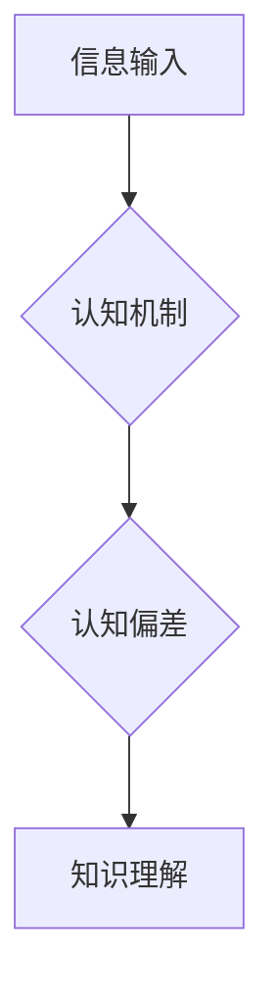

                 

## 认知偏差：影响知识理解的隐形障碍

> 关键词：认知偏差、知识理解、偏见、算法、机器学习、深度学习、数据科学、决策

### 1. 背景介绍

在当今数据爆炸的时代，我们被海量信息所包围。如何有效地理解和处理这些信息，成为了至关重要的挑战。然而，我们的大脑并非完美的逻辑机器，它会受到各种认知偏差的影响，这些偏差就像隐形的障碍，阻碍我们对知识的准确理解。

认知偏差是指人们在认知、判断和决策过程中，由于思维方式、经验和情绪等因素而产生的系统性错误。这些偏差往往是无意识的，我们并不知道自己正在受到它们的影响。然而，它们却会潜移默化地影响我们的思考模式，导致我们做出错误的判断和决策。

在软件开发领域，认知偏差同样存在，并可能导致一系列问题，例如：

* **设计缺陷：** 开发人员可能会因为认知偏差而忽略某些关键需求，导致软件设计存在缺陷。
* **代码错误：** 开发人员可能会因为认知偏差而编写出错误的代码，导致软件出现bug。
* **测试缺陷：** 开发人员可能会因为认知偏差而设计出不完善的测试用例，导致软件测试无法全面覆盖。
* **项目延期：** 开发人员可能会因为认知偏差而低估项目难度，导致项目延期。

### 2. 核心概念与联系

认知偏差的产生与人类大脑的认知机制密切相关。我们的大脑为了高效地处理信息，会采用各种简化策略，例如：

* **代表性思维：** 将新信息与已有的知识进行比较，并根据相似性进行判断。
* **可用性启示：** 容易被回忆起的例子会对我们的判断产生更大的影响。
* **锚定效应：** 初始信息会对我们的判断产生持续的影响。
* **群体思维：** 在群体中，个体可能会为了迎合群体而放弃自己的独立思考。

这些认知机制虽然在日常生活中非常有用，但它们也容易导致认知偏差。

**Mermaid 流程图：**



### 3. 核心算法原理 & 具体操作步骤

为了识别和减轻认知偏差的影响，研究人员开发了许多算法和模型。其中一些核心算法包括：

**3.1 算法原理概述**

* **反事实推理：** 通过假设不同的场景，来评估当前决策的合理性。
* **偏见检测算法：** 利用机器学习技术，识别文本和数据中的潜在偏见。
* **多视角分析：** 从不同的角度和立场来分析问题，避免单一视角的认知偏差。

**3.2 算法步骤详解**

* **数据收集和预处理：** 收集相关数据，并进行清洗、转换和特征提取。
* **模型训练：** 利用机器学习算法，训练模型以识别认知偏差。
* **偏差检测和评估：** 将模型应用于实际数据，检测并评估认知偏差的程度。
* **偏差修正：** 根据检测结果，采取措施修正认知偏差，例如提供更多信息、改变决策框架等。

**3.3 算法优缺点**

* **优点：** 可以识别和减轻认知偏差，提高决策的准确性。
* **缺点：** 需要大量的数据进行训练，算法本身也可能存在偏差。

**3.4 算法应用领域**

* **人工智能：** 确保人工智能算法的公平性和公正性。
* **金融：** 避免金融决策受到认知偏差的影响，降低风险。
* **医疗：** 提高医疗诊断的准确性，避免医疗误诊。
* **法律：** 帮助法官和律师做出更客观的判决。

### 4. 数学模型和公式 & 详细讲解 & 举例说明

**4.1 数学模型构建**

认知偏差可以被建模为一个影响因素，它会改变我们的认知过程，导致知识理解的偏差。我们可以用一个简单的数学模型来表示：

$$
K = f(I, B)
$$

其中：

* $K$ 代表知识理解
* $I$ 代表输入信息
* $B$ 代表认知偏差

$f$ 代表认知过程，它将信息和偏差结合起来，产生最终的知识理解。

**4.2 公式推导过程**

我们可以进一步推导这个模型，分析认知偏差对知识理解的影响程度。例如，我们可以假设认知偏差 $B$ 是一个加性干扰项，它会直接影响到知识理解 $K$：

$$
K = I + B
$$

在这个模型中，认知偏差 $B$ 的大小直接决定了知识理解 $K$ 与真实信息 $I$ 之间的偏差程度。

**4.3 案例分析与讲解**

例如，在阅读新闻时，如果我们对某个事件持有先入为主的观点，那么我们可能会倾向于选择支持我们观点的信息，而忽略与我们观点相冲突的信息。这是一种代表性思维的认知偏差，它会导致我们对事件的理解存在偏差。

### 5. 项目实践：代码实例和详细解释说明

为了更好地理解认知偏差的识别和减轻，我们可以开发一个简单的项目，利用机器学习算法来检测文本中的潜在偏见。

**5.1 开发环境搭建**

* Python 3.x
* TensorFlow 或 PyTorch
* NLTK 或 spaCy

**5.2 源代码详细实现**

```python
import nltk
from sklearn.model_selection import train_test_split
from sklearn.linear_model import LogisticRegression
from sklearn.metrics import accuracy_score

# 数据集准备
# ...

# 数据预处理
# ...

# 模型训练
model = LogisticRegression()
model.fit(X_train, y_train)

# 模型评估
y_pred = model.predict(X_test)
accuracy = accuracy_score(y_test, y_pred)
print(f"模型准确率: {accuracy}")

# 偏差检测
# ...
```

**5.3 代码解读与分析**

* 数据集准备：收集包含文本和偏见标签的数据集。
* 数据预处理：对文本进行清洗、分词、词向量化等处理。
* 模型训练：使用机器学习算法，例如逻辑回归，训练模型以识别偏见。
* 模型评估：使用测试集评估模型的准确率。
* 偏差检测：将训练好的模型应用于新的文本数据，检测其潜在的偏见。

**5.4 运行结果展示**

运行结果将显示模型的准确率，以及检测到的文本偏见。

### 6. 实际应用场景

认知偏差的识别和减轻在各个领域都有着广泛的应用场景：

* **新闻媒体：** 识别和减轻新闻报道中的偏见，提高新闻的客观性和公正性。
* **社交媒体：** 识别和减轻社交媒体平台上的网络暴力和仇恨言论。
* **教育领域：** 帮助学生识别和克服认知偏差，提高学习效率。
* **医疗保健：** 帮助医生识别和克服认知偏差，提高医疗诊断的准确性。

### 7. 工具和资源推荐

**7.1 学习资源推荐**

* **书籍：**
    * 《Thinking, Fast and Slow》 by Daniel Kahneman
    * 《Predictably Irrational》 by Dan Ariely
    * 《The Art of Thinking Clearly》 by Rolf Dobelli
* **在线课程：**
    * Coursera: Cognitive Biases
    * edX: Behavioral Economics

**7.2 开发工具推荐**

* **Python:** 广泛用于机器学习和数据分析。
* **TensorFlow:** 开源深度学习框架。
* **PyTorch:** 开源深度学习框架。
* **NLTK:** 自然语言处理工具包。
* **spaCy:** 自然语言处理库。

**7.3 相关论文推荐**

* **"On the Dangers of Stochastic Parrots: Can Language Models Be Too Big?"** by Emily M. Bender et al.
* **"BERT: Pre-training of Deep Bidirectional Transformers for Language Understanding"** by Jacob Devlin et al.
* **"Attention Is All You Need"** by Ashish Vaswani et al.

### 8. 总结：未来发展趋势与挑战

认知偏差的识别和减轻是一个重要的研究方向，它将对人工智能、数据科学、决策科学等领域产生深远的影响。

**8.1 研究成果总结**

近年来，在机器学习和深度学习的推动下，认知偏差的识别和减轻取得了显著进展。例如，研究人员开发了许多算法和模型，能够识别文本和数据中的潜在偏见。

**8.2 未来发展趋势**

未来，认知偏差的研究将朝着以下几个方向发展：

* **更准确的偏差检测：** 开发更准确、更鲁棒的算法，能够识别更细微的认知偏差。
* **个性化偏差修正：** 根据个人的认知特点，提供个性化的偏差修正方案。
* **跨模态认知偏差研究：** 研究不同模态（例如文本、图像、音频）中的认知偏差。

**8.3 面临的挑战**

认知偏差的研究也面临着一些挑战：

* **数据获取和标注：** 构建高质量的认知偏差数据集是一个难题。
* **算法解释性和可解释性：** 许多机器学习算法是黑盒模型，难以解释其决策过程。
* **伦理问题：** 认知偏差的识别和修正可能会涉及到隐私和公平等伦理问题。

**8.4 研究展望**

尽管面临着挑战，但认知偏差的研究前景依然广阔。随着人工智能技术的不断发展，我们相信未来能够开发出更有效的认知偏差识别和减轻技术，帮助人们做出更理性、更公平的决策。

### 9. 附录：常见问题与解答

**常见问题：**

* 如何识别自己的认知偏差？
* 如何减轻认知偏差的影响？
* 认知偏差对人工智能有什么影响？

**解答：**

* 识别自己的认知偏差可以通过反思自己的思维模式、寻求反馈、了解常见的认知偏差类型等方式。
* 减轻认知偏差的影响可以通过批判性思维、多视角分析、寻求专业意见等方式。
* 认知偏差可能会导致人工智能算法产生偏见，从而影响其公平性和公正性。

作者：禅与计算机程序设计艺术 / Zen and the Art of Computer Programming


<end_of_turn>

