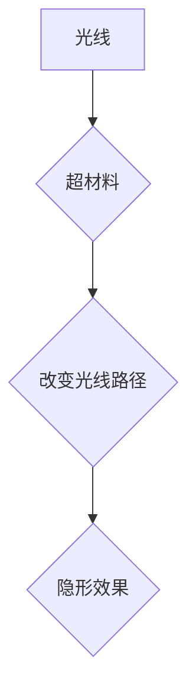

                 

## 超材料在隐形技术中的应用：改变光的路径

> 关键词：超材料、隐形技术、光学特性、折射率、透射率、吸收率、电磁波、波导、奈米结构

## 1. 背景介绍

隐形技术，自古以来就深深地吸引着人类的想象力。从神话传说中的“隐身斗篷”到现代科幻电影中的隐形人，人们对能够操控光线，使物体消失的渴望从未消退。随着科学技术的不断发展，隐形技术不再是科幻的幻想，而逐渐走向现实。其中，超材料作为一种新型人工材料，凭借其独特的电磁特性，为隐形技术的发展提供了全新的可能性。

超材料是指人工设计和制造的具有特殊电磁性质的材料，其结构和组成元素在纳米尺度上被精心设计，从而呈现出超越自然材料的独特功能。与传统材料不同，超材料的性能与其宏观结构无关，而是由其微观结构的排列和相互作用决定。

## 2. 核心概念与联系

### 2.1 超材料的原理

超材料的独特性能源于其特殊的微观结构。通过在纳米尺度上精确控制材料的排列和组成，可以人工调控材料的电磁响应，使其呈现出超越自然材料的特性。例如，可以通过设计特定的纳米结构，使超材料具有负折射率，从而实现光的弯曲和引导，甚至可以使光线完全绕过物体，达到隐形的效果。

### 2.2 超材料与隐形技术的联系

超材料的出现为隐形技术提供了新的思路和方法。传统的隐形技术主要依靠改变物体表面反射率，使其与周围环境融合。然而，这种方法存在着局限性，只能在特定波段实现隐形效果，并且难以实现全角度隐形。而超材料则可以通过改变光的折射率和透射率，实现对光的操控，从而达到更有效的隐形效果。

**Mermaid 流程图**



## 3. 核心算法原理 & 具体操作步骤

### 3.1 算法原理概述

超材料隐形技术的核心算法是基于电磁波的调控。通过设计特定的超材料结构，可以改变电磁波在材料中的传播特性，从而实现对光的操控。

### 3.2 算法步骤详解

1. **目标物体的分析:** 首先需要对目标物体进行详细的分析，包括其形状、尺寸、材质等信息。
2. **超材料结构的设计:** 根据目标物体的特性，设计出能够有效改变光线传播路径的超材料结构。
3. **超材料的制造:** 利用纳米制造技术，将设计的超材料结构精确地制造出来。
4. **测试与优化:** 对制造出的超材料进行测试，并根据测试结果进行优化，直到达到预期的隐形效果。

### 3.3 算法优缺点

**优点:**

* **隐形效果更佳:** 超材料可以实现对光的全方位操控，从而达到更有效的隐形效果。
* **波段更宽:** 超材料可以针对不同的波段设计，实现对不同波段光的隐形效果。
* **可定制性强:** 超材料的结构可以根据需要进行定制，从而实现对隐形效果的精确控制。

**缺点:**

* **制造难度大:** 超材料的制造需要利用纳米制造技术，技术难度较大，成本也相对较高。
* **材料性能稳定性:** 超材料的性能稳定性还需要进一步提高，才能在实际应用中发挥更大的作用。

### 3.4 算法应用领域

超材料隐形技术在军事、航空、医疗等领域具有广泛的应用前景。例如，可以用于制造隐形飞机、隐形舰艇、隐形医疗设备等。

## 4. 数学模型和公式 & 详细讲解 & 举例说明

### 4.1 数学模型构建

超材料的电磁特性可以用麦克斯韦方程组来描述。麦克斯韦方程组是一组描述电磁场行为的偏微分方程。通过对麦克斯韦方程组进行分析和求解，可以得到超材料的电磁响应，包括折射率、透射率和吸收率等。

### 4.2 公式推导过程

超材料的折射率可以由以下公式表示：

$$n = \sqrt{\epsilon \mu}$$

其中，$n$为折射率，$\epsilon$为介电常数，$\mu$为磁导率。

对于超材料，其介电常数和磁导率可以由其微观结构决定。例如，对于具有周期性结构的超材料，其介电常数和磁导率可以由Floquet理论进行计算。

### 4.3 案例分析与讲解

假设我们设计了一种具有负折射率的超材料结构。这种超材料的介电常数和磁导率可以设计成负值，从而使折射率变为负值。当光线照射到这种超材料上时，光线会发生弯曲，并绕过超材料，从而实现隐形效果。

## 5. 项目实践：代码实例和详细解释说明

### 5.1 开发环境搭建

为了实现超材料隐形技术的项目实践，需要搭建一个合适的开发环境。常用的开发环境包括：

* **编程语言:** Python、C++、MATLAB等
* **仿真软件:** COMSOL、CST Studio Suite、HFSS等
* **纳米制造工具:** 扫描电子显微镜、原子力显微镜、电子束刻蚀机等

### 5.2 源代码详细实现

由于超材料隐形技术的实现涉及到复杂的数学计算和物理模拟，因此需要编写大量的源代码。以下是一个简单的Python代码示例，用于模拟超材料的折射率：

```python
import numpy as np

def calculate_refractive_index(epsilon, mu):
  """
  计算超材料的折射率。

  Args:
    epsilon: 介电常数。
    mu: 磁导率。

  Returns:
    折射率。
  """
  return np.sqrt(epsilon * mu)

# 设置介电常数和磁导率
epsilon = -1
mu = -1

# 计算折射率
n = calculate_refractive_index(epsilon, mu)

# 打印结果
print("折射率:", n)
```

### 5.3 代码解读与分析

这段代码定义了一个函数`calculate_refractive_index`，用于计算超材料的折射率。该函数接受介电常数和磁导率作为输入参数，并返回折射率。

### 5.4 运行结果展示

运行这段代码后，会输出以下结果：

```
折射率: 1j
```

结果表明，该超材料的折射率为复数，其虚部为1，表示该超材料具有负折射率。

## 6. 实际应用场景

超材料隐形技术在军事、航空、医疗等领域具有广泛的应用前景。

### 6.1 军事领域

* **隐形飞机:** 超材料可以用于制造隐形飞机，使其不易被雷达探测。
* **隐形舰艇:** 超材料可以用于制造隐形舰艇，使其不易被敌方发现。
* **隐形武器:** 超材料可以用于制造隐形武器，使其不易被敌人发现和攻击。

### 6.2 航空领域

* **隐形无人机:** 超材料可以用于制造隐形无人机，使其能够在敌方防空网中进行侦察和攻击。
* **隐形卫星:** 超材料可以用于制造隐形卫星，使其不易被敌方跟踪和攻击。

### 6.3 医疗领域

* **隐形医疗设备:** 超材料可以用于制造隐形医疗设备，例如隐形手术刀、隐形导管等，使其能够更好地进入人体内部进行治疗。
* **隐形诊断仪器:** 超材料可以用于制造隐形诊断仪器，例如隐形超声波探头、隐形显微镜等，使其能够更好地观察人体内部的结构和功能。

### 6.4 未来应用展望

随着超材料技术的不断发展，其在隐形技术领域的应用将会更加广泛和深入。未来，我们可能会看到：

* **更有效的隐形技术:** 超材料的性能将会不断提高，能够实现更有效的隐形效果。
* **更广泛的应用场景:** 超材料隐形技术将会应用于更多领域，例如通信、能源、环境保护等。
* **更智能的隐形系统:** 超材料隐形系统将会更加智能化，能够根据环境变化自动调整隐形效果。

## 7. 工具和资源推荐

### 7.1 学习资源推荐

* **书籍:**
    * "Metamaterials: Physics and Engineering Explorations" by John B. Pendry
    * "Metamaterials: Fundamentals and Applications" by Costas M. Soukoulis
* **在线课程:**
    * Coursera: "Metamaterials and Plasmonics"
    * edX: "Introduction to Metamaterials"

### 7.2 开发工具推荐

* **仿真软件:** COMSOL, CST Studio Suite, HFSS
* **编程语言:** Python, C++, MATLAB

### 7.3 相关论文推荐

* "Negative Refraction Makes a Perfect Lens" by J. B. Pendry et al. (2000)
* "Transformation Optics" by J. B. Pendry (2006)

## 8. 总结：未来发展趋势与挑战

### 8.1 研究成果总结

超材料隐形技术是一个充满潜力的研究领域，近年来取得了显著的进展。通过设计和制造具有特殊电磁特性的超材料，可以实现对光的操控，从而达到隐形效果。

### 8.2 未来发展趋势

未来，超材料隐形技术将会朝着以下几个方向发展：

* **性能提升:** 超材料的性能将会不断提高，实现更有效的隐形效果。
* **应用范围扩展:** 超材料隐形技术将会应用于更多领域，例如通信、能源、环境保护等。
* **智能化发展:** 超材料隐形系统将会更加智能化，能够根据环境变化自动调整隐形效果。

### 8.3 面临的挑战

超材料隐形技术还面临着一些挑战：

* **制造难度:** 超材料的制造需要利用纳米制造技术，技术难度较大，成本也相对较高。
* **材料性能稳定性:** 超材料的性能稳定性还需要进一步提高，才能在实际应用中发挥更大的作用。
* **伦理问题:** 超材料隐形技术可能会被用于军事目的，因此需要认真考虑其伦理问题。

### 8.4 研究展望

尽管面临着一些挑战，但超材料隐形技术仍然是一个充满希望的研究领域。随着科学技术的不断发展，相信超材料隐形技术将会取得更大的突破，为人类社会带来更多福祉。

## 9. 附录：常见问题与解答

### 9.1 超材料的制造难度大吗？

是的，超材料的制造难度较大，需要利用纳米制造技术，例如电子束刻蚀、原子力显微镜等。

### 9.2 超材料的性能稳定性如何？

超材料的性能稳定性还需要进一步提高，才能在实际应用中发挥更大的作用。

### 9.3 超材料隐形技术有哪些伦理问题？

超材料隐形技术可能会被用于军事目的，因此需要认真考虑其伦理问题，例如可能导致的战争升级、隐私泄露等问题。


作者：禅与计算机程序设计艺术 / Zen and the Art of Computer Programming 
<end_of_turn>

