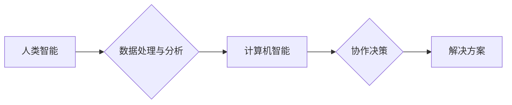

                 

## 连接人类智慧的纽带：人类计算的协作精神

> 关键词：人类计算、协作智能、人工智能、机器学习、数据分析、计算共创、人类-计算机交互

### 1. 背景介绍

在信息时代，数据爆炸和计算能力的飞速发展，人工智能（AI）正以惊人的速度改变着我们的生活。从自动驾驶到医疗诊断，从个性化推荐到科学发现，AI技术的应用无处不在。然而，尽管AI取得了令人瞩目的成就，但它仍然面临着一些瓶颈，例如缺乏对复杂问题的理解能力、难以处理开放式和模糊的场景，以及对人类社会伦理和价值观的理解不足。

人类计算（Human Computation）应运而生，它是一种将人类智能与计算机智能相结合的新型计算模式。人类计算的核心思想是，利用人类的认知能力、创造力、判断力和经验，与计算机的计算能力和数据处理能力相结合，共同解决复杂问题。

### 2. 核心概念与联系

人类计算的核心概念是将人类和计算机视为一个协作系统，共同完成任务。

**2.1 人类智能的优势**

* **理解和解释复杂信息:** 人类擅长理解和解释复杂、模糊、多义的信息，而计算机在处理这类信息时往往会遇到困难。
* **创造力和创新:** 人类拥有创造力和创新能力，能够提出新的解决方案和想法，而计算机则更擅长执行已知的算法和规则。
* **道德和伦理判断:** 人类拥有道德和伦理判断能力，能够在解决问题时考虑社会影响和伦理规范，而计算机则缺乏这种能力。

**2.2 计算机智能的优势**

* **高速计算和数据处理:** 计算机拥有强大的计算能力和数据处理能力，能够快速处理海量数据，并从中发现模式和规律。
* **精确性和可重复性:** 计算机能够执行任务以精确和可重复的方式，而人类则容易受到情绪和主观因素的影响。
* **存储和检索信息:** 计算机能够存储和检索海量信息，方便人类获取和利用知识。

**2.3 人类计算的协作模式**

人类计算的协作模式多种多样，例如：

* **人类在回路中:** 人类参与到机器学习算法的训练和改进过程中，例如标注数据、纠正错误、提供反馈等。
* **人类辅助机器:** 人类提供决策支持、解释结果、解决机器无法处理的问题等。
* **机器辅助人类:** 机器提供数据分析、信息检索、自动化处理等辅助，帮助人类更高效地完成工作。

**2.4  Mermaid 流程图**



### 3. 核心算法原理 & 具体操作步骤

人类计算的核心算法原理是将人类和计算机的优势结合起来，共同完成任务。具体操作步骤如下：

**3.1 算法原理概述**

人类计算算法通常分为以下几个步骤：

1. **问题定义:** 明确需要解决的问题，并将其分解成更小的子问题。
2. **数据收集:** 收集与问题相关的原始数据，并进行预处理。
3. **人类参与:** 利用人类的认知能力和判断力，对数据进行分析、理解和解释，并提供反馈和指导。
4. **计算机处理:** 利用计算机的计算能力和数据处理能力，对数据进行分析、建模和预测。
5. **结果评估:** 对计算机处理的结果进行评估，并根据需要进行调整和改进。

**3.2 算法步骤详解**

* **问题定义:** 

    * 首先，需要明确需要解决的问题，并将其分解成更小的子问题。例如，如果要解决“如何提高客户满意度”的问题，可以将其分解成“如何了解客户需求”、“如何改进产品和服务”、“如何提升客户服务体验”等子问题。
    * 每个子问题都需要进行详细的分析和定义，以便更好地指导后续的步骤。

* **数据收集:** 

    * 接下来，需要收集与问题相关的原始数据。数据来源可以是各种渠道，例如客户调查问卷、产品使用数据、社交媒体评论等。
    * 收集到的数据需要进行预处理，例如清洗、格式化、标准化等，以便于后续的分析和处理。

* **人类参与:** 

    * 人类参与是人类计算的核心环节。人类可以利用自己的认知能力和判断力，对数据进行分析、理解和解释。例如，可以对客户调查问卷进行分析，了解客户的需求和痛点；可以对产品使用数据进行分析，发现产品使用中的问题和改进方向；可以对社交媒体评论进行分析，了解客户对产品的评价和反馈。
    * 人类还可以提供反馈和指导，帮助计算机更好地理解问题和数据。例如，可以对计算机生成的预测结果进行评估，并提供反馈，帮助计算机改进预测模型；可以对计算机提出的解决方案进行评估，并提供建议，帮助计算机找到更好的解决方案。

* **计算机处理:** 

    * 计算机可以利用自己的计算能力和数据处理能力，对数据进行分析、建模和预测。例如，可以利用机器学习算法对客户数据进行分析，预测客户的购买行为；可以利用数据挖掘技术对产品使用数据进行分析，发现产品使用中的模式和规律；可以利用自然语言处理技术对社交媒体评论进行分析，提取客户的意见和情感。

* **结果评估:** 

    * 最后，需要对计算机处理的结果进行评估，并根据需要进行调整和改进。例如，可以对预测结果的准确率进行评估，并根据需要调整预测模型；可以对解决方案的有效性进行评估，并根据需要改进解决方案。

**3.3 算法优缺点**

* **优点:**
    * 可以充分利用人类和计算机的优势，共同解决复杂问题。
    * 可以处理开放式和模糊的场景，例如需要理解和解释复杂信息、进行创造性思考等。
    * 可以考虑社会影响和伦理规范，避免计算机算法带来的潜在风险。

* **缺点:**
    * 需要协调人类和计算机的协作，提高效率和准确性。
    * 需要设计合适的算法和流程，才能有效地利用人类和计算机的优势。
    * 需要考虑数据隐私和安全问题。

**3.4 算法应用领域**

人类计算的应用领域非常广泛，例如：

* **科学研究:** 利用人类的认知能力和判断力，辅助科学家进行数据分析、模型构建和实验设计。
* **医疗诊断:** 利用人类的医学知识和经验，辅助医生进行疾病诊断和治疗方案制定。
* **金融分析:** 利用人类的金融知识和经验，辅助金融分析师进行风险评估和投资决策。
* **教育教学:** 利用人类的教学经验和学生个体差异，个性化定制教育内容和教学方法。
* **创意设计:** 利用人类的创造力和想象力，辅助设计师进行产品设计、艺术创作等。

### 4. 数学模型和公式 & 详细讲解 & 举例说明

人类计算的数学模型和公式可以用来描述人类和计算机的协作过程，以及协作过程中的信息传递和决策机制。

**4.1 数学模型构建**

一个简单的数学模型可以用来描述人类和计算机协作完成任务的过程。假设任务可以分解成多个子任务，每个子任务都需要人类和计算机的参与。

*  **H(i)** 表示第 i 个子任务中人类的贡献度。
*  **C(i)** 表示第 i 个子任务中计算机的贡献度。
*  **T(i)** 表示第 i 个子任务的完成时间。

则任务的总完成时间可以表示为：

$$T = \sum_{i=1}^{n} T(i)$$

其中 n 是任务的总数量。

**4.2 公式推导过程**

我们可以进一步推导每个子任务的完成时间公式，例如：

$$T(i) = f(H(i), C(i))$$

其中 f 是一个函数，描述了人类和计算机贡献度对任务完成时间的影响。

**4.3 案例分析与讲解**

例如，在图像识别任务中，人类可以提供图像的语义信息和上下文线索，而计算机可以利用深度学习算法进行图像特征提取和分类。

我们可以将图像识别任务分解成多个子任务，例如：

*  **子任务 1:** 人类标注图像中的目标物体。
*  **子任务 2:** 计算机提取图像特征。
*  **子任务 3:** 计算机进行目标分类。

每个子任务的完成时间可以由人类和计算机的贡献度决定。

### 5. 项目实践：代码实例和详细解释说明

为了更好地理解人类计算的原理和应用，我们可以通过一个简单的项目实践来进行演示。

**5.1 开发环境搭建**

*  操作系统: Windows/macOS/Linux
*  编程语言: Python
*  库: NumPy, Pandas, Matplotlib

**5.2 源代码详细实现**

```python
import numpy as np
import pandas as pd
from matplotlib import pyplot as plt

# 人类标注数据
data = pd.DataFrame({
    'image_id': [1, 2, 3, 4, 5],
    'label': ['cat', 'dog', 'cat', 'dog', 'bird']
})

# 计算机特征提取
def extract_features(image_id):
    # 模拟计算机提取图像特征
    return np.random.rand(10)

# 训练机器学习模型
def train_model(data):
    # 模拟训练机器学习模型
    return lambda image_id: np.random.choice(['cat', 'dog', 'bird'], p=[0.3, 0.5, 0.2])

# 预测结果
def predict(model, image_id):
    # 使用模型预测图像标签
    return model(image_id)

# 人类-计算机协作流程
def human_computer_collaboration(data):
    # 人类标注数据
    human_labels = data['label']
    # 计算机提取特征
    features = [extract_features(image_id) for image_id in data['image_id']]
    # 训练机器学习模型
    model = train_model(data)
    # 预测结果
    predictions = [predict(model, image_id) for image_id in data['image_id']]
    # 评估结果
    accuracy = np.sum(human_labels == predictions) / len(human_labels)
    print(f'Accuracy: {accuracy}')

# 执行协作流程
human_computer_collaboration(data)
```

**5.3 代码解读与分析**

*  代码首先定义了人类标注的数据和计算机特征提取的函数。
*  然后，代码定义了训练机器学习模型和预测结果的函数。
*  最后，代码定义了人类-计算机协作流程的函数，并执行了该流程。

**5.4 运行结果展示**

运行代码后，会输出模型的准确率。

### 6. 实际应用场景

人类计算已经开始在各个领域得到应用，例如：

* **科学研究:** 人类计算可以帮助科学家进行大规模数据分析、模型构建和实验设计，加速科学发现。例如，在基因组测序领域，人类计算可以帮助科学家分析基因序列，识别疾病基因和潜在药物靶点。
* **医疗诊断:** 人类计算可以帮助医生进行疾病诊断、治疗方案制定和患者管理。例如，在癌症诊断领域，人类计算可以帮助医生分析病理图像，识别癌细胞和判断肿瘤的类型和分期。
* **金融分析:** 人类计算可以帮助金融分析师进行风险评估、投资决策和欺诈检测。例如，在反欺诈领域，人类计算可以帮助金融机构识别异常交易行为，防止金融犯罪。
* **教育教学:** 人类计算可以帮助教师个性化定制教育内容和教学方法，提高学生的学习效率和兴趣。例如，在在线教育领域，人类计算可以帮助平台根据学生的学习进度和能力，推荐合适的学习资源和练习题。

**6.4 未来应用展望**

未来，人类计算将更加广泛地应用于各个领域，例如：

* **自动驾驶:** 人类计算可以帮助自动驾驶系统更好地理解道路环境、预测行人行为和做出更安全的决策。
* **机器人技术:** 人类计算可以帮助机器人更好地理解人类语言、感知环境和完成复杂任务。
* **虚拟现实和增强现实:** 人类计算可以帮助虚拟现实和增强现实系统提供更逼真的体验和更智能的交互。

### 7. 工具和资源推荐

**7.1 学习资源推荐**

*  **书籍:**
    *  《人类计算：从数据到智慧》
    *  《协作智能：人类与机器的未来》
*  **在线课程:**
    *  Coursera: 人工智能与人类计算
    *  edX: 人类计算与数据科学

**7.2 开发工具推荐**

*  **编程语言:** Python, Java, C++
*  **机器学习库:** TensorFlow, PyTorch, scikit-learn
*  **数据分析工具:** Pandas, NumPy, Matplotlib

**7.3 相关论文推荐**

*  《人类计算：一种新的计算范式》
*  《协作智能：人类与机器的协同工作》
*  《人类计算在科学研究中的应用》

### 8. 总结：未来发展趋势与挑战

**8.1 研究成果总结**

人类计算是一个新兴的领域，近年来取得了显著的进展。研究人员已经开发出各种人类计算算法和工具，并将其应用于各个领域。

**8.2 未来发展趋势**

未来，人类计算将朝着以下几个方向发展：

*  **更加智能的协作机制:** 研究人员将开发更加智能的协作机制，使人类和计算机能够更加有效地协作。
*  **更加广泛的应用场景:** 人类计算将应用于更多领域，例如自动驾驶、机器人技术、虚拟现实和增强现实等。
*  **更加注重伦理和社会影响:** 人类计算的发展需要更加注重伦理和社会影响，确保其能够安全、公平地应用于社会。

**8.3 面临的挑战**

人类计算也面临着一些挑战，例如：

*  **数据隐私和安全:** 人类计算需要处理大量的人类数据，因此需要确保数据隐私和安全。
*  **算法偏见:** 人类计算算法可能会受到人类偏见的影响，导致不公平的结果。
*  **人类参与度:** 人类参与度是人类计算的关键因素，需要找到有效的激励机制，提高人类的参与积极性。

**8.4 研究展望**

未来，我们需要继续深入研究人类计算的原理和方法，开发更加智能、高效、安全的协作机制，并将其应用于更多领域，为人类社会创造更大的价值。

### 9. 附录：常见问题与解答

**9.1 如何提高人类计算的效率？**

*  设计更加高效的协作流程，减少人类和计算机之间的信息传递和反馈时间。
*  利用自动化技术，减少人类重复性劳动，提高人类的专注力和创造力。
*  提供有效的激励机制，提高人类的参与积极性。

**9.2 如何解决人类计算中的算法偏见问题？**

*  使用更加公平的数据集进行算法训练。
*  开发算法偏见检测和缓解技术。
*  建立伦理审查机制，确保算法的公平性和公正性。

**9.3 人类计算会取代人类工作吗？**

人类计算不会取代人类工作，而是会与人类共同工作，提高工作效率和创造力。人类仍然需要发挥自己的创造力、判断力和解决问题的能力，而计算机可以帮助人类处理重复性劳动和数据分析等任务。


作者：禅与计算机程序设计艺术 / Zen and the Art of Computer Programming 
<end_of_turn>

