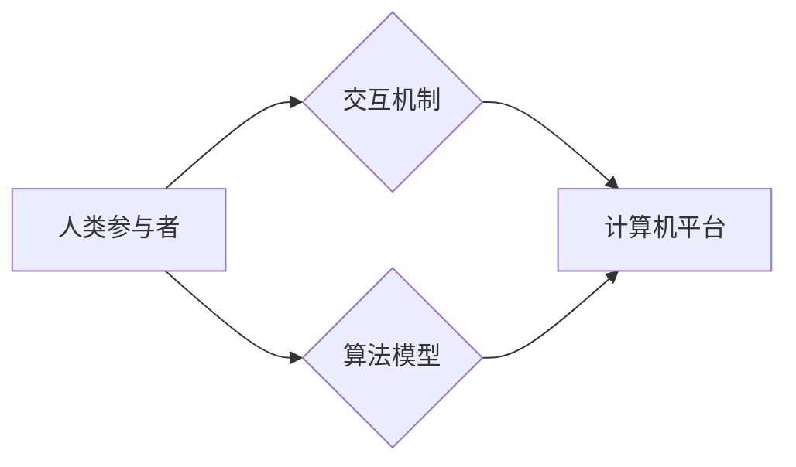

                 

## 释放人类潜力的无限可能：人类计算的最终目标

> 关键词：人类计算、人工智能、认知增强、计算模型、神经网络、可解释性、伦理

### 1. 背景介绍

人类文明的进步离不开对计算的不断探索和突破。从简单的算盘到复杂的超级计算机，我们一直在寻求更有效、更强大的计算方式。然而，随着人工智能技术的飞速发展，我们开始意识到，传统的计算模式已经无法满足未来对计算能力的需求。人类计算，作为一种全新的计算 paradigm，正逐渐成为解决这一问题的关键。

人类计算是指将人类的认知能力与计算机技术相结合，共同完成复杂的任务。它不仅仅是利用计算机辅助人类进行计算，而是更深层次地融合人类的智慧、创造力和洞察力。人类计算的最终目标是释放人类潜力的无限可能，帮助我们更好地理解世界，解决复杂问题，创造更美好的未来。

### 2. 核心概念与联系

#### 2.1 人类计算的本质

人类计算的核心概念是将人类的认知能力视为一种计算资源，并将其与计算机技术相结合。人类的认知能力包括感知、记忆、推理、决策等多种方面，这些能力在解决复杂问题时发挥着至关重要的作用。

#### 2.2 人类计算的架构

人类计算的架构通常包括以下几个关键部分：

* **人类参与者:** 负责提供认知能力、创意和判断力。
* **计算机平台:** 提供计算能力、数据存储和信息处理能力。
* **交互机制:** 允许人类和计算机之间进行有效的沟通和协作。
* **算法模型:** 指导人类和计算机如何共同完成任务。

**Mermaid 流程图:**



#### 2.3 人类计算与人工智能的关系

人类计算与人工智能是相辅相成的。人工智能技术可以帮助我们构建更强大的计算模型，而人类计算则可以为这些模型提供更丰富的认知能力和创造力。两者共同发展，将推动计算技术的进步，并释放人类潜力的无限可能。

### 3. 核心算法原理 & 具体操作步骤

#### 3.1 算法原理概述

人类计算的核心算法原理是将人类的认知能力转化为计算机可理解的算法，并通过计算机平台进行高效的计算和处理。常见的算法模型包括：

* **神经网络:** 模仿人类大脑的神经元结构，通过学习和训练来完成各种任务，例如图像识别、自然语言处理等。
* **强化学习:** 通过奖励和惩罚机制，训练智能体在特定环境中学习最佳策略。
* **进化算法:** 借鉴自然进化过程，通过选择、交叉和变异等操作，不断优化算法的性能。

#### 3.2 算法步骤详解

以神经网络为例，其训练步骤可以概括为以下几个阶段：

1. **数据准备:** 收集和预处理训练数据，例如图像、文本等。
2. **网络结构设计:** 根据任务需求设计神经网络的结构，包括层数、节点数、激活函数等。
3. **参数初始化:** 为神经网络的参数进行随机初始化。
4. **前向传播:** 将输入数据通过神经网络进行计算，得到输出结果。
5. **损失函数计算:** 计算输出结果与真实值的误差，即损失函数的值。
6. **反向传播:** 根据损失函数的梯度，调整神经网络的参数，使其朝着降低损失函数的方向进行更新。
7. **迭代训练:** 重复前向传播、损失函数计算和反向传播的过程，直到损失函数达到预设的阈值。

#### 3.3 算法优缺点

**优点:**

* 能够学习复杂模式和关系。
* 具有强大的泛化能力，可以应用于多种任务。
* 能够不断改进和优化。

**缺点:**

* 训练过程需要大量数据和计算资源。
* 模型的可解释性较差，难以理解其决策过程。
* 容易受到数据偏差的影响。

#### 3.4 算法应用领域

神经网络算法已广泛应用于以下领域：

* **图像识别:** 人脸识别、物体检测、图像分类等。
* **自然语言处理:** 机器翻译、文本摘要、情感分析等。
* **语音识别:** 语音转文本、语音助手等。
* **推荐系统:** 商品推荐、内容推荐等。
* **医疗诊断:** 疾病预测、影像分析等。

### 4. 数学模型和公式 & 详细讲解 & 举例说明

#### 4.1 数学模型构建

神经网络的数学模型基于线性代数和微积分。其核心是神经元，每个神经元接收多个输入信号，并通过权重进行加权求和，然后应用激活函数进行非线性变换，最终输出一个信号。

#### 4.2 公式推导过程

**激活函数:**

$$f(x) = \frac{1}{1 + e^{-x}}$$

**损失函数:**

$$L = \frac{1}{n} \sum_{i=1}^{n} (y_i - \hat{y}_i)^2$$

其中，$y_i$ 是真实值，$\hat{y}_i$ 是预测值，$n$ 是样本数量。

**梯度下降算法:**

$$\theta = \theta - \alpha \frac{\partial L}{\partial \theta}$$

其中，$\theta$ 是模型参数，$\alpha$ 是学习率。

#### 4.3 案例分析与讲解

以图像分类为例，假设我们有一个包含猫和狗的图像数据集。我们可以使用神经网络模型来学习猫和狗的特征，并训练模型能够准确地识别出图像中的猫和狗。

在训练过程中，我们会将图像数据输入到神经网络中，并计算模型的输出结果。然后，我们会使用损失函数来衡量模型的预测结果与真实值的差异。最后，我们会使用梯度下降算法来更新模型的参数，使其朝着降低损失函数的方向进行调整。

经过多次迭代训练，模型的性能将会不断提高，最终能够达到预设的准确率。

### 5. 项目实践：代码实例和详细解释说明

#### 5.1 开发环境搭建

为了实现人类计算项目，我们需要搭建一个合适的开发环境。常用的开发环境包括：

* **Python:** 作为人工智能领域最流行的编程语言，Python 提供了丰富的库和框架，例如 TensorFlow、PyTorch 等，可以方便地构建和训练神经网络模型。
* **Jupyter Notebook:** 作为一种交互式编程环境，Jupyter Notebook 可以方便地进行代码编写、运行和调试，并可视化模型的训练过程。
* **GPU:** 由于神经网络训练需要大量的计算资源，因此使用 GPU 可以显著提高训练速度。

#### 5.2 源代码详细实现

以下是一个简单的图像分类示例代码，使用 TensorFlow 框架实现：

```python
import tensorflow as tf

# 定义模型结构
model = tf.keras.models.Sequential([
  tf.keras.layers.Conv2D(32, (3, 3), activation='relu', input_shape=(28, 28, 1)),
  tf.keras.layers.MaxPooling2D((2, 2)),
  tf.keras.layers.Conv2D(64, (3, 3), activation='relu'),
  tf.keras.layers.MaxPooling2D((2, 2)),
  tf.keras.layers.Flatten(),
  tf.keras.layers.Dense(10, activation='softmax')
])

# 编译模型
model.compile(optimizer='adam',
              loss='sparse_categorical_crossentropy',
              metrics=['accuracy'])

# 训练模型
model.fit(x_train, y_train, epochs=5)

# 评估模型
loss, accuracy = model.evaluate(x_test, y_test)
print('Test loss:', loss)
print('Test accuracy:', accuracy)
```

#### 5.3 代码解读与分析

这段代码定义了一个简单的卷积神经网络模型，用于图像分类任务。模型包含两个卷积层、两个池化层、一个全连接层和一个输出层。

* **Conv2D:** 卷积层，用于提取图像特征。
* **MaxPooling2D:** 池化层，用于降低特征图的尺寸，提高模型的鲁棒性。
* **Flatten:** 将多维特征图展平为一维向量。
* **Dense:** 全连接层，用于将特征向量映射到输出类别。
* **softmax:** 激活函数，用于将输出向量转换为概率分布。

#### 5.4 运行结果展示

训练完成后，我们可以使用测试数据评估模型的性能。测试结果通常包括测试损失和测试准确率。

### 6. 实际应用场景

#### 6.1 医疗诊断

人类计算可以帮助医生更快、更准确地诊断疾病。例如，可以利用神经网络模型分析患者的影像数据，识别潜在的病变，并辅助医生做出诊断。

#### 6.2 教育培训

人类计算可以个性化教育培训，根据学生的学习进度和需求提供定制化的学习内容和辅导。例如，可以利用人工智能技术分析学生的学习行为，识别他们的薄弱环节，并提供针对性的学习建议。

#### 6.3 科学研究

人类计算可以加速科学研究，帮助科学家更快地发现新的知识和规律。例如，可以利用人工智能技术分析海量科研数据，识别潜在的科学发现，并辅助科学家进行实验设计和数据分析。

#### 6.4 未来应用展望

随着人工智能技术的不断发展，人类计算的应用场景将会更加广泛。未来，人类计算将被应用于更多领域，例如：

* **金融投资:** 利用人工智能技术分析市场数据，预测股票价格走势，辅助投资决策。
* **智能制造:** 利用人工智能技术优化生产流程，提高生产效率，实现智能化制造。
* **自动驾驶:** 利用人工智能技术感知周围环境，做出驾驶决策，实现自动驾驶。

### 7. 工具和资源推荐

#### 7.1 学习资源推荐

* **Coursera:** 提供丰富的机器学习和人工智能课程。
* **edX:** 提供来自世界顶尖大学的在线课程。
* **Udacity:** 提供针对人工智能领域的职业培训课程。

#### 7.2 开发工具推荐

* **TensorFlow:** 开源深度学习框架。
* **PyTorch:** 开源深度学习框架。
* **Keras:** 高级深度学习API，可以运行在TensorFlow、Theano等框架上。

#### 7.3 相关论文推荐

* **Deep Learning** by Ian Goodfellow, Yoshua Bengio, and Aaron Courville
* **Attention Is All You Need** by Ashish Vaswani et al.
* **Generative Adversarial Networks** by Ian Goodfellow et al.

### 8. 总结：未来发展趋势与挑战

#### 8.1 研究成果总结

人类计算的研究取得了显著进展，已经应用于多个领域，取得了令人瞩目的成果。例如，在图像识别、自然语言处理等领域，人类计算模型已经超越了人类水平。

#### 8.2 未来发展趋势

未来，人类计算的发展趋势包括：

* **更强大的计算模型:** 研究更复杂的计算模型，例如 Transformer、Graph Neural Network 等，以提高模型的性能和泛化能力。
* **更有效的训练方法:** 研究更有效的训练方法，例如迁移学习、联邦学习等，以降低训练成本和提高训练效率。
* **更强的可解释性:** 研究更强的可解释性算法，使人类能够更好地理解模型的决策过程。

#### 8.3 面临的挑战

人类计算也面临着一些挑战，例如：

* **数据隐私和安全:** 人类计算需要大量的数据进行训练，如何保护数据隐私和安全是一个重要的挑战。
* **算法偏见:** 人工智能模型容易受到训练数据的偏见影响，如何解决算法偏见是一个重要的研究方向。
* **伦理问题:** 人类计算的应用可能会带来一些伦理问题，例如人工智能的责任归属、人工智能的就业影响等，需要进行深入的探讨和研究。

#### 8.4 研究展望

尽管面临着挑战，但人类计算仍然是一个充满希望的领域。相信随着技术的不断发展，人类计算将为人类社会带来更多福祉，释放人类潜力的无限可能。

### 9. 附录：常见问题与解答

**Q1: 人类计算与人工智能有什么区别？**

**A1:** 人类计算和人工智能都是利用计算机技术解决复杂问题，但两者侧重点不同。人工智能侧重于构建能够模拟人类智能的计算机系统，而人类计算则更注重将人类的认知能力与计算机技术相结合，共同完成任务。

**Q2: 人类计算的应用场景有哪些？**

**A2:** 人类计算的应用场景非常广泛，包括医疗诊断、教育培训、科学研究、金融投资、智能制造等。

**Q3: 如何学习人类计算？**

**A3:** 可以通过学习机器学习、深度学习等相关课程，并阅读相关书籍和论文来学习人类计算。


作者：禅与计算机程序设计艺术 / Zen and the Art of Computer Programming 
<end_of_turn>

