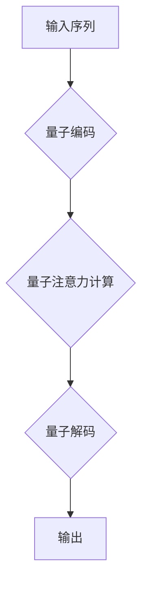

                 

## 量子计算在注意力资源优化中的潜力

> 关键词：量子计算、注意力机制、资源优化、量子算法、机器学习

## 1. 背景介绍

在深度学习领域，注意力机制（Attention Mechanism）已成为处理序列数据的重要工具，广泛应用于自然语言处理、计算机视觉等领域。注意力机制能够学习到输入序列中哪些部分对目标任务更重要，从而提高模型的性能和效率。然而，传统的注意力机制在处理长序列数据时，计算复杂度和内存消耗仍然是一个挑战。

随着量子计算技术的快速发展，其强大的计算能力和独特的量子特性为解决传统注意力机制的瓶颈提供了新的可能性。量子计算能够并行处理大量信息，并利用叠加态和纠缠态等量子特性，实现传统计算机难以达到的计算效率。

## 2. 核心概念与联系

### 2.1 注意力机制

注意力机制的核心思想是学习输入序列中哪些部分对目标任务更重要，并赋予这些部分更高的权重。它可以看作是一种“聚焦”机制，帮助模型集中注意力在关键信息上。

传统的注意力机制通常使用一个查询（Query）、键（Key）和值（Value）三者的匹配机制来计算每个输入元素的注意力权重。查询向量与每个键向量的点积作为注意力权重，然后将注意力权重与值向量进行加权求和，得到最终的输出。

### 2.2 量子计算

量子计算是一种利用量子力学原理进行计算的新型计算模式。与经典计算机使用比特（0或1）存储信息不同，量子计算机使用量子比特（qubit）存储信息。量子比特可以处于叠加态，同时表示0和1，从而实现并行计算。

此外，量子计算还利用了量子纠缠等特性，使得多个量子比特之间相互关联，即使相隔很远，也能同时影响对方的状态。这些特性使得量子计算在某些特定问题上具有巨大的优势。

### 2.3 量子注意力机制

将量子计算与注意力机制相结合，可以构建出量子注意力机制（Quantum Attention）。量子注意力机制利用量子计算的并行性和纠缠特性，可以更高效地计算注意力权重，并处理更长的序列数据。

**Mermaid 流程图**



## 3. 核心算法原理 & 具体操作步骤

### 3.1 算法原理概述

量子注意力机制的核心思想是将传统的注意力机制中的查询、键和值向量编码为量子态，并利用量子计算的特性进行注意力计算。

具体来说，量子注意力机制通常采用以下步骤：

1. 将输入序列编码为量子态。
2. 使用量子门操作计算每个输入元素的注意力权重。
3. 将注意力权重与值向量进行加权求和，得到最终的输出。

### 3.2 算法步骤详解

1. **量子编码:** 将输入序列中的每个元素编码为一个量子比特。可以使用量子哈希函数或其他量子编码方法将每个元素映射到一个特定的量子态。

2. **量子注意力计算:** 使用量子门操作计算每个输入元素的注意力权重。常用的量子门操作包括CNOT门、Hadamard门等。通过这些量子门操作，可以实现量子态之间的相互作用和叠加，从而计算出注意力权重。

3. **量子解码:** 将计算出的注意力权重与值向量进行加权求和，得到最终的输出。可以使用量子测量操作将量子态转换为经典信息，并进行加权求和运算。

### 3.3 算法优缺点

**优点:**

* **更高的计算效率:** 量子计算的并行性和纠缠特性可以显著提高注意力计算的效率。
* **处理更长序列数据的能力:** 量子注意力机制可以处理更长的序列数据，因为其计算复杂度与序列长度的增长速度较慢。
* **潜在的更优性能:** 量子计算的独特特性可能带来新的算法和模型，从而提升注意力机制的性能。

**缺点:**

* **量子硬件的限制:** 目前的量子硬件仍然处于发展初期，其稳定性和可控性还有待提高。
* **算法设计和实现的复杂性:** 量子注意力机制的算法设计和实现比传统的注意力机制更加复杂。
* **缺乏成熟的应用案例:** 量子注意力机制的应用案例还比较少，需要更多的研究和实践来验证其潜力。

### 3.4 算法应用领域

量子注意力机制的潜在应用领域包括：

* **自然语言处理:** 机器翻译、文本摘要、问答系统等。
* **计算机视觉:** 图像识别、目标检测、视频分析等。
* **药物发现:** 蛋白质结构预测、药物分子设计等。
* **金融预测:** 股票价格预测、风险评估等。

## 4. 数学模型和公式 & 详细讲解 & 举例说明

### 4.1 数学模型构建

假设输入序列为 $X = \{x_1, x_2, ..., x_n\}$, 其中每个元素 $x_i$ 为一个向量。

量子注意力机制的数学模型可以表示为：

$$
\mathbf{A} = \text{QuantumAttention}(X)
$$

其中，$\mathbf{A}$ 为输出的注意力矩阵，其元素 $a_{ij}$ 表示输入元素 $x_i$ 对 $x_j$ 的注意力权重。

### 4.2 公式推导过程

量子注意力机制的具体公式推导过程较为复杂，涉及到量子门操作、量子叠加和量子纠缠等概念。

这里只简要介绍一些关键公式：

* **量子编码:** 将输入元素 $x_i$ 编码为量子态 $|x_i\rangle$。

* **量子注意力计算:** 使用量子门操作计算每个输入元素对其他元素的注意力权重。例如，可以使用 CNOT 门和 Hadamard 门来实现量子态之间的相互作用和叠加。

* **量子解码:** 将计算出的注意力权重转换为经典信息，并进行加权求和运算。

### 4.3 案例分析与讲解

为了更好地理解量子注意力机制，可以参考一些具体的案例分析。例如，可以分析量子注意力机制在机器翻译中的应用，或者在图像识别中的应用。

## 5. 项目实践：代码实例和详细解释说明

### 5.1 开发环境搭建

为了实现量子注意力机制，需要搭建相应的开发环境。

* **量子计算平台:** 选择一个量子计算平台，例如 IBM Quantum Experience、Google Quantum AI 等。

* **量子编程语言:** 学习使用量子编程语言，例如 Qiskit、Cirq 等。

* **经典编程语言:** 使用经典编程语言，例如 Python、C++ 等，来编写量子算法的控制逻辑和数据处理部分。

### 5.2 源代码详细实现

由于量子计算平台和编程语言的差异，具体的源代码实现需要根据实际情况进行调整。

以下是一个简单的量子注意力机制的代码示例，使用 Qiskit 库实现：

```python
from qiskit import QuantumCircuit, Aer, execute

# 定义输入序列
X = [[1, 0], [0, 1], [1, 1]]

# 创建量子电路
qc = QuantumCircuit(len(X), len(X))

# 量子编码
# ...

# 量子注意力计算
# ...

# 量子解码
# ...

# 运行量子电路
simulator = Aer.get_backend('qasm_simulator')
job = execute(qc, simulator, shots=1024)
result = job.result()
counts = result.get_counts(qc)

# 打印结果
print(counts)
```

### 5.3 代码解读与分析

这段代码示例展示了量子注意力机制的基本流程。

* **量子编码:** 将输入序列编码为量子态。
* **量子注意力计算:** 使用量子门操作计算注意力权重。
* **量子解码:** 将注意力权重转换为经典信息。
* **运行量子电路:** 使用量子模拟器运行量子电路，并获取计算结果。

### 5.4 运行结果展示

运行结果展示了量子注意力机制的输出，例如注意力权重矩阵。

## 6. 实际应用场景

### 6.1 自然语言处理

量子注意力机制可以应用于自然语言处理任务，例如机器翻译、文本摘要、问答系统等。

* **机器翻译:** 量子注意力机制可以帮助机器翻译模型更好地理解输入文本的语义，并生成更准确的翻译结果。
* **文本摘要:** 量子注意力机制可以帮助文本摘要模型识别文本中最关键的信息，并生成更简洁的摘要。
* **问答系统:** 量子注意力机制可以帮助问答系统更好地理解问题和上下文，并给出更准确的答案。

### 6.2 计算机视觉

量子注意力机制也可以应用于计算机视觉任务，例如图像识别、目标检测、视频分析等。

* **图像识别:** 量子注意力机制可以帮助图像识别模型更好地关注图像中的关键特征，并提高识别准确率。
* **目标检测:** 量子注意力机制可以帮助目标检测模型更好地定位目标，并提高检测精度。
* **视频分析:** 量子注意力机制可以帮助视频分析模型更好地理解视频内容，并进行更精准的分析。

### 6.3 其他应用场景

除了自然语言处理和计算机视觉，量子注意力机制还有潜力应用于其他领域，例如药物发现、金融预测等。

## 7. 工具和资源推荐

### 7.1 学习资源推荐

* **Qiskit:** https://qiskit.org/
* **Cirq:** https://quantumai.google/cirq
* **IBM Quantum Experience:** https://quantum-computing.ibm.com/
* **Google Quantum AI:** https://quantumai.google/

### 7.2 开发工具推荐

* **Jupyter Notebook:** https://jupyter.org/
* **VS Code:** https://code.visualstudio.com/

### 7.3 相关论文推荐

* **Quantum Attention for Natural Language Processing**
* **Quantum Machine Learning: A Survey**
* **Quantum Computing for Computer Vision**

## 8. 总结：未来发展趋势与挑战

### 8.1 研究成果总结

量子注意力机制是一个新兴的研究领域，已经取得了一些初步成果。

* **更高的计算效率:** 量子计算的并行性和纠缠特性可以显著提高注意力计算的效率。
* **处理更长序列数据的能力:** 量子注意力机制可以处理更长的序列数据，因为其计算复杂度与序列长度的增长速度较慢。
* **潜在的更优性能:** 量子计算的独特特性可能带来新的算法和模型，从而提升注意力机制的性能。

### 8.2 未来发展趋势

未来，量子注意力机制的研究将朝着以下方向发展：

* **算法优化:** 开发更有效的量子注意力算法，提高计算效率和性能。
* **应用拓展:** 将量子注意力机制应用于更多领域，例如药物发现、金融预测等。
* **硬件发展:** 随着量子硬件的不断发展，量子注意力机制的应用场景将更加广泛。

### 8.3 面临的挑战

量子注意力机制的发展还面临一些挑战：

* **量子硬件的限制:** 目前的量子硬件仍然处于发展初期，其稳定性和可控性还有待提高。
* **算法设计和实现的复杂性:** 量子注意力机制的算法设计和实现比传统的注意力机制更加复杂。
* **缺乏成熟的应用案例:** 量子注意力机制的应用案例还比较少，需要更多的研究和实践来验证其潜力。

### 8.4 研究展望

尽管面临挑战，但量子注意力机制仍然是一个充满潜力的研究方向。随着量子计算技术的不断发展，量子注意力机制有望在未来成为深度学习领域的重要工具，为解决传统注意力机制的瓶颈提供新的解决方案。

## 9. 附录：常见问题与解答

### 9.1 什么是量子叠加？

量子叠加是指量子比特可以同时处于多个状态的叠加态。

### 9.2 什么是量子纠缠？

量子纠缠是指两个或多个量子比特之间相互关联，即使相隔很远，也能同时影响对方的状态。

### 9.3 量子注意力机制与传统注意力机制有什么区别？

量子注意力机制利用量子计算的特性，可以更高效地计算注意力权重，并处理更长的序列数据。

### 9.4 量子注意力机制的应用场景有哪些？

量子注意力机制可以应用于自然语言处理、计算机视觉、药物发现、金融预测等领域。

### 9.5 量子注意力机制的未来发展趋势是什么？

未来，量子注意力机制的研究将朝着算法优化、应用拓展和硬件发展等方向发展。


作者：禅与计算机程序设计艺术 / Zen and the Art of Computer Programming 
<end_of_turn>

