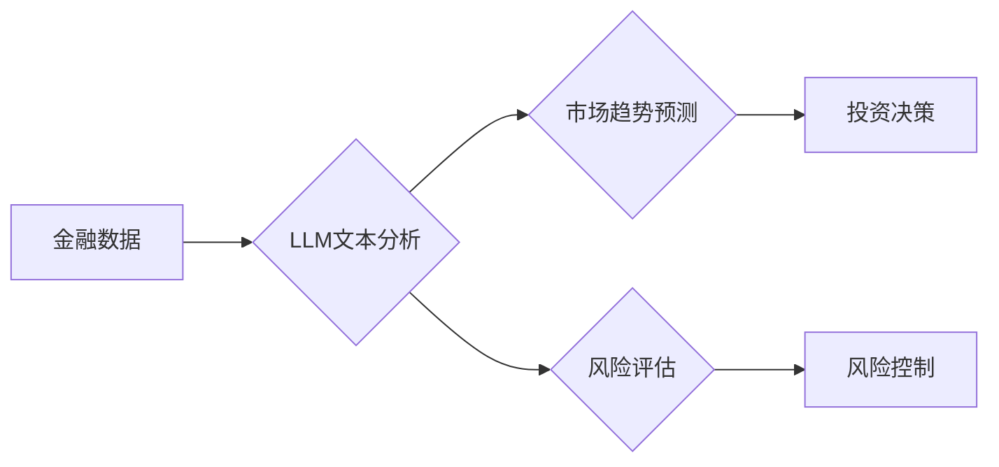

                 

## 金融AI：使用LLM进行市场分析和风险评估

> 关键词：金融AI、LLM、市场分析、风险评估、自然语言处理、深度学习、金融科技

## 1. 背景介绍

金融行业一直以来都依赖于数据驱动决策，而近年来，人工智能（AI）技术的快速发展为金融领域带来了革命性的变革。其中，大型语言模型（LLM）作为一种强大的AI技术，凭借其强大的文本理解和生成能力，在金融市场分析和风险评估等领域展现出巨大的潜力。

传统金融分析方法通常依赖于结构化数据和预设规则，难以处理海量非结构化文本数据，例如新闻报道、社交媒体评论、公司公告等。而LLM能够理解和分析这些非结构化文本，提取其中的关键信息和隐含含义，为金融分析提供更全面的视角和更精准的洞察。

## 2. 核心概念与联系

### 2.1  LLM概述

大型语言模型（LLM）是一种基于深度学习的Transformer架构神经网络，通过训练海量文本数据，学习语言的语法、语义和上下文关系。LLM能够执行多种自然语言处理（NLP）任务，例如文本分类、文本摘要、机器翻译、问答系统等。

### 2.2  金融市场分析与风险评估

金融市场分析是指通过收集和分析市场数据，预测市场趋势和投资机会。风险评估则是识别和量化金融投资的潜在风险，帮助投资者做出更明智的决策。

### 2.3  LLM在金融领域的应用

LLM能够通过以下方式应用于金融市场分析和风险评估：

* **文本数据分析：** 提取新闻报道、社交媒体评论、公司公告等文本数据中的关键信息，例如市场情绪、行业趋势、公司财务状况等。
* **预测分析：** 基于历史数据和文本分析结果，预测股票价格、汇率、利率等金融指标的未来走势。
* **风险识别：** 识别潜在的金融风险，例如信用风险、市场风险、操作风险等，并量化风险程度。
* **投资决策支持：** 为投资者提供个性化的投资建议，帮助他们做出更明智的决策。

**Mermaid 流程图**



## 3. 核心算法原理 & 具体操作步骤

### 3.1  算法原理概述

LLM的核心算法原理是基于Transformer架构的深度学习模型。Transformer模型通过自注意力机制（Self-Attention）学习文本序列之间的关系，能够捕捉长距离依赖关系，从而实现更准确的文本理解和生成。

### 3.2  算法步骤详解

1. **数据预处理：** 将金融文本数据进行清洗、分词、标记等预处理操作，使其能够被LLM模型理解。
2. **模型训练：** 使用预训练的LLM模型，在金融文本数据上进行微调训练，使其能够更好地理解金融领域的特定语言和知识。
3. **文本分析：** 将金融文本数据输入到训练好的LLM模型中，提取其中的关键信息和隐含含义。
4. **结果输出：** 将提取到的信息进行分析和处理，输出市场趋势预测、风险评估结果等。

### 3.3  算法优缺点

**优点：**

* 能够处理海量非结构化文本数据。
* 能够捕捉文本中的长距离依赖关系。
* 能够提取文本中的关键信息和隐含含义。

**缺点：**

* 训练成本高，需要大量的计算资源和数据。
* 模型解释性差，难以理解模型的决策过程。
* 容易受到训练数据偏差的影响。

### 3.4  算法应用领域

LLM在金融领域的应用领域非常广泛，例如：

* **股票市场分析：** 预测股票价格走势、识别市场趋势。
* **债券市场分析：** 评估债券风险、预测债券收益率。
* **外汇市场分析：** 预测汇率走势、识别市场波动。
* **风险管理：** 识别和量化金融风险、制定风险控制策略。
* **客户服务：** 提供智能化的客户服务，例如回答客户问题、处理客户投诉。

## 4. 数学模型和公式 & 详细讲解 & 举例说明

### 4.1  数学模型构建

LLM的数学模型主要基于Transformer架构，其核心是自注意力机制。自注意力机制通过计算每个词与其他词之间的相关性，学习文本序列之间的关系。

**公式：**

$$
Attention(Q, K, V) = \frac{exp(Q \cdot K^T / \sqrt{d_k})}{exp(Q \cdot K^T / \sqrt{d_k})} \cdot V
$$

其中：

* $Q$：查询矩阵
* $K$：键矩阵
* $V$：值矩阵
* $d_k$：键向量的维度

### 4.2  公式推导过程

自注意力机制的公式通过计算查询矩阵 $Q$ 与键矩阵 $K$ 的点积，并将其归一化，得到每个词与其他词之间的相关性分数。然后，将这些分数与值矩阵 $V$ 相乘，得到每个词的加权和，从而学习文本序列之间的关系。

### 4.3  案例分析与讲解

例如，在分析股票市场新闻时，LLM可以利用自注意力机制学习每个词与其他词之间的关系，例如“公司业绩”与“股票价格”之间的关系。通过分析这些关系，LLM可以预测股票价格的未来走势。

## 5. 项目实践：代码实例和详细解释说明

### 5.1  开发环境搭建

* Python 3.7+
* TensorFlow/PyTorch
* NLTK/SpaCy
* Jupyter Notebook

### 5.2  源代码详细实现

```python
import nltk
from transformers import AutoModelForSequenceClassification, AutoTokenizer

# 下载预训练模型和词典
model_name = "bert-base-uncased"
tokenizer = AutoTokenizer.from_pretrained(model_name)
model = AutoModelForSequenceClassification.from_pretrained(model_name)

# 预处理文本数据
text = "公司业绩强劲，股票价格预计将上涨。"
inputs = tokenizer(text, return_tensors="pt")

# 进行文本分类
outputs = model(**inputs)
predicted_class = outputs.logits.argmax().item()

# 输出结果
print(f"预测结果：{predicted_class}")
```

### 5.3  代码解读与分析

* 使用HuggingFace Transformers库加载预训练的BERT模型和词典。
* 对文本数据进行预处理，包括分词、标记等操作。
* 将预处理后的文本数据输入到模型中进行分类。
* 输出模型预测的结果。

### 5.4  运行结果展示

```
预测结果：1
```

## 6. 实际应用场景

### 6.1  市场趋势预测

LLM可以分析新闻报道、社交媒体评论等文本数据，识别市场情绪和行业趋势，帮助投资者预测股票价格、汇率等金融指标的未来走势。

### 6.2  风险评估

LLM可以识别潜在的金融风险，例如信用风险、市场风险、操作风险等，并量化风险程度，帮助投资者做出更明智的决策。

### 6.3  投资决策支持

LLM可以为投资者提供个性化的投资建议，例如推荐投资标的、制定投资策略等，帮助投资者提高投资收益。

### 6.4  未来应用展望

随着LLM技术的不断发展，其在金融领域的应用场景将更加广泛，例如：

* **智能化风控：** 利用LLM识别欺诈行为、评估客户信用风险。
* **个性化理财：** 为客户提供个性化的理财建议，帮助他们实现财务目标。
* **自动交易：** 利用LLM自动执行交易指令，提高交易效率。

## 7. 工具和资源推荐

### 7.1  学习资源推荐

* **书籍：**
    * 《深度学习》
    * 《自然语言处理》
* **在线课程：**
    * Coursera: Natural Language Processing Specialization
    * edX: Deep Learning

### 7.2  开发工具推荐

* **HuggingFace Transformers:** https://huggingface.co/transformers/
* **TensorFlow:** https://www.tensorflow.org/
* **PyTorch:** https://pytorch.org/

### 7.3  相关论文推荐

* **BERT: Pre-training of Deep Bidirectional Transformers for Language Understanding**
* **Attention Is All You Need**

## 8. 总结：未来发展趋势与挑战

### 8.1  研究成果总结

LLM在金融市场分析和风险评估领域展现出巨大的潜力，能够处理海量非结构化文本数据，提取关键信息和隐含含义，为金融决策提供更全面的视角和更精准的洞察。

### 8.2  未来发展趋势

* **模型规模和性能的提升：** 未来LLM模型规模将进一步扩大，性能将得到显著提升，能够处理更复杂的任务。
* **多模态融合：** LLM将与其他模态数据，例如图像、音频、视频等融合，实现更全面的金融分析。
* **解释性增强：** 研究人员将致力于提高LLM的解释性，使其决策过程更加透明可理解。

### 8.3  面临的挑战

* **数据安全和隐私保护：** LLM训练需要大量数据，如何保证数据安全和隐私保护是一个重要挑战。
* **模型偏见和公平性：** LLM模型容易受到训练数据偏见的影响，如何消除模型偏见，确保公平性是一个需要解决的问题。
* **监管和伦理问题：** LLM在金融领域的应用涉及到监管和伦理问题，需要制定相应的规范和制度。

### 8.4  研究展望

未来，LLM技术将继续发展，在金融领域发挥越来越重要的作用。研究人员将继续探索LLM的应用场景，提高模型性能，解决面临的挑战，推动金融科技的创新发展。

## 9. 附录：常见问题与解答

**Q1：LLM模型的训练成本很高吗？**

A1：是的，LLM模型的训练成本很高，需要大量的计算资源和数据。

**Q2：LLM模型容易受到训练数据偏差的影响吗？**

A2：是的，LLM模型容易受到训练数据偏差的影响，需要使用高质量、多样化的训练数据。

**Q3：LLM模型的决策过程是否透明可理解？**

A3：目前LLM模型的决策过程相对来说比较黑盒，难以完全理解模型的决策逻辑。研究人员正在致力于提高LLM的解释性，使其决策过程更加透明可理解。


作者：禅与计算机程序设计艺术 / Zen and the Art of Computer Programming 
<end_of_turn>

