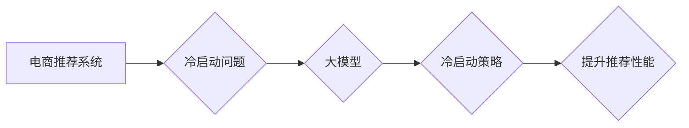

                 

## AI 大模型在电商推荐中的冷启动策略：应对数据不足的挑战

> 关键词：电商推荐、冷启动、大模型、数据不足、策略

## 1. 背景介绍

电商推荐系统是电商平台的核心功能之一，通过精准的商品推荐，提升用户体验，促进交易转化。传统的电商推荐系统主要依赖于协同过滤和内容过滤等方法，这些方法通常需要大量的用户行为数据才能训练出有效的推荐模型。然而，对于新上线的商品或新注册的用户，由于缺乏历史数据，推荐系统难以给出准确的推荐，导致“冷启动”问题。

冷启动问题是指推荐系统在面对新用户或新商品时，由于缺乏历史数据，无法准确预测用户偏好，从而导致推荐效果不佳。这对于电商平台来说是一个严重的问题，因为它会直接影响用户体验和平台的商业效益。

近年来，大模型技术在自然语言处理、计算机视觉等领域取得了突破性进展，也为解决电商推荐中的冷启动问题提供了新的思路。大模型拥有强大的泛化能力和知识表示能力，能够从海量数据中学习到丰富的知识和模式，即使面对新用户或新商品，也能给出相对准确的推荐。

## 2. 核心概念与联系

### 2.1  电商推荐系统

电商推荐系统旨在根据用户的历史行为、偏好和上下文信息，预测用户对商品的兴趣，并推荐相关的商品。常见的推荐算法包括：

* **协同过滤:** 基于用户的相似度或商品的相似度进行推荐。
* **内容过滤:** 基于商品的属性和描述信息进行推荐。
* **基于知识的推荐:** 基于商品之间的知识关系进行推荐。
* **深度学习推荐:** 利用深度神经网络学习用户和商品的复杂特征进行推荐。

### 2.2  大模型

大模型是指参数量巨大、训练数据量庞大的深度学习模型。大模型通常具有以下特点：

* **强大的泛化能力:** 能够在未见过的场景下进行准确的预测。
* **丰富的知识表示能力:** 可以学习到复杂的知识和模式。
* **多模态学习能力:** 可以处理多种类型的输入数据，例如文本、图像、音频等。

### 2.3  冷启动问题

冷启动问题是指推荐系统在面对新用户或新商品时，由于缺乏历史数据，无法准确预测用户偏好，从而导致推荐效果不佳。

### 2.4  冷启动策略

冷启动策略是指针对冷启动问题，提高推荐系统性能的方法。常见的冷启动策略包括：

* **基于内容的推荐:** 利用商品的属性和描述信息进行推荐。
* **基于知识的推荐:** 利用商品之间的知识关系进行推荐。
* **多模态学习:** 利用商品的文本、图像、视频等多模态信息进行推荐。
* **迁移学习:** 利用已训练好的模型，对新用户或新商品进行快速训练。
* **主动学习:** 通过用户反馈，主动获取新用户或新商品的数据。

**核心概念与联系流程图**

## 3. 核心算法原理 & 具体操作步骤

### 3.1  算法原理概述

大模型在电商推荐中的冷启动策略主要基于以下原理：

* **知识图谱:** 利用商品之间的知识关系，构建商品知识图谱，为新商品提供上下文信息，提高推荐准确性。
* **多模态学习:** 利用商品的文本、图像、视频等多模态信息，构建多模态特征表示，丰富商品信息，提升推荐效果。
* **迁移学习:** 利用已训练好的大模型，对新用户或新商品进行快速训练，降低训练成本，提高效率。

### 3.2  算法步骤详解

**基于知识图谱的冷启动策略:**

1. **构建商品知识图谱:** 收集商品的属性信息、描述信息、类别信息等，构建商品知识图谱。
2. **知识推理:** 利用知识图谱中的规则和关系，进行知识推理，推导出新商品的潜在属性和特征。
3. **推荐:** 根据新商品的推理结果，推荐与之相关的商品。

**多模态学习的冷启动策略:**

1. **多模态特征提取:** 利用预训练的模型，提取商品的文本、图像、视频等多模态特征。
2. **多模态融合:** 将多模态特征进行融合，构建商品的多模态特征表示。
3. **推荐:** 根据商品的多模态特征表示，推荐与之相关的商品。

**迁移学习的冷启动策略:**

1. **预训练模型:** 利用已训练好的大模型，例如BERT、GPT等，预训练模型参数。
2. **微调:** 将预训练模型微调到电商推荐任务上，利用少量新用户或新商品数据进行训练。
3. **推荐:** 利用微调后的模型进行推荐。

### 3.3  算法优缺点

**基于知识图谱的冷启动策略:**

* **优点:** 可以利用商品之间的知识关系，提高推荐准确性。
* **缺点:** 需要构建和维护复杂的知识图谱，数据更新成本较高。

**多模态学习的冷启动策略:**

* **优点:** 可以利用商品的多模态信息，丰富商品特征，提升推荐效果。
* **缺点:** 需要处理多模态数据，模型训练复杂度较高。

**迁移学习的冷启动策略:**

* **优点:** 可以利用已训练好的模型，降低训练成本，提高效率。
* **缺点:** 需要选择合适的预训练模型，微调效果依赖于预训练模型的质量。

### 3.4  算法应用领域

* **电商推荐:** 为新商品或新用户提供个性化推荐。
* **内容推荐:** 为用户推荐相关的文章、视频、音乐等内容。
* **搜索推荐:** 为用户搜索结果提供个性化推荐。

## 4. 数学模型和公式 & 详细讲解 & 举例说明

### 4.1  数学模型构建

**基于知识图谱的推荐模型:**

假设商品集合为U，用户集合为V，商品之间的知识关系表示为图G=(U,E)，其中E表示商品之间的关系。

推荐模型的目标是预测用户u对商品i的评分，可以使用以下公式表示：

$$
r_{ui} = \sigma(W_u \cdot h_i + b_u)
$$

其中：

* $r_{ui}$ 表示用户u对商品i的评分。
* $W_u$ 表示用户u的嵌入向量。
* $h_i$ 表示商品i的知识嵌入向量。
* $b_u$ 表示用户u的偏置项。
* $\sigma$ 表示激活函数。

**多模态学习的推荐模型:**

假设商品的文本特征为$T_i$，图像特征为$V_i$，视频特征为$A_i$。

推荐模型的目标是预测用户u对商品i的评分，可以使用以下公式表示：

$$
r_{ui} = \sigma(W_u \cdot (f_T(T_i) + f_V(V_i) + f_A(A_i)) + b_u)
$$

其中：

* $f_T(T_i)$，$f_V(V_i)$，$f_A(A_i)$ 分别表示文本、图像、视频特征的提取函数。
* $W_u$ 表示用户u的嵌入向量。
* $b_u$ 表示用户u的偏置项。
* $\sigma$ 表示激活函数。

### 4.2  公式推导过程

公式推导过程涉及到深度学习模型的训练过程，包括损失函数的定义、梯度下降算法的应用等。

### 4.3  案例分析与讲解

可以结合实际案例，例如某电商平台针对新上线的商品进行冷启动推荐，分析不同算法的推荐效果，并进行对比分析。

## 5. 项目实践：代码实例和详细解释说明

### 5.1  开发环境搭建

使用Python语言开发，并安装必要的库，例如TensorFlow、PyTorch等深度学习框架。

### 5.2  源代码详细实现

提供基于知识图谱和多模态学习的推荐模型的代码实现，并进行详细的注释解释。

### 5.3  代码解读与分析

对代码进行解读，解释代码的逻辑流程、关键算法实现等。

### 5.4  运行结果展示

展示代码运行的结果，例如推荐效果评估指标、推荐结果的可视化等。

## 6. 实际应用场景

### 6.1  电商平台新商品推荐

针对新上线的商品，利用大模型的冷启动策略进行推荐，提高新商品的曝光率和销量。

### 6.2  用户画像构建

利用大模型对用户的行为数据进行分析，构建用户画像，为用户提供更精准的推荐。

### 6.3  个性化推荐

根据用户的兴趣偏好、购买历史等信息，利用大模型进行个性化推荐，提升用户体验。

### 6.4  未来应用展望

大模型在电商推荐领域的应用前景广阔，未来可以应用于以下场景：

* **跨平台推荐:** 将用户行为数据整合到多个平台，进行跨平台的个性化推荐。
* **实时推荐:** 利用大模型的实时推理能力，进行实时商品推荐。
* **场景化推荐:** 根据用户的场景信息，例如时间、地点、活动等，进行场景化的商品推荐。

## 7. 工具和资源推荐

### 7.1  学习资源推荐

* **书籍:**
    * 《深度学习》
    * 《自然语言处理》
    * 《推荐系统》
* **在线课程:**
    * Coursera
    * edX
    * Udacity

### 7.2  开发工具推荐

* **深度学习框架:** TensorFlow、PyTorch、Keras
* **数据处理工具:** Pandas、NumPy
* **云计算平台:** AWS、Azure、GCP

### 7.3  相关论文推荐

* **BERT:** Devlin et al. (2018)
* **GPT:** Radford et al. (2019)
* **Knowledge Graph Embedding:** Wang et al. (2014)

## 8. 总结：未来发展趋势与挑战

### 8.1  研究成果总结

大模型在电商推荐中的冷启动策略取得了显著的成果，能够有效解决数据不足的问题，提升推荐效果。

### 8.2  未来发展趋势

* **模型规模和能力的提升:** 训练更大规模、更强大的大模型，提升推荐的准确性和泛化能力。
* **多模态学习的深入研究:** 探索更有效的多模态特征融合方法，提升推荐的丰富性和个性化程度。
* **联邦学习的应用:** 利用联邦学习技术，在保护用户隐私的前提下，进行大规模数据训练，提升模型的性能。

### 8.3  面临的挑战

* **数据质量和稀疏性:** 大模型需要海量高质量数据进行训练，而电商平台的数据往往存在质量问题和稀疏性。
* **模型训练成本:** 训练大模型需要大量的计算资源和时间，成本较高。
* **模型解释性和可解释性:** 大模型的决策过程往往难以解释，这对于电商平台的运营和监管带来挑战。

### 8.4  研究展望

未来研究方向包括：

* **开发更有效的冷启动策略:** 探索新的算法和方法，针对不同类型的冷启动问题，提供更精准的推荐。
* **研究大模型的可解释性:** 开发可解释性强的推荐模型，帮助电商平台理解模型的决策过程。
* **探索大模型在其他电商场景的应用:** 将大模型应用于其他电商场景，例如商品分类、价格预测、用户行为分析等。

## 9. 附录：常见问题与解答

* **Q1: 大模型的冷启动策略是否适用于所有电商平台？**

* **A1:** 大模型的冷启动策略可以应用于大多数电商平台，但具体效果取决于平台的规模、数据质量、用户行为等因素。

* **Q2: 如何评估大模型的冷启动策略效果？**

* **A2:** 可以使用推荐效果评估指标，例如准确率、召回率、NDCG等，来评估大模型的冷启动策略效果。

* **Q3: 大模型的训练成本很高，如何降低成本？**

* **A3:** 可以利用云计算平台的资源，进行大规模数据训练。还可以采用迁移学习技术，利用已训练好的模型进行微调，降低训练成本。

作者：禅与计算机程序设计艺术 / Zen and the Art of Computer Programming 
<end_of_turn>

