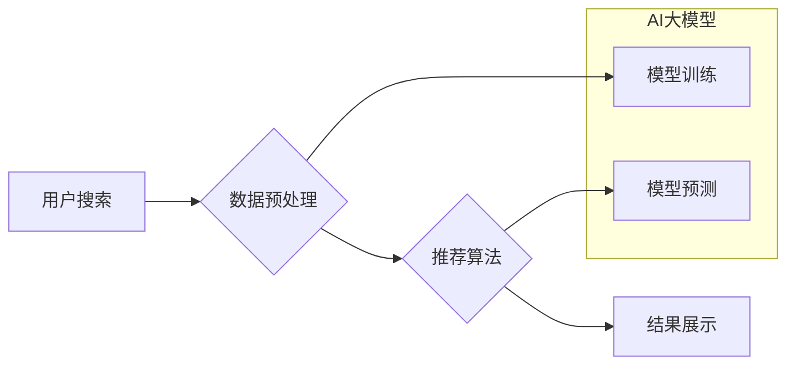

                 

## AI 大模型在电商搜索推荐中的数据处理能力要求：应对大规模数据挑战

> 关键词：AI大模型、电商搜索推荐、数据处理、大规模数据、推荐算法、数据预处理、特征工程、模型训练、性能优化

## 1. 背景介绍

电商行业竞争日益激烈，用户需求日益多元化，搜索推荐系统作为电商平台的核心功能，承担着引流、转化、提升用户体验等重要任务。传统的搜索推荐系统往往依赖于规则引擎和基于特征的机器学习模型，难以应对海量数据、用户行为复杂性和商品属性多变等挑战。近年来，随着深度学习技术的快速发展，AI大模型在电商搜索推荐领域展现出巨大的潜力。

AI大模型，是指参数量巨大、训练数据海量、具备强大的泛化能力的深度学习模型。其强大的语义理解、知识表示和预测能力，能够有效提升搜索推荐系统的精准度、个性化程度和用户体验。然而，AI大模型在电商搜索推荐中的应用也面临着诸多挑战，其中数据处理能力是关键。

## 2. 核心概念与联系

### 2.1  电商搜索推荐系统

电商搜索推荐系统旨在根据用户的搜索意图和历史行为，推荐与用户需求相匹配的商品。其核心流程包括：

1. **用户搜索**: 用户输入关键词或商品信息进行搜索。
2. **数据预处理**: 对用户搜索词和商品信息进行清洗、转换和特征提取。
3. **推荐算法**: 根据预处理后的数据，利用推荐算法生成推荐结果。
4. **结果展示**: 将推荐结果以列表、卡片等形式展示给用户。

### 2.2  AI大模型

AI大模型是指参数量巨大、训练数据海量、具备强大的泛化能力的深度学习模型。其主要特点包括：

1. **规模化**: 参数量巨大，通常包含数十亿甚至数千亿个参数。
2. **数据驱动**: 依赖海量数据进行训练，能够学习复杂的模式和关系。
3. **泛化能力强**: 能够应用于多种任务，并表现出良好的泛化能力。

### 2.3  数据处理能力

数据处理能力是指处理海量数据的能力，包括数据采集、存储、清洗、转换、特征提取等环节。AI大模型的训练和应用都需要依赖强大的数据处理能力。

**Mermaid 流程图**



## 3. 核心算法原理 & 具体操作步骤

### 3.1  算法原理概述

在电商搜索推荐系统中，常用的AI大模型算法包括：

1. **Transformer**: Transformer模型是一种基于注意力机制的深度学习模型，能够有效捕捉文本序列中的长距离依赖关系，在自然语言处理任务中表现出色。

2. **BERT**: BERT (Bidirectional Encoder Representations from Transformers) 是基于Transformer模型的预训练语言模型，能够理解上下文信息，在搜索推荐任务中能够提升关键词匹配和语义理解能力。

3. **Graph Neural Networks (GNN)**: GNN模型能够处理图结构数据，能够学习商品之间的关系和用户之间的连接，在推荐个性化商品和发现潜在兴趣方面具有优势。

### 3.2  算法步骤详解

以Transformer模型为例，其训练步骤如下：

1. **数据预处理**: 将用户搜索词和商品信息转换为数字向量，并进行分词、词嵌入等操作。

2. **模型训练**: 利用预处理后的数据，训练Transformer模型，使其能够学习用户搜索意图和商品特征之间的关系。

3. **模型评估**: 使用测试数据评估模型的性能，例如准确率、召回率、NDCG等指标。

4. **模型部署**: 将训练好的模型部署到线上环境，用于实时推荐商品。

### 3.3  算法优缺点

**Transformer模型**

* **优点**: 能够有效捕捉文本序列中的长距离依赖关系，在语义理解和推荐精准度方面表现出色。
* **缺点**: 训练成本高，需要海量数据和强大的计算资源。

**BERT模型**

* **优点**: 预训练模型，能够快速迁移到不同的任务，在关键词匹配和语义理解方面表现出色。
* **缺点**: 对于特定领域的推荐任务，可能需要进行微调才能达到最佳效果。

**GNN模型**

* **优点**: 能够处理图结构数据，学习商品之间的关系和用户之间的连接，在推荐个性化商品和发现潜在兴趣方面具有优势。
* **缺点**: 对于复杂图结构，模型训练和推理效率可能较低。

### 3.4  算法应用领域

AI大模型在电商搜索推荐领域具有广泛的应用场景，例如：

1. **商品搜索**: 根据用户搜索词，推荐与用户需求相匹配的商品。

2. **个性化推荐**: 根据用户的历史行为和偏好，推荐个性化的商品。

3. **新品推荐**: 推荐新上市的商品，帮助用户发现新产品。

4. **关联推荐**: 根据用户浏览或购买的商品，推荐相关的商品。

5. **跨界推荐**: 根据用户的兴趣爱好，推荐跨界领域的商品。

## 4. 数学模型和公式 & 详细讲解 & 举例说明

### 4.1  数学模型构建

Transformer模型的核心是注意力机制，其数学模型可以表示为：

$$
Attention(Q, K, V) = softmax(\frac{QK^T}{\sqrt{d_k}})V
$$

其中：

* $Q$：查询矩阵
* $K$：键矩阵
* $V$：值矩阵
* $d_k$：键向量的维度
* $softmax$：softmax函数

### 4.2  公式推导过程

注意力机制的目的是计算查询向量与键向量的相关性，并根据相关性加权值矩阵。

1. 计算查询向量与键向量的点积，并进行归一化处理。

2. 应用softmax函数，将点积结果转换为概率分布。

3. 将概率分布与值矩阵相乘，得到加权后的值向量。

### 4.3  案例分析与讲解

假设用户搜索关键词为“智能手机”，商品信息包括“品牌”、“型号”、“价格”等特征。

1. 将关键词和商品信息转换为数字向量。

2. 计算查询向量（用户搜索词向量）与键向量（商品特征向量）的点积。

3. 应用softmax函数，得到每个商品的注意力分数，表示该商品与用户搜索词的相关性。

4. 将注意力分数与商品信息值向量相乘，得到加权后的商品信息向量。

5. 根据加权后的商品信息向量，排序并推荐与用户搜索词相关性最高的商品。

## 5. 项目实践：代码实例和详细解释说明

### 5.1  开发环境搭建

1. 安装Python环境和必要的库，例如TensorFlow、PyTorch等深度学习框架。

2. 下载预训练模型，例如BERT、RoBERTa等。

3. 设置开发环境，例如使用Jupyter Notebook进行代码编写和调试。

### 5.2  源代码详细实现

```python
# 使用BERT模型进行商品搜索推荐

from transformers import AutoTokenizer, AutoModelForSequenceClassification

# 加载预训练模型和词典
tokenizer = AutoTokenizer.from_pretrained("bert-base-uncased")
model = AutoModelForSequenceClassification.from_pretrained("bert-base-uncased")

# 用户搜索词
query = "智能手机"

# 商品信息
products = [
    {"id": 1, "name": "小米13", "price": 3999},
    {"id": 2, "name": "华为P60", "price": 4999},
    {"id": 3, "name": "苹果iPhone14", "price": 6999},
    # ...
]

# 将用户搜索词和商品信息转换为BERT模型输入格式
query_input = tokenizer(query, return_tensors="pt")
product_inputs = [tokenizer(product["name"], return_tensors="pt") for product in products]

# 使用BERT模型预测商品与用户搜索词的相关性
query_output = model(**query_input)
product_outputs = [model(**product_input) for product_input in product_inputs]

# ...
```

### 5.3  代码解读与分析

1. 加载预训练模型和词典。

2. 将用户搜索词和商品信息转换为BERT模型输入格式。

3. 使用BERT模型预测商品与用户搜索词的相关性。

4. 根据预测结果，排序并推荐与用户搜索词相关性最高的商品。

### 5.4  运行结果展示

运行代码后，将输出商品的排序结果，例如：

```
推荐商品:
1. 苹果iPhone14
2. 小米13
3. 华为P60
```

## 6. 实际应用场景

AI大模型在电商搜索推荐领域的应用场景广泛，例如：

### 6.1  淘宝搜索推荐

淘宝平台利用AI大模型，根据用户的搜索词、浏览历史、购买记录等信息，推荐与用户需求相匹配的商品。

### 6.2  京东商品推荐

京东平台利用AI大模型，推荐新品、关联商品、个性化商品等，提升用户购物体验。

### 6.3  拼多多商品发现

拼多多平台利用AI大模型，推荐用户潜在兴趣的商品，帮助用户发现新产品。

### 6.4  未来应用展望

未来，AI大模型在电商搜索推荐领域将有更广泛的应用，例如：

1. **多模态推荐**: 结合文本、图像、视频等多模态数据，提供更丰富的推荐结果。

2. **个性化定制**: 根据用户的个性化需求，定制专属的商品推荐方案。

3. **场景化推荐**: 根据用户的购物场景，推荐更精准的商品。

4. **交互式推荐**: 通过与用户进行交互，不断学习用户的偏好，提供更个性化的推荐。

## 7. 工具和资源推荐

### 7.1  学习资源推荐

1. **深度学习框架**: TensorFlow、PyTorch、JAX等。

2. **自然语言处理库**: Hugging Face Transformers、SpaCy、NLTK等。

3. **在线课程**: Coursera、edX、Udacity等平台提供深度学习和自然语言处理相关的课程。

### 7.2  开发工具推荐

1. **Jupyter Notebook**: 用于代码编写、调试和可视化。

2. **Git**: 用于代码版本控制。

3. **Docker**: 用于容器化开发环境。

### 7.3  相关论文推荐

1. **Attention Is All You Need**: https://arxiv.org/abs/1706.03762

2. **BERT: Pre-training of Deep Bidirectional Transformers for Language Understanding**: https://arxiv.org/abs/1810.04805

3. **Graph Convolutional Networks**: https://arxiv.org/abs/1609.02907

## 8. 总结：未来发展趋势与挑战

### 8.1  研究成果总结

AI大模型在电商搜索推荐领域取得了显著的成果，能够提升推荐精准度、个性化程度和用户体验。

### 8.2  未来发展趋势

未来，AI大模型在电商搜索推荐领域将朝着以下方向发展：

1. **模型规模化**: 模型参数量将继续增加，提升模型的表达能力和泛化能力。

2. **多模态融合**: 将文本、图像、视频等多模态数据融合，提供更丰富的推荐结果。

3. **场景化定制**: 根据用户的购物场景，提供更精准的商品推荐。

4. **交互式推荐**: 通过与用户进行交互，不断学习用户的偏好，提供更个性化的推荐。

### 8.3  面临的挑战

AI大模型在电商搜索推荐领域也面临着一些挑战：

1. **数据质量**: AI大模型的训练依赖于高质量的数据，数据清洗、标注和维护是一个重要的挑战。

2. **计算资源**: 训练大型AI模型需要大量的计算资源，成本较高。

3. **模型解释性**: AI模型的决策过程往往难以解释，缺乏透明度，难以获得用户的信任。

4. **公平性与偏见**: AI模型可能存在公平性问题和偏见，需要进行相应的检测和修正。

### 8.4  研究展望

未来，需要进一步研究以下问题：

1. 如何提高数据质量和效率，降低数据处理成本。

2. 如何开发更有效的训练方法，降低模型训练成本。

3. 如何提升模型的解释性，增强用户信任。

4. 如何解决模型公平性问题，确保推荐结果的公正性。

## 9. 附录：常见问题与解答

### 9.1  常见问题

1. 如何选择合适的AI大模型？

2. 如何进行模型训练和评估？

3. 如何部署AI大模型到线上环境？

### 9.2  解答

1. 选择合适的AI大模型需要根据具体任务需求和数据特点进行选择。

2. 模型训练和评估需要使用合适的指标和方法，例如准确率、召回率、NDCG等。

3. 部署AI大模型到线上环境需要考虑模型的性能、可扩展性和安全性等因素。


作者：禅与计算机程序设计艺术 / Zen and the Art of Computer Programming 
<end_of_turn>

