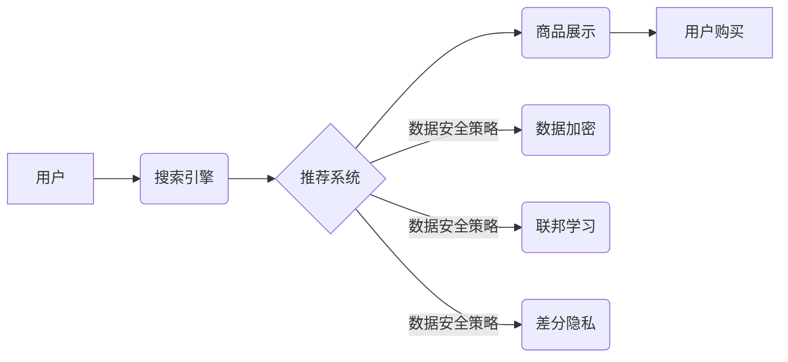

                 

## AI 大模型在电商搜索推荐中的数据安全策略：保障用户隐私与数据完整性

> 关键词：AI大模型、电商搜索推荐、数据安全、用户隐私、数据完整性、联邦学习、差分隐私、数据加密

## 1. 背景介绍

电商平台作为连接消费者和商品的桥梁，其搜索推荐系统扮演着至关重要的角色。用户通过搜索引擎或推荐列表发现并购买心仪商品，而精准的搜索推荐能够极大地提升用户体验，促进交易转化。近年来，随着人工智能技术的飞速发展，大规模的AI模型在电商搜索推荐领域得到了广泛应用。这些模型能够学习用户行为、商品特征等海量数据，提供个性化、精准的推荐结果。然而，大模型训练和应用过程中，也带来了新的数据安全挑战。

**1.1 数据安全挑战**

* **用户隐私泄露风险:** 大模型训练需要大量用户数据，包括搜索历史、浏览记录、购买行为等敏感信息。如果数据处理不当，可能会导致用户隐私泄露，造成个人信息安全隐患。
* **数据完整性破坏:** 数据在传输、存储和处理过程中，可能受到恶意攻击或系统故障的影响，导致数据丢失、篡改或损坏，从而影响推荐系统的准确性和可靠性。
* **算法可解释性问题:** 大模型的决策过程往往是复杂的，难以解释其推荐结果背后的逻辑，这可能导致用户对推荐结果产生 distrust，并引发伦理和法律争议。

**1.2 数据安全策略的重要性**

为了保障用户隐私和数据完整性，电商平台需要制定完善的数据安全策略，确保大模型的训练和应用过程安全可靠。

## 2. 核心概念与联系

**2.1 核心概念**

* **AI大模型:** 指规模庞大、参数数量众多的深度学习模型，能够学习复杂数据模式，实现强大的泛化能力。
* **电商搜索推荐:** 指根据用户需求和历史行为，从海量商品中筛选出最相关的商品，并将其推荐给用户的系统。
* **数据安全:** 指保护数据免受未经授权的访问、使用、披露、修改或销毁等威胁，确保数据安全完整和可信。
* **用户隐私:** 指个人信息在收集、使用、存储和处理过程中，享有的不被侵犯、不被滥用的权利。

**2.2 架构关系**



**2.3 核心技术**

* **数据加密:** 对敏感数据进行加密处理，防止未经授权的访问和使用。
* **联邦学习:** 在不共享原始数据的情况下，通过模型参数的迭代更新，实现模型训练和优化。
* **差分隐私:** 通过添加噪声，保护用户数据在聚合分析过程中的隐私。

## 3. 核心算法原理 & 具体操作步骤

**3.1 算法原理概述**

电商搜索推荐系统通常采用基于用户的协同过滤、基于物品的协同过滤、基于内容的推荐等算法。这些算法通过分析用户行为、商品特征等数据，预测用户对特定商品的兴趣，并将其推荐给用户。

**3.2 算法步骤详解**

* **数据预处理:** 对原始数据进行清洗、转换和特征提取，构建适合算法训练的数据集。
* **模型训练:** 使用选定的算法，训练推荐模型，学习用户行为和商品特征之间的关系。
* **模型评估:** 使用测试数据评估模型的性能，例如准确率、召回率、覆盖率等指标。
* **模型部署:** 将训练好的模型部署到线上环境，实时为用户提供推荐结果。
* **模型维护:** 定期对模型进行更新和优化，以适应不断变化的用户需求和商品信息。

**3.3 算法优缺点**

* **协同过滤:** 优点：能够发现隐性关联，推荐个性化结果。缺点：数据稀疏问题、冷启动问题。
* **基于内容的推荐:** 优点：能够解释推荐结果，避免数据稀疏问题。缺点：难以捕捉用户细微需求，推荐结果可能过于单一。
* **混合推荐:** 结合协同过滤和基于内容的推荐，发挥各自优势，提升推荐效果。

**3.4 算法应用领域**

电商搜索推荐算法广泛应用于商品推荐、用户画像、个性化营销等领域。

## 4. 数学模型和公式 & 详细讲解 & 举例说明

**4.1 数学模型构建**

协同过滤算法通常使用矩阵分解模型，将用户-商品交互矩阵分解成用户特征矩阵和商品特征矩阵。

**4.2 公式推导过程**

假设用户-商品交互矩阵为R，用户特征矩阵为U，商品特征矩阵为V。则模型的目标函数为：

$$
\min_{U,V} ||R - UV^T||_F^2
$$

其中，||.||_F^2表示Frobenius范数。

**4.3 案例分析与讲解**

假设用户A喜欢电影A和B，用户B喜欢电影B和C，则用户-商品交互矩阵为：

$$
R = \begin{bmatrix}
1 & 1 & 0 \\
0 & 1 & 1
\end{bmatrix}
$$

通过矩阵分解，可以得到用户特征矩阵U和商品特征矩阵V，从而预测用户A对电影C的评分。

## 5. 项目实践：代码实例和详细解释说明

**5.1 开发环境搭建**

使用Python语言和深度学习框架TensorFlow或PyTorch搭建开发环境。

**5.2 源代码详细实现**

```python
import tensorflow as tf

# 定义用户-商品交互矩阵
R = tf.constant([[1, 1, 0], [0, 1, 1]])

# 定义用户特征矩阵和商品特征矩阵
U = tf.Variable(tf.random.normal([2, 3]))
V = tf.Variable(tf.random.normal([3, 1]))

# 定义损失函数
loss = tf.reduce_mean(tf.square(R - tf.matmul(U, V)))

# 定义优化器
optimizer = tf.keras.optimizers.Adam()

# 训练模型
for epoch in range(100):
    with tf.GradientTape() as tape:
        loss_value = loss
    gradients = tape.gradient(loss_value, [U, V])
    optimizer.apply_gradients(zip(gradients, [U, V]))

# 预测用户A对电影C的评分
prediction = tf.matmul(U[0], V)
print(prediction)
```

**5.3 代码解读与分析**

代码首先定义用户-商品交互矩阵R，然后定义用户特征矩阵U和商品特征矩阵V。损失函数计算预测结果与真实结果之间的平方差，优化器使用Adam算法更新模型参数。训练完成后，可以使用模型预测用户对特定商品的评分。

**5.4 运行结果展示**

运行代码后，可以得到用户A对电影C的评分预测结果。

## 6. 实际应用场景

**6.1 个性化商品推荐**

根据用户的搜索历史、浏览记录、购买行为等数据，推荐个性化的商品，提升用户体验和转化率。

**6.2 用户画像分析**

通过分析用户的行为数据，构建用户画像，了解用户的兴趣爱好、消费习惯等信息，为精准营销提供数据支持。

**6.3 内容推荐**

根据用户的阅读历史、点赞记录等数据，推荐相关的文章、视频、音频等内容，满足用户的个性化需求。

**6.4 未来应用展望**

随着AI技术的不断发展，大模型在电商搜索推荐领域的应用将更加广泛和深入。例如，可以利用多模态数据，结合文本、图像、视频等信息，提供更精准、更丰富的推荐结果。

## 7. 工具和资源推荐

**7.1 学习资源推荐**

* **书籍:**
    * 《深度学习》
    * 《推荐系统实践》
* **在线课程:**
    * Coursera: 深度学习
    * Udacity: 机器学习工程师
* **博客和论坛:**
    * TensorFlow博客
    * PyTorch论坛

**7.2 开发工具推荐**

* **深度学习框架:** TensorFlow, PyTorch
* **数据处理工具:** Pandas, NumPy
* **云计算平台:** AWS, Azure, GCP

**7.3 相关论文推荐**

* 《Collaborative Filtering for Implicit Feedback Datasets》
* 《Deep Learning for Recommender Systems》

## 8. 总结：未来发展趋势与挑战

**8.1 研究成果总结**

大模型在电商搜索推荐领域取得了显著的成果，能够提供个性化、精准的推荐结果，提升用户体验和商业价值。

**8.2 未来发展趋势**

* **多模态推荐:** 结合文本、图像、视频等多模态数据，提供更丰富的推荐结果。
* **联邦学习:** 保护用户隐私，实现模型训练和优化。
* **可解释性增强:** 提高模型的透明度和可解释性，增强用户信任。

**8.3 面临的挑战**

* **数据安全:** 保护用户隐私和数据完整性。
* **算法可解释性:** 解释模型的决策过程，增强用户信任。
* **模型效率:** 提升模型训练和推理效率。

**8.4 研究展望**

未来研究将继续探索大模型在电商搜索推荐领域的应用，关注数据安全、算法可解释性和模型效率等关键问题，推动推荐系统朝着更加智能、安全、可靠的方向发展。

## 9. 附录：常见问题与解答

**9.1 如何保护用户隐私？**

* 使用数据加密技术保护敏感数据。
* 采用联邦学习技术，在不共享原始数据的情况下训练模型。
* 遵循数据隐私法规，获取用户同意并合理使用数据。

**9.2 如何保证数据完整性？**

* 使用数据校验机制，确保数据传输和存储的完整性。
* 定期备份数据，防止数据丢失。
* 监控系统日志，及时发现和处理数据异常。

**9.3 如何解释模型的决策过程？**

* 使用可解释性分析方法，解释模型的决策规则。
* 提供用户友好的解释界面，帮助用户理解推荐结果。
* 持续改进模型的可解释性，增强用户信任。


作者：禅与计算机程序设计艺术 / Zen and the Art of Computer Programming 
<end_of_turn>

