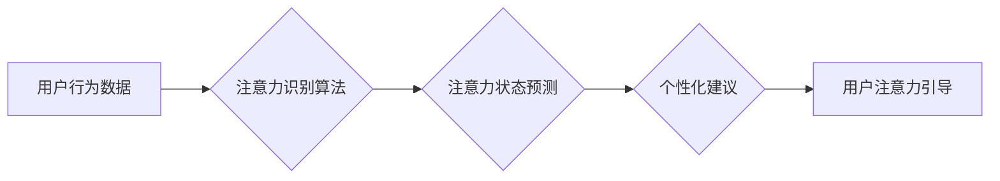

                 

## AI与人类注意力流：未来的工作、生活与注意力管理技术的创新

> 关键词：人工智能、注意力流、深度学习、神经网络、注意力机制、注意力管理、认知科学、未来工作、未来生活

## 1. 背景介绍

在信息爆炸的时代，人类面临着前所未有的注意力挑战。来自社交媒体、电子邮件、新闻推送等各种渠道的信息洪流，不断地冲击着我们的注意力，导致专注力下降、信息过载、认知疲劳等问题日益突出。 

与此同时，人工智能（AI）技术飞速发展，深度学习和神经网络等算法取得了突破性进展，为理解和管理人类注意力流提供了新的可能性。AI能够识别和分析用户的行为模式，预测用户的注意力偏好，并提供个性化的注意力管理建议。

## 2. 核心概念与联系

### 2.1 人类注意力流

人类注意力流是一个复杂而动态的过程，涉及认知、情感、生理等多方面因素。它可以被理解为一个有限的资源，需要在不同的信息源之间进行分配。

注意力流的特征包括：

* **选择性:** 人类能够从众多信息中选择关注特定信息。
* **可塑性:** 注意力流可以被训练和改变，例如通过冥想、专注练习等。
* **有限性:** 人类注意力资源有限，长时间集中注意力会导致疲劳和下降。
* **动态性:** 注意力流会随着时间和环境的变化而发生变化。

### 2.2 AI与注意力流

AI技术可以帮助我们更好地理解和管理人类注意力流。

* **注意力识别:** AI算法可以分析用户的行为数据，例如眼动追踪、鼠标移动、键盘输入等，识别用户的注意力状态和偏好。
* **注意力预测:** 基于用户的历史行为数据，AI模型可以预测用户的未来注意力流，并提供预警和建议。
* **注意力引导:** AI系统可以根据用户的注意力状态和目标，提供个性化的内容推荐、任务分配和环境调整，引导用户的注意力集中在重要信息上。

**Mermaid 流程图**



## 3. 核心算法原理 & 具体操作步骤

### 3.1 算法原理概述

注意力机制是深度学习领域的重要突破，它能够模拟人类的注意力机制，学习到输入数据中最重要的部分。

注意力机制的核心思想是：在处理序列数据时，赋予不同数据元素不同的权重，从而突出重要信息，抑制无关信息。

### 3.2 算法步骤详解

1. **输入数据:** 将序列数据输入到注意力机制中。
2. **查询、键、值矩阵:** 将输入数据转换为查询（Q）、键（K）、值（V）三个矩阵。
3. **注意力权重计算:** 计算查询矩阵与键矩阵之间的相似度，得到注意力权重。
4. **加权求和:** 根据注意力权重，对值矩阵进行加权求和，得到输出结果。

### 3.3 算法优缺点

**优点:**

* 能够学习到输入数据中最重要的部分。
* 能够处理长序列数据。
* 在自然语言处理、计算机视觉等领域取得了优异的性能。

**缺点:**

* 计算复杂度较高。
* 训练数据量较大。
* 对输入数据顺序敏感。

### 3.4 算法应用领域

注意力机制在以下领域有广泛的应用:

* **自然语言处理:** 机器翻译、文本摘要、问答系统、情感分析等。
* **计算机视觉:** 图像识别、目标检测、图像分割等。
* **语音识别:** 语音转文本、语音合成等。
* **时间序列分析:** 股票预测、天气预报等。

## 4. 数学模型和公式 & 详细讲解 & 举例说明

### 4.1 数学模型构建

注意力机制的数学模型可以表示为以下公式:

$$
\text{Attention}(Q, K, V) = \text{softmax}(\frac{Q K^T}{\sqrt{d_k}}) V
$$

其中:

* $Q$：查询矩阵
* $K$：键矩阵
* $V$：值矩阵
* $d_k$：键向量的维度
* $\text{softmax}$：softmax函数，用于将注意力权重归一化

### 4.2 公式推导过程

1. 计算查询矩阵 $Q$ 与键矩阵 $K$ 的点积，得到一个得分矩阵。
2. 对得分矩阵进行归一化，使用 softmax 函数将得分转换为注意力权重。
3. 将注意力权重与值矩阵 $V$ 进行加权求和，得到最终的输出结果。

### 4.3 案例分析与讲解

假设我们有一个句子 "The cat sat on the mat"，我们想使用注意力机制来找出句子中与 "sat" 这个词语最相关的词语。

1. 将句子中的每个词语转换为向量表示，作为查询矩阵 $Q$、键矩阵 $K$ 和值矩阵 $V$ 的输入。
2. 计算 $Q$ 与 $K$ 的点积，得到一个得分矩阵，其中每个元素代表两个词语之间的相关性。
3. 对得分矩阵进行 softmax 归一化，得到注意力权重。
4. 将注意力权重与 $V$ 进行加权求和，得到最终的输出结果，即与 "sat" 最相关的词语及其权重。

## 5. 项目实践：代码实例和详细解释说明

### 5.1 开发环境搭建

* Python 3.x
* TensorFlow 或 PyTorch 深度学习框架
* Jupyter Notebook 或 VS Code 代码编辑器

### 5.2 源代码详细实现

```python
import tensorflow as tf

# 定义注意力机制
def attention_layer(query, key, value, mask=None):
    # 计算查询与键的点积
    scores = tf.matmul(query, key, transpose_b=True)
    # 对得分进行归一化
    if mask is not None:
        scores += (mask * -1e9)
    attention_weights = tf.nn.softmax(scores, axis=-1)
    # 计算加权求和
    context_vector = tf.matmul(attention_weights, value)
    return context_vector, attention_weights

# 示例代码
query = tf.constant([[1, 2, 3], [4, 5, 6]])
key = tf.constant([[7, 8, 9], [10, 11, 12]])
value = tf.constant([[13, 14, 15], [16, 17, 18]])

context_vector, attention_weights = attention_layer(query, key, value)
print(context_vector)
print(attention_weights)
```

### 5.3 代码解读与分析

* `attention_layer` 函数定义了注意力机制的核心逻辑。
* `tf.matmul` 函数计算查询矩阵与键矩阵的点积。
* `tf.nn.softmax` 函数对得分进行归一化，得到注意力权重。
* `tf.matmul` 函数再次计算加权求和，得到最终的输出结果。

### 5.4 运行结果展示

运行上述代码，会输出注意力权重和上下文向量。注意力权重表示每个词语与查询词语之间的相关性，上下文向量则代表了查询词语在句子中的语义信息。

## 6. 实际应用场景

### 6.1 个性化学习

AI可以根据用户的学习风格和进度，个性化推荐学习内容和学习路径，引导用户的注意力集中在需要学习的关键知识点上。

### 6.2 沉浸式体验

AI可以根据用户的兴趣和偏好，生成个性化的虚拟现实（VR）和增强现实（AR）体验，引导用户的注意力沉浸在虚拟世界中。

### 6.3 健康管理

AI可以监测用户的生理数据，例如心率、睡眠、血压等，识别用户的注意力状态，并提供个性化的健康建议，帮助用户改善注意力集中能力。

### 6.4 未来应用展望

* **脑机接口:** AI可以与脑机接口技术结合，直接读取用户的脑电信号，识别用户的注意力状态，并提供更精准的注意力管理建议。
* **元宇宙:** 在元宇宙中，AI可以根据用户的虚拟身份和行为，个性化定制虚拟环境，引导用户的注意力沉浸在虚拟世界中。
* **人工智能协作:** AI可以帮助人类更好地协作，例如在会议中，AI可以识别每个人的注意力状态，并提供相应的提醒和建议，提高会议效率。

## 7. 工具和资源推荐

### 7.1 学习资源推荐

* **书籍:**
    * 《深度学习》
    * 《Attention Is All You Need》
* **在线课程:**
    * Coursera: 深度学习
    * Udacity: 自然语言处理
* **博客:**
    * Jay Alammar's Blog: https://jalammar.github.io/

### 7.2 开发工具推荐

* **TensorFlow:** https://www.tensorflow.org/
* **PyTorch:** https://pytorch.org/
* **Keras:** https://keras.io/

### 7.3 相关论文推荐

* **Attention Is All You Need:** https://arxiv.org/abs/1706.03762
* **BERT: Pre-training of Deep Bidirectional Transformers for Language Understanding:** https://arxiv.org/abs/1810.04805

## 8. 总结：未来发展趋势与挑战

### 8.1 研究成果总结

AI与注意力流的研究取得了显著进展，注意力机制在自然语言处理、计算机视觉等领域取得了优异的性能。

### 8.2 未来发展趋势

* **更强大的注意力机制:** 研究更强大的注意力机制，例如自注意力、多头注意力等，提高注意力机制的表达能力和泛化能力。
* **注意力与认知科学的结合:** 将注意力机制与认知科学研究结合，更深入地理解人类注意力机制，开发更有效的注意力管理技术。
* **跨模态注意力:** 研究跨模态注意力机制，例如文本-图像、文本-音频等，实现跨模态信息的融合和理解。

### 8.3 面临的挑战

* **数据隐私:** 使用用户行为数据训练注意力模型，需要考虑数据隐私和安全问题。
* **算法解释性:** 注意力机制的内部工作机制较为复杂，需要提高算法的解释性，方便用户理解和信任。
* **伦理问题:** AI注意力管理技术可能会被滥用，例如用于操控用户行为，需要关注其伦理问题。

### 8.4 研究展望

未来，AI与注意力流的研究将继续深入，为我们提供更强大的注意力管理工具，帮助我们更好地应对信息爆炸时代带来的挑战，提升工作效率、生活质量和认知能力。

## 9. 附录：常见问题与解答

**Q1: 注意力机制是如何工作的？**

A1: 注意力机制通过计算查询矩阵与键矩阵的点积，得到注意力权重，然后根据注意力权重对值矩阵进行加权求和，从而突出重要信息，抑制无关信息。

**Q2: 注意力机制有哪些应用场景？**

A2: 注意力机制在自然语言处理、计算机视觉、语音识别等领域有广泛的应用，例如机器翻译、文本摘要、图像识别等。

**Q3: 如何评估注意力机制的性能？**

A3: 可以使用BLEU、ROUGE等指标评估注意力机制在机器翻译、文本摘要等任务上的性能。

**Q4: 注意力机制有哪些局限性？**

A4: 注意力机制的计算复杂度较高，训练数据量较大，对输入数据顺序敏感。

**Q5: 未来注意力机制的发展趋势是什么？**

A5: 未来注意力机制将更加强大、高效、解释性强，并与其他人工智能技术融合，应用于更广泛的领域。


作者：禅与计算机程序设计艺术 / Zen and the Art of Computer Programming 
<end_of_turn>

