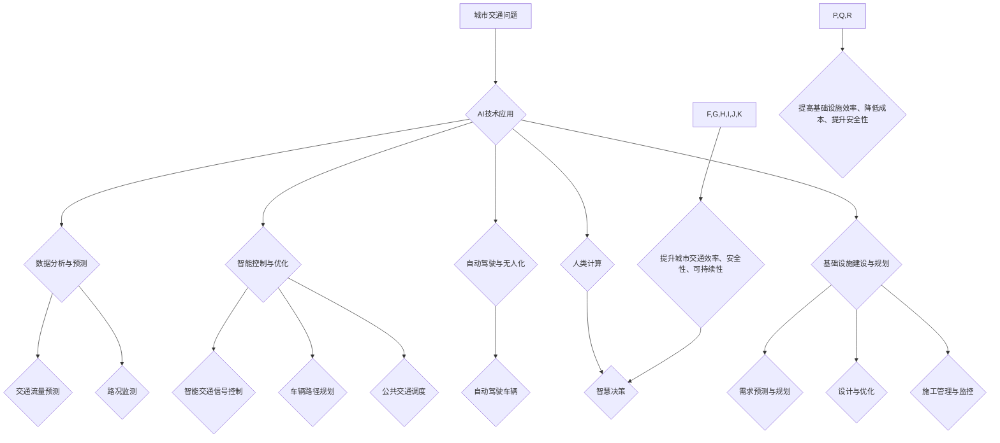

                 

## AI与人类计算：打造可持续发展的城市交通管理系统与基础设施建设与规划

> 关键词：人工智能、城市交通、交通管理系统、基础设施建设、可持续发展、人类计算、机器学习、深度学习、优化算法、数据分析

## 1. 背景介绍

随着全球人口的持续增长和城市化的加速推进，城市交通问题日益突出。拥堵、事故、污染等问题给城市居民带来了巨大的困扰，也严重制约了城市经济和社会发展。传统交通管理模式已难以满足日益复杂的需求，迫切需要引入先进的技术手段进行革新。

人工智能（AI）作为一门新兴技术，凭借其强大的数据处理能力、学习能力和决策能力，为解决城市交通问题提供了新的思路和解决方案。AI技术可以应用于各个环节，从交通流量预测、路况监测、智能交通信号控制到自动驾驶、出行规划等，全面提升城市交通效率、安全性、可持续性。

## 2. 核心概念与联系

### 2.1 人工智能与城市交通

人工智能（AI）是指模拟人类智能行为的计算机系统。在城市交通领域，AI技术主要体现在以下几个方面：

* **数据分析与预测:** AI算法可以分析海量交通数据，识别出行模式、预测交通流量、预警拥堵等，为交通管理提供决策依据。
* **智能控制与优化:** AI可以实现智能交通信号控制、车辆路径规划、公共交通调度等，优化交通流量，减少拥堵。
* **自动驾驶与无人化:** AI技术是自动驾驶的核心，可以实现车辆自动行驶、避障、决策等功能，未来将彻底改变城市交通格局。

### 2.2 人类计算与AI协同

人类计算是指人类利用自身智慧和经验进行计算和决策的过程。在城市交通管理中，AI技术与人类计算可以协同工作，发挥各自优势，实现更有效的管理。

* **AI提供数据支持:** AI可以收集、分析和处理海量交通数据，为人类决策提供客观依据。
* **人类提供智慧引导:** 人类可以根据AI分析结果，结合自身经验和专业知识，制定更合理的交通策略。

### 2.3 城市基础设施建设与规划

城市基础设施建设与规划是城市可持续发展的重要保障。AI技术可以应用于基础设施建设的各个环节，提高效率、降低成本、提升安全性。

* **需求预测与规划:** AI可以分析城市发展趋势、人口变化、交通需求等，预测未来基础设施需求，为规划提供依据。
* **设计与优化:** AI可以辅助设计更合理的交通网络、道路布局、停车场规划等，提高基础设施利用率。
* **施工管理与监控:** AI可以实现施工过程的自动化监控、数据分析，提高施工效率、降低风险。

**核心概念与联系流程图**



## 3. 核心算法原理 & 具体操作步骤

### 3.1 算法原理概述

城市交通管理系统中常用的核心算法包括：

* **机器学习算法:** 用于分析交通数据，识别出行模式，预测交通流量等。常见的机器学习算法包括线性回归、逻辑回归、决策树、支持向量机、神经网络等。
* **深度学习算法:** 用于处理复杂的数据，例如图像、视频等。深度学习算法可以实现车辆识别、路况识别、交通信号识别等功能。
* **优化算法:** 用于优化交通流量分配、车辆路径规划、交通信号控制等。常见的优化算法包括遗传算法、模拟退火算法、粒子群算法等。

### 3.2 算法步骤详解

以交通流量预测为例，详细说明机器学习算法的具体操作步骤：

1. **数据收集:** 收集历史交通数据，包括时间、地点、交通流量等信息。
2. **数据预处理:** 对收集到的数据进行清洗、转换、归一化等处理，使其适合机器学习算法的训练。
3. **模型选择:** 选择合适的机器学习算法，例如线性回归、神经网络等。
4. **模型训练:** 使用训练数据训练机器学习模型，调整模型参数，使其能够准确预测交通流量。
5. **模型评估:** 使用测试数据评估模型的预测精度，并根据评估结果进行模型调整。
6. **模型部署:** 将训练好的模型部署到实际应用环境中，用于实时预测交通流量。

### 3.3 算法优缺点

**机器学习算法:**

* **优点:** 能够从数据中学习规律，预测未来趋势，适应不断变化的交通环境。
* **缺点:** 需要大量的数据进行训练，训练时间较长，对数据质量要求较高。

**深度学习算法:**

* **优点:** 能够处理复杂的数据，例如图像、视频等，具有更强的学习能力。
* **缺点:** 训练数据量更大，训练时间更长，对硬件资源要求更高。

**优化算法:**

* **优点:** 可以找到最优解，提高交通效率。
* **缺点:** 算法复杂度较高，计算量较大。

### 3.4 算法应用领域

* **交通流量预测:** 预测未来交通流量，为交通管理提供决策依据。
* **路况监测:** 实时监测路况，及时发布交通信息。
* **智能交通信号控制:** 根据实时交通流量情况，优化交通信号控制，减少拥堵。
* **车辆路径规划:** 为车辆规划最优路径，提高出行效率。
* **公共交通调度:** 根据乘客需求，优化公共交通线路和班次，提高服务效率。
* **自动驾驶:** 实现车辆自动行驶、避障、决策等功能。

## 4. 数学模型和公式 & 详细讲解 & 举例说明

### 4.1 数学模型构建

交通流量预测模型可以采用以下数学模型：

* **线性回归模型:** 假设交通流量与时间、日期、天气等因素之间存在线性关系，可以使用线性回归模型进行预测。

$$
y = \beta_0 + \beta_1x_1 + \beta_2x_2 + ... + \beta_nx_n + \epsilon
$$

其中：

* $y$ 是预测的交通流量
* $x_1, x_2, ..., x_n$ 是影响交通流量的因素，例如时间、日期、天气等
* $\beta_0, \beta_1, ..., \beta_n$ 是模型参数
* $\epsilon$ 是误差项

* **神经网络模型:** 可以使用多层神经网络模型进行交通流量预测，该模型能够学习更复杂的非线性关系。

### 4.2 公式推导过程

神经网络模型的训练过程涉及到梯度下降算法，其核心公式为：

$$
\theta = \theta - \alpha \frac{\partial J}{\partial \theta}
$$

其中：

* $\theta$ 是模型参数
* $\alpha$ 是学习率
* $J$ 是损失函数，用于衡量模型预测结果与实际结果之间的误差
* $\frac{\partial J}{\partial \theta}$ 是损失函数对模型参数的梯度

### 4.3 案例分析与讲解

假设我们想要预测某条道路的交通流量，收集了该道路过去一周的交通流量数据以及相应的日期、时间、天气等信息。可以使用线性回归模型或神经网络模型进行预测。

* **线性回归模型:** 可以将交通流量作为因变量，日期、时间、天气等信息作为自变量，建立线性回归模型，并使用历史数据进行训练。
* **神经网络模型:** 可以将交通流量数据作为输入，使用多层神经网络模型进行训练，学习交通流量与各种因素之间的复杂关系。

通过训练模型，我们可以得到预测交通流量的公式，并将其应用于未来时间段的预测。

## 5. 项目实践：代码实例和详细解释说明

### 5.1 开发环境搭建

* **操作系统:** Ubuntu 20.04 LTS
* **编程语言:** Python 3.8
* **深度学习框架:** TensorFlow 2.0
* **数据处理库:** Pandas
* **可视化库:** Matplotlib

### 5.2 源代码详细实现

```python
import pandas as pd
from tensorflow.keras.models import Sequential
from tensorflow.keras.layers import Dense

# 1. 数据加载和预处理
data = pd.read_csv('traffic_data.csv')
# ... 数据清洗、转换、归一化等操作

# 2. 模型构建
model = Sequential()
model.add(Dense(64, activation='relu', input_shape=(data.shape[1] - 1,)))
model.add(Dense(32, activation='relu'))
model.add(Dense(1))

# 3. 模型编译
model.compile(loss='mean_squared_error', optimizer='adam')

# 4. 模型训练
model.fit(data.iloc[:, :-1], data.iloc[:, -1], epochs=100, batch_size=32)

# 5. 模型评估
# ... 使用测试数据评估模型性能

# 6. 模型部署
# ... 将训练好的模型部署到实际应用环境中
```

### 5.3 代码解读与分析

* **数据加载和预处理:** 首先需要加载交通数据，并进行必要的预处理操作，例如数据清洗、转换、归一化等。
* **模型构建:** 使用深度学习框架构建神经网络模型，包括输入层、隐藏层和输出层。
* **模型编译:** 配置模型的损失函数、优化器等参数。
* **模型训练:** 使用训练数据训练模型，调整模型参数，使其能够准确预测交通流量。
* **模型评估:** 使用测试数据评估模型的预测精度。
* **模型部署:** 将训练好的模型部署到实际应用环境中，用于实时预测交通流量。

### 5.4 运行结果展示

* **预测结果可视化:** 使用Matplotlib等库将预测结果可视化，与实际交通流量进行对比。
* **指标分析:** 计算模型的预测精度、平均绝对误差等指标，评估模型性能。

## 6. 实际应用场景

### 6.1 交通流量预测与管理

* **拥堵路段预警:** 利用AI预测拥堵路段，提前预警驾驶员，引导他们选择替代路线。
* **交通信号控制优化:** 根据实时交通流量情况，智能调整交通信号灯的绿灯时间，减少拥堵。
* **公共交通调度优化:** 根据乘客需求，优化公交车线路和班次，提高服务效率。

### 6.2 智能交通基础设施建设

* **智慧停车:** 利用AI技术实现智能停车场管理，引导车辆停靠空余车位，提高停车效率。
* **智能交通监控:** 利用摄像头和传感器，实现交通监控，识别违章行为，保障交通安全。
* **自动驾驶道路建设:** 为自动驾驶车辆提供安全可靠的道路环境，例如智能交通标志、车道线识别等。

### 6.3 城市规划与发展

* **交通需求预测:** 利用AI预测未来城市交通需求，为城市规划提供依据。
* **城市交通网络优化:** 利用AI优化城市交通网络布局，提高交通效率和安全性。
* **绿色出行推广:** 利用AI分析出行模式，推广绿色出行方式，减少交通污染。

### 6.4 未来应用展望

* **更精准的交通预测:** 利用更先进的机器学习算法和更丰富的交通数据，实现更精准的交通预测。
* **更智能的交通管理:** 利用人工智能技术实现更智能的交通管理，例如自动驾驶、无人化交通等。
* **更可持续的城市交通:** 利用AI技术促进绿色出行，减少交通污染，打造更可持续的城市交通系统。

## 7. 工具和资源推荐

### 7.1 学习资源推荐

* **书籍:**
    * 《深度学习》 - Ian Goodfellow, Yoshua Bengio, Aaron Courville
    * 《机器学习》 - Tom Mitchell
* **在线课程:**
    * Coursera: 深度学习 Specialization
    * edX: Artificial Intelligence
* **博客和网站:**
    * Towards Data Science
    * Machine Learning Mastery

### 7.2 开发工具推荐

* **深度学习框架:** TensorFlow, PyTorch, Keras
* **数据处理库:** Pandas, NumPy
* **可视化库:** Matplotlib, Seaborn
* **云计算平台:** AWS, Azure, Google Cloud

### 7.3 相关论文推荐

* **交通流量预测:**
    * "Traffic Flow Prediction Using Deep Learning" - Wang et al. (2018)
    * "A Deep Learning Approach for Short-Term Traffic Flow Prediction" - Chen et al. (2019)
* **智能交通信号控制:**
    * "Deep Reinforcement Learning for Adaptive Traffic Signal Control" - Yang et al. (2020)
    * "A Deep Learning Approach to Adaptive Traffic Signal Control" - Li et al. (2021)

## 8. 总结：未来发展趋势与挑战

### 8.1 研究成果总结

近年来，人工智能技术在城市交通管理领域取得了显著进展，例如交通流量预测、智能交通信号控制、自动驾驶等方面都取得了突破性进展。

### 8.2 未来发展趋势

* **更精准的预测:** 利用更先进的机器学习算法和更丰富的交通数据，实现更精准的交通预测。
* **更智能的决策:** 利用人工智能技术实现更智能的交通决策，例如自动驾驶、无人化交通等。
* **更可持续的交通:** 利用AI技术促进绿色出行，减少交通污染，打造更可持续的城市交通系统。

### 8.3 面临的挑战

* **数据质量:** 训练人工智能模型需要大量高质量的交通数据，而现实中交通数据往往存在不完整、不准确等问题。
* **算法复杂度:** 一些人工智能算法非常复杂，需要强大的计算能力才能训练和运行。
* **伦理问题:** 自动驾驶等人工智能技术涉及到伦理问题，例如责任归属、数据隐私等，需要认真考虑和解决。

### 8.4 研究展望

未来，人工智能技术将继续推动城市交通管理的创新发展，为打造更安全、更便捷、更可持续的城市交通系统提供强大的技术支撑。


## 9. 附录：常见问题与解答

* **Q1: AI技术是否会取代人类交通管理人员？**

> A1: AI技术可以辅助人类交通管理人员，提高工作效率，但不会完全取代人类。人类的智慧和经验仍然不可替代，例如应对突发事件、制定复杂的交通策略等。

* **Q2: AI技术在城市交通管理中的应用有哪些伦理问题？**

> A2: AI技术在城市交通管理中的应用涉及到数据隐私、算法透明度、责任归属等伦理问题，需要认真考虑和解决。例如，AI算法的决策过程是否透明可解释？数据如何保护用户隐私？在发生交通事故时，责任如何界定？

* **Q3: 如何评估AI技术在城市交通管理中的效果？**

> A3: 可以通过多种指标来评估AI技术在城市交通管理中的效果，例如交通流量预测精度、拥堵路段减少率、交通事故率下降等。


作者：禅与计算机程序设计艺术 / Zen and the Art of Computer Programming 
<end_of_turn>

