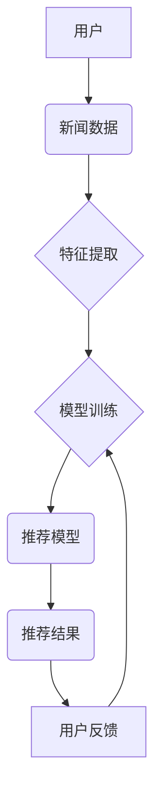

                 

## AI在个性化新闻推荐中的应用：信息精准投放

> 关键词：个性化推荐、新闻推荐、机器学习、深度学习、自然语言处理、用户画像、推荐算法

## 1. 背景介绍

在信息爆炸的时代，海量新闻资讯的涌现使得用户难以筛选出真正感兴趣的内容。传统新闻推荐系统往往依靠人工编辑或简单的规则匹配，难以满足用户个性化需求。随着人工智能技术的快速发展，基于机器学习和深度学习的个性化新闻推荐系统应运而生，为用户提供更加精准、高效的信息服务。

个性化新闻推荐系统旨在根据用户的兴趣、偏好、阅读历史等信息，预测用户可能感兴趣的新闻内容，并将其推荐给用户。这不仅可以提升用户阅读体验，还可以帮助新闻机构提高用户粘性、增加广告收入。

## 2. 核心概念与联系

### 2.1  个性化推荐

个性化推荐是指根据用户的个人特征和行为模式，定制化地推荐产品、服务或内容。其核心目标是提高用户满意度和参与度，并促进用户与平台的长期互动。

### 2.2  新闻推荐

新闻推荐是指根据用户的兴趣和偏好，推荐用户可能感兴趣的新闻文章。它可以帮助用户快速获取所需信息，并发现新的新闻内容。

### 2.3  机器学习

机器学习是人工智能领域的重要分支，它通过算法学习数据中的模式和规律，从而实现对未知数据的预测和分类。在个性化新闻推荐中，机器学习算法可以根据用户的历史行为数据，学习用户的兴趣偏好，并预测用户可能感兴趣的新闻内容。

### 2.4  深度学习

深度学习是机器学习的一种高级形式，它利用多层神经网络来模拟人类大脑的学习过程。深度学习算法在处理复杂数据和模式方面具有更强的能力，在个性化新闻推荐中可以实现更精准的推荐效果。

**核心概念与架构流程图**



## 3. 核心算法原理 & 具体操作步骤

### 3.1  算法原理概述

个性化新闻推荐算法通常基于以下核心原理：

* **用户画像构建:** 通过分析用户的历史行为数据，如阅读记录、点赞、评论等，构建用户的兴趣偏好、阅读习惯等特征，形成用户画像。
* **新闻内容分析:** 对新闻内容进行文本分析，提取关键词、主题、情感等特征，构建新闻内容的语义表示。
* **推荐模型训练:** 利用机器学习或深度学习算法，训练推荐模型，学习用户和新闻之间的关系，预测用户可能感兴趣的新闻内容。
* **推荐结果排序:** 根据推荐模型的预测结果，对推荐新闻进行排序，并展示给用户。

### 3.2  算法步骤详解

1. **数据收集:** 收集用户行为数据、新闻内容数据等。
2. **数据预处理:** 对数据进行清洗、转换、特征提取等预处理操作。
3. **用户画像构建:** 利用聚类算法、降维算法等，构建用户的兴趣偏好、阅读习惯等特征。
4. **新闻内容分析:** 利用自然语言处理技术，提取新闻内容的关键词、主题、情感等特征。
5. **推荐模型训练:** 选择合适的机器学习或深度学习算法，训练推荐模型，学习用户和新闻之间的关系。
6. **推荐结果排序:** 根据推荐模型的预测结果，对推荐新闻进行排序，并展示给用户。
7. **用户反馈收集:** 收集用户的点击、点赞、评论等反馈数据，用于模型的迭代优化。

### 3.3  算法优缺点

**优点:**

* **个性化推荐:** 根据用户的兴趣偏好，推荐更精准的内容。
* **提升用户体验:** 帮助用户快速获取所需信息，提高阅读效率。
* **数据驱动:** 基于数据分析，不断优化推荐效果。

**缺点:**

* **数据依赖:** 需要大量的数据进行训练，数据质量直接影响推荐效果。
* **算法复杂:** 训练和部署推荐模型需要一定的技术难度。
* **信息茧房:** 可能导致用户只接触到自己感兴趣的信息，缺乏多元化视野。

### 3.4  算法应用领域

个性化新闻推荐算法广泛应用于新闻网站、社交媒体平台、搜索引擎等领域，例如：

* **新闻推荐:** 根据用户的兴趣偏好，推荐相关新闻文章。
* **个性化内容推送:** 根据用户的阅读习惯，推送个性化内容，如视频、音频、图片等。
* **广告精准投放:** 根据用户的兴趣偏好，精准投放广告，提高广告转化率。

## 4. 数学模型和公式 & 详细讲解 & 举例说明

### 4.1  数学模型构建

在个性化新闻推荐中，常用的数学模型包括协同过滤模型、内容基模型、混合模型等。

**协同过滤模型:**

协同过滤模型基于用户的行为相似性进行推荐。假设用户A和用户B都喜欢新闻X，则可以推测用户A可能也喜欢用户B喜欢的其他新闻。

**内容基模型:**

内容基模型基于新闻内容的语义特征进行推荐。假设用户A喜欢科技新闻，则可以推荐其他科技类新闻。

**混合模型:**

混合模型结合协同过滤和内容基模型的优点，实现更精准的推荐。

### 4.2  公式推导过程

协同过滤模型中常用的公式包括：

* **用户相似度计算:**

$$
similarity(u_i, u_j) = \frac{ \sum_{n=1}^{N} r_{i,n} * r_{j,n} }{ \sqrt{ \sum_{n=1}^{N} r_{i,n}^2 } * \sqrt{ \sum_{n=1}^{N} r_{j,n}^2 } }
$$

其中，$u_i$和$u_j$表示两个用户，$r_{i,n}$和$r_{j,n}$表示用户$u_i$和$u_j$对新闻$n$的评分。

* **预测评分:**

$$
\hat{r}_{i,m} = \bar{r}_i + \frac{ \sum_{j \in N(i)} similarity(u_i, u_j) * (r_{j,m} - \bar{r}_j) }{ \sum_{j \in N(i)} similarity(u_i, u_j) }
$$

其中，$\hat{r}_{i,m}$表示用户$u_i$对新闻$m$的预测评分，$\bar{r}_i$和$\bar{r}_j$表示用户$u_i$和$u_j$的平均评分，$N(i)$表示与用户$u_i$相似的用户集合。

### 4.3  案例分析与讲解

假设有一个新闻推荐系统，需要推荐用户A喜欢的新闻。

1. **用户画像构建:** 通过分析用户A的阅读历史，发现用户A喜欢科技新闻、财经新闻等。
2. **新闻内容分析:** 对新闻内容进行文本分析，提取关键词、主题等特征。
3. **推荐模型训练:** 利用协同过滤模型，训练推荐模型，学习用户和新闻之间的关系。
4. **推荐结果排序:** 根据推荐模型的预测结果，对推荐新闻进行排序，并展示给用户。

## 5. 项目实践：代码实例和详细解释说明

### 5.1  开发环境搭建

* **操作系统:** Linux/macOS/Windows
* **编程语言:** Python
* **深度学习框架:** TensorFlow/PyTorch
* **数据处理库:** Pandas/NumPy
* **自然语言处理库:** NLTK/spaCy

### 5.2  源代码详细实现

```python
import pandas as pd
from sklearn.metrics.pairwise import cosine_similarity

# 加载用户行为数据
user_data = pd.read_csv('user_data.csv')

# 提取用户-新闻交互矩阵
user_news_matrix = user_data.pivot_table(index='user_id', columns='news_id', values='rating')

# 计算用户相似度
user_similarity = cosine_similarity(user_news_matrix)

# 获取用户A的ID
user_a_id = 1

# 获取与用户A相似的用户
similar_users = user_similarity[user_a_id].argsort()[:-10:-1]

# 获取用户A喜欢的新闻
user_a_liked_news = user_news_matrix.loc[user_a_id].index[user_news_matrix.loc[user_a_id] > 3]

# 推荐新闻
recommended_news = []
for user_b_id in similar_users:
    for news_id in user_news_matrix.loc[user_b_id].index:
        if news_id not in user_a_liked_news and user_news_matrix.loc[user_b_id, news_id] > 3:
            recommended_news.append(news_id)

# 输出推荐结果
print(f'推荐给用户A的新闻：{recommended_news}')
```

### 5.3  代码解读与分析

* **数据加载:** 加载用户行为数据，并将其转换为用户-新闻交互矩阵。
* **用户相似度计算:** 使用余弦相似度计算用户之间的相似度。
* **推荐新闻:** 遍历与用户A相似的用户，获取他们喜欢的新闻，并排除用户A已经喜欢的新闻，最终得到推荐新闻列表。

### 5.4  运行结果展示

运行上述代码，将输出用户A可能感兴趣的新闻列表。

## 6. 实际应用场景

个性化新闻推荐系统已广泛应用于各大新闻平台，例如：

* **腾讯新闻:** 基于用户的阅读历史、兴趣偏好等信息，推荐个性化新闻内容。
* **今日头条:** 利用深度学习算法，精准推荐用户感兴趣的新闻、视频、图片等内容。
* **百度新闻:** 通过内容分析和用户画像构建，推荐用户可能感兴趣的新闻。

### 6.4  未来应用展望

未来，个性化新闻推荐系统将朝着以下方向发展：

* **更精准的推荐:** 利用更先进的机器学习算法和深度学习模型，实现更精准的推荐。
* **多模态推荐:** 结合文本、图片、视频等多模态数据，提供更丰富的推荐内容。
* **个性化内容创作:** 基于用户的兴趣偏好，生成个性化新闻内容。
* **跨平台推荐:** 实现跨平台的个性化推荐，例如将手机端新闻推荐同步到电脑端。

## 7. 工具和资源推荐

### 7.1  学习资源推荐

* **书籍:**
    * 《推荐系统实践》
    * 《深度学习》
* **在线课程:**
    * Coursera: Recommender Systems
    * Udacity: Deep Learning Nanodegree

### 7.2  开发工具推荐

* **Python:** 
    * TensorFlow
    * PyTorch
    * Scikit-learn
* **数据库:**
    * MySQL
    * PostgreSQL

### 7.3  相关论文推荐

* **Collaborative Filtering for Implicit Feedback Datasets**
* **Deep Learning for Recommender Systems**
* **Hybrid Recommender Systems: A Survey**

## 8. 总结：未来发展趋势与挑战

### 8.1  研究成果总结

个性化新闻推荐系统已取得了显著的成果，能够有效提升用户体验，并为新闻机构带来商业价值。

### 8.2  未来发展趋势

未来，个性化新闻推荐系统将朝着更精准、更智能、更个性化的方向发展。

### 8.3  面临的挑战

个性化新闻推荐系统也面临着一些挑战，例如：

* **数据稀疏性:** 用户行为数据往往是稀疏的，难以训练出精准的推荐模型。
* **冷启动问题:** 新用户和新新闻难以获得推荐，需要新的算法和策略来解决。
* **信息茧房问题:** 个性化推荐可能导致用户只接触到自己感兴趣的信息，缺乏多元化视野。

### 8.4  研究展望

未来研究将重点关注以下几个方面:

* **解决数据稀疏性问题:** 利用迁移学习、知识图谱等技术，提高推荐模型的泛化能力。
* **缓解冷启动问题:** 利用用户画像、内容分析等技术，为新用户和新新闻提供初始推荐。
* **构建更公平、更透明的推荐系统:** 避免信息茧房问题，提供更多元化的信息内容。

## 9. 附录：常见问题与解答

**Q1: 个性化新闻推荐会侵犯用户隐私吗？**

A1: 个性化新闻推荐系统需要收集用户的行为数据，但这些数据通常是匿名化的，不会泄露用户的个人信息。

**Q2: 如何评估个性化新闻推荐系统的效果？**

A2: 可以通过点击率、停留时间、用户满意度等指标来评估个性化新闻推荐系统的效果。

**Q3: 如何避免信息茧房问题？**

A3: 可以通过推荐多样化的内容、提供用户反馈机制、引导用户探索新领域等方式来避免信息茧房问题。


作者：禅与计算机程序设计艺术 / Zen and the Art of Computer Programming 
<end_of_turn>

