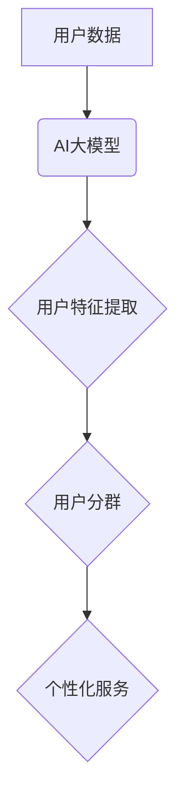

                 

## AI大模型在电商平台用户分群中的作用

> 关键词：AI大模型、用户分群、电商平台、推荐系统、个性化营销、聚类算法、深度学习、自然语言处理

## 1. 背景介绍

在当今数据爆炸的时代，电商平台面临着日益激烈的竞争。为了提升用户体验、提高转化率和促进商业增长，精准的用户分群成为电商平台发展的重要战略。传统的用户分群方法主要依赖于用户基本信息和行为数据，例如年龄、性别、购买历史等，但这些方法往往缺乏深度和灵活性，难以捕捉用户复杂的多维特征。

近年来，随着人工智能技术的快速发展，特别是深度学习和自然语言处理技术的突破，AI大模型在用户分群领域展现出巨大的潜力。AI大模型能够从海量用户数据中学习到更丰富的用户特征，并进行更精准的用户画像构建，从而实现更细致、更精准的用户分群。

## 2. 核心概念与联系

### 2.1 用户分群

用户分群是指将电商平台的用户根据其共同的特征和行为模式进行分类，形成不同的用户群体。用户分群可以帮助电商平台更好地了解用户需求，提供个性化服务，提高用户粘性和转化率。

### 2.2 AI大模型

AI大模型是指在海量数据上训练的深度学习模型，具有强大的学习和泛化能力。常见的AI大模型包括Transformer、BERT、GPT等。

### 2.3 关系图



## 3. 核心算法原理 & 具体操作步骤

### 3.1 算法原理概述

AI大模型在用户分群中的应用主要基于聚类算法。聚类算法是一种无监督学习算法，旨在将数据点根据其相似性进行分组。常用的聚类算法包括K-means、DBSCAN、层次聚类等。

### 3.2 算法步骤详解

1. **数据预处理:** 对用户数据进行清洗、转换和特征工程，提取用户特征，例如用户购买历史、浏览记录、评论内容等。
2. **模型选择:** 根据用户数据特点和分群需求选择合适的聚类算法。
3. **模型训练:** 使用训练数据训练选择的聚类模型，并根据模型输出结果将用户数据进行分组。
4. **模型评估:** 使用测试数据评估模型的性能，例如聚类准确率、轮廓系数等。
5. **模型优化:** 根据评估结果对模型参数进行调整，优化模型性能。

### 3.3 算法优缺点

**优点:**

* 能够从海量用户数据中学习到更丰富的用户特征，实现更精准的用户分群。
* 不需要预先定义用户标签，能够发现用户群体的潜在结构。
* 能够动态调整用户分群，适应用户行为变化。

**缺点:**

* 聚类算法的性能受数据质量和特征选择的影响较大。
* 难以解释模型的决策过程，缺乏可解释性。
* 计算复杂度较高，需要强大的计算资源。

### 3.4 算法应用领域

AI大模型在用户分群领域的应用不仅限于电商平台，还可以应用于其他领域，例如：

* **金融领域:** 用户风险评估、精准营销
* **医疗领域:** 疾病诊断、个性化治疗
* **教育领域:** 学生分层、个性化学习

## 4. 数学模型和公式 & 详细讲解 & 举例说明

### 4.1 数学模型构建

用户分群的核心是寻找用户之间的相似度，常用的相似度度量方法包括欧氏距离、余弦相似度等。

**欧氏距离:**

$$
d(x,y) = \sqrt{\sum_{i=1}^{n}(x_i - y_i)^2}
$$

其中，$x$ 和 $y$ 是两个用户，$x_i$ 和 $y_i$ 是用户 $x$ 和 $y$ 在第 $i$ 个特征上的值，$n$ 是特征的个数。

**余弦相似度:**

$$
sim(x,y) = \frac{x \cdot y}{||x|| ||y||}
$$

其中，$x \cdot y$ 是 $x$ 和 $y$ 的点积，$||x||$ 和 $||y||$ 是 $x$ 和 $y$ 的模长。

### 4.2 公式推导过程

聚类算法的目标是将用户数据划分为若干个簇，使得每个簇内的用户之间相似度高，而不同簇之间的用户相似度低。

K-means 算法是一种常用的聚类算法，其核心思想是迭代地更新每个簇的中心点，直到簇的结构稳定。

K-means 算法的步骤如下：

1. 随机选择 $k$ 个用户作为初始簇中心。
2. 将每个用户分配到距离其最近的簇中心的用户组。
3. 计算每个簇的中心点，并将中心点作为新的簇中心。
4. 重复步骤 2 和 3，直到簇的结构稳定。

### 4.3 案例分析与讲解

假设我们有一个电商平台的用户数据，包含用户的年龄、性别、购买历史等特征。我们想使用 K-means 算法将用户分为 3 个簇。

1. 我们随机选择 3 个用户作为初始簇中心。
2. 将每个用户分配到距离其最近的簇中心的用户组。
3. 计算每个簇的中心点，并将中心点作为新的簇中心。
4. 重复步骤 2 和 3，直到簇的结构稳定。

最终，我们将得到 3 个用户簇，每个簇的用户具有相似的特征和行为模式。

## 5. 项目实践：代码实例和详细解释说明

### 5.1 开发环境搭建

* Python 3.6+
* scikit-learn 库
* pandas 库
* matplotlib 库

### 5.2 源代码详细实现

```python
import pandas as pd
from sklearn.cluster import KMeans
from sklearn.preprocessing import StandardScaler

# 加载用户数据
data = pd.read_csv('user_data.csv')

# 数据预处理
# 提取用户特征
features = data[['age', 'gender', 'purchase_amount']]

# 标准化数据
scaler = StandardScaler()
scaled_features = scaler.fit_transform(features)

# 选择聚类算法
kmeans = KMeans(n_clusters=3, random_state=42)

# 训练模型
kmeans.fit(scaled_features)

# 获取用户簇标签
labels = kmeans.labels_

# 将簇标签添加到用户数据中
data['cluster'] = labels

# 展示结果
print(data.head())
```

### 5.3 代码解读与分析

1. 首先，我们加载用户数据并提取用户特征。
2. 然后，我们使用 StandardScaler 对用户特征进行标准化，使得不同特征的尺度一致。
3. 接下来，我们选择 KMeans 算法作为聚类算法，并设置簇的数量为 3。
4. 然后，我们训练 KMeans 模型，并获取用户簇标签。
5. 最后，我们将簇标签添加到用户数据中，并展示结果。

### 5.4 运行结果展示

运行代码后，我们将得到一个包含用户簇标签的用户数据。我们可以根据簇标签对用户进行细分，并提供个性化的服务。

## 6. 实际应用场景

AI大模型在电商平台用户分群中的应用场景非常广泛，例如：

### 6.1 个性化推荐

根据用户的兴趣爱好、购买历史等特征，为用户推荐个性化的商品。

### 6.2 精准营销

根据用户的消费习惯、购买偏好等特征，进行精准的营销推广，提高营销效果。

### 6.3 用户画像构建

根据用户的行为数据，构建用户的画像，了解用户的需求和偏好。

### 6.4 运营策略优化

根据用户分群的结果，优化电商平台的运营策略，例如促销活动、会员制度等。

### 6.5 未来应用展望

随着人工智能技术的不断发展，AI大模型在电商平台用户分群领域的应用将更加广泛和深入。例如：

* 利用自然语言处理技术，从用户的评论、聊天记录等文本数据中提取更丰富的用户特征。
* 利用强化学习技术，动态调整用户分群策略，适应用户的行为变化。
* 利用联邦学习技术，在保护用户隐私的前提下，进行用户分群。

## 7. 工具和资源推荐

### 7.1 学习资源推荐

* **书籍:**
    * 深度学习
    * 自然语言处理
* **在线课程:**
    * Coursera
    * edX
    * Udacity

### 7.2 开发工具推荐

* **Python:** 
    * scikit-learn
    * TensorFlow
    * PyTorch

### 7.3 相关论文推荐

* **BERT: Pre-training of Deep Bidirectional Transformers for Language Understanding**
* **Attention Is All You Need**
* **K-Means Clustering**

## 8. 总结：未来发展趋势与挑战

### 8.1 研究成果总结

AI大模型在电商平台用户分群领域取得了显著的成果，能够实现更精准的用户分群，并为电商平台提供更个性化的服务。

### 8.2 未来发展趋势

未来，AI大模型在电商平台用户分群领域的应用将更加深入和广泛，例如：

* 利用更先进的 AI 模型，例如 Transformer、GPT 等，提取更丰富的用户特征。
* 利用强化学习技术，动态调整用户分群策略，适应用户的行为变化。
* 利用联邦学习技术，在保护用户隐私的前提下，进行用户分群。

### 8.3 面临的挑战

AI大模型在电商平台用户分群领域也面临一些挑战，例如：

* 数据质量问题：AI大模型的性能受数据质量的影响较大，需要保证用户数据的准确性和完整性。
* 计算资源问题：训练大型 AI 模型需要大量的计算资源，需要不断优化模型结构和训练方法，降低计算成本。
* 可解释性问题：AI大模型的决策过程难以解释，需要开发更可解释的 AI 模型，提高用户对模型的信任度。

### 8.4 研究展望

未来，我们需要继续研究和探索 AI大模型在电商平台用户分群领域的应用，解决上述挑战，并推动 AI 技术在电商领域的创新发展。

## 9. 附录：常见问题与解答

**Q1: 如何选择合适的聚类算法？**

**A1:** 选择合适的聚类算法需要根据用户数据的特点和分群需求进行选择。例如，如果用户数据具有明显的类别结构，可以使用 K-means 算法；如果用户数据具有较复杂的结构，可以使用 DBSCAN 算法。

**Q2: 如何评估聚类算法的性能？**

**A2:** 常用的聚类算法性能评估指标包括聚类准确率、轮廓系数等。

**Q3: 如何解释 AI 模型的决策过程？**

**A3:** 为了提高 AI 模型的可解释性，可以采用以下方法：

* 使用可解释的 AI 模型，例如决策树、线性回归等。
* 使用特征重要性分析，找出对模型决策最重要的特征。
* 使用局部解释方法，解释单个样本的预测结果。


作者：禅与计算机程序设计艺术 / Zen and the Art of Computer Programming 
<end_of_turn>

