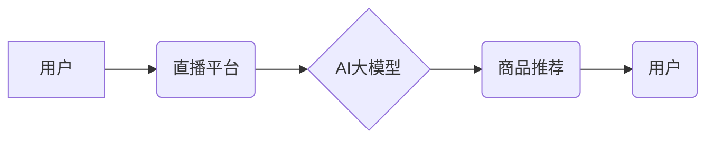

                 

## AI大模型在电商直播推荐中的应用

> 关键词：电商直播、AI大模型、推荐系统、自然语言处理、深度学习、Transformer、用户画像、商品匹配

## 1. 背景介绍

电商直播近年来发展迅速，成为电商销售的重要渠道之一。直播平台上涌现出大量主播和商品，用户面临着海量信息的选择困境。如何精准推荐符合用户兴趣和需求的商品，提升用户体验和转化率，是电商直播平台面临的重大挑战。

传统电商推荐系统主要依赖于用户历史行为数据和商品特征信息，但这些数据往往难以捕捉用户实时意图和直播场景的动态变化。随着人工智能技术的快速发展，特别是大模型技术的突破，AI大模型在电商直播推荐领域展现出巨大的潜力。

## 2. 核心概念与联系

**2.1 核心概念**

* **电商直播:** 以实时视频为载体，主播与观众进行互动，展示商品并进行销售的线上销售模式。
* **AI大模型:** 指规模庞大、训练数据海量的人工智能模型，能够学习复杂的数据模式和关系，并进行泛化学习，在不同场景下进行预测和生成。
* **推荐系统:** 基于用户行为、商品特征等数据，预测用户对商品的兴趣，并推荐符合用户偏好的商品。

**2.2 架构关系**



**2.3 核心联系**

AI大模型通过学习用户行为、商品信息、直播内容等海量数据，构建用户画像和商品理解模型，从而实现精准的商品推荐。

## 3. 核心算法原理 & 具体操作步骤

**3.1 算法原理概述**

电商直播推荐系统通常采用基于深度学习的推荐算法，例如Transformer模型。Transformer模型能够捕捉用户和商品之间的长距离依赖关系，并学习复杂的语义信息，从而实现更精准的推荐。

**3.2 算法步骤详解**

1. **数据预处理:** 收集用户行为数据、商品信息、直播内容等数据，进行清洗、格式化和特征提取。
2. **模型训练:** 使用Transformer模型训练，输入用户和商品信息，输出推荐结果。
3. **模型评估:** 使用指标如点击率、转化率等评估模型性能，并进行调参优化。
4. **实时推荐:** 将训练好的模型部署到线上，实时根据用户行为和直播内容进行商品推荐。

**3.3 算法优缺点**

* **优点:** 能够捕捉用户和商品之间的复杂关系，实现精准推荐，提升用户体验和转化率。
* **缺点:** 需要海量数据进行训练，训练成本较高，模型部署和维护也需要一定的技术支持。

**3.4 算法应用领域**

* **电商直播推荐:** 推荐符合用户兴趣和需求的商品。
* **内容推荐:** 推荐用户感兴趣的直播内容。
* **广告推荐:** 推送与用户兴趣相关的广告。

## 4. 数学模型和公式 & 详细讲解 & 举例说明

**4.1 数学模型构建**

电商直播推荐系统通常采用基于用户的协同过滤模型，例如矩阵分解模型。

**4.2 公式推导过程**

假设用户集合为U，商品集合为I，用户对商品的评分矩阵为R，其中R(u,i)表示用户u对商品i的评分。

目标是学习用户和商品的潜在特征向量，以便预测用户对商品的评分。

矩阵分解模型将评分矩阵R分解为两个低维矩阵：用户特征矩阵U和商品特征矩阵V。

$$R \approx U V^T$$

其中，U(u,k)表示用户u的第k个潜在特征，V(i,k)表示商品i的第k个潜在特征。

**4.3 案例分析与讲解**

假设用户A对商品1评分为4，对商品2评分为3，用户B对商品1评分为5，对商品2评分为4。

可以使用矩阵分解模型学习用户和商品的潜在特征，并预测用户A对商品2的评分。

## 5. 项目实践：代码实例和详细解释说明

**5.1 开发环境搭建**

* Python 3.7+
* TensorFlow/PyTorch
* Jupyter Notebook

**5.2 源代码详细实现**

```python
import tensorflow as tf

# 定义用户和商品特征矩阵
user_features = tf.Variable(tf.random.normal([10, 10]))
item_features = tf.Variable(tf.random.normal([10, 10]))

# 定义评分预测函数
def predict_rating(user_id, item_id):
    user_vector = user_features[user_id]
    item_vector = item_features[item_id]
    return tf.reduce_sum(user_vector * item_vector)

# 训练模型
# ...

# 推理用户对商品的评分
user_id = 0
item_id = 1
predicted_rating = predict_rating(user_id, item_id)
print(predicted_rating)
```

**5.3 代码解读与分析**

* 代码定义了用户和商品的特征矩阵，并使用矩阵乘法计算用户对商品的评分预测。
* 训练模型部分需要根据实际数据进行调整。

**5.4 运行结果展示**

运行代码后，将输出用户对商品的预测评分。

## 6. 实际应用场景

**6.1 直播间商品推荐**

根据用户的观看历史、点赞记录、评论内容等信息，推荐与用户兴趣相关的商品。

**6.2 直播间内容推荐**

根据用户的观看历史、关注主播等信息，推荐与用户兴趣相关的直播内容。

**6.3 直播间互动推荐**

根据用户的互动行为，例如评论、点赞、打赏等，推荐与用户互动相关的商品或主播。

**6.4 未来应用展望**

* **个性化推荐:** 基于用户的实时意图和直播场景，提供更个性化的商品推荐。
* **多模态推荐:** 融合文本、图像、音频等多模态数据，实现更精准的推荐。
* **交互式推荐:** 与用户进行实时互动，根据用户的反馈动态调整推荐结果。

## 7. 工具和资源推荐

**7.1 学习资源推荐**

* **书籍:**
    * 深度学习
    * 自然语言处理
* **在线课程:**
    * Coursera
    * edX
* **博客:**
    * TensorFlow Blog
    * PyTorch Blog

**7.2 开发工具推荐**

* **TensorFlow:** 开源深度学习框架
* **PyTorch:** 开源深度学习框架
* **Jupyter Notebook:** 交互式编程环境

**7.3 相关论文推荐**

* Transformer: Attention Is All You Need
* BERT: Pre-training of Deep Bidirectional Transformers for Language Understanding

## 8. 总结：未来发展趋势与挑战

**8.1 研究成果总结**

AI大模型在电商直播推荐领域取得了显著成果，能够实现精准的商品推荐，提升用户体验和转化率。

**8.2 未来发展趋势**

* **模型规模和能力提升:** 训练更大规模、更强大的AI大模型，提升推荐精度和泛化能力。
* **多模态融合:** 融合文本、图像、音频等多模态数据，实现更全面的用户理解和商品匹配。
* **个性化推荐:** 基于用户的实时意图和直播场景，提供更个性化的推荐。

**8.3 面临的挑战**

* **数据质量和隐私:** 确保推荐数据质量和用户隐私安全。
* **模型解释性和可控性:** 提升模型的解释性和可控性，避免推荐结果出现偏差或不公平现象。
* **技术成本和部署难度:** 降低模型训练和部署的成本和难度，使其更易于推广应用。

**8.4 研究展望**

未来，AI大模型在电商直播推荐领域将继续发展，并与其他技术融合，例如增强现实、虚拟现实等，为用户提供更沉浸式、更个性化的购物体验。

## 9. 附录：常见问题与解答

**9.1 如何评估AI大模型的推荐效果？**

常用的评估指标包括点击率、转化率、用户满意度等。

**9.2 如何解决AI大模型训练数据不足的问题？**

可以使用数据增强技术、迁移学习等方法来解决数据不足的问题。

**9.3 如何保证AI大模型的公平性和可解释性？**

可以通过模型设计、数据预处理、算法调参等方式来保证模型的公平性和可解释性。


作者：禅与计算机程序设计艺术 / Zen and the Art of Computer Programming 
<end_of_turn>

